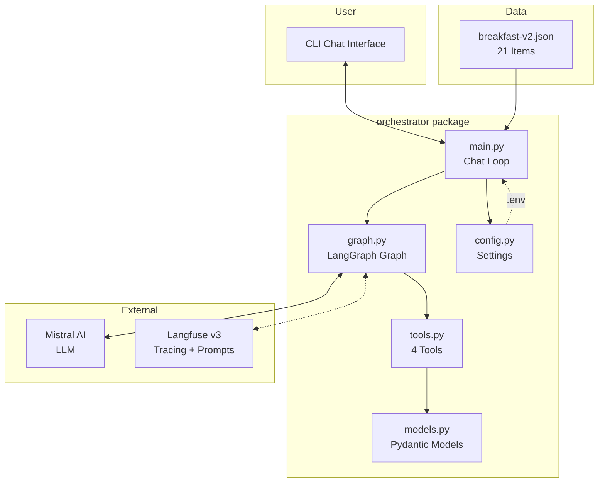
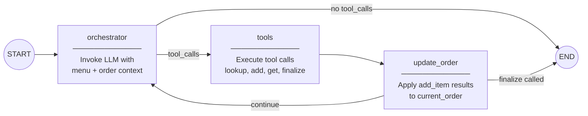
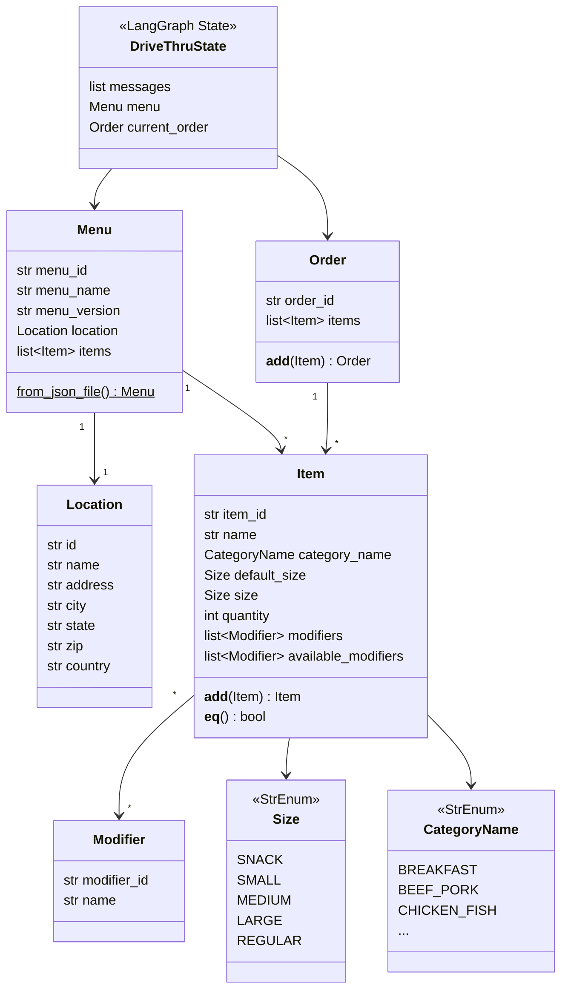
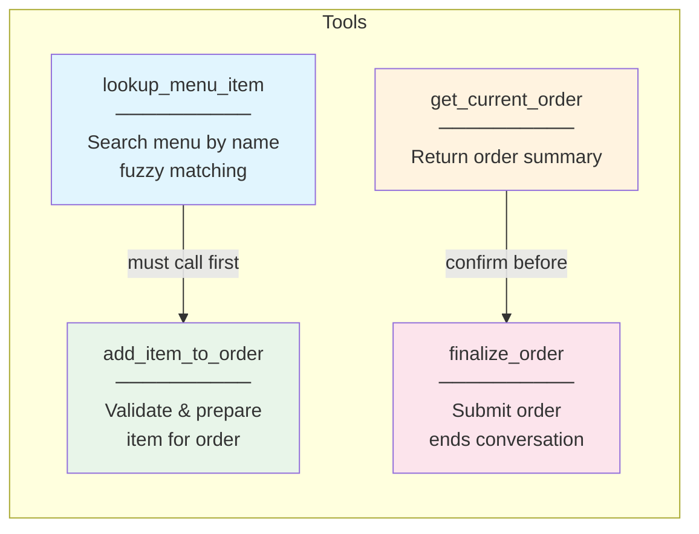

# McDonald's Breakfast Menu - Chatbot Ordering System

A drive-thru chatbot ordering system for McDonald's breakfast menu, built with LangGraph and Pydantic v2.

## Tech Stack

- Python 3.12+
- [LangGraph](https://langchain-ai.github.io/langgraph/) for agent orchestration
- [LangChain](https://python.langchain.com/) + Mistral AI for LLM integration
- [Langfuse v3](https://langfuse.com/) for observability, tracing, and prompt management
- [Pydantic v2](https://docs.pydantic.dev/) for data validation
- [uv](https://docs.astral.sh/uv/) for package management (workspace mode)

## Project Structure

```
src/orchestrator/orchestrator/   # Main chatbot package
  config.py        # Settings from environment variables (.env)
  graph.py         # LangGraph chatbot graph with tool routing
  main.py          # CLI chat interface
  tools.py         # LangGraph tools (add/remove items, finalize order)
  models.py        # Pydantic models (Item, Modifier, Order, Menu, Location)
  enums.py         # Enums (Size, CategoryName)
  logging.py       # Loguru logging setup
menus/             # Menu data (CSV, JSON, XML with schemas)
scripts/           # Utility scripts (e.g. seed_langfuse_prompts.py)
plan/              # Implementation plans and handoff docs
tests/             # Tests
```

## Getting Started

```bash
uv sync --all-packages   # Install all workspace dependencies
```

### Environment Variables

Create a `.env` file at the project root:

```
MISTRAL_API_KEY=your-key
LANGFUSE_PUBLIC_KEY=your-key
LANGFUSE_SECRET_KEY=your-key
LANGFUSE_BASE_URL=https://us.cloud.langfuse.com
```

### Seed Langfuse Prompts

The chatbot fetches its system prompt from Langfuse. Seed the prompts before first run:

```bash
uv run --package orchestrator python scripts/seed_langfuse_prompts.py
```

### Run the Chatbot

```bash
uv run --package orchestrator python -m orchestrator.main
```

## Langfuse Integration (v3)

This project uses **Langfuse SDK v3** (3.x). Key differences from v2:

- **CallbackHandler import**: `from langfuse.langchain import CallbackHandler` (not `langfuse.callback`)
- **Client initialization**: Credentials are set on the `Langfuse()` singleton client, not on the handler
- **No constructor args on handler**: `CallbackHandler()` takes no `session_id`, `user_id`, etc. — these are passed via config metadata or `propagate_attributes()`
- **Session/user tracking**: Pass `langfuse_session_id` and `langfuse_user_id` in `config["metadata"]`
- **Flushing**: Use `get_client().flush()` instead of `handler.flush()`
- **Environment variables**: `LANGFUSE_PUBLIC_KEY`, `LANGFUSE_SECRET_KEY`, `LANGFUSE_BASE_URL`

```python
from langfuse import Langfuse, get_client
from langfuse.langchain import CallbackHandler

# Initialize client (reads from env vars, or pass explicitly)
Langfuse(
    public_key="pk-lf-...",
    secret_key="sk-lf-...",
    host="https://us.cloud.langfuse.com",
)

# Create handler (no constructor args in v3)
handler = CallbackHandler()

# Pass session_id/user_id via metadata (v3 pattern)
config = {
    "callbacks": [handler],
    "metadata": {
        "langfuse_session_id": "my-session-id",
        "langfuse_user_id": "my-user-id",
        "langfuse_tags": ["tag1", "tag2"],
    },
}
result = graph.invoke(state, config=config)

# Flush on exit
get_client().flush()
```

> **v2 → v3 breaking change**: `CallbackHandler(session_id=...)` no longer works. Use `config["metadata"]["langfuse_session_id"]` instead. See [Langfuse upgrade guide](https://langfuse.com/docs/observability/sdk/upgrade-path).

Langfuse is also used for **prompt management** — the system prompt is fetched at runtime via `langfuse.get_prompt()` with a fallback if Langfuse is unavailable.

## Architecture

### System Overview



### LangGraph Flow



### Data Models



### Tools



## Data Models

- `Size` - StrEnum: snack, small, medium, large, regular
- `CategoryName` - Menu category (breakfast, beverages, coffee-tea, etc.)
- `Modifier` - Item variations (Extra Cheese, No Onions, etc.)
- `Item` - Menu item with modifiers, size, quantity; supports equality, ordering, and addition
- `Order` - Collection of items for a customer order
- `Location` - Restaurant location details
- `Menu` - Full menu with items, loadable from JSON files
