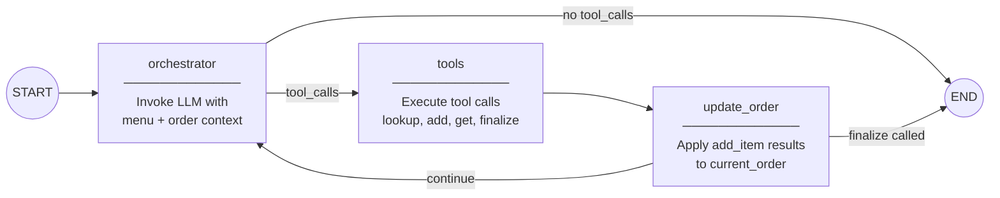

# ADR-001: Use LLM Orchestrator Pattern Over Explicit State Machine

**Status:** Accepted

[Back to ADR Index](./adr.md)

---

## Context

The system needs a conversational graph that handles drive-thru ordering: greeting the customer, taking orders, looking up menu items, confirming, and finalizing. Two architectures were considered during design:

**v0 — Explicit State Machine (12+ nodes):** Each conversation phase (greeting, intent classification, menu lookup, item confirmation, order review, finalization) would be a separate LangGraph node. Conditional edges would route between phases based on classified intent. This required an intent classifier, structured output parsing, and explicit handling of every state transition.

**v1 — LLM Orchestrator (4 nodes):** A single orchestrator node delegates all routing to the LLM via tool calling. The LLM reasons about what to do, calls the appropriate tools, and the graph loops until the conversation ends. The LLM naturally handles multi-intent utterances (e.g., "I'll have two McMuffins and a coffee") without explicit multi-intent parsing.

The v0 design was documented but never implemented. As the design progressed, it became clear that the complexity of explicit state transitions was not justified for a breakfast menu ordering flow.

## Decision

Use a **4-node LLM orchestrator loop**: `orchestrator` -> `tools` -> `update_order` -> back to `orchestrator`.

The LLM decides which tools to call (or whether to respond directly) based on the conversation context. Two conditional edge functions handle routing:



```python
# graph.py — Graph construction

_builder = StateGraph(DriveThruState)
_builder.add_node("orchestrator", orchestrator_node)
_builder.add_node("tools", _tool_node)
_builder.add_node("update_order", update_order)

_builder.add_edge(START, "orchestrator")
_builder.add_conditional_edges(
    "orchestrator", should_continue,
    {"tools": "tools", "respond": END},
)
_builder.add_edge("tools", "update_order")
_builder.add_conditional_edges(
    "update_order", should_end_after_update,
    {"end": END, "continue": "orchestrator"},
)
```

**Why v0 was rejected:**
- Multi-intent utterances ("two McMuffins and a large coffee") require complex parsing in a state machine but are handled naturally by an LLM with tools
- 12+ nodes with conditional edges is difficult to maintain and extend
- Intent classification adds latency and another failure mode
- The ordering domain has a small, fixed set of actions — 4 tools cover all cases

## Consequences

**Benefits:**
- Dramatically simpler graph (4 nodes vs 12+)
- Natural handling of ambiguous, multi-intent, and off-script utterances
- Easy to extend: adding a new capability means adding a tool, not rewiring the graph
- Tools are independently testable as pure functions

**Tradeoffs:**
- Less deterministic than explicit routing — the LLM may choose unexpected tool sequences
- Harder to enforce strict ordering constraints (e.g., "always greet first") without prompt engineering
- Debugging conversation flow requires reading LLM reasoning rather than tracing graph edges
- All routing intelligence is concentrated in the system prompt, making prompt quality critical

**Constraints introduced:**
- The system prompt must contain explicit rules about tool calling order (e.g., "ALWAYS call lookup_menu_item before add_item_to_order")
- The `<reasoning>` tag convention (see [ADR-008](./008-reasoning-tag-extraction.md)) was introduced to compensate for lost routing transparency

---

[Back to ADR Index](./adr.md)
