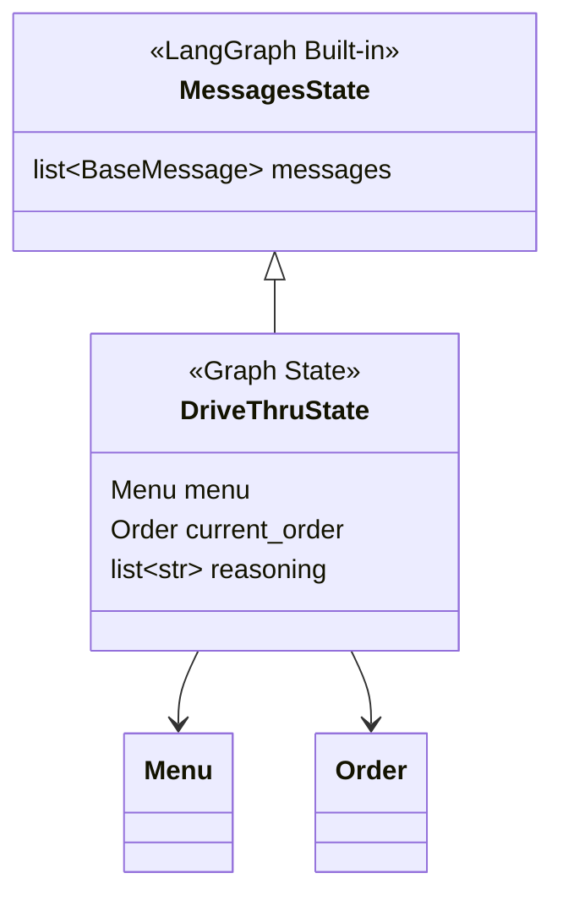

# ADR-002: Extend MessagesState with Minimal Domain Fields

**Status:** Accepted

[Back to ADR Index](./adr.md)

---

## Context

LangGraph requires a state schema (a TypedDict or class) that defines what data flows through the graph. The v0 design proposed 8+ state fields including `conversation_phase`, `last_intent`, `pending_items`, `confirmation_status`, and other phase-tracking metadata.

With the shift to the LLM orchestrator pattern ([ADR-001](./001-llm-orchestrator-pattern.md)), the LLM implicitly tracks conversation phase through the message history. Most of the v0 state fields became redundant.

LangGraph provides `MessagesState`, a built-in base class that manages a `messages` list with an add-message reducer (automatic appending, deduplication, and message ID management).

## Decision

Extend `MessagesState` with only **3 domain fields**:

```python
# graph.py:38-47

class DriveThruState(MessagesState):
    menu: Menu                                      # Loaded menu for this location
    current_order: Order                            # Customer's order in progress
    reasoning: Annotated[list[str], operator.add]   # LLM decision rationale log
```



- **`menu`** — The loaded menu data. Set once at graph invocation and read by tools via `InjectedState`. Never mutated during conversation.
- **`current_order`** — The customer's in-progress order. Mutated only by the `update_order` node. Immutable updates via `Order.__add__` (see [ADR-004](./004-domain-model-operator-overloading.md)).
- **`reasoning`** — Accumulator log of LLM decisions. Uses `operator.add` reducer so each node invocation appends entries without overwriting previous ones.

**Why the v0 fields were dropped:**
- `conversation_phase` — The LLM tracks this implicitly via message history
- `last_intent` — No intent classifier exists in v1; the LLM expresses intent through tool calls
- `pending_items` — The LLM manages this through its reasoning and multi-step tool calls
- `confirmation_status` — Tracked naturally in conversation flow

## Consequences

**Benefits:**
- Minimal state surface area — only 3 fields to reason about
- `MessagesState` inheritance gives automatic message management for free
- `operator.add` on `reasoning` prevents accidental overwrites across graph cycles
- State is easy to initialize: just `menu`, `current_order`, and a first message

**Tradeoffs:**
- No explicit phase tracking means you cannot query "what phase is the conversation in?" from the state alone — you must read the message history
- The `reasoning` list grows unboundedly over long conversations (acceptable for drive-thru interactions which are short-lived)

---

[Back to ADR Index](./adr.md)
