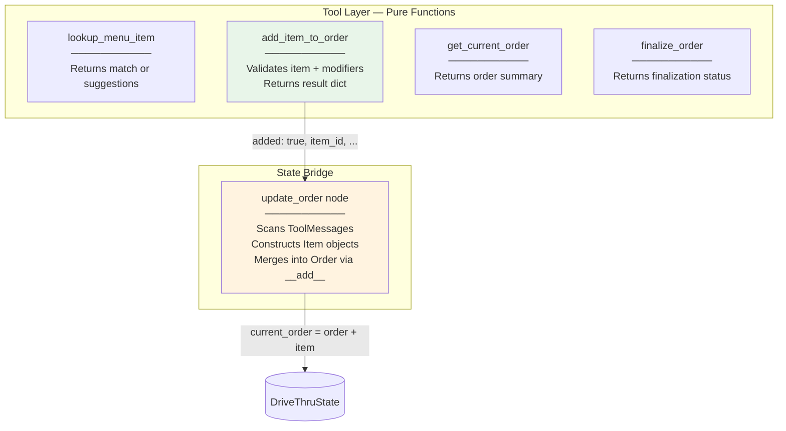

# ADR-003: Pure Function Tools with Dedicated State Bridge Node

**Status:** Accepted

[Back to ADR Index](./adr.md)

---

## Context

LangGraph tools are functions that the LLM can call. Two patterns exist for how tools interact with graph state:

1. **Tools mutate state directly** — Tools use LangGraph's `Command` pattern to return state updates alongside their results. The tool both validates and applies changes.
2. **Tools return data, a separate node mutates state** — Tools are pure functions that return dicts. A dedicated graph node reads tool results from `ToolMessage`s and applies state changes.

The system has 4 tools:

| Tool | Reads State | Modifies State |
|------|------------|----------------|
| `lookup_menu_item` | `menu` | No |
| `add_item_to_order` | `menu` | No (returns result dict) |
| `get_current_order` | `current_order` | No |
| `finalize_order` | `current_order` | No |

Only `add_item_to_order` produces data that needs to update `current_order`. But it does not perform the update itself.

## Decision

All tools are **pure functions** that return dicts. They access state via `InjectedState` for reads but never write to state. A dedicated **`update_order` node** processes `add_item_to_order` results and applies them to `current_order`:



The `update_order` node scans only **recent** `ToolMessage`s (after the last `AIMessage`) to avoid reprocessing items from previous conversation turns:

```python
# graph.py:293-349

def update_order(state: DriveThruState) -> dict:
    current_order = state["current_order"]

    # Find the last AIMessage to scope processing window
    last_ai_idx = -1
    for i, msg in enumerate(state["messages"]):
        if hasattr(msg, "tool_calls") and msg.tool_calls:
            last_ai_idx = i

    recent_messages = state["messages"][last_ai_idx + 1:] if last_ai_idx >= 0 else []

    for msg in recent_messages:
        if not isinstance(msg, ToolMessage) or msg.name != "add_item_to_order":
            continue
        result = json.loads(msg.content)
        if not result.get("added"):
            continue

        new_item = Item(
            item_id=result["item_id"],
            name=result["item_name"],
            category_name=CategoryName(result["category_name"]),
            size=Size(result["size"]) if result.get("size") else None,
            quantity=result["quantity"],
            modifiers=[Modifier(**m) for m in result.get("modifiers", [])],
        )
        current_order = current_order + new_item

    return {"current_order": current_order}
```

**Why the `Command` pattern was rejected:**
- Mixing validation and state mutation in tools makes them harder to test in isolation
- The `Command` pattern requires tools to know the state schema, coupling tools to graph internals
- A single `update_order` node creates one auditable place for all state mutations
- Pure function tools can be tested with plain dicts — no graph context needed

## Consequences

**Benefits:**
- Tools are trivially unit-testable: pass args, assert on returned dict
- All order state mutations happen in exactly one node (`update_order`), making debugging straightforward
- Clear separation of concerns: validation (tools) vs mutation (update_order) vs routing (conditional edges)
- `InjectedState` keeps tools' state reads invisible to the LLM (menu is not a tool argument the LLM fills)

**Tradeoffs:**
- Extra graph node (`update_order`) that would not be needed with the `Command` pattern
- Tool results must be serialized to JSON in `ToolMessage.content` and deserialized in `update_order` — one extra parsing step
- The `update_order` node must scan messages to find relevant tool results, adding message iteration logic

---

[Back to ADR Index](./adr.md)
