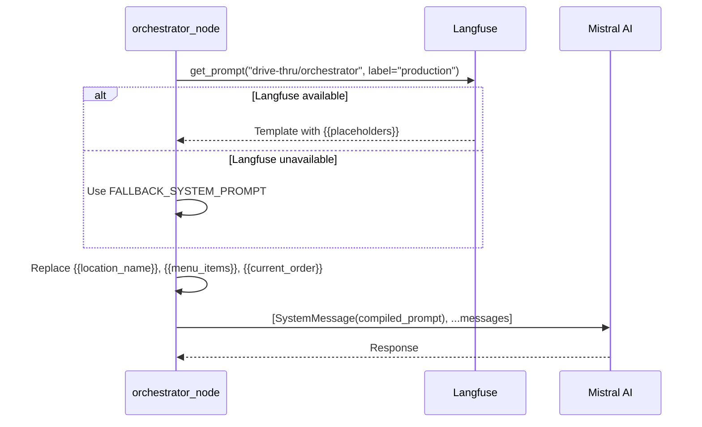

# ADR-005: Runtime System Prompt Compilation via Langfuse

**Status:** Accepted

[Back to ADR Index](./adr.md)

---

## Context

The orchestrator node needs a system prompt that includes dynamic runtime data: the restaurant location, the current menu items, and the customer's current order. This data changes per session and per conversation turn (the order grows as items are added).

**Options considered:**
1. **Hardcoded prompt** — Embed the full prompt in `graph.py` as a Python string
2. **Template file** — Load a Jinja2 or Mustache template from disk
3. **Langfuse prompt management** — Store the template in Langfuse, fetch at runtime, with a hardcoded fallback

## Decision

Store the system prompt template in **Langfuse prompt management** with `{{variable}}` placeholders. Fetch it at runtime via `langfuse.get_prompt()`. Fall back to a hardcoded `FALLBACK_SYSTEM_PROMPT` if Langfuse is unavailable.



### Prompt fetching with fallback

```python
# graph.py:100-133

PROMPT_NAME = "drive-thru/orchestrator"

def _get_system_prompt_template() -> str:
    settings = get_settings()
    if not settings.langfuse_public_key or not settings.langfuse_secret_key:
        return FALLBACK_SYSTEM_PROMPT

    try:
        langfuse = Langfuse(
            public_key=settings.langfuse_public_key,
            secret_key=settings.langfuse_secret_key,
            host=settings.langfuse_base_url,
        )
        prompt = langfuse.get_prompt(PROMPT_NAME, label="production")
        if isinstance(prompt.prompt, list):
            for msg in prompt.prompt:
                if msg.get("role") == "system":
                    return msg["content"]
        return prompt.prompt
    except Exception:
        return FALLBACK_SYSTEM_PROMPT
```

### Compilation on every invocation

The prompt is compiled fresh every turn because `{{current_order}}` changes as items are added:

```python
# graph.py:189-231

def orchestrator_node(state: DriveThruState) -> dict:
    prompt_template = _get_system_prompt_template()

    menu_items = "\n".join(
        f"- {item.name} [{item.category_name.value}] "
        f"(default size: {item.default_size.value})"
        for item in state["menu"].items
    )

    current_items = "\n".join(
        f"- {item.quantity}x {item.name} ({item.size.value})"
        + (f" [{', '.join(m.name for m in item.modifiers)}]" if item.modifiers else "")
        for item in state["current_order"].items
    ) or "Empty"

    system_content = (
        prompt_template
        .replace("{{location_name}}", location.name)
        .replace("{{location_address}}", location_address)
        .replace("{{menu_items}}", menu_items)
        .replace("{{current_order}}", current_items)
    )
```

**Why hardcoded-only was rejected:**
- Cannot iterate on prompt wording without code deployments
- No version history or A/B testing capability

**Why Jinja2 templates were rejected:**
- Adds a templating engine dependency for simple string replacement
- Langfuse already provides template management with versioning, labels, and a UI editor

## Consequences

**Benefits:**
- Prompt changes can be deployed via Langfuse without code changes
- Langfuse provides version history, labels (`production`, `staging`), and rollback
- The fallback prompt ensures the system works without Langfuse — useful for local dev, tests, and outages
- Simple `str.replace()` is sufficient for 4 variables — no template engine needed

**Tradeoffs:**
- Network call to Langfuse on every `orchestrator_node` invocation (not cached across turns)
- If the Langfuse prompt and fallback prompt diverge, behavior differences may be subtle
- The `{{variable}}` convention is fragile — a typo in a variable name silently produces an uncompiled placeholder in the prompt

---

[Back to ADR Index](./adr.md)
