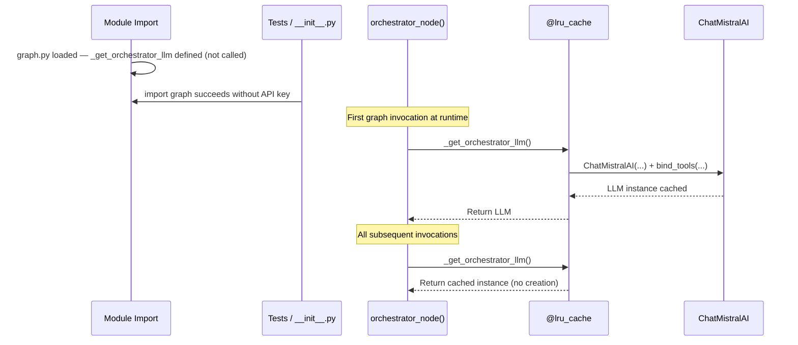

# ADR-007: Lazy LLM Initialization with `@lru_cache`

**Status:** Accepted

[Back to ADR Index](./adr.md)

---

## Context

The `graph.py` module defines the LangGraph graph and is imported by multiple consumers:
- **`__init__.py`** — Exports models and tools (but not the graph)
- **LangGraph Studio** — Imports the graph to visualize and run it
- **Tests** — Import tools and state classes to test in isolation
- **`main.py`** — Imports the graph builder to compile with a checkpointer

If the `ChatMistralAI` LLM client were created at module level (import time), any import of `graph.py` would fail without `MISTRAL_API_KEY` set. This would break tests, package initialization, and IDE tooling.

## Decision

Use `@lru_cache(maxsize=1)` for **lazy, singleton** LLM initialization. The LLM is created on first invocation of the orchestrator node, not at import time.

```python
# graph.py:143-163

@lru_cache(maxsize=1)
def _get_orchestrator_llm():
    settings = get_settings()
    llm = ChatMistralAI(
        model=settings.mistral_model,
        temperature=settings.mistral_temperature,
        api_key=settings.mistral_api_key,
    )
    return llm.bind_tools(_tools)
```



The same pattern is applied to `get_settings()`:

```python
# config.py:49-52

@lru_cache(maxsize=1)
def get_settings() -> Settings:
    return Settings()
```

**Alternatives considered:**
- **Module-level initialization** — Rejected because it breaks imports without credentials
- **Dependency injection** — More flexible but adds complexity for a single LLM instance
- **Environment check at import** — Fragile; silently creates a None LLM or requires sentinel values

## Consequences

**Benefits:**
- `graph.py` can be imported freely without API keys — critical for tests and `__init__.py`
- Singleton via `@lru_cache` ensures only one LLM instance exists, avoiding redundant API client creation
- Zero overhead on repeated calls — `@lru_cache` returns the cached instance instantly
- The pattern is explicit and well-understood in Python

**Tradeoffs:**
- First graph invocation has initialization latency (creating the LLM client and binding tools)
- `@lru_cache` makes it impossible to reinitialize with different settings without clearing the cache (acceptable for a CLI application with a single configuration per run)
- The `_` prefix convention (`_get_orchestrator_llm`) signals this is internal, but it is still accessible to tests if needed

**Related decisions:**
- [ADR-012](./012-dual-graph-compilation.md) also relies on this pattern: `_builder` is created at module level (no API key needed), while the LLM is only initialized when the compiled graph is invoked

---

[Back to ADR Index](./adr.md)
