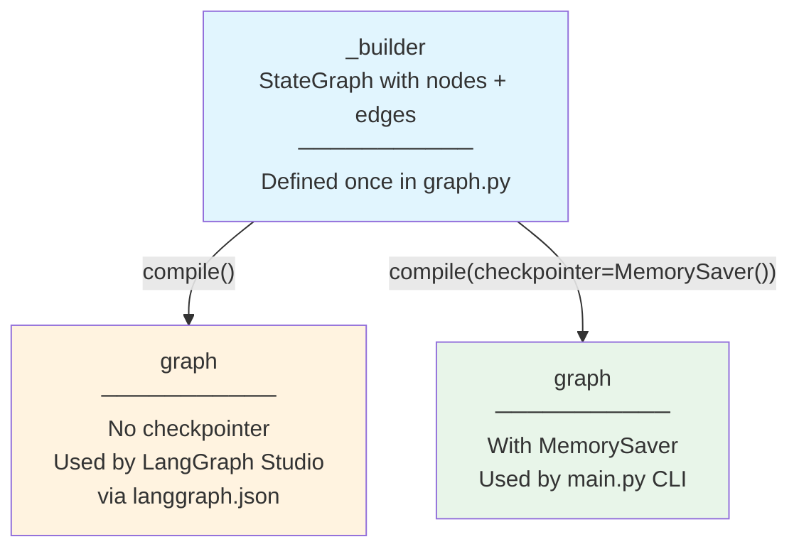

# ADR-012: Dual Graph Compilation for Studio vs CLI

**Status:** Accepted

[Back to ADR Index](./adr.md)

---

## Context

The LangGraph graph is consumed by two different runtimes:

1. **LangGraph Studio** — A visual IDE that provides its own checkpointer, message persistence, and session management. It imports the graph via `langgraph.json` and expects a pre-compiled `CompiledGraph` object.
2. **CLI (`main.py`)** — A terminal chat loop that needs a `MemorySaver` checkpointer to persist conversation state across turns within a session.

LangGraph's `StateGraph.compile()` accepts an optional `checkpointer` parameter. If a checkpointer is provided, the graph persists state between invocations. If not, each invocation starts fresh.

The problem: Studio provides its own checkpointer at runtime. If the graph is compiled with `MemorySaver` in `graph.py`, Studio's checkpointer conflicts. But the CLI needs `MemorySaver` to maintain conversation history.

## Decision

Export the `StateGraph` **builder** (`_builder`) and compile twice:

```python
# graph.py:386-412 — Module-level: compile without checkpointer for Studio

_builder = StateGraph(DriveThruState)
_builder.add_node("orchestrator", orchestrator_node)
_builder.add_node("tools", _tool_node)
_builder.add_node("update_order", update_order)
# ... edges ...

graph = _builder.compile()       # No checkpointer — Studio provides its own
```

```python
# main.py:60 — CLI: compile from builder with MemorySaver

from .graph import _builder

graph = _builder.compile(checkpointer=MemorySaver())
```



### langgraph.json configuration

```json
{
  "dependencies": ["./src/orchestrator"],
  "graphs": {
    "orchestrator": "orchestrator.graph:graph"
  },
  "env": ".env"
}
```

Studio imports `orchestrator.graph:graph` — the checkpointer-free compiled graph.

**Alternatives considered:**
- **Single compilation with conditional checkpointer** — Check an env var to decide whether to include `MemorySaver`. Rejected because it couples graph definition to runtime environment detection.
- **Only export the compiled graph, let CLI use it directly** — Without a checkpointer, the CLI would lose conversation history between turns. Each `graph.invoke()` would start a fresh conversation.

## Consequences

**Benefits:**
- Clean separation: graph structure is defined once, compilation is context-specific
- Studio and CLI can use the same graph definition with different persistence strategies
- The `_builder` is a plain `StateGraph` — no API keys or runtime config needed to construct it (see [ADR-007](./007-lazy-llm-initialization.md))
- The `_` prefix signals that `_builder` is an internal export, not part of the public API

**Tradeoffs:**
- Two compilation sites means graph configuration (e.g., adding a new checkpointer or interrupt) must be updated in multiple places
- `main.py` imports `_builder` (a private symbol) from `graph.py` — a mild encapsulation breach
- Developers must understand why `graph` and `_builder` both exist and when to use which

---

[Back to ADR Index](./adr.md)
