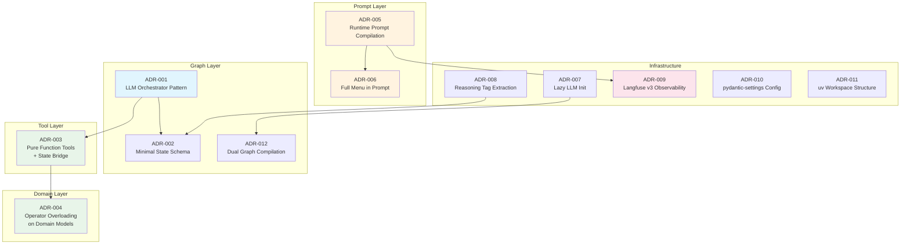

# Architectural Decision Records

**Project:** McDonald's Drive-Thru Chatbot
A conversational ordering system for McDonald's breakfast menu, built with LangGraph, Mistral AI, and Pydantic v2. Customers interact through a CLI interface while the system validates items against a real menu, manages order state, and traces all activity through Langfuse.

**Tech Stack:** Python 3.12+ | LangGraph | LangChain + Mistral AI | Langfuse v3 | Pydantic v2 | uv workspaces

---

## Table of Contents

| ADR | Title | Status |
|-----|-------|--------|
| [001](./001-llm-orchestrator-pattern.md) | Use LLM orchestrator pattern over explicit state machine | Accepted |
| [002](./002-minimal-state-schema.md) | Extend MessagesState with minimal domain fields | Accepted |
| [003](./003-pure-function-tools-with-state-bridge.md) | Pure function tools with dedicated state bridge node | Accepted |
| [004](./004-domain-model-operator-overloading.md) | Operator overloading on Pydantic domain models | Accepted |
| [005](./005-runtime-prompt-compilation.md) | Runtime system prompt compilation via Langfuse | Accepted |
| [006](./006-full-menu-in-system-prompt.md) | Embed full menu in the system prompt | Accepted |
| [007](./007-lazy-llm-initialization.md) | Lazy LLM initialization with `@lru_cache` | Accepted |
| [008](./008-reasoning-tag-extraction.md) | Structured reasoning extraction via XML tags | Accepted |
| [009](./009-langfuse-v3-observability.md) | Langfuse v3 for observability and prompt management | Accepted |
| [010](./010-pydantic-settings-configuration.md) | `pydantic-settings` with `.env` and singleton caching | Accepted |
| [011](./011-uv-workspace-structure.md) | uv workspace with independent member packages | Accepted |
| [012](./012-dual-graph-compilation.md) | Dual graph compilation for Studio vs CLI | Accepted |

---

## How to Read These ADRs

Each ADR follows a standard template:

- **Title** — Numbered identifier and descriptive name
- **Status** — `Proposed` | `Accepted` | `Deprecated` | `Superseded by [ADR #]`
- **Context** — The forces and facts driving the need for a decision
- **Decision** — The chosen approach and why alternatives were rejected
- **Consequences** — Tradeoffs, benefits, and resulting constraints

ADRs are immutable once accepted. If a decision is reversed, the original ADR is marked `Superseded` and a new ADR is created explaining the change.

---

## ADR Summary Diagram

---

*v1 — February 2026*

[Back to Architecture Overview](../architecture.md)
