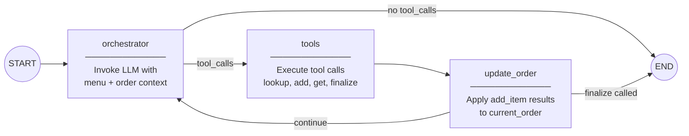
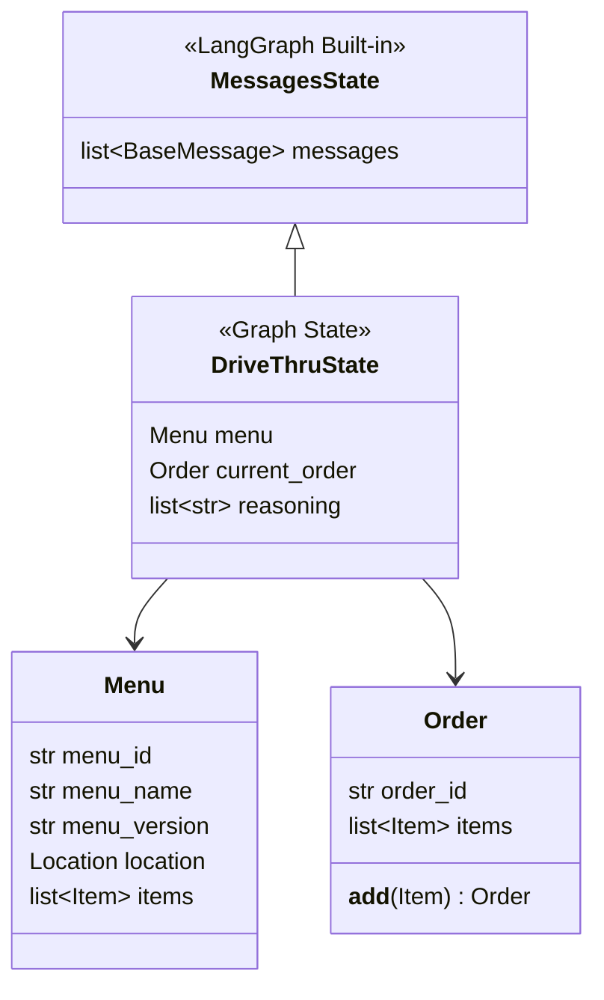
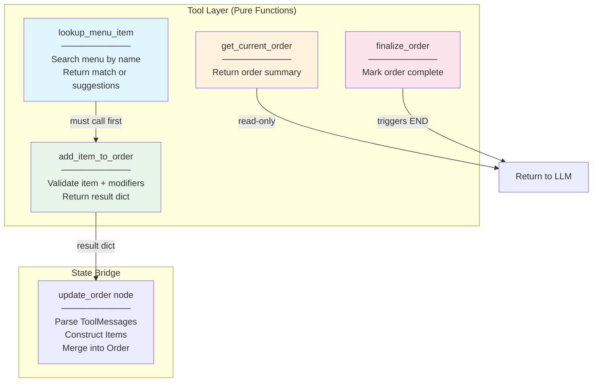
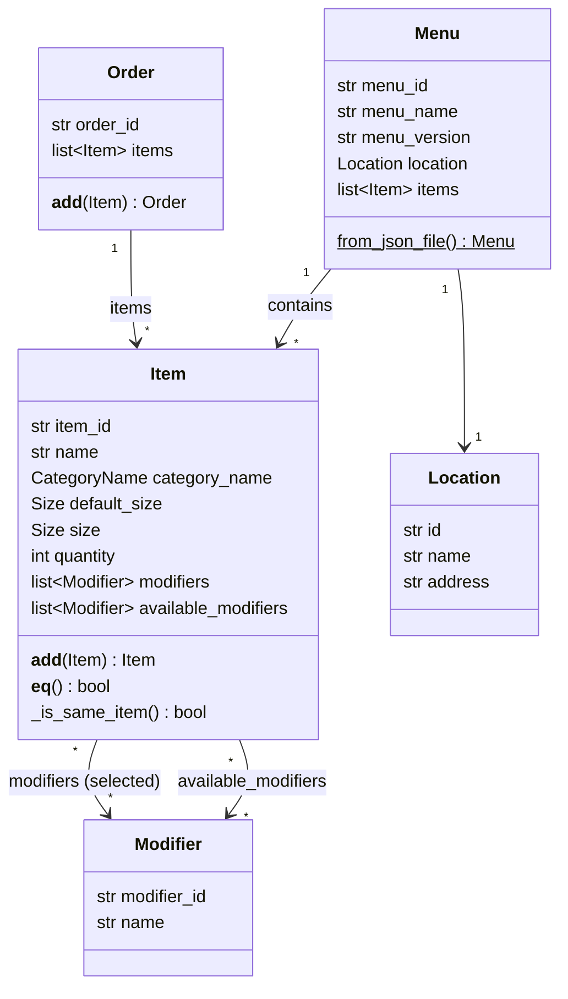
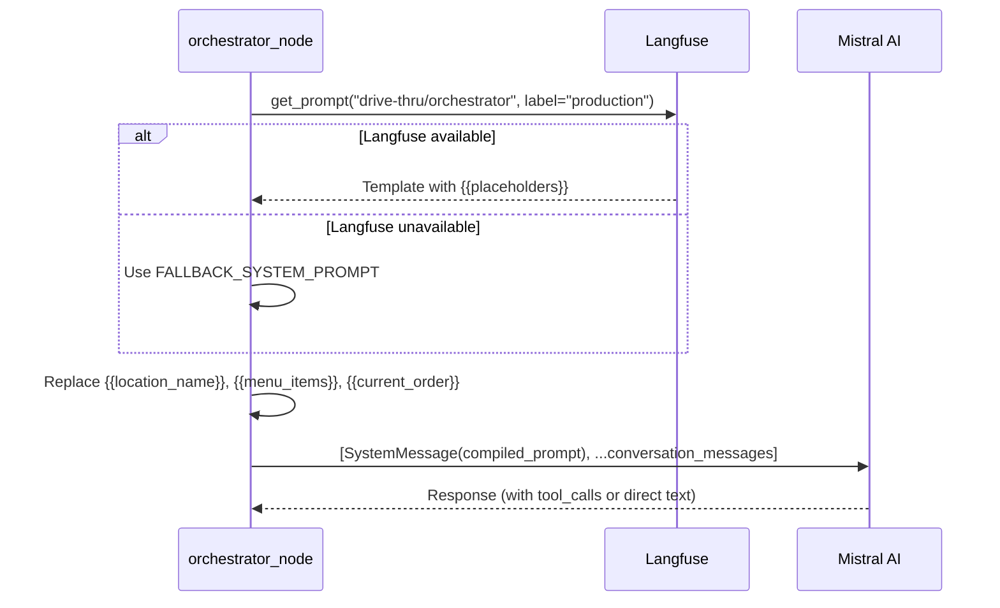
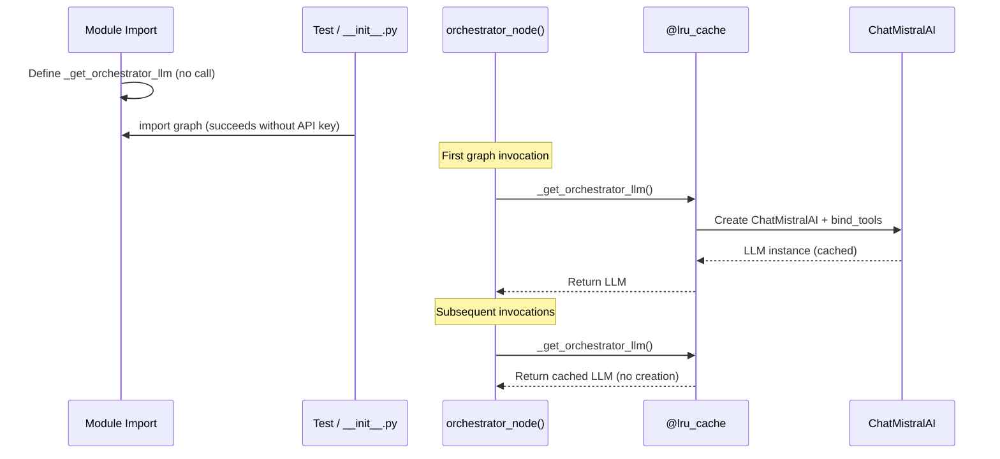

# Architectural Decisions - McDonald's Drive-Thru Chatbot

A drive-thru chatbot ordering system for McDonald's breakfast menu, built with LangGraph, Mistral AI, and Pydantic v2. The system takes customer orders through a conversational CLI interface, validates items against a real menu, and manages order state through a tool-calling agent loop.

**Tech Stack:** Python 3.12+ | LangGraph | LangChain + Mistral AI | Langfuse v3 | Pydantic v2 | uv workspaces

---

## Table of Contents

- [1. Graph Architecture: LLM Orchestrator Pattern](#1-graph-architecture-llm-orchestrator-pattern)
- [2. State Schema Design](#2-state-schema-design)
- [3. Tool Design: Pure Functions + State Bridge](#3-tool-design-pure-functions--state-bridge)
- [4. Domain Models with Operator Overloading](#4-domain-models-with-operator-overloading)
- [5. System Prompt Compilation](#5-system-prompt-compilation)
- [6. Lazy LLM Initialization](#6-lazy-llm-initialization)
- [7. Reasoning Extraction and Observability](#7-reasoning-extraction-and-observability)
- [8. Configuration and Environment](#8-configuration-and-environment)
- [9. Workspace and Package Structure](#9-workspace-and-package-structure)

---

## 1. Graph Architecture: LLM Orchestrator Pattern

### Decision

Use a **4-node LLM orchestrator loop** instead of an explicit state machine with intent classification.

### Context

The original v0 design called for 12+ nodes with explicit state transitions (greeting, intent classification, menu lookup, order confirmation, etc.) and conditional edges for every conversation phase. This was abandoned in favor of a simpler architecture that delegates routing decisions to the LLM itself.

### Architecture



### How the Graph is Built

The graph is constructed with a `StateGraph`, two conditional edges, and one direct edge:

```python
# graph.py:386-412

_builder = StateGraph(DriveThruState)
_builder.add_node("orchestrator", orchestrator_node)
_builder.add_node("tools", _tool_node)           # LangGraph's prebuilt ToolNode
_builder.add_node("update_order", update_order)

_builder.add_edge(START, "orchestrator")
_builder.add_conditional_edges(
    "orchestrator",
    should_continue,           # tool_calls? -> "tools" | "respond" -> END
    {"tools": "tools", "respond": END},
)
_builder.add_edge("tools", "update_order")
_builder.add_conditional_edges(
    "update_order",
    should_end_after_update,   # finalize_order? -> "end" | "continue" -> orchestrator
    {"end": END, "continue": "orchestrator"},
)

graph = _builder.compile()     # No checkpointer — Studio provides its own
```

### Routing Logic

Two conditional edge functions control the flow:

```python
# graph.py:271-290

def should_continue(state: DriveThruState) -> str:
    last_message = state["messages"][-1]
    if last_message.tool_calls:
        return "tools"
    return "respond"     # No tool calls -> END (direct response to customer)


def should_end_after_update(state: DriveThruState) -> str:
    # Scan only recent ToolMessages (after last AIMessage)
    for msg in recent_messages:
        if isinstance(msg, ToolMessage) and msg.name == "finalize_order":
            return "end"
    return "continue"    # Loop back to orchestrator
```

### Tradeoffs

| Factor | LLM Orchestrator (chosen) | Explicit State Machine (v0) |
|--------|---------------------------|----------------------------|
| **Nodes** | 4 | 12+ |
| **Routing** | LLM decides via tool calls | Conditional edges per phase |
| **Multi-intent** | Handles naturally | Requires complex parsing |
| **Determinism** | LLM-dependent | Predictable |
| **Extensibility** | Add tools | Add nodes + edges + routing |
| **Testability** | Test tools independently | Test each node + transition |

---

## 2. State Schema Design

### Decision

Extend LangGraph's `MessagesState` with only 3 domain fields instead of building a custom state from scratch.

### Schema

```python
# graph.py:38-47

class DriveThruState(MessagesState):
    menu: Menu                                      # Loaded menu for this location
    current_order: Order                            # Customer's order in progress
    reasoning: Annotated[list[str], operator.add]   # LLM decision rationale log
```



### Why `MessagesState`

Inheriting from `MessagesState` gives automatic message handling with LangGraph's built-in add-message reducer. This means nodes only need to return `{"messages": [new_message]}` and LangGraph handles appending, deduplication, and message ID management.

### Why `operator.add` for Reasoning

The `reasoning` field uses an **accumulator reducer** so every node invocation appends to the list without overwriting previous entries:

```python
reasoning: Annotated[list[str], operator.add]

# Node returns:
return {"reasoning": ["[TOOL_CALL] lookup_menu_item: Customer asked for McMuffin"]}
# -> Appended to existing list, never overwritten
```

---

## 3. Tool Design: Pure Functions + State Bridge

### Decision

Tools return plain dicts and never mutate state. A dedicated `update_order` node bridges tool results into the graph state.

### Tool Flow



### Tool: `lookup_menu_item`

The LLM must call this before adding any item. It validates existence and returns available modifiers:

```python
# tools.py:17-67

@tool
def lookup_menu_item(
    item_name: str,
    menu: Annotated[Menu, InjectedState("menu")],   # Injected from state, invisible to LLM
) -> dict:
    # Exact match (case-insensitive)
    for item in menu.items:
        if item.name.lower() == item_name.lower():
            return {
                "found": True,
                "item_id": item.item_id,
                "name": item.name,
                "category_name": item.category_name.value,
                "default_size": item.default_size.value,
                "available_modifiers": [
                    {"modifier_id": m.modifier_id, "name": m.name}
                    for m in item.available_modifiers
                ],
            }

    # Substring fallback suggestions
    suggestions = [
        item.name for item in menu.items
        if item_name.lower() in item.name.lower()
        or item.name.lower() in item_name.lower()
    ]
    return {"found": False, "requested": item_name, "suggestions": suggestions[:3]}
```

### Tool: `add_item_to_order`

Validates the item exists on the menu and that all modifiers are from the item's `available_modifiers`. Returns a result dict but does **not** modify state:

```python
# tools.py:71-135

@tool
def add_item_to_order(
    item_id: str,
    item_name: str,
    category_name: str,
    quantity: int = 1,
    size: str | None = None,
    modifiers: list[dict] | None = None,
    menu: Annotated[Menu, InjectedState("menu")] = None,
) -> dict:
    # Validate item exists on menu
    menu_item = next((i for i in menu.items if i.item_id == item_id), None)
    if not menu_item:
        return {"added": False, "error": f"Item '{item_id}' not found on menu."}

    # Validate modifiers against available_modifiers
    valid_modifier_ids = {m.modifier_id for m in menu_item.available_modifiers}
    for mod in modifiers or []:
        if mod.get("modifier_id") not in valid_modifier_ids:
            return {"added": False, "error": f"Modifier '{mod.get('name')}' not available"}

    resolved_size = size or menu_item.default_size.value
    return {"added": True, "item_id": item_id, "item_name": item_name, ...}
```

### The `update_order` State Bridge

This node scans recent `ToolMessage`s and constructs `Item` objects from successful `add_item_to_order` results:

```python
# graph.py:293-349

def update_order(state: DriveThruState) -> dict:
    current_order = state["current_order"]

    # Only process ToolMessages AFTER the last AIMessage (avoid reprocessing)
    for msg in recent_messages:
        if msg.name != "add_item_to_order":
            continue
        result = json.loads(msg.content)
        if not result.get("added"):
            continue

        new_item = Item(
            item_id=result["item_id"],
            name=result["item_name"],
            category_name=CategoryName(result["category_name"]),
            size=Size(result["size"]) if result.get("size") else None,
            quantity=result["quantity"],
            modifiers=[Modifier(**m) for m in result.get("modifiers", [])],
        )
        current_order = current_order + new_item   # Order.__add__ merges duplicates

    return {"current_order": current_order}
```

### Why This Pattern

| Concern | Responsibility |
|---------|---------------|
| **Validation** | Tools (pure functions, easy to unit test) |
| **State mutation** | `update_order` node (single place, auditable) |
| **Routing** | Conditional edges (declarative) |
| **Conversation** | Orchestrator node (LLM reasoning) |

This avoids LangGraph's `Command` pattern complexity and keeps tools independently testable without mocking graph state.

---

## 4. Domain Models with Operator Overloading

### Decision

Use Python operator overloading (`__add__`, `__eq__`, `__hash__`) on Pydantic models for natural order manipulation syntax.

### Order + Item Addition

```python
# models.py:123-139

class Order(BaseModel):
    order_id: str = Field(default_factory=lambda: str(uuid.uuid4()))
    items: list[Item] = Field(default_factory=list)

    def __add__(self, other: object) -> "Order":
        """Add an Item to this Order, merging quantities for duplicate items."""
        if not isinstance(other, Item):
            return NotImplemented
        updated_items = list(self.items)
        for i, existing in enumerate(updated_items):
            if existing._is_same_item(other):
                updated_items[i] = existing + other    # Item.__add__ merges quantities
                return Order(order_id=self.order_id, items=updated_items)
        updated_items.append(other)
        return Order(order_id=self.order_id, items=updated_items)
```

This enables the natural syntax used in `update_order`:

```python
current_order = current_order + new_item
# If Egg McMuffin (qty=1) exists and new_item is Egg McMuffin (qty=2)
# -> single Egg McMuffin entry with qty=3
```

### Item Equality (Business Semantics)

Two items are "the same" when they have the same ID, name, category, and modifiers. This is what drives duplicate merging:

```python
# models.py:60-68

def __eq__(self, other: object) -> bool:
    if not isinstance(other, Item):
        return NotImplemented
    return (
        self.item_id == other.item_id
        and self.name == other.name
        and self.category_name == other.category_name
        and set(self.modifiers) == set(other.modifiers)   # Order-independent
    )
```

### Auto-Size via Model Validator

If no size is specified, the item automatically picks up its `default_size`:

```python
# models.py:54-58

@model_validator(mode="after")
def set_size_from_default(self) -> Self:
    if self.size is None:
        self.size = self.default_size
    return self
```

### Data Model Relationships



### Immutability

Both `Item.__add__` and `Order.__add__` return **new objects** rather than mutating in place. This is important for LangGraph state management — the graph tracks state changes through returned values, not in-place mutations.

---

## 5. System Prompt Compilation

### Decision

Store the system prompt template in Langfuse with `{{variable}}` placeholders, fetch at runtime, and compile with current menu/order state on every LLM invocation.

### Prompt Compilation Flow



### Runtime Compilation

The prompt is compiled fresh on every invocation with current state:

```python
# graph.py:189-235

def orchestrator_node(state: DriveThruState) -> dict:
    prompt_template = _get_system_prompt_template()

    # Format menu items for the prompt
    menu_items = "\n".join(
        f"- {item.name} [{item.category_name.value}] "
        f"(default size: {item.default_size.value})"
        for item in state["menu"].items
    )

    # Format current order for the prompt
    current_items = (
        "\n".join(
            f"- {item.quantity}x {item.name} ({item.size.value})"
            + (f" [{', '.join(m.name for m in item.modifiers)}]" if item.modifiers else "")
            for item in state["current_order"].items
        )
        or "Empty"
    )

    # Compile: replace {{var}} with runtime values
    system_content = (
        prompt_template
        .replace("{{location_name}}", location.name)
        .replace("{{location_address}}", location_address)
        .replace("{{menu_items}}", menu_items)
        .replace("{{current_order}}", current_items)
    )

    messages = [SystemMessage(content=system_content)] + state["messages"]
    response = _get_orchestrator_llm().invoke(messages)
```

### Why Full Menu in the System Prompt

With only 21 breakfast items, the full menu fits easily in the context window. This was chosen over alternatives:

| Approach | Pros | Cons |
|----------|------|------|
| **Full menu in prompt (chosen)** | LLM answers menu questions directly; simplest | Doesn't scale to hundreds of items |
| Tool-only (no menu in prompt) | Scales to large menus | LLM can't answer "what's on the menu?" without tool calls |
| Hybrid (summary + tool) | Balanced | More complexity for v1 |

---

## 6. Lazy LLM Initialization

### Decision

Use `@lru_cache` for lazy, singleton LLM initialization instead of creating the LLM at module import time.

### Problem

If the LLM were created at import time in `graph.py`, importing the module without `MISTRAL_API_KEY` set would fail. This breaks:
- Tests that don't need an API key
- `__init__.py` that exports models/tools but not the graph
- LangGraph Studio that imports the module to inspect the graph

### Solution

```python
# graph.py:143-163

@lru_cache(maxsize=1)
def _get_orchestrator_llm():
    """Lazy-initialized via @lru_cache — only created when the graph
    is first invoked, NOT at import time."""
    settings = get_settings()
    llm = ChatMistralAI(
        model=settings.mistral_model,
        temperature=settings.mistral_temperature,
        api_key=settings.mistral_api_key,
    )
    return llm.bind_tools(_tools)
```



The same pattern applies to `get_settings()` in `config.py`:

```python
# config.py:49-52

@lru_cache(maxsize=1)
def get_settings() -> Settings:
    return Settings()
```

---

## 7. Reasoning Extraction and Observability

### Decision

Require the LLM to wrap its decision rationale in `<reasoning>` tags, then extract and strip them from user-facing output while logging them separately to the state.

### Extraction

```python
# graph.py:170-186

_REASONING_PATTERN = re.compile(r"<reasoning>(.*?)</reasoning>", re.DOTALL)

def _extract_reasoning(content: str) -> tuple[str, str]:
    """Returns (reasoning_text, cleaned_content)."""
    match = _REASONING_PATTERN.search(content)
    if not match:
        return "", content
    reasoning_text = match.group(1).strip()
    cleaned = _REASONING_PATTERN.sub("", content).strip()
    return reasoning_text, cleaned
```

### Structured Logging to State

Reasoning entries are prefixed with the action type for structured analysis:

```python
# graph.py:245-264

if response.tool_calls:
    tool_names = ", ".join(tc["name"] for tc in response.tool_calls)
    reasoning_entry = f"[TOOL_CALL] {tool_names}: {raw_reasoning}"
else:
    reasoning_entry = f"[DIRECT] {raw_reasoning}"

return {"messages": [response], "reasoning": [reasoning_entry]}
```

Example entries in `state["reasoning"]`:
```
[TOOL_CALL] lookup_menu_item: Customer asked for an Egg McMuffin, need to verify it exists
[TOOL_CALL] add_item_to_order: Item confirmed, adding 2x Egg McMuffin to order
[DIRECT] Customer greeted, welcoming them and asking what they'd like to order
```

### Langfuse Integration

All graph invocations are traced through the Langfuse v3 `CallbackHandler`:

```python
# main.py:19-38

def _create_langfuse_handler():
    settings = get_settings()
    if not settings.langfuse_public_key or not settings.langfuse_secret_key:
        return None

    from langfuse import Langfuse
    from langfuse.langchain import CallbackHandler

    Langfuse(                                  # Initialize singleton client
        public_key=settings.langfuse_public_key,
        secret_key=settings.langfuse_secret_key,
        host=settings.langfuse_base_url,
    )
    return CallbackHandler()                   # No constructor args in v3

# Attached to graph config:
config["callbacks"] = [langfuse_handler]
config["metadata"] = {"langfuse_session_id": session_id}
```

---

## 8. Configuration and Environment

### Decision

Use `pydantic-settings` with `.env` file loading and singleton caching for all application configuration.

```python
# config.py:9-52

PROJECT_ROOT = Path(__file__).resolve().parents[3]   # 3 levels up from config.py

class Settings(BaseSettings):
    model_config = SettingsConfigDict(
        env_file=str(PROJECT_ROOT / ".env"),
        env_file_encoding="utf-8",
        extra="ignore",           # Ignore unknown env vars
    )

    # LLM
    mistral_api_key: str                              # Required, no default
    mistral_model: str = "mistral-small-latest"
    mistral_temperature: float = 0.0

    # Menu
    menu_json_path: str = str(PROJECT_ROOT / "menus/.../breakfast-v2.json")

    # Logging
    log_level: str = "DEBUG"

    # Langfuse (optional — empty string = disabled)
    langfuse_public_key: str = ""
    langfuse_secret_key: str = ""
    langfuse_base_url: str = "https://cloud.langfuse.com"

@lru_cache(maxsize=1)
def get_settings() -> Settings:
    return Settings()
```

### Why `extra="ignore"`

The `.env` file may contain variables used by other tools (Langfuse, LangGraph Studio, etc.) that aren't defined in `Settings`. Without `extra="ignore"`, pydantic-settings would raise a validation error on unknown fields.

### Optional vs Required

- **Required:** `mistral_api_key` (no default, will error if missing)
- **Optional with defaults:** Everything else. Langfuse is disabled when keys are empty strings, allowing the chatbot to run without observability.

---

## 9. Workspace and Package Structure

### Decision

Use a **uv workspace** with the orchestrator as an independent member package, supporting future stages as separate packages.

### Structure

```
mcdonalds-drive-thru-bot/          # Workspace root
├── pyproject.toml                 # Workspace config + dev dependencies
├── uv.lock                        # Single lockfile for all packages
├── src/
│   └── orchestrator/              # Workspace member
│       ├── pyproject.toml         # Own dependencies (langchain, pydantic, etc.)
│       └── orchestrator/          # Python package
│           ├── __init__.py
│           ├── __main__.py
│           ├── config.py
│           ├── enums.py
│           ├── models.py
│           ├── tools.py
│           ├── graph.py
│           ├── main.py
│           └── logging.py
├── menus/                         # Menu data (JSON, XML, CSV)
├── tests/                         # Tests (outside packages)
├── scripts/                       # Utility scripts
└── logs/                          # Rotating log files
```

### Module Exports

The `__init__.py` deliberately does **not** export the graph to avoid triggering LLM initialization at import time:

```python
# __init__.py

from .enums import CategoryName, Size
from .models import Item, Location, Menu, Modifier, Order
from .tools import add_item_to_order, finalize_order, get_current_order, lookup_menu_item

# graph is NOT exported — import it directly from orchestrator.graph
```

### Dual Compilation

The graph is compiled twice for different contexts:

```python
# graph.py:412 — For LangGraph Studio (Studio provides its own checkpointer)
graph = _builder.compile()

# main.py:60 — For CLI (needs MemorySaver for conversation persistence)
graph = _builder.compile(checkpointer=MemorySaver())
```

This is why `main.py` imports `_builder` (the `StateGraph` builder) rather than the pre-compiled `graph`, allowing it to compile with a `MemorySaver` checkpointer for CLI conversation persistence across turns.

### Dev Dependencies (Workspace Root)

Dev tools are shared across all workspace members via the root `pyproject.toml`:

- `ruff` for linting/formatting
- `ty` for type checking
- `langgraph-cli` for LangGraph Studio
- `pre-commit` for git hooks

---

*v1 — February 2026*
