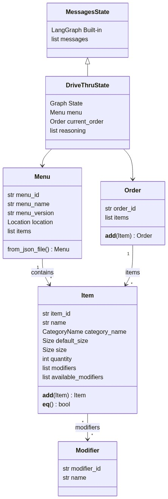
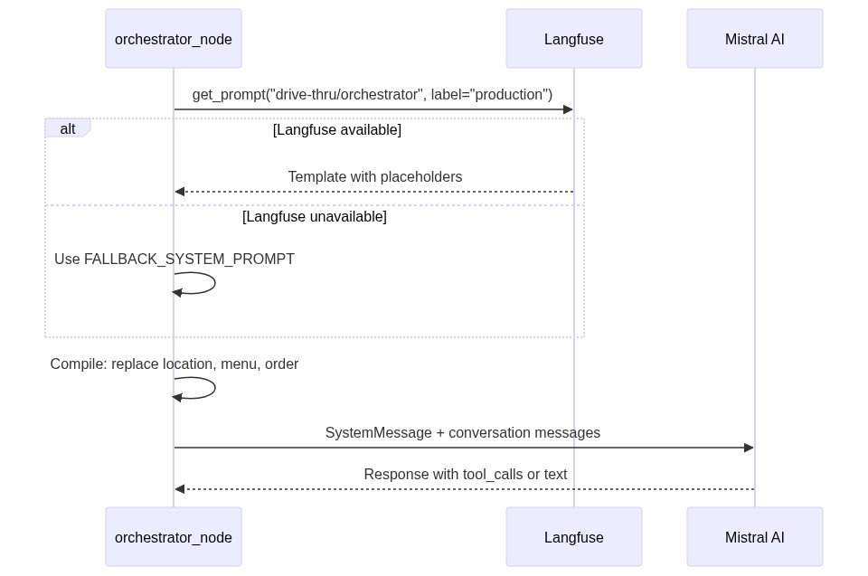

# Building a McDonald's Drive-Thru Chatbot with LangGraph: Why Less Graph is More

*February 2026*

I built a conversational drive-thru ordering system for McDonald's breakfast menu using LangGraph, Mistral AI, and Pydantic v2. Along the way I threw out an entire 12-node state machine design and replaced it with 4 nodes. This post explains what I built, and more importantly, **why** I made the decisions I did.

The full source is available on GitHub. Let's dig in.

---

## What It Does

A customer talks to the chatbot through a CLI. They order breakfast items, customize them with modifiers ("no onions", "extra cheese"), review their order, and finalize. Behind the scenes, a LangGraph agent validates everything against a real menu, manages order state, and traces every decision through Langfuse.


The stack:
- **LangGraph** for the agent loop
- **Mistral AI** as the LLM
- **Langfuse v3** for observability and prompt management
- **Pydantic v2** for data validation
- **uv workspaces** for package management

---

## The Design I Threw Away

My first design (v0) was a textbook state machine. Twelve nodes. Explicit transitions for every conversation phase: greeting, intent classification, menu lookup, item confirmation, order review, finalization. Each phase had conditional edges routing to the next.

It looked great on paper. It would have been miserable to build.

The problem became obvious when I thought about how customers actually talk at a drive-thru: *"I'll have two Egg McMuffins, a large coffee, and can you add hash browns to that?"* That's three intents in one sentence. In a state machine, you need an intent classifier, multi-intent parsing, and careful edge routing to handle it. In an LLM orchestrator, you just... let the LLM figure it out. It's what LLMs are good at.


**The v0 state machine (left)** required 12+ nodes with explicit routing between phases. **The v1 orchestrator (right)** has 4 nodes and lets the LLM handle all routing decisions through tool calling.

### Why the orchestrator pattern won

| Factor | LLM Orchestrator (v1) | Explicit State Machine (v0) |
|--------|---------------------------|----------------------------|
| **Nodes** | 4 | 12+ |
| **Routing** | LLM decides via tool calls | Conditional edges per phase |
| **Multi-intent** | Handles naturally | Requires complex parsing |
| **Extensibility** | Add a tool | Add nodes + edges + routing |
| **Testability** | Test tools as pure functions | Test each node + transition |

The tradeoff is determinism. A state machine gives you predictable paths. An LLM orchestrator gives you flexibility at the cost of occasionally surprising behavior. For a breakfast menu ordering flow with 4 tools, flexibility wins.

---

## The Graph: 4 Nodes, 2 Conditional Edges

Here's the entire LangGraph flow:


1. **`orchestrator`** — Invokes the LLM with the full menu, current order, and conversation history. The LLM either calls tools or responds directly.
2. **`tools`** — Executes whatever tools the LLM requested (LangGraph's built-in `ToolNode`).
3. **`update_order`** — Bridges tool results into graph state. If `add_item_to_order` succeeded, constructs an `Item` and merges it into the `Order`.

Two conditional edge functions control routing:

```python
def should_continue(state: DriveThruState) -> str:
    last_message = state["messages"][-1]
    if last_message.tool_calls:
        return "tools"
    return "respond"     # No tool calls -> END (direct response to customer)


def should_end_after_update(state: DriveThruState) -> str:
    for msg in recent_messages:
        if isinstance(msg, ToolMessage) and msg.name == "finalize_order":
            return "end"
    return "continue"    # Loop back to orchestrator
```

And the graph construction:

```python
_builder = StateGraph(DriveThruState)
_builder.add_node("orchestrator", orchestrator_node)
_builder.add_node("tools", _tool_node)
_builder.add_node("update_order", update_order)

_builder.add_edge(START, "orchestrator")
_builder.add_conditional_edges(
    "orchestrator", should_continue,
    {"tools": "tools", "respond": END},
)
_builder.add_edge("tools", "update_order")
_builder.add_conditional_edges(
    "update_order", should_end_after_update,
    {"end": END, "continue": "orchestrator"},
)
```

That's the entire graph. No intent classifier. No phase tracking. The LLM handles all of that implicitly through the conversation history and tool calls.

---

## State Design: Only What You Actually Need

The v0 design had 8+ state fields: `conversation_phase`, `last_intent`, `pending_items`, `confirmation_status`, and more. When I switched to the LLM orchestrator pattern, most of them became redundant. The LLM implicitly tracks conversation phase through the message history.

The final state has **3 domain fields** on top of LangGraph's built-in `MessagesState`:

```python
class DriveThruState(MessagesState):
    menu: Menu                                      # Loaded once, never mutated
    current_order: Order                            # Mutated only by update_order
    reasoning: Annotated[list[str], operator.add]   # LLM decision log
```



### Why `operator.add` for reasoning

The `reasoning` field uses an **accumulator reducer**. Every time a node returns `{"reasoning": ["some entry"]}`, LangGraph appends it to the existing list instead of overwriting. This is important because the graph loops — without the reducer, each cycle would destroy the previous reasoning entries.

```python
reasoning: Annotated[list[str], operator.add]

# Node returns:
return {"reasoning": ["[TOOL_CALL] lookup_menu_item: Customer asked for McMuffin"]}
# -> Appended to existing list, never overwritten
```

This builds a full decision log over the conversation:

```
[TOOL_CALL] lookup_menu_item: Customer asked for an Egg McMuffin, verifying existence
[TOOL_CALL] add_item_to_order: Item confirmed on menu, adding 2x Egg McMuffin
[DIRECT] Customer greeted, welcoming them and asking what they'd like
[TOOL_CALL] finalize_order: Customer confirmed, submitting order
```

---

## Tool Design: Pure Functions with a State Bridge

This was one of the most deliberate architectural decisions. LangGraph offers a `Command` pattern where tools can mutate state directly. I rejected it.

Instead, all 4 tools are **pure functions** that return dicts. They never touch graph state. A dedicated `update_order` node reads tool results from `ToolMessage`s and applies state changes in one place.


### Why pure functions matter

The separation gives you three things:

**1. Tools are trivially testable.** Pass arguments, assert on the returned dict. No graph context, no mocking:

```python
@tool
def lookup_menu_item(
    item_name: str,
    menu: Annotated[Menu, InjectedState("menu")],  # Injected, invisible to LLM
) -> dict:
    for item in menu.items:
        if item.name.lower() == item_name.lower():
            return {
                "found": True,
                "item_id": item.item_id,
                "name": item.name,
                "available_modifiers": [
                    {"modifier_id": m.modifier_id, "name": m.name}
                    for m in item.available_modifiers
                ],
            }

    # Substring fallback suggestions
    suggestions = [
        item.name for item in menu.items
        if item_name.lower() in item.name.lower()
    ]
    return {"found": False, "requested": item_name, "suggestions": suggestions[:3]}
```

**2. All state mutations happen in exactly one node.** When something goes wrong with the order, you look at `update_order`. That's it. One place to debug, one place to audit.

**3. Tools don't know the state schema.** They read state via `InjectedState` (which is invisible to the LLM — it doesn't see `menu` as a tool argument). But they never write to state, so they're completely decoupled from graph internals.

### The state bridge

The `update_order` node scans recent `ToolMessage`s, constructs `Item` objects from successful `add_item_to_order` results, and merges them into the order:

```python
def update_order(state: DriveThruState) -> dict:
    current_order = state["current_order"]

    for msg in recent_messages:
        if msg.name != "add_item_to_order":
            continue
        result = json.loads(msg.content)
        if not result.get("added"):
            continue

        new_item = Item(
            item_id=result["item_id"],
            name=result["item_name"],
            category_name=CategoryName(result["category_name"]),
            size=Size(result["size"]) if result.get("size") else None,
            quantity=result["quantity"],
            modifiers=[Modifier(**m) for m in result.get("modifiers", [])],
        )
        current_order = current_order + new_item  # Order.__add__ merges duplicates

    return {"current_order": current_order}
```

Notice that line: `current_order = current_order + new_item`. That `+` operator is doing a lot of work.

---

## Domain Models: Why `order + item` Just Works

I overloaded Python's `+` operator on the Pydantic models so order manipulation reads naturally. This isn't just syntactic sugar — the immutability guarantees matter for LangGraph.

### `Order + Item` — add with duplicate merging

```python
class Order(BaseModel):
    order_id: str = Field(default_factory=lambda: str(uuid.uuid4()))
    items: list[Item] = Field(default_factory=list)

    def __add__(self, other: object) -> "Order":
        if not isinstance(other, Item):
            return NotImplemented
        updated_items = list(self.items)
        for i, existing in enumerate(updated_items):
            if existing._is_same_item(other):
                updated_items[i] = existing + other  # Item.__add__ merges quantities
                return Order(order_id=self.order_id, items=updated_items)
        updated_items.append(other)
        return Order(order_id=self.order_id, items=updated_items)
```

When the customer says "two more Egg McMuffins" and they already have one, the order doesn't get a second entry — it updates the quantity to 3. Two items are "the same" when they share the same ID, name, category, and modifiers:

```python
def __eq__(self, other: object) -> bool:
    if not isinstance(other, Item):
        return NotImplemented
    return (
        self.item_id == other.item_id
        and self.name == other.name
        and self.category_name == other.category_name
        and set(self.modifiers) == set(other.modifiers)  # Order-independent
    )
```

### Why `+` instead of `.add_item()`?

A method named `add` implies mutation. In Python, `order.add_item(item)` reads like it changes `order` in place. But LangGraph tracks state through **returned values**, not in-place mutations. The `+` operator has well-understood immutable semantics — `a + b` returns a new object. This makes the intent explicit:

```python
# This returns a NEW order. current_order is unchanged.
current_order = current_order + new_item
```

---

## Prompt Management: Runtime Compilation via Langfuse

The system prompt is a template stored in Langfuse with `{{variable}}` placeholders. Every time the orchestrator node fires, it fetches the template, compiles it with current state, and sends it to the LLM.



### Why compile on every turn?

Because `{{current_order}}` changes as items are added. The LLM needs to see the current order to reason about what to do next. Compiling fresh each turn means the system prompt is always accurate:

```python
def orchestrator_node(state: DriveThruState) -> dict:
    prompt_template = _get_system_prompt_template()

    menu_items = "\n".join(
        f"- {item.name} [{item.category_name.value}] "
        f"(default size: {item.default_size.value})"
        for item in state["menu"].items
    )

    current_items = "\n".join(
        f"- {item.quantity}x {item.name} ({item.size.value})"
        for item in state["current_order"].items
    ) or "Empty"

    system_content = (
        prompt_template
        .replace("{{location_name}}", location.name)
        .replace("{{menu_items}}", menu_items)
        .replace("{{current_order}}", current_items)
    )
```

### Why the full menu in the prompt?

With 21 breakfast items, the full menu fits easily in the context window (~500 tokens). I considered tool-only access (LLM calls `lookup_menu_item` for everything), RAG with embeddings, and a hybrid approach. All were overkill.

The killer argument: customers ask "what do you have?" If the menu isn't in the prompt, the LLM either makes multiple tool calls to list items or — worse — hallucinate items from training data. With the menu in the prompt, it answers instantly and accurately.

This won't scale to hundreds of items. But for a breakfast menu, simplest wins.

### Why Langfuse over hardcoded prompts?

The prompt is the most iterated artifact in any LLM application. Storing it in Langfuse gives you version history, labels (`production`, `staging`), A/B testing, and a UI editor — all without code deployments. A hardcoded fallback ensures the system works if Langfuse is down:

```python
def _get_system_prompt_template() -> str:
    try:
        prompt = langfuse.get_prompt("drive-thru/orchestrator", label="production")
        return prompt.prompt
    except Exception:
        return FALLBACK_SYSTEM_PROMPT
```

---

## Reasoning Extraction: Making the LLM Show Its Work

When you replace a state machine with an LLM orchestrator, you lose routing transparency. In a state machine, you can trace the graph edges to understand flow. In an orchestrator, the LLM just... decides. So I made it explain itself.

The system prompt instructs the LLM to wrap its reasoning in `<reasoning>` tags:

```
ALWAYS start your response with a <reasoning> tag explaining your decision.
If you are calling tools, explain which tools you chose and why.
Example: <reasoning>Customer asked for an Egg McMuffin. I need to call
lookup_menu_item to verify it exists before adding it.</reasoning>
```

The orchestrator node extracts the reasoning, strips it from the customer-facing response, and logs it to state:

```python
_REASONING_PATTERN = re.compile(r"<reasoning>(.*?)</reasoning>", re.DOTALL)

def _extract_reasoning(content: str) -> tuple[str, str]:
    match = _REASONING_PATTERN.search(content)
    if not match:
        return "", content
    reasoning_text = match.group(1).strip()
    cleaned = _REASONING_PATTERN.sub("", content).strip()
    return reasoning_text, cleaned
```

Each entry gets a structured prefix for filtering:

```python
if response.tool_calls:
    tool_names = ", ".join(tc["name"] for tc in response.tool_calls)
    reasoning_entry = f"[TOOL_CALL] {tool_names}: {raw_reasoning}"
else:
    reasoning_entry = f"[DIRECT] {raw_reasoning}"
```

The customer sees clean responses. The developer sees a full decision log. The cost is a few extra output tokens per turn — worth it for debuggability.

---

## Infrastructure Decisions

### Lazy LLM initialization

If `ChatMistralAI` were created at import time, importing `graph.py` without `MISTRAL_API_KEY` would crash. This breaks tests, `__init__.py` exports, and LangGraph Studio. The fix is `@lru_cache`:

```python
@lru_cache(maxsize=1)
def _get_orchestrator_llm():
    settings = get_settings()
    llm = ChatMistralAI(
        model=settings.mistral_model,
        temperature=settings.mistral_temperature,
        api_key=settings.mistral_api_key,
    )
    return llm.bind_tools(_tools)
```

The LLM is created on first invocation, not at import time. Subsequent calls return the cached instance. The same pattern applies to `get_settings()`.

### Dual graph compilation

The graph is consumed by two runtimes that need different checkpointers:


- **LangGraph Studio** provides its own checkpointer — compiling with `MemorySaver` would conflict.
- **CLI** needs `MemorySaver` to persist conversation across turns.

The solution: export the `StateGraph` builder and compile twice:

```python
# graph.py — For Studio (no checkpointer)
graph = _builder.compile()

# main.py — For CLI (with MemorySaver)
graph = _builder.compile(checkpointer=MemorySaver())
```

### uv workspaces

The project uses a uv workspace so future stages (voice integration, multi-location) can have independent dependencies without polluting the orchestrator:

```toml
[tool.uv.workspace]
members = ["src/orchestrator"]     # Future: src/voice, src/locations, etc.
```

One lockfile, isolated dependencies, shared dev tools. Adding a new stage means creating a new directory and adding it to `members`.

---

## Wrapping Up

The biggest lesson from this project: **resist the urge to model every conversation state explicitly.** The v0 state machine was architecturally elegant and practically terrible. The v1 orchestrator is simple, testable, and handles the messiness of real conversation naturally.

Key decisions that paid off:
- **4-node LLM orchestrator** over 12-node state machine — simplicity and natural multi-intent handling
- **Pure function tools + state bridge** — testability and single-point-of-mutation debugging
- **Operator overloading on domain models** — immutable semantics that play well with LangGraph state
- **Runtime prompt compilation via Langfuse** — iterate on prompts without code deployments
- **Reasoning extraction** — compensates for lost routing transparency in the orchestrator pattern

The system is intentionally v1-scoped. It handles 21 breakfast items through a CLI. But the architecture decisions — lazy initialization, dual compilation, workspace structure — are all designed to make the next stages (voice, multi-location, larger menus) possible without rewriting what's already here.

---

*Built with LangGraph, Mistral AI, Langfuse v3, and Pydantic v2. February 2026.*
