<!-- modified: 2026-02-13 -->

# From Vibes to Metrics: Building an Evaluation Pipeline for an AI Drive-Thru Agent with Langfuse v3

You built an LLM-powered agent. It mostly works. You changed the prompt, chatted with it a few times, and it "looked good." Ship it.

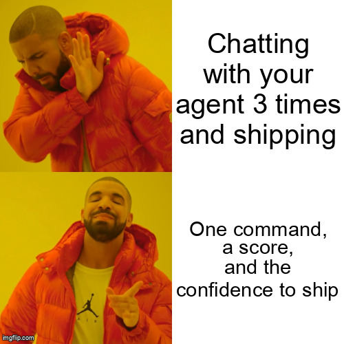

We've all been there. This post walks through how we moved past vibes-based testing for our McDonald's breakfast drive-thru chatbot and built a repeatable evaluation pipeline with Langfuse v3. By the end, we had one command, a quantitative score, and the confidence to actually ship prompt changes.

---

## The Agent Under Test

Our agent is a McDonald's breakfast drive-thru chatbot built with LangGraph and Mistral, traced with Langfuse v3. A customer says "I'll have two Egg McMuffins and a hash brown," and the agent looks up items on the menu, validates they exist, and builds a structured order.

The core is a 4-node LangGraph state machine:

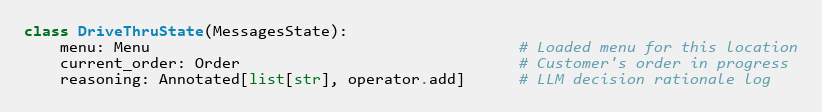

An orchestrator LLM decides what to do, calls tools, updates the order, and loops back:

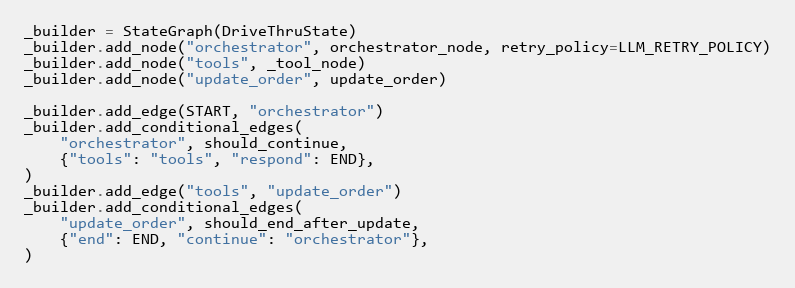

Before evaluations, our development workflow looked like this:

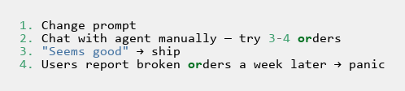

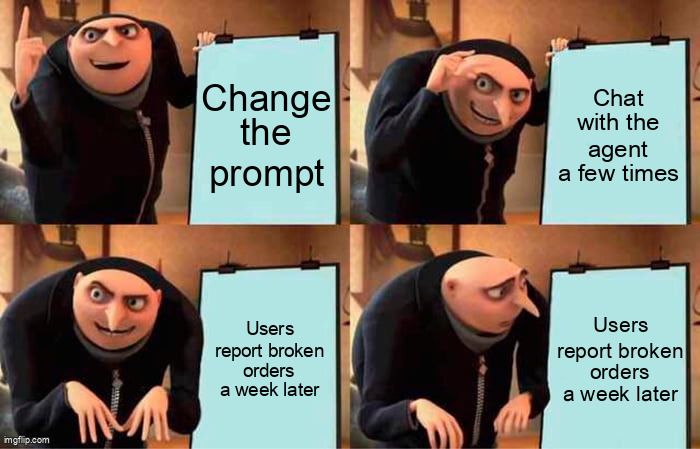

The problems with this are obvious once you list them:

- No baseline. You change the prompt or swap models and have no way to tell if things got better or worse.
- Silent regressions. The agent used to handle "gimme two hash browns" fine, but after a prompt rewrite it stopped working — and you don't notice for days.
- No granularity. Did it get the right item but wrong quantity? Or hallucinate an entirely different item? Binary "it worked / it didn't" hides the distinction.
- Edge cases slip through. Informal phrasing ("lemme get uhh..."), off-menu items ("Big Mac" during breakfast), ambiguous names ("a McMuffin") — you'd need to remember to test all of these manually, every time.

The goal: change a prompt, run `make eval`, get a score you can compare to the last run. One command. Quantitative. Repeatable.

To get there, we need three things: a dataset, evaluators, and a runner to connect them.

---

## Designing the Evaluation Dataset

### What to Evaluate First

We focused on single-turn order correctness — the highest-impact, most measurable capability. Given one customer utterance, does the agent produce the correct order?

We deliberately deferred multi-turn flows, tone, latency, and order modification. These matter, but they require more complex test harnesses and often more subjective scoring. Start with something deterministic.

> Tip: Pick the capability that (a) has a clear right answer and (b) matters most to your users. For us, that's order correctness — if the agent adds the wrong item, nothing else matters.

### Category-Based Coverage

Twenty-five well-chosen test cases beat 500 random ones. Structured coverage across failure modes catches more bugs than volume. We defined nine categories, each targeting a specific way the agent can fail:

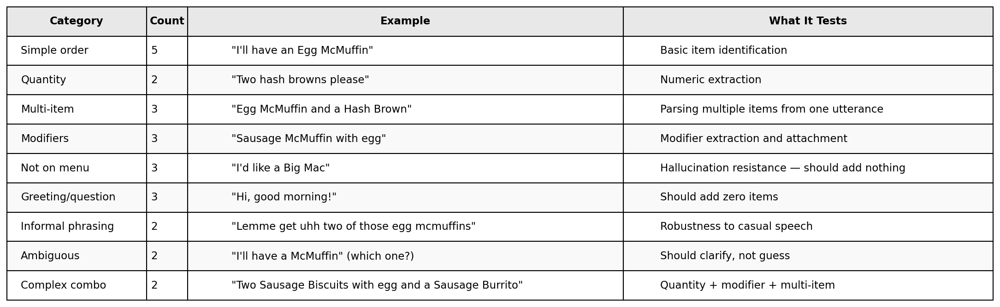
Pay attention to the "absence" categories. `not_on_menu`, `greeting`, and `ambiguous` all expect an empty order. Many eval setups only test for the presence of correct items and never test for the absence of incorrect ones:

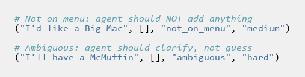

Without these, you'd never catch the hallucination bug where the agent confidently adds an item that doesn't exist on the breakfast menu.

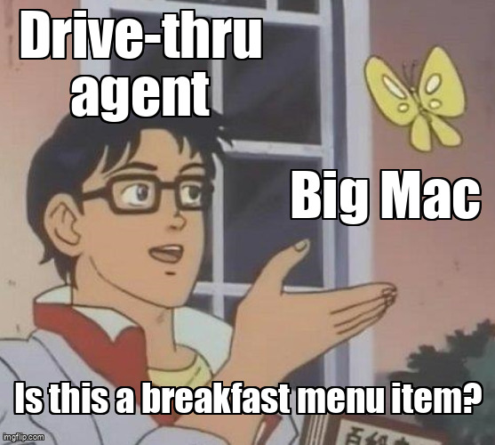

### Dataset Item Structure

Each test case lands in Langfuse with a clear contract between input and expected output:

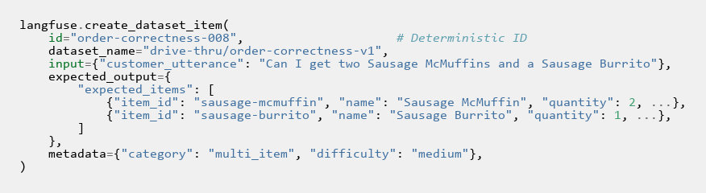

Three design decisions worth calling out:

1. Deterministic IDs (`order-correctness-000`, `order-correctness-001`, ...): Re-running the seed script upserts rather than duplicating. You can run `make eval-seed` as many times as you want.

2. Metadata for slicing: `category` and `difficulty` let you filter results in the Langfuse UI — "how do we score on hard cases vs easy?" — without changing the dataset.

3. Input/output contract: `input.customer_utterance` is what the agent receives; `expected_output.expected_items` is what evaluators compare against. This contract is the bridge between dataset and evaluators.

The seed script itself is straightforward — create the dataset, iterate through test cases, create each item with a deterministic ID:

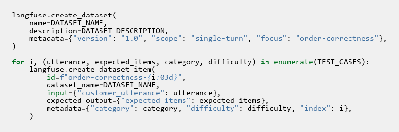

One command seeds everything:

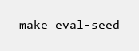

---

## The Experiment Runner

This is the core of the pipeline. We need a task function that invokes the agent, three item-level evaluators that score the results, and one run-level aggregator.

### The Task Function

Langfuse's `dataset.run_experiment()` expects a callable that takes a dataset item and returns output for evaluators to score. Our task function is the adapter between the LangGraph agent and Langfuse's evaluation framework:

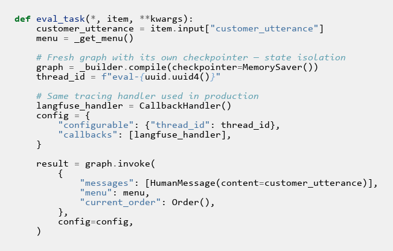

Three things matter here:

State isolation. Each dataset item gets a fresh graph with its own `MemorySaver` and unique thread ID. Without this, state from one test case leaks into the next — an order for "two hash browns" carries over into the greeting test, causing a false failure.

Tracing for free. The same `CallbackHandler` that traces production conversations also traces eval runs. Every evaluation item shows up as a full trace in Langfuse, so you can click into any failing test case and inspect the exact LLM calls, tool invocations, and state transitions. This is invaluable when debugging why a test case scored 0.4 instead of 1.0.

Thin adapter. After invocation, the function reshapes the result into a dict for evaluators — order items, tool calls, response text, item count. Business logic belongs in evaluators, not here:

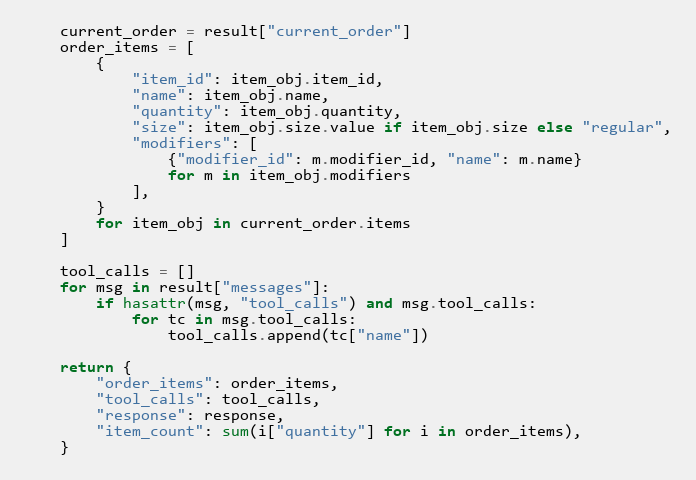

### The Evaluators

We built three item-level evaluators and one run-level aggregator. All are deterministic — no LLM calls in the eval loop.

#### Order Correctness (0.0–1.0, weighted partial credit)

The primary metric. Did the agent get the order right?

The evaluator handles edge cases first. When both sides are empty (greetings, questions, off-menu requests), the answer is correct — the agent correctly did nothing. When expected is empty but the agent added items, that's hallucination — the worst failure. When expected has items but the agent produced nothing, it missed the order entirely. Both score 0.0:

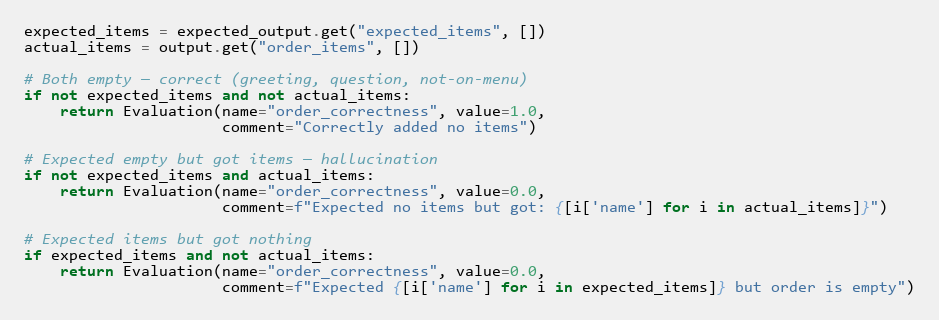

When both sides have items, matching happens by `item_id` using dict lookups — order-independent, so "hash brown, then McMuffin" scores the same as "McMuffin, then hash brown":

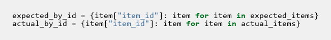

Each matched item gets a weighted score:

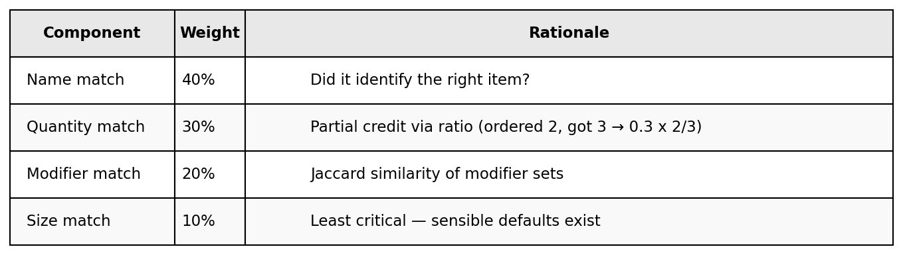
Quantity scoring gives partial credit for being close rather than treating off-by-one the same as a total miss:

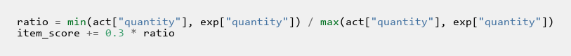

Modifiers are compared as sets using Jaccard similarity:

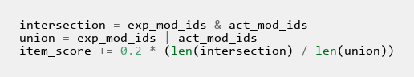

> Why partial credit? "Got the right item but wrong quantity" is fundamentally different from "hallucinated an item that doesn't exist." Binary scoring hides that distinction. With weighted scoring, a regression from correct quantity to off-by-one shows as a visible dip — not a silent pass-to-fail cliff.

#### Tool Call Accuracy (0.0–1.0, protocol compliance)

This evaluator checks whether the agent followed the correct tool-calling protocol, independent of whether the order ended up correct.

Our agent has an explicit rule: always call `lookup_menu_item` before `add_item_to_order`. The lookup validates that the item exists and returns the canonical `item_id`. Skipping it means the agent is guessing — and an agent that guesses correctly today will break silently when the menu changes.

The evaluator checks temporal ordering:

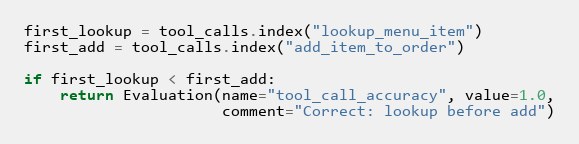

Scoring:
- 1.0 — Correct protocol (lookup before add)
- 0.5 — Both called but wrong order
- 0.3 — Only one of the two called
- 0.0 — Neither called when items were expected

#### No Hallucinated Items (binary, 0 or 1)

The simplest evaluator, catching the worst failure mode: the agent inventing menu items that don't exist.

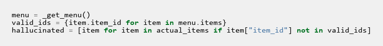

If the agent adds a "McChicken" to a breakfast order, partial credit doesn't apply. Hallucination is a hard failure.

#### Average Order Correctness (run-level aggregate)

A run-level evaluator that receives all item results and computes the single number you compare between runs:

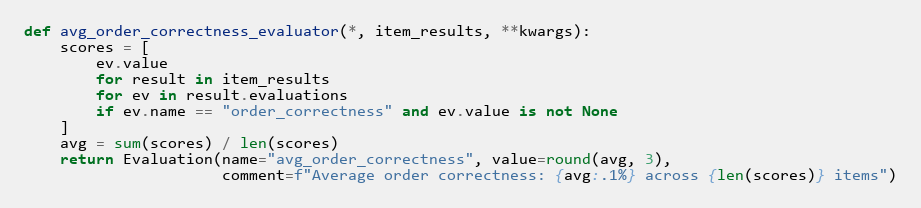

"Prompt v1: 87%. Prompt v2: 92%. Ship it."

### Wiring It Together

Everything connects in a single `run_experiment()` call:

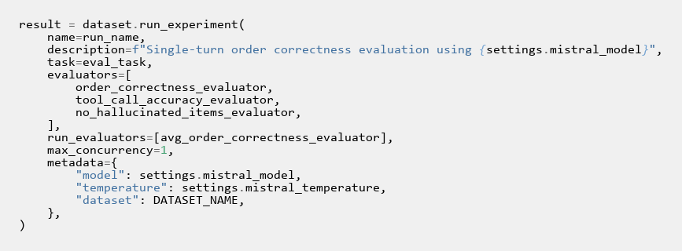

A few things to note:

- `evaluators` vs `run_evaluators`: Item evaluators score each dataset item independently. Run evaluators aggregate across all items. You'll typically have several item-level evaluators and one or two run-level ones.
- `max_concurrency=1`: Sequential execution for deterministic ordering and to avoid rate limits during development. Increase once stable.
- `metadata`: Record anything you might want to slice by later — model name, temperature, prompt version. You'll thank yourself.

Two commands cover the full workflow:

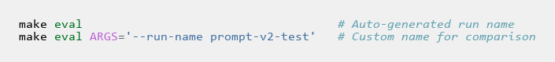

---

## Prompt Management and the Eval Loop

We use Langfuse's prompt management for version control over the system prompt. Prompts are seeded with a `production` label:

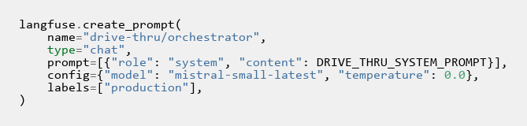

At runtime, the agent fetches by label with a hardcoded fallback:

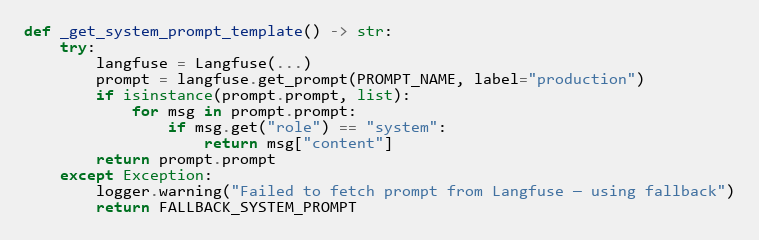

This closes the loop: change a prompt in Langfuse, run `make eval`, and the new version is what gets evaluated. The run metadata records which model and settings were used, so you can always trace back what was tested.

Here's what the workflow looks like in practice:

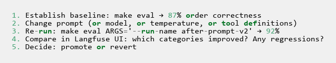

The `category` and `difficulty` metadata on each dataset item let you slice results in the Langfuse UI. An aggregate score of "87%" is useful for comparison, but "we went from 60% to 90% on informal phrasing while staying flat on everything else" tells you exactly what your prompt change accomplished.

---

## Lessons Learned

Deterministic evaluators first. No LLM calls in the eval loop means fast runs (~2 minutes for 25 items), zero eval cost beyond the agent's own LLM calls, and perfectly reproducible scores. LLM-as-Judge adds variance and cost — save it for subjective metrics like tone.

Partial credit over binary pass/fail. "Right item, wrong quantity" (score: ~0.7) is actionable signal. Binary scoring treats it the same as "hallucinated a different item" (score: 0.0). Weighted scoring makes regressions visible at a finer granularity.

Order-independent matching everywhere. Items matched by `item_id` via dict lookups. Modifiers compared as sets. The agent saying items in a different order than expected doesn't affect scores. This eliminates an entire class of false negatives.

Test for absence, not just presence. Eight of our 25 test cases expect an empty order. Without these, we'd never catch hallucination bugs.

Idempotent everything. Re-running `make eval-seed` upserts via deterministic IDs. Re-running `make eval` creates a new experiment run, never overwriting old ones. You can't accidentally destroy your baseline.

Start with evaluation earlier. Designing the dataset forced us to articulate what "correct" means — which clarified the agent's requirements. "Should the agent guess when someone says 'a McMuffin' without specifying which one?" is a requirements question, not an evaluation question. This thinking should happen before you build the agent, not after.

---

## What's Next

1. LLM-as-Judge evaluators for tone, helpfulness, and response conciseness
2. Multi-turn conversation evaluation — full ordering flows with modifications and confirmations
3. CI integration — fail the build if order correctness drops below a threshold
4. Production traffic sampling — evaluate live conversations offline to catch drift

---

## Quick-Start Reference

### Reproduce This

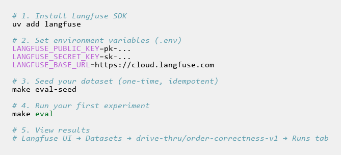

### File Map

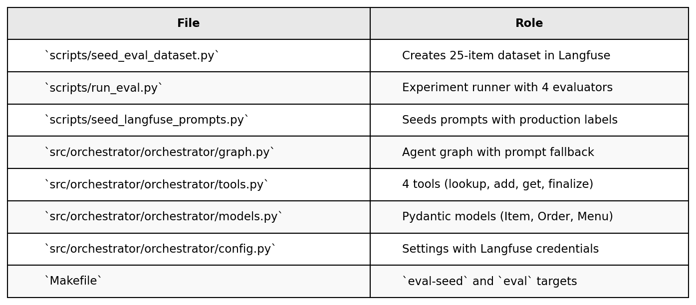
### Evaluator Function Signatures (Langfuse v3)

For readers implementing their own evaluators:

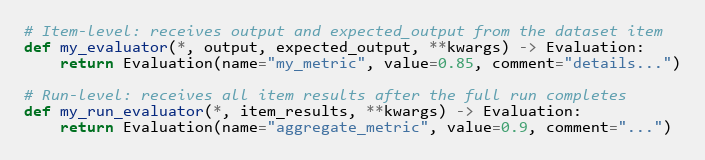

The `**kwargs` matters — Langfuse may pass additional context. Accept it even if you don't use it.

---

That's the full pipeline. Twenty-five test cases, four evaluators, one command. The next time you change a prompt, you'll know whether it's better — not because it "seemed good," but because you measured it.
