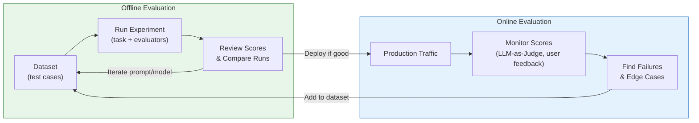
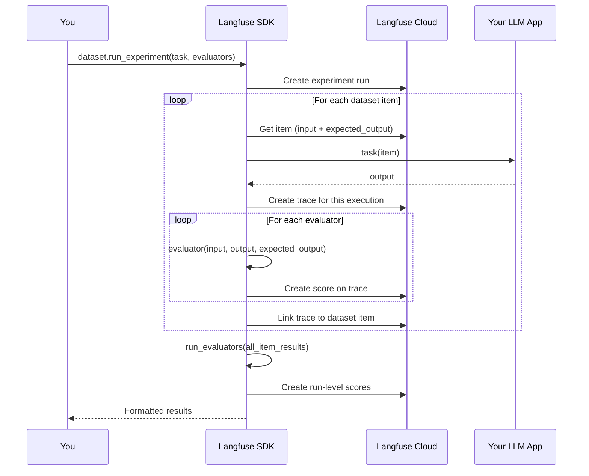
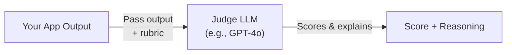
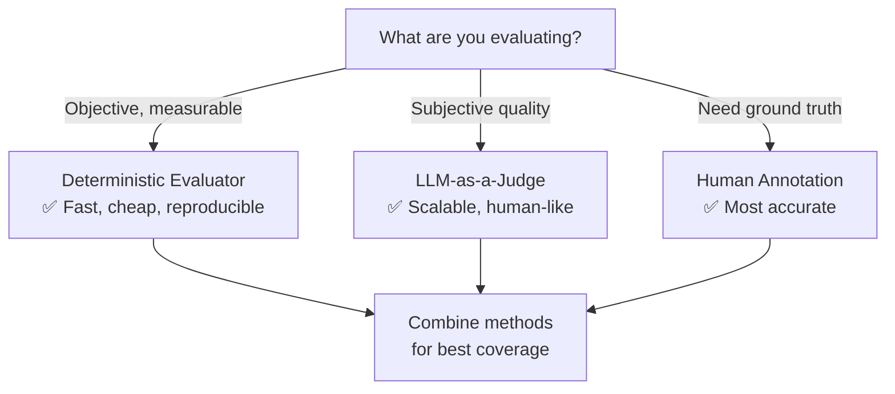
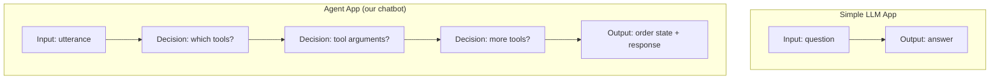
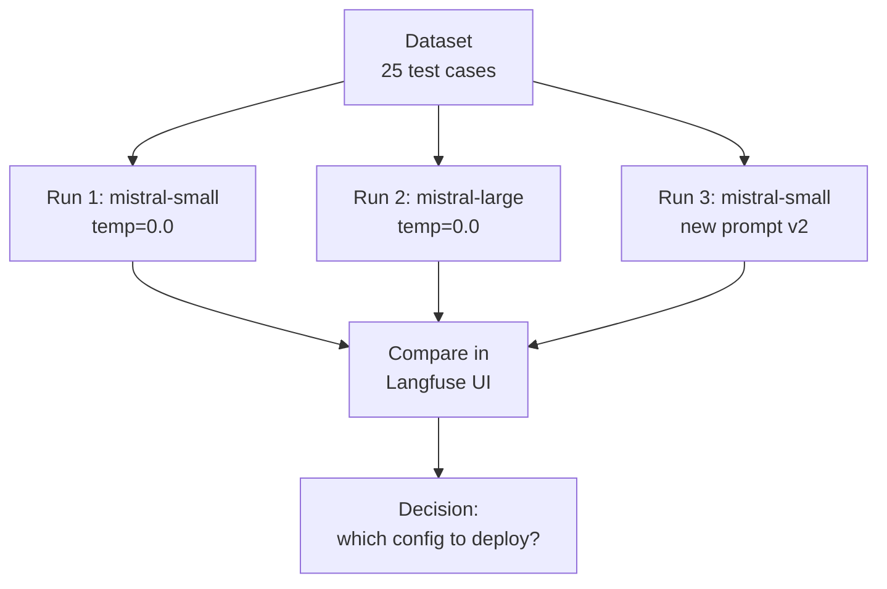
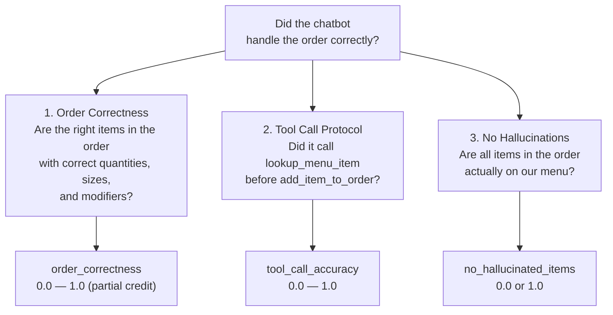
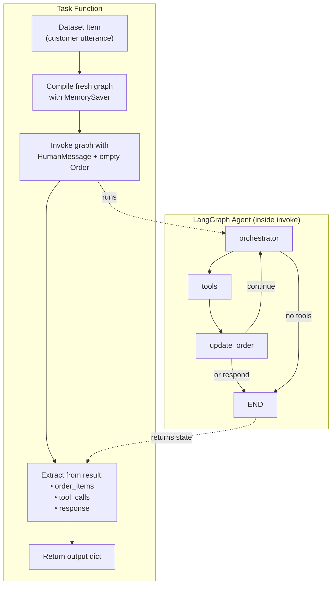
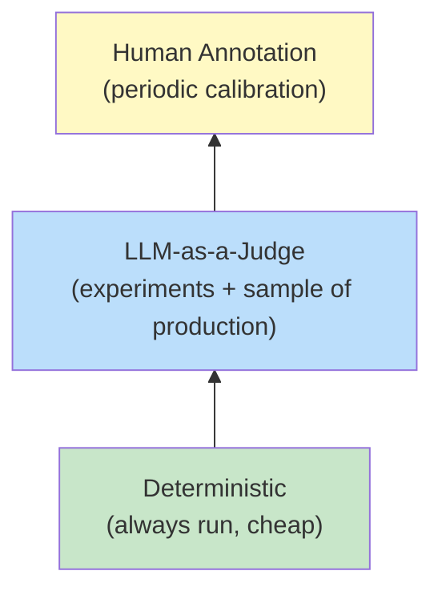

<!-- modified: 2026-02-11 -->
# Langfuse Evaluations Tutorial

A practical guide to evaluating LLM applications with [Langfuse v3](https://langfuse.com), using this McDonald's drive-thru chatbot as a running example.

---

## Table of Contents

- [Why Evaluate?](#why-evaluate)
- [Core Concepts](#core-concepts)
  - [The Evaluation Loop](#the-evaluation-loop)
  - [Key Objects](#key-objects)
  - [How They Connect](#how-they-connect)
- [Evaluation Methods](#evaluation-methods)
  - [Deterministic Evaluators](#deterministic-evaluators)
  - [LLM-as-a-Judge](#llm-as-a-judge)
  - [Human Annotation](#human-annotation)
  - [Choosing the Right Method](#choosing-the-right-method)
- [Datasets](#datasets)
  - [What Makes a Good Dataset](#what-makes-a-good-dataset)
  - [Creating Datasets via SDK](#creating-datasets-via-sdk)
  - [Dataset Design for Agents](#dataset-design-for-agents)
  - [Growing Datasets from Production](#growing-datasets-from-production)
- [Experiments](#experiments)
  - [The Experiment Runner SDK](#the-experiment-runner-sdk)
  - [Task Functions](#task-functions)
  - [Item-Level Evaluators](#item-level-evaluators)
  - [Run-Level Evaluators](#run-level-evaluators)
  - [Running and Comparing Experiments](#running-and-comparing-experiments)
- [Applying This to Our Chatbot](#applying-this-to-our-chatbot)
  - [What We Evaluate](#what-we-evaluate)
  - [Dataset Design](#dataset-design)
  - [Our Task Function](#our-task-function)
  - [Our Evaluators](#our-evaluators)
  - [Running the Evaluation](#running-the-evaluation)
- [Tips for Getting the Most Out of Evaluations](#tips-for-getting-the-most-out-of-evaluations)
- [Further Reading](#further-reading)

---

## Why Evaluate?

LLM applications are non-deterministic. The same prompt can produce different outputs across runs. Traditional software tests (assert input X produces output Y) don't work when the output is natural language generated by a model.

Evaluation replaces guesswork with data:

| Without evaluation | With evaluation |
|---|---|
| "The new prompt seems better" | "Accuracy improved from 82% to 91% across 25 test cases" |
| Edge cases found by users in production | Edge cases caught before deployment |
| Prompt regressions discovered days later | Regressions blocked by automated scoring |
| "I think the model upgrade is fine" | "Model B scores 4% higher on order correctness but costs 2x more" |

Evaluation is especially important for **agent-based systems** like this chatbot, where the LLM makes multiple decisions (which tools to call, in what order, with what arguments) and a single wrong decision can cascade.

---

## Core Concepts

> **Langfuse docs:** [Evaluation Core Concepts](https://langfuse.com/docs/evaluation/core-concepts)

### The Evaluation Loop

Evaluation isn't a one-time activity. It's a continuous loop between offline testing and online monitoring:



**Offline evaluation** tests your application against a fixed dataset before deployment. You change a prompt, run the experiment, review scores, iterate until satisfied, then deploy.

**Online evaluation** scores live production traces to catch issues your dataset didn't cover. When you find failures, you add them back to the dataset, so future experiments catch them.

Over time, your dataset grows from a handful of examples into a comprehensive test suite that reflects real-world usage.

### Key Objects

Langfuse evaluation is built on a small set of objects that work together:

| Object | What it is | Example |
|--------|-----------|---------|
| **Dataset** | A named collection of test cases | `drive-thru/order-correctness-v1` |
| **Dataset Item** | One test case: an input + optional expected output | Input: "I'll have an Egg McMuffin"<br/>Expected: `[{item_id: "egg-mcmuffin", qty: 1}]` |
| **Task** | Your application code to test | The LangGraph agent invocation |
| **Evaluator** | A function that scores one result | "Does the order match expected items?" |
| **Score** | The output of an evaluator (numeric, categorical, or boolean) | `order_correctness: 0.85` |
| **Experiment Run** | One execution of the task against all dataset items | `eval-20260211-143022` |

> **Langfuse docs:** [Evaluation Data Model](https://langfuse.com/docs/evaluation/experiments/data-model)

### How They Connect

Here's the full picture of how an experiment flows:



The key insight: **the experiment runner handles all the wiring**. You provide three things — a dataset, a task function, and evaluator functions — and the SDK handles concurrent execution, error isolation, trace linking, and score reporting.

---

## Evaluation Methods

Langfuse supports multiple ways to score your application. Each is suited to different kinds of questions.

> **Langfuse docs:** [Evaluation Methods](https://langfuse.com/docs/evaluation/core-concepts#evaluation-methods)

### Deterministic Evaluators

**What:** Code-based checks with exact logic. No LLM calls needed.

**Best for:** Objective, measurable criteria — correctness, format validation, protocol compliance.

**Examples:**
- Does the order contain exactly the expected items?
- Did the agent call `lookup_menu_item` before `add_item_to_order`?
- Is the response under 50 words?
- Does the output parse as valid JSON?

```python
from langfuse import Evaluation

def order_correctness(*, output, expected_output, **kwargs):
    actual_items = {item["item_id"] for item in output.get("order_items", [])}
    expected_items = {item["item_id"] for item in expected_output.get("expected_items", [])}

    if actual_items == expected_items:
        return Evaluation(name="order_correctness", value=1.0, comment="Perfect match")

    return Evaluation(name="order_correctness", value=0.0, comment="Mismatch")
```

**Advantages:** Fast, cheap, reproducible, no API calls.
**Limitations:** Can only check things you can express as code.

### LLM-as-a-Judge

**What:** Use a separate LLM to evaluate your application's output.

**Best for:** Subjective qualities — tone, helpfulness, clarity, factual accuracy.

> **Langfuse docs:** [LLM-as-a-Judge](https://langfuse.com/docs/evaluation/evaluation-methods/llm-as-a-judge)

**Examples:**
- Is the response friendly and appropriate for a drive-thru?
- Does the response accurately reflect the menu?
- Is the response concise enough to be spoken aloud?

You can configure LLM-as-a-Judge evaluators directly in the Langfuse UI — no code required. Langfuse ships managed evaluators for common criteria (hallucination, toxicity, helpfulness) and lets you create custom evaluators with your own prompt templates.



**Advantages:** Can evaluate subjective qualities at scale.
**Limitations:** Costs money per evaluation (LLM API call), slower, can have its own biases.

You can also define LLM-as-a-Judge evaluators in code using the experiment runner SDK:

```python
from langfuse import Evaluation
from openai import OpenAI

def tone_evaluator(*, output, **kwargs):
    response = OpenAI().chat.completions.create(
        model="gpt-4o-mini",
        messages=[{
            "role": "user",
            "content": f"Rate this drive-thru response for friendliness (0-1):\n{output['response']}"
        }],
    )
    score = float(response.choices[0].message.content.strip())
    return Evaluation(name="tone", value=score)
```

### Human Annotation

**What:** Human reviewers score traces manually through annotation queues.

**Best for:** Building ground truth, calibrating automated evaluators, handling subjective edge cases.

> **Langfuse docs:** [Annotation Queues](https://langfuse.com/docs/evaluation/evaluation-methods/annotation-queues)

Langfuse provides a built-in annotation UI where you can:
1. Create annotation queues with custom scoring rubrics
2. Assign traces to reviewers
3. Collect structured feedback (numeric scores, categories, comments)

**When to use:** When bootstrapping your first dataset, validating that automated evaluators agree with human judgment, or handling cases that are too nuanced for code or LLM-as-a-Judge.

### Choosing the Right Method



In practice, most teams use a combination:
- **Deterministic** for correctness and protocol compliance (cheap, always run)
- **LLM-as-a-Judge** for quality dimensions (run on a sample or during experiments)
- **Human annotation** for building initial datasets and periodic calibration

---

## Datasets

Datasets are the foundation of repeatable evaluation. A well-designed dataset lets you compare different prompt versions, models, or configurations on the same set of inputs.

> **Langfuse docs:** [Datasets](https://langfuse.com/docs/evaluation/experiments/datasets)

### What Makes a Good Dataset

1. **Representative** — Cover the most common cases, weighted by actual frequency
2. **Comprehensive** — Include edge cases, error conditions, and boundary scenarios
3. **Labeled** — Each item has a clear expected output so evaluators can score automatically
4. **Growing** — Continuously add real failures from production
5. **Categorized** — Use metadata to tag items by category, difficulty, and source

A dataset of 25-50 well-chosen items is far more useful than 500 random ones. Quality matters more than quantity.

### Creating Datasets via SDK

```python
from langfuse import Langfuse

langfuse = Langfuse()

# Create the dataset (idempotent — Langfuse upserts by name)
langfuse.create_dataset(
    name="my-eval-dataset",
    description="Test cases for my LLM application",
    metadata={"version": "1.0", "focus": "accuracy"},
)

# Add items
langfuse.create_dataset_item(
    dataset_name="my-eval-dataset",
    input={"question": "What is the capital of France?"},
    expected_output={"answer": "Paris"},
    metadata={"category": "geography", "difficulty": "easy"},
)
```

Key points:
- **`input`** and **`expected_output`** can be any JSON-serializable object — design the schema that makes sense for your evaluators
- **`metadata`** is for your organizational purposes (filtering, analysis) — evaluators don't receive it by default
- Datasets support **folder organization** via slashes in names: `"evaluation/qa-dataset"`
- Items can be **archived** (removed from future runs) without deleting them

### Dataset Design for Agents

For agent-based applications (like our chatbot), dataset design requires more thought because agents make multiple decisions per input:



For agents, your expected output should capture **what the end state should be**, not every intermediate decision. This keeps the dataset maintainable while still catching most issues.

For our chatbot, each dataset item looks like:

```json
{
  "input": {"customer_utterance": "Two Egg McMuffins and a hash brown"},
  "expected_output": {
    "expected_items": [
      {"item_id": "egg-mcmuffin", "name": "Egg McMuffin", "quantity": 2, "size": "regular", "modifiers": []},
      {"item_id": "hash-brown", "name": "Hash Brown", "quantity": 1, "size": "regular", "modifiers": []}
    ]
  }
}
```

### Growing Datasets from Production

The most valuable dataset items come from real failures. Langfuse makes it easy to add production traces to datasets:

**Via the UI:** On any trace, click "+ Add to dataset" to create a dataset item from that trace's input/output.

**Via the SDK:**

```python
langfuse.create_dataset_item(
    dataset_name="my-eval-dataset",
    input={"customer_utterance": "the weird thing the customer actually said"},
    expected_output={"expected_items": [...]},  # you provide the correct answer
    source_trace_id="trace-id-from-production",  # links back to the original trace
    metadata={"source": "production_failure", "failure_reason": "added wrong item"},
)
```

**Workflow:** Monitor production traces in Langfuse → find failures → add correct expected output → add to dataset → future experiments catch this case.

---

## Experiments

An experiment runs your application against a dataset and scores the results. It's how you answer "did this change make things better or worse?"

> **Langfuse docs:** [Experiments via SDK](https://langfuse.com/docs/evaluation/experiments/experiments-via-sdk)

### The Experiment Runner SDK

Langfuse v3 provides a high-level `run_experiment()` method that handles the entire flow:

```python
from langfuse import get_client

langfuse = get_client()

# Get your dataset
dataset = langfuse.get_dataset("my-eval-dataset")

# Run the experiment
result = dataset.run_experiment(
    name="experiment-v1",
    task=my_task_function,
    evaluators=[my_evaluator_1, my_evaluator_2],
    run_evaluators=[my_aggregate_evaluator],
)

print(result.format())
```

The runner automatically handles:
- **Concurrent execution** — runs items in parallel (configurable with `max_concurrency`)
- **Error isolation** — one item failure doesn't stop the whole experiment
- **Automatic tracing** — each task execution creates a Langfuse trace
- **Dataset run creation** — results appear in the Langfuse comparison UI

You can also run experiments on **local data** (without a Langfuse-hosted dataset):

```python
local_data = [
    {"input": "What is 2+2?", "expected_output": "4"},
    {"input": "What is 3+3?", "expected_output": "6"},
]

result = langfuse.run_experiment(
    name="quick-test",
    data=local_data,
    task=my_task,
    evaluators=[my_evaluator],
)
```

Local experiments create traces in Langfuse but don't create dataset runs (no comparison UI).

### Task Functions

The task function is your application code wrapped for the experiment runner. It receives a dataset item and returns an output.

**Signature:**

```python
def my_task(*, item, **kwargs):
    # item.input  — the input from the dataset item (dict)
    # item.expected_output  — available but typically used by evaluators, not the task

    result = my_llm_application(item.input)

    return result  # any JSON-serializable value; passed to evaluators as 'output'
```

**Key rules:**
- Always accept `**kwargs` — the SDK may pass additional arguments in the future
- Return a JSON-serializable value — this becomes the `output` parameter in evaluators
- Each invocation should be **independent** — don't share state between items
- If your app uses tracing (e.g., Langfuse `CallbackHandler`), include it in the task — traces are automatically linked to the dataset item

### Item-Level Evaluators

Item-level evaluators score each dataset item individually. They receive the input, output, expected output, and metadata.

**Signature:**

```python
from langfuse import Evaluation

def my_evaluator(*, input, output, expected_output, metadata, **kwargs):
    # input  — from dataset item
    # output — returned by the task function
    # expected_output — from dataset item
    # metadata — from dataset item

    score = compute_score(output, expected_output)

    return Evaluation(
        name="my_metric",     # appears in Langfuse UI
        value=score,          # numeric (0.0-1.0), categorical (string), or boolean
        comment="explanation" # optional, helps with debugging
    )
```

The `Evaluation` return type:
- **`name`** — the metric name shown in Langfuse (e.g., `"order_correctness"`)
- **`value`** — the score. Can be numeric (float/int), categorical (string), or boolean
- **`comment`** — optional explanation that appears alongside the score in the UI

You can return **multiple evaluations** from one evaluator by returning a list:

```python
def multi_evaluator(*, output, **kwargs):
    return [
        Evaluation(name="metric_a", value=0.8),
        Evaluation(name="metric_b", value=1.0),
    ]
```

### Run-Level Evaluators

Run-level evaluators compute **aggregate metrics** across all items in an experiment. They receive the full list of item results.

```python
from langfuse import Evaluation

def average_accuracy(*, item_results, **kwargs):
    scores = [
        ev.value
        for result in item_results
        for ev in result.evaluations
        if ev.name == "accuracy" and ev.value is not None
    ]

    avg = sum(scores) / len(scores) if scores else 0
    return Evaluation(
        name="avg_accuracy",
        value=round(avg, 3),
        comment=f"Average accuracy: {avg:.1%} across {len(scores)} items",
    )
```

Run-level scores are attached to the overall dataset run and visible in the Langfuse comparison view.

### Running and Comparing Experiments

The real power of experiments is **comparison**. Run the same dataset with different configurations and compare side-by-side:



In the Langfuse UI, you can:
- View per-item scores side-by-side across runs
- See aggregate score differences at a glance
- Drill into specific items where scores changed
- Filter by metadata (category, difficulty) to understand patterns

**Common experiments:**
- Compare model versions (mistral-small vs mistral-large)
- Compare prompt versions (production vs staging prompt)
- Compare temperature settings
- Compare tool configurations
- A/B test before deploying to production

---

## Applying This to Our Chatbot

Now let's see how all these concepts apply to the McDonald's drive-thru chatbot.

### What We Evaluate

Our primary concern is **order correctness**: when a customer says "Two Egg McMuffins and a hash brown," does the right stuff end up in the order?

This breaks down into three specific questions:



### Dataset Design

Each test case is a **single customer utterance** with the expected order state after the agent processes it:

| Category | Example utterance | Expected items | Difficulty |
|---|---|---|---|
| Simple order | "I'll have an Egg McMuffin" | 1x Egg McMuffin | Easy |
| Quantity | "Two hash browns please" | 2x Hash Brown | Easy |
| Multi-item | "Egg McMuffin and a Hash Brown" | 1x Egg McMuffin + 1x Hash Brown | Medium |
| Modifier | "Sausage McMuffin with egg" | 1x Sausage McMuffin [Egg] | Medium |
| Not on menu | "I'd like a Big Mac" | (empty — should add nothing) | Medium |
| Greeting | "Hi, good morning!" | (empty — should add nothing) | Easy |
| Informal | "yeah gimme two egg mcmuffins" | 2x Egg McMuffin | Hard |
| Ambiguous | "I'll have a McMuffin" | (empty — should clarify) | Hard |
| Complex | "Two Sausage Biscuits with egg and a Sausage Burrito" | 2x Sausage Biscuit [Egg] + 1x Sausage Burrito | Hard |

Note that "expected items = empty" is a valid and important test case. Greetings, questions, and not-on-menu requests should **not** result in items being added to the order. Testing this catches hallucination bugs.

### Our Task Function

The task function wraps the LangGraph agent. Key design decisions:

1. **Fresh state per item** — each item gets its own `MemorySaver` and `thread_id` so the order starts empty
2. **Full graph invocation** — we run the complete orchestrator → tools → update_order loop
3. **Structured output** — we return the order state, tool call sequence, and response text so evaluators can check different aspects



### Our Evaluators

**`order_correctness`** (0.0 — 1.0, partial credit):

For each unique `item_id` across expected and actual orders:

| Component | Weight | Score logic |
|---|---|---|
| Name match | 0.4 | Case-insensitive string comparison |
| Quantity match | 0.3 | Exact match = full credit; close = partial credit |
| Size match | 0.1 | Exact match |
| Modifier match | 0.2 | Jaccard similarity of modifier IDs |

Missing expected items and unexpected extra items both count against the score.

Special cases:
- Both empty (greeting/question) → 1.0
- Expected empty, got items (hallucination) → 0.0
- Expected items, got nothing (missed order) → 0.0

**`tool_call_accuracy`** (0.0 — 1.0):
- Items expected: must have `lookup_menu_item` before `add_item_to_order` → 1.0
- No items expected: `add_item_to_order` must NOT appear → 1.0
- Protocol violations get partial credit (0.3 — 0.5)

**`no_hallucinated_items`** (binary 0.0 or 1.0):
- Checks every `item_id` in the actual order against the breakfast menu
- Any item not on the menu → 0.0

### Running the Evaluation

```bash
# Step 1: Seed the dataset (one-time, idempotent)
make eval-seed

# Step 2: Run an experiment
make eval

# Step 3: Run again with different config and compare
make eval ARGS='--run-name mistral-large-test'
```

After running, open the Langfuse UI:
1. Navigate to **Datasets** → `drive-thru/order-correctness-v1`
2. Click the **Runs** tab to see experiment runs
3. Click a run to see per-item scores
4. Select two runs and click **Compare** to see differences

---

## Tips for Getting the Most Out of Evaluations

### Start small, iterate fast

Don't try to build a 500-item dataset on day one. Start with 15-25 carefully chosen items that cover your most important scenarios. Run experiments. See what breaks. Add those failures to the dataset. Iterate.

### Design expected outputs for your evaluators

Your `expected_output` schema should match what your evaluators need. If your evaluator checks order items, your expected output should contain order items. If it checks tool calls, include expected tool calls. Design them together.

### Use metadata for analysis

Tag dataset items with `category`, `difficulty`, `source`, or any other dimensions you care about. When reviewing experiment results, you can filter by these tags to answer questions like "how does the model perform on multi-item orders vs simple orders?"

### Test the absence of action

Some of the most important test cases check that the agent does **not** do something:
- Greeting → no items added
- Off-menu request → no items added
- Question about the menu → no items added

These catch hallucination bugs that are easy to miss.

### Compare before deploying

Every prompt change, model switch, or configuration update should be an experiment. Run the new version against your dataset, compare scores to the baseline, and only deploy if scores improve (or at least don't regress).

### Use comments in evaluations

The `comment` field on `Evaluation` objects is your debugging breadcrumb. When a score is low, the comment should explain **why**:

```python
# Bad: no comment
return Evaluation(name="accuracy", value=0.3)

# Good: explains what went wrong
return Evaluation(
    name="accuracy",
    value=0.3,
    comment="Expected Egg McMuffin (qty=2) but got qty=1; Hash Brown: MISSING"
)
```

### Layer evaluation methods

Start with deterministic evaluators (fast, cheap, reliable). Once those are stable, add LLM-as-a-Judge for subjective quality. Use human annotation to calibrate both.



### Automate in CI (when ready)

Once your dataset and evaluators are stable, run experiments in CI to block regressions:

```python
# In a pytest test
def test_order_correctness_above_threshold():
    result = dataset.run_experiment(
        name="ci-check",
        task=eval_task,
        evaluators=[order_correctness_evaluator],
        run_evaluators=[avg_order_correctness_evaluator],
    )

    avg = next(
        ev.value for ev in result.run_evaluations
        if ev.name == "avg_order_correctness"
    )
    assert avg >= 0.80, f"Order correctness {avg:.1%} below threshold 80%"
```

---

## Further Reading

### Langfuse Documentation

- [Evaluation Overview](https://langfuse.com/docs/evaluation/overview) — starting point for all evaluation features
- [Core Concepts](https://langfuse.com/docs/evaluation/core-concepts) — datasets, experiments, scores, evaluation loop
- [Datasets](https://langfuse.com/docs/evaluation/experiments/datasets) — creating, versioning, and managing datasets
- [Experiments via SDK](https://langfuse.com/docs/evaluation/experiments/experiments-via-sdk) — the experiment runner API
- [Experiments via UI](https://langfuse.com/docs/evaluation/experiments/experiments-via-ui) — running experiments from the Langfuse interface
- [LLM-as-a-Judge](https://langfuse.com/docs/evaluation/evaluation-methods/llm-as-a-judge) — setting up model-based evaluators
- [Annotation Queues](https://langfuse.com/docs/evaluation/evaluation-methods/annotation-queues) — human review workflows
- [Scores via API/SDK](https://langfuse.com/docs/evaluation/evaluation-methods/scores-via-sdk) — programmatic score creation
- [Data Model](https://langfuse.com/docs/evaluation/experiments/data-model) — detailed schema for all evaluation objects

### Cookbooks & Guides

- [Evaluate LangGraph Agents](https://langfuse.com/guides/cookbook/example_langgraph_agents) — end-to-end LangGraph evaluation example
- [Agent Evaluation Guide](https://langfuse.com/guides/cookbook/example_pydantic_ai_mcp_agent_evaluation) — three evaluation strategies (black-box, trajectory, single-step)
- [Systematic Evaluation of AI Agents](https://langfuse.com/blog/2025-11-06-experiment-interpretation) — running and interpreting experiments
- [Synthetic Datasets](https://langfuse.com/docs/evaluation/features/synthetic-datasets) — generating test data with LLMs

### Project-Specific

- [Implementation Plan](../../plan/future-plans/2026-02-11-langfuse-evaluation-dataset-and-experiments.md) — the step-by-step plan for building our evaluation system
- [Evaluation Design Notes (v0)](../../planning-docs/thoughts/target-implementation/v0/langfuse-evaluation-v0.md) — original evaluation brainstorming document
- [Architecture](../architecture/architecture.md) — system architecture and design decisions

### Python SDK Reference

- [Python SDK v3 Reference](https://python.reference.langfuse.com) — full API docs
- [`Langfuse.run_experiment()`](https://python.reference.langfuse.com/langfuse#Langfuse.run_experiment) — experiment runner API
- [`Langfuse.create_dataset()`](https://python.reference.langfuse.com/langfuse#Langfuse.create_dataset) — dataset creation
- [`Langfuse.create_dataset_item()`](https://python.reference.langfuse.com/langfuse#Langfuse.create_dataset_item) — adding items to datasets
