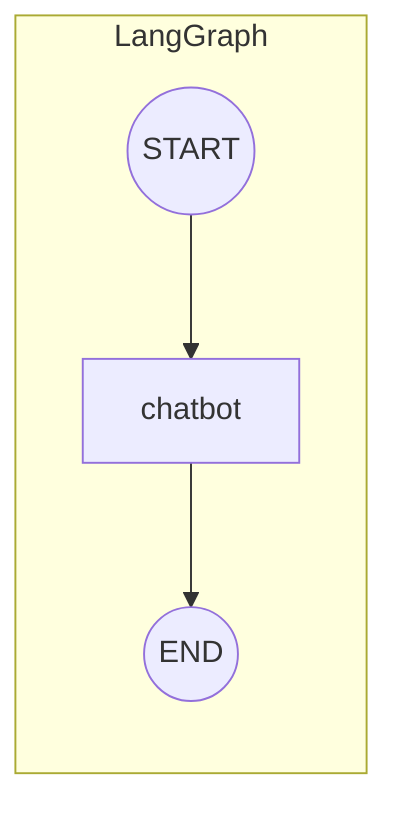
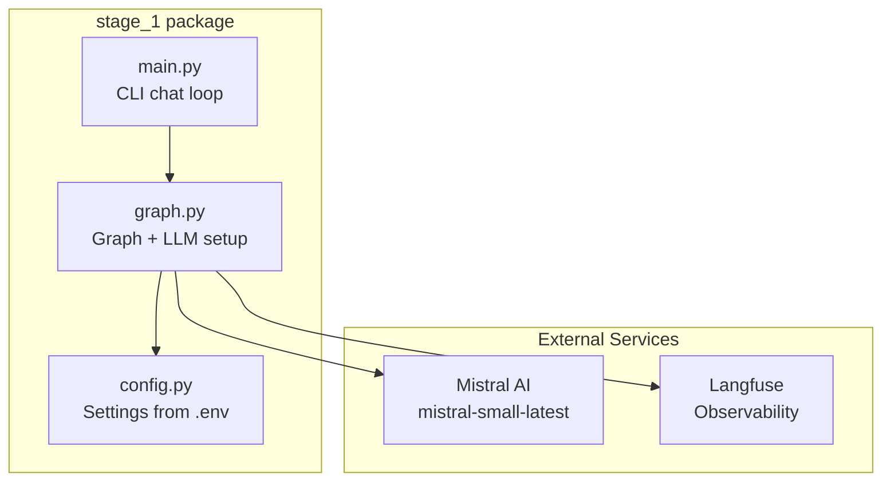
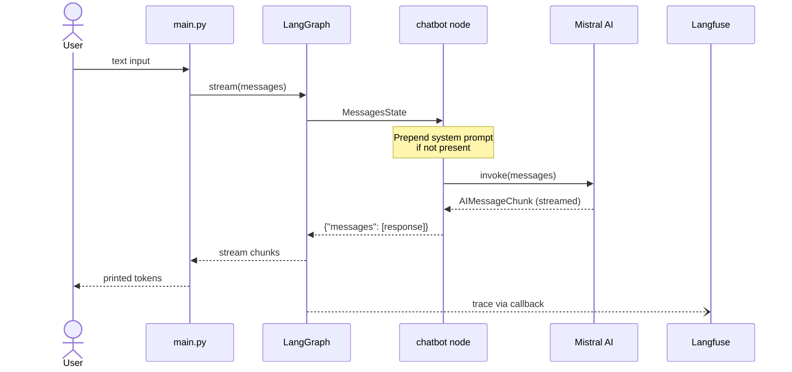
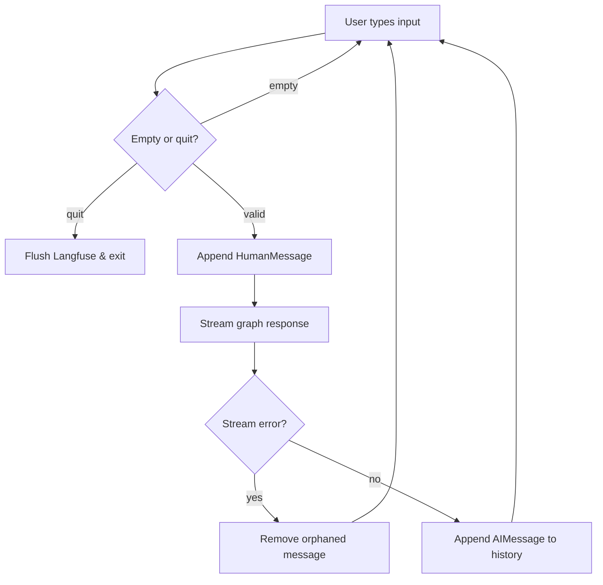

# Stage 1: Simple Chatbot

A single-node LangGraph chatbot with Mistral AI and Langfuse observability.

## Architecture



## Component Overview



## Data Flow



## Message Handling



## Running

```bash
make chat            # or: uv run --package stage-1 python -m stage_1.main
make dev             # LangGraph Studio
```

## Required Environment Variables

| Variable | Purpose |
|---|---|
| `MISTRAL_API_KEY` | Mistral AI API access |
| `LANGFUSE_SECRET_KEY` | Langfuse auth |
| `LANGFUSE_PUBLIC_KEY` | Langfuse auth |
| `LANGFUSE_BASE_URL` | Langfuse host (default: `https://us.cloud.langfuse.com`) |
