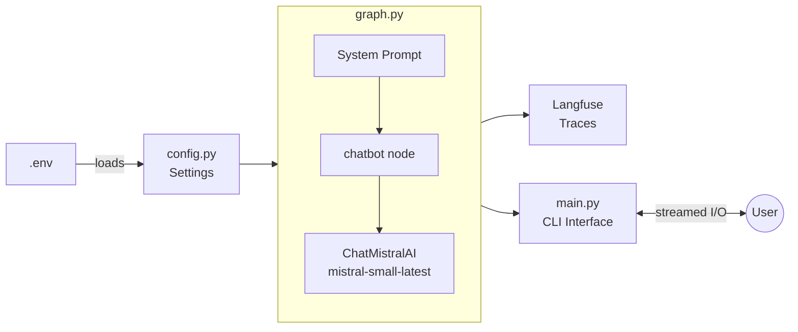
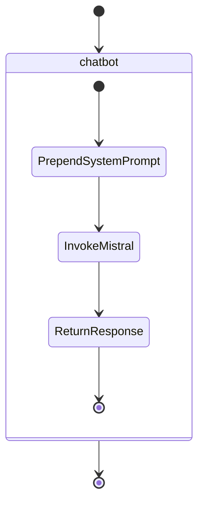
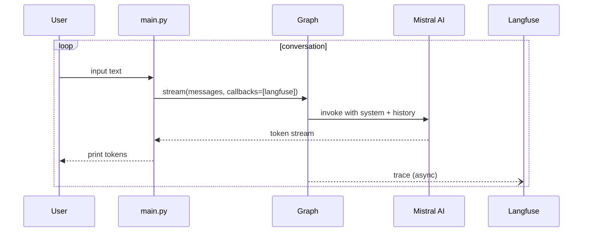
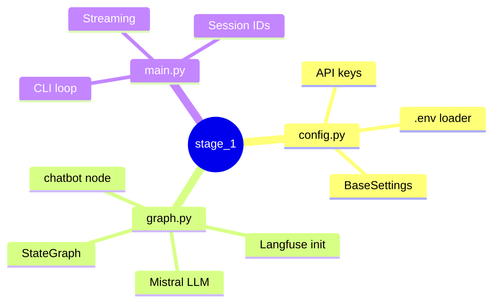

# Stage 1: Simple Chatbot

Single-node LangGraph chatbot. Mistral AI for generation, Langfuse for tracing.

## How It Works



## The Graph



## Streaming Conversation Loop



## File Map



## Run

```bash
make chat   # CLI
make dev    # LangGraph Studio
```
