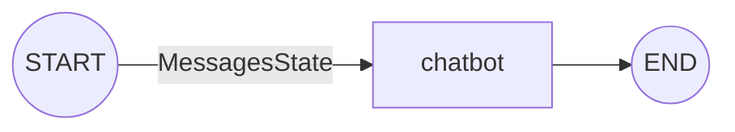
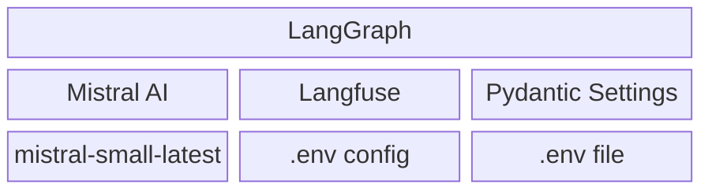
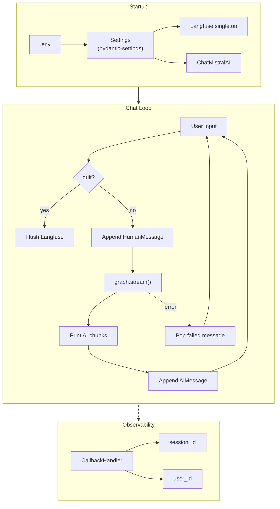
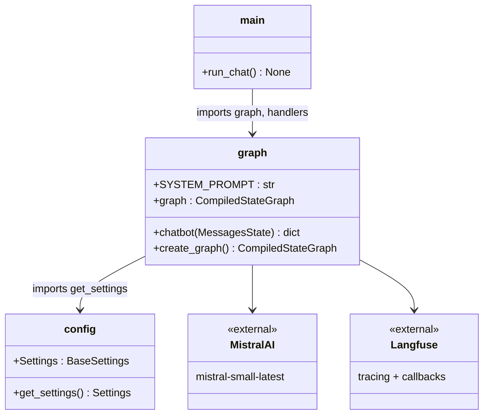

# Stage 1: Simple Chatbot

## The Graph



One node. Messages in, response out.

## Stack



## End-to-End Flow



## Modules



## Run

```bash
make chat   # CLI
make dev    # LangGraph Studio
```
