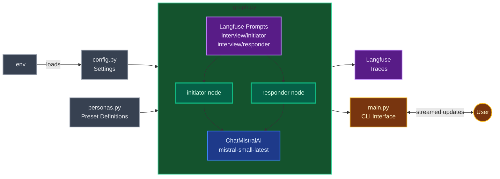
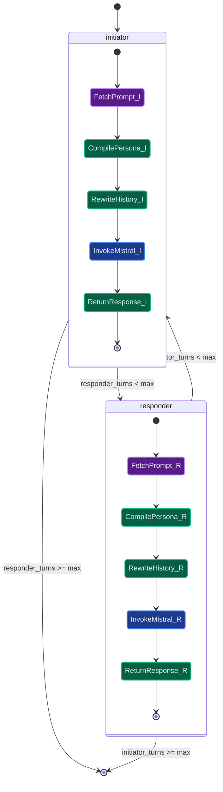
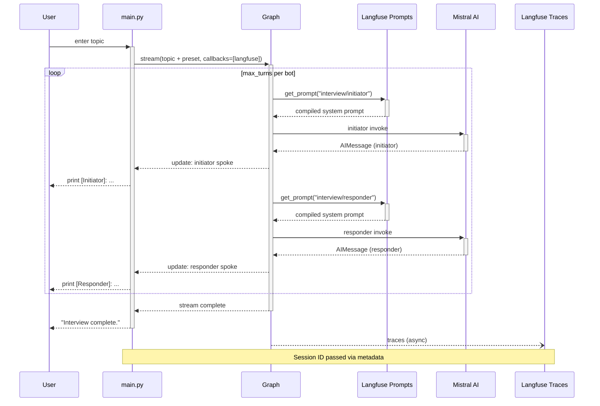
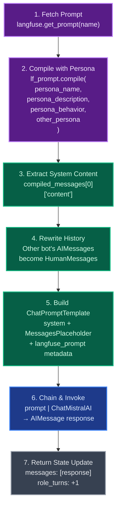
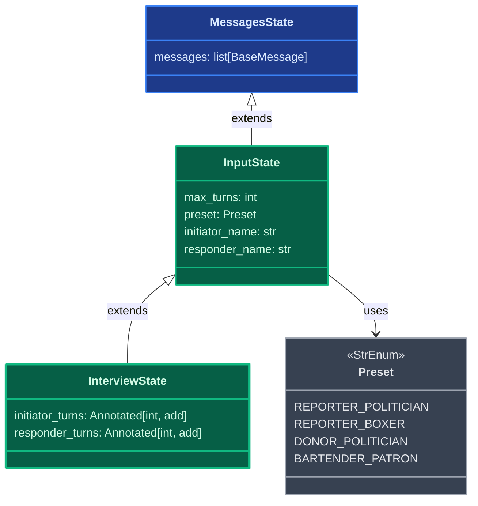
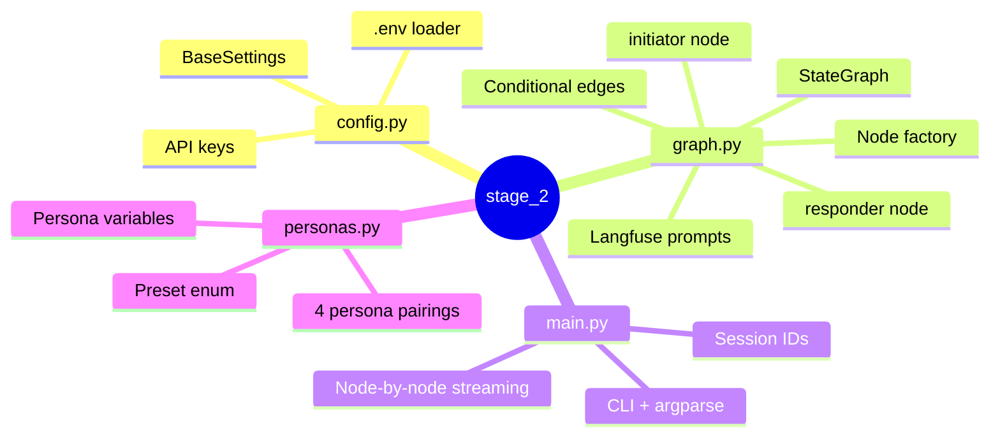

# Stage 2: Two-Bot Interview

Multi-node LangGraph graph where two AI personas interview each other. Mistral AI for generation, Langfuse for prompt management and tracing.

## Table of Contents

- [Introduction](#introduction)
- [Tech Stack](#tech-stack)
- [Architectural Decisions](#architectural-decisions)
- [System Overview](#system-overview)
- [The Graph](#the-graph)
- [Conversation Example](#conversation-example)
- [Persona System](#persona-system)
- [Prompt Pipeline](#prompt-pipeline)
- [State Schema](#state-schema)
- [Message Rewriting](#message-rewriting)
- [File Map](#file-map)
- [Run](#run)

## Introduction

Stage 2 evolves the single-bot chatbot into a two-bot conversation system. Two AI personas — an initiator and a responder — take turns speaking on a user-provided topic. Persona definitions are stored in Langfuse as managed chat prompts, so behavior can be tweaked without code changes. The graph alternates between the two bots until a configurable turn limit is reached, producing an interview-style transcript streamed to the CLI.

## Tech Stack

The graph runs on **LangGraph** (v1.0+) with two nodes wired in a conditional loop. The LLM is **Mistral AI** (`mistral-small-latest`) via `langchain-mistralai`. Prompt templates are managed in **Langfuse** (v3) as versioned chat prompts — fetched at runtime, compiled with persona variables, and linked back to traces for full observability. Persona presets are defined in Python as a `StrEnum` + dictionary so new pairings can be added without touching graph logic. Configuration uses **Pydantic Settings**, and the project is packaged with **uv** workspaces and **Hatchling** builds.

## Architectural Decisions

**Two-node conditional loop.** The graph has two nodes (`initiator`, `responder`) connected by conditional edges that check turn counts. This is the minimal structure for a multi-turn two-agent conversation — each node is symmetric and built by the same factory function.

**Langfuse prompt management.** System prompts live in Langfuse as `interview/initiator` and `interview/responder` chat prompts, not in source code. Each invocation fetches the latest prompt version, compiles it with persona variables, and attaches `langfuse_prompt` metadata so traces link back to the exact prompt version used.

**Node factory pattern.** `_build_node_fn(role, prompt_name)` returns a closure for either role. This eliminates duplication — the initiator and responder nodes differ only in which persona they load and which turn counter they increment.

**Message rewriting for Mistral.** Mistral requires strict user/assistant alternation. Since both bots produce `AIMessage`s, each node rewrites the other bot's messages to `HumanMessage`s before invoking the LLM. This keeps the conversation history valid from each bot's perspective.

## System Overview



## The Graph



## Conversation Example

A 3-turn interview with the `reporter-politician` preset, showing how the graph alternates between nodes.



## Persona System

Four preset pairings ship out of the box. Each preset defines an initiator (drives the conversation) and responder (reacts).

```mermaid
flowchart TB
    subgraph Presets["Persona Presets (personas.py)"]
        direction TB
        RP["reporter-politician"]
        RB["reporter-boxer"]
        DP["donor-politician"]
        BP["bartender-patron"]
    end

    subgraph Roles["Each Preset Contains"]
        direction LR
        I["Initiator<br/>persona_name<br/>persona_description<br/>persona_behavior"]
        R["Responder<br/>persona_name<br/>persona_description<br/>persona_behavior"]
    end

    RP --> Roles
    RB --> Roles
    DP --> Roles
    BP --> Roles

    I -->|compiled into| LFI["Langfuse Prompt<br/>interview/initiator"]
    R -->|compiled into| LFR["Langfuse Prompt<br/>interview/responder"]

    style Presets fill:#374151,stroke:#9ca3af,stroke-width:2px
    style Roles fill:#14532d,stroke:#34d399,stroke-width:2px
    style RP fill:#065f46,stroke:#10b981,stroke-width:2px,color:#d1fae5
    style RB fill:#065f46,stroke:#10b981,stroke-width:2px,color:#d1fae5
    style DP fill:#065f46,stroke:#10b981,stroke-width:2px,color:#d1fae5
    style BP fill:#065f46,stroke:#10b981,stroke-width:2px,color:#d1fae5
    style I fill:#78350f,stroke:#fbbf24,stroke-width:2px,color:#fef3c7
    style R fill:#78350f,stroke:#fbbf24,stroke-width:2px,color:#fef3c7
    style LFI fill:#581c87,stroke:#c084fc,stroke-width:2px,color:#f3e8ff
    style LFR fill:#581c87,stroke:#c084fc,stroke-width:2px,color:#f3e8ff
```



## Prompt Pipeline

Each node invocation follows this pipeline to go from a Langfuse prompt template to a Mistral LLM call.



## State Schema



## Message Rewriting

Mistral requires strict user/assistant alternation. Both bots produce `AIMessage`s, so each node must rewrite the other bot's messages before invoking the LLM.

```mermaid
flowchart LR
    subgraph SharedState["Shared Message History"]
        direction TB
        H1["HumanMessage<br/>'Interview topic: ...'"]
        A1["AIMessage<br/>name='Reporter'<br/>'First question...'"]
        A2["AIMessage<br/>name='Politician'<br/>'Well, let me say...'"]
        A3["AIMessage<br/>name='Reporter'<br/>'But the numbers show...'"]
    end

    subgraph InitView["Initiator's View"]
        direction TB
        IH1["HumanMessage<br/>'Interview topic: ...'"]
        IH2["HumanMessage<br/>'First question...'"]
        IH3["HumanMessage<br/>'Well, let me say...'"]
        IH4["HumanMessage<br/>'But the numbers show...'"]
    end

    subgraph RespView["Responder's View"]
        direction TB
        RH1["HumanMessage<br/>'Interview topic: ...'"]
        RH2["HumanMessage<br/>'First question...'"]
        RH3["HumanMessage<br/>'Well, let me say...'"]
        RH4["HumanMessage<br/>'But the numbers show...'"]
    end

    SharedState -->|"rewrite for<br/>initiator node"| InitView
    SharedState -->|"rewrite for<br/>responder node"| RespView

    style SharedState fill:#374151,stroke:#9ca3af,stroke-width:2px
    style InitView fill:#14532d,stroke:#34d399,stroke-width:2px
    style RespView fill:#14532d,stroke:#34d399,stroke-width:2px
    style H1 fill:#78350f,stroke:#fbbf24,stroke-width:2px,color:#fef3c7
    style A1 fill:#1e3a8a,stroke:#3b82f6,stroke-width:2px,color:#dbeafe
    style A2 fill:#1e3a8a,stroke:#3b82f6,stroke-width:2px,color:#dbeafe
    style A3 fill:#1e3a8a,stroke:#3b82f6,stroke-width:2px,color:#dbeafe
    style IH1 fill:#78350f,stroke:#fbbf24,stroke-width:2px,color:#fef3c7
    style IH2 fill:#78350f,stroke:#fbbf24,stroke-width:2px,color:#fef3c7
    style IH3 fill:#78350f,stroke:#fbbf24,stroke-width:2px,color:#fef3c7
    style IH4 fill:#78350f,stroke:#fbbf24,stroke-width:2px,color:#fef3c7
    style RH1 fill:#78350f,stroke:#fbbf24,stroke-width:2px,color:#fef3c7
    style RH2 fill:#78350f,stroke:#fbbf24,stroke-width:2px,color:#fef3c7
    style RH3 fill:#78350f,stroke:#fbbf24,stroke-width:2px,color:#fef3c7
    style RH4 fill:#78350f,stroke:#fbbf24,stroke-width:2px,color:#fef3c7
```



All `AIMessage`s are converted to `HumanMessage`s from each bot's perspective, so Mistral always sees a flat sequence of `HumanMessage`s after the system prompt. This satisfies the alternation requirement since the bot only ever produces one `AIMessage` (its own response) per turn.

## File Map



## Run

```bash
make chat SCOPE=2                              # CLI (default preset)
make chat SCOPE=2 -- --preset bartender-patron  # CLI with preset
make dev SCOPE=2                                # LangGraph Studio
```
