# LangGraph Drive-Thru Bot: State Diagrams (v1 — LLM Orchestrator Pattern)

> **Reference Document:** [LangGraph State Design v1](./langgraph-state-design-v1.md)

> **v1 Change from v0:** Replaces the explicit state machine (12+ nodes, intent routing, conditional edges) with an **LLM orchestrator pattern** — a single reasoning node with tool-calling.

> **v1 Scope:** Same as v0 — customers can only **add items** to their order.

> **v1 Interface:** Chatbot (text-only). Same as v0.

---

## Table of Contents

- [v0 vs v1 Graph Comparison](#v0-vs-v1-graph-comparison)
- [v1 System Overview](#v1-system-overview)
- [v1 Graph Architecture](#v1-graph-architecture)
- [State Schema](#state-schema)
- [Tool Interaction Flow](#tool-interaction-flow)
- [Conversation Sequence: Simple Order](#conversation-sequence-simple-order)
- [Conversation Sequence: Multi-Intent](#conversation-sequence-multi-intent)
- [Conversation Sequence: Item Not Found](#conversation-sequence-item-not-found)
- [Orchestrator Decision Flow](#orchestrator-decision-flow)
- [Langfuse Trace Structure](#langfuse-trace-structure)

---

## v0 vs v1 Graph Comparison

Side-by-side showing the structural simplification.

### v0: Explicit State Machine (12+ nodes)

### v1: LLM Orchestrator (4 nodes)

```mermaid
flowchart TD
    START([START]) --> Orchestrator["Orchestrator<br/>(LLM + Tools)"]

    Orchestrator --> ShouldContinue{"Tool calls?"}

    ShouldContinue -->|"Yes (tool calls)"| Tools["Execute Tools"]
    ShouldContinue -->|"No (direct response)"| END([END])
    ShouldContinue -->|"finalize_order called"| END

    Tools --> UpdateOrder["update_order<br/>(process results →<br/>update current_order)"]
    UpdateOrder --> Orchestrator

    style START fill:#22c55e,color:#fff
    style END fill:#ef4444,color:#fff
    style Orchestrator fill:#8b5cf6,color:#fff
    style ShouldContinue fill:#f59e0b,color:#000
    style Tools fill:#3b82f6,color:#fff
    style UpdateOrder fill:#10b981,color:#fff
```

---

## v1 System Overview

High-level view of the orchestrator-based system.

```mermaid
flowchart TB
    subgraph External["External Systems"]
        Input["Text Input<br/>(Chatbot)"]
        Output["Text Output<br/>(Chatbot)"]
        MenuJSON["Menu JSON<br/>(Location-Specific)"]
    end

    subgraph LangGraph["LangGraph Application"]
        subgraph OrchestratorNode["Orchestrator Node"]
            LLM["LLM<br/>(gpt-4o-mini)"]
            SystemPrompt["System Prompt<br/>(location + full menu + order)"]
        end
        subgraph ToolNode["Tool Node"]
            T1["lookup_menu_item"]
            T2["add_item_to_order"]
            T3["get_current_order"]
            T4["finalize_order"]
        end
        UpdateOrderNode["update_order<br/>(tool results → state)"]
        State["DriveThruState<br/>(messages, menu, current_order)"]
    end

    subgraph Observability["Observability"]
        Langfuse["Langfuse"]
        Checkpointer["Checkpointer<br/>(MemorySaver / PostgresSaver)"]
    end

    Input -->|"Customer message"| State
    MenuJSON -->|"Load via Menu.from_json_file()"| State
    State -->|"Full context"| LLM
    SystemPrompt -->|"Location + full menu + order"| LLM
    LLM -->|"Tool calls"| ToolNode
    ToolNode -->|"Tool results (dicts)"| UpdateOrderNode
    UpdateOrderNode -->|"Updated current_order"| State
    State -->|"Updated context"| LLM
    LLM -->|"Response"| Output
    State -->|"Checkpoint"| Checkpointer
    LLM -->|"Traces"| Langfuse

    style OrchestratorNode fill:#f3e8ff,stroke:#8b5cf6
    style ToolNode fill:#dbeafe,stroke:#3b82f6
    style UpdateOrderNode fill:#d1fae5,stroke:#10b981
```

---

## v1 Graph Architecture

The complete LangGraph graph with all edges.

```mermaid
flowchart TD
    START([START]) --> Orchestrator

    subgraph OrchestratorLoop["Orchestrator Tool-Calling Loop"]
        Orchestrator["orchestrator_node<br/><i>LLM reasons + calls tools</i>"]
        Tools["tool_node<br/><i>Executes tool calls (pure functions)</i>"]
        UpdateOrder["update_order<br/><i>Process tool results →<br/>update current_order via Order.__add__</i>"]

        Orchestrator --> Check{"should_continue()"}
        Check -->|"has tool_calls<br/>(not finalize)"| Tools
        Tools --> UpdateOrder
        UpdateOrder --> Orchestrator
    end

    Check -->|"no tool_calls<br/>(direct response)"| END([END])
    Check -->|"finalize_order<br/>called"| END

    style START fill:#22c55e,color:#fff
    style END fill:#ef4444,color:#fff
    style Orchestrator fill:#8b5cf6,color:#fff
    style Tools fill:#3b82f6,color:#fff
    style UpdateOrder fill:#10b981,color:#fff
    style Check fill:#f59e0b,color:#000
    style OrchestratorLoop fill:#faf5ff,stroke:#c4b5fd,stroke-dasharray: 5 5
```

---

## State Schema

Comparison of v0 and v1 state schemas, with v1 expanded to show actual Pydantic model fields.

```mermaid
classDiagram
    class DriveThruState_v0 {
        +list messages
        +Menu menu
        +Order current_order
        +ParsedIntent parsed_intent
        +ParsedItemRequest parsed_item_request
        +ValidationResult validation_result
        +CustomerResponse response
        +bool is_order_complete
        8 fields
    }

    class DriveThruState_v1 {
        +list messages
        +Menu menu
        +Order current_order
        3 fields
    }

    class Menu {
        +str menu_id
        +str menu_name
        +str menu_version
        +Location location
        +list~Item~ items
        +from_json_file(path) Menu$
        +from_dict(data) Menu$
    }

    class Location {
        +str id
        +str name
        +str address
        +str city
        +str state
        +str zip
        +str country
    }

    class Order {
        +str order_id  «uuid»
        +list~Item~ items
        +__add__(Item) Order
    }

    class Item {
        +str item_id
        +str name
        +CategoryName category_name
        +Size default_size
        +Size|None size
        +int quantity  «ge=1»
        +list~Modifier~ modifiers
        +list~Modifier~ available_modifiers
        +__add__(other) Item
    }

    class Modifier {
        +str modifier_id
        +str name
    }

    class Size {
        <<StrEnum>>
        SNACK
        SMALL
        MEDIUM
        LARGE
        REGULAR
    }

    class CategoryName {
        <<StrEnum>>
        BREAKFAST
        BEEF_PORK
        CHICKEN_FISH
        SALADS
        SNACKS_SIDES
        DESSERTS
        BEVERAGES
        COFFEE_TEA
        SMOOTHIES_SHAKES
    }

    DriveThruState_v1 --> Menu
    DriveThruState_v1 --> Order
    Menu --> Location
    Menu --> "many" Item : items
    Order --> "many" Item : items
    Item --> Size : default_size / size
    Item --> CategoryName : category_name
    Item --> "many" Modifier : modifiers
    Item --> "many" Modifier : available_modifiers
```

> **Note:** `Item` serves dual purpose — in `Menu.items` the `available_modifiers` list defines what's possible; in `Order.items` the `modifiers` list captures customer selections. There is no `price` field on `Item`.

---

## Tool Interaction Flow

How the orchestrator uses tools to handle customer requests.

```mermaid
flowchart LR
    subgraph Orchestrator["Orchestrator (LLM)"]
        Reason["Reason about<br/>customer message"]
    end

    subgraph Tools["Available Tools (pure functions)"]
        Lookup["lookup_menu_item<br/><i>Verify item exists</i>"]
        Add["add_item_to_order<br/><i>Validate + return item data</i>"]
        GetOrder["get_current_order<br/><i>Read back order</i>"]
        Finalize["finalize_order<br/><i>Complete order</i>"]
    end

    subgraph StateUpdate["update_order Node"]
        UO["Process add results<br/>→ Order.__add__<br/>→ update current_order"]
    end

    subgraph Results["Tool Results (dicts)"]
        Found["✅ found: true<br/>item_id, name, category,<br/>default_size, modifiers"]
        NotFound["❌ found: false<br/>suggestions: [...]"]
        Added["✅ added: true<br/>item_id, qty, size,<br/>modifiers"]
        OrderSummary["📋 order_id, items,<br/>item_count (no price)"]
        Done["🏁 finalized: true<br/>order_id"]
    end

    Reason -->|"Customer orders item"| Lookup
    Reason -->|"Item verified"| Add
    Reason -->|"'What did I order?'"| GetOrder
    Reason -->|"'That's all'"| Finalize

    Lookup --> Found
    Lookup --> NotFound
    Add --> Added
    GetOrder --> OrderSummary
    Finalize --> Done

    Added -->|"update_order processes"| UO
    UO -->|"State updated"| Reason

    Found -->|"Proceed to add"| Reason
    NotFound -->|"Suggest alternatives"| Reason
    OrderSummary -->|"Read back"| Reason
    Done -->|"Thank + end"| Reason

    style Orchestrator fill:#f3e8ff,stroke:#8b5cf6
    style Lookup fill:#dbeafe,stroke:#3b82f6
    style Add fill:#dbeafe,stroke:#3b82f6
    style GetOrder fill:#dbeafe,stroke:#3b82f6
    style Finalize fill:#dbeafe,stroke:#3b82f6
    style Found fill:#dcfce7,stroke:#22c55e
    style NotFound fill:#fee2e2,stroke:#ef4444
    style Added fill:#dcfce7,stroke:#22c55e
    style Done fill:#dcfce7,stroke:#22c55e
    style UO fill:#d1fae5,stroke:#10b981
```

---

## Conversation Sequence: Simple Order

A typical single-item order flow.

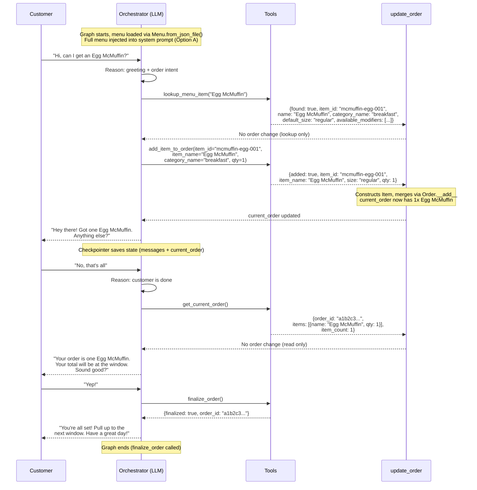

---

## Conversation Sequence: Multi-Intent

Handling multiple intents in a single customer utterance.

```mermaid
sequenceDiagram
    participant C as Customer
    participant O as Orchestrator (LLM)
    participant T as Tools
    participant U as update_order

    C->>O: "Two hash browns, a large coffee,<br/>and what sandwiches do you have?"

    O->>O: Reason: 2 items + 1 question

    par Parallel tool calls
        O->>T: lookup_menu_item("hash brown")
        O->>T: lookup_menu_item("coffee")
    end

    T-->>U: hash brown: {found: true, item_id: "hashbrown-001",<br/>category_name: "snacks-sides", default_size: "regular"}
    T-->>U: coffee: {found: true, item_id: "coffee-001",<br/>category_name: "beverages", default_size: "medium"}
    U-->>O: No order change (lookups only)

    par Parallel adds
        O->>T: add_item_to_order(item_id="hashbrown-001",<br/>item_name="Hash Brown",<br/>category_name="snacks-sides", qty=2)
        O->>T: add_item_to_order(item_id="coffee-001",<br/>item_name="Coffee",<br/>category_name="beverages", qty=1, size="large")
    end

    T-->>U: {added: true, qty: 2, size: "regular"}
    T-->>U: {added: true, qty: 1, size: "large"}
    Note over U: Processes BOTH add results sequentially.<br/>Order.__add__ for each: 2x Hash Brown + 1x Coffee (large)
    U-->>O: current_order updated with both items

    O->>O: Reason: answer menu question<br/>from full menu in system prompt (Option A — no tool needed)

    O-->>C: "Got it — two hash browns and a large coffee!<br/>For sandwiches, we've got the Egg McMuffin,<br/>Sausage McMuffin, and McGriddle.<br/>Want to add one?"

    Note over O: All 3 intents handled in ONE turn<br/>(no prices quoted — not in model)
```

---

## Conversation Sequence: Item Not Found

Handling an item that isn't on the menu.

```mermaid
sequenceDiagram
    participant C as Customer
    participant O as Orchestrator (LLM)
    participant T as Tools

    C->>O: "Can I get a Big Mac?"

    O->>T: lookup_menu_item("Big Mac")
    T-->>O: {found: false, suggestions: ["Big Breakfast", "McGriddle"]}

    O->>O: Reason: item not on breakfast menu,<br/>suggest alternatives from tool result

    O-->>C: "Sorry, we don't have the Big Mac<br/>on our breakfast menu! How about<br/>a Big Breakfast or a McGriddle?"

    Note over O: No reject node needed —<br/>orchestrator handles naturally
```

---

## Orchestrator Decision Flow

Internal logic of how the orchestrator decides what to do.

```mermaid
flowchart TD
    Input["Customer Message"] --> Orchestrator

    Orchestrator --> Analyze["LLM analyzes message<br/>in context of:<br/>• conversation history<br/>• current menu (with categories, sizes)<br/>• current order (with modifiers)<br/>• location info"]

    Analyze --> WhatToDo{"What does the<br/>customer want?"}

    WhatToDo -->|"Order an item"| LookupFirst["Call lookup_menu_item"]
    WhatToDo -->|"Ask about menu"| AnswerFromContext["Answer from<br/>menu in system prompt<br/>(no prices available)"]
    WhatToDo -->|"Ask about price"| NoPrice["'Your total will be<br/>at the window'"]
    WhatToDo -->|"Check their order"| CallGetOrder["Call get_current_order"]
    WhatToDo -->|"Done ordering"| ReadBack["Read back order,<br/>then call finalize_order"]
    WhatToDo -->|"Greeting/chitchat"| Respond["Respond directly<br/>(no tools needed)"]
    WhatToDo -->|"Multiple things"| HandleAll["Handle all via<br/>multiple tool calls"]

    LookupFirst --> Found{"Item found?"}
    Found -->|Yes| HasMods{"Customer wants<br/>modifiers?"}
    Found -->|No| SuggestAlt["Suggest alternatives<br/>from tool result"]

    HasMods -->|"Yes (valid modifier)"| CallAddMod["Call add_item_to_order<br/>(item_id, name, category,<br/>qty, size, modifiers)"]
    HasMods -->|"Yes (invalid modifier)"| RejectMod["'That modification isn't<br/>available for this item'"]
    HasMods -->|No| CallAdd["Call add_item_to_order<br/>(item_id, name, category,<br/>qty, size)"]

    CallAdd --> ConfirmToCustomer["Confirm item added<br/>(Order.__add__ merges dups)"]
    CallAddMod --> ConfirmToCustomer
    SuggestAlt --> RespondToCustomer["Respond with suggestions"]
    RejectMod --> RespondToCustomer
    NoPrice --> RespondToCustomer
    AnswerFromContext --> RespondToCustomer
    CallGetOrder --> RespondToCustomer
    ReadBack --> EndGraph["Graph ends"]
    Respond --> RespondToCustomer
    HandleAll --> RespondToCustomer

    ConfirmToCustomer --> AskAnythingElse["'Anything else?'"]
    RespondToCustomer --> WaitForNext["Wait for next message"]

    style Orchestrator fill:#8b5cf6,color:#fff
    style WhatToDo fill:#f59e0b,color:#000
    style Found fill:#f59e0b,color:#000
    style HasMods fill:#f59e0b,color:#000
    style EndGraph fill:#ef4444,color:#fff
    style NoPrice fill:#fee2e2,stroke:#ef4444

    style LookupFirst fill:#dbeafe,stroke:#3b82f6
    style CallAdd fill:#dbeafe,stroke:#3b82f6
    style CallAddMod fill:#dbeafe,stroke:#3b82f6
    style CallGetOrder fill:#dbeafe,stroke:#3b82f6
```

---

## Langfuse Trace Structure

What traces look like in the orchestrator pattern vs v0.

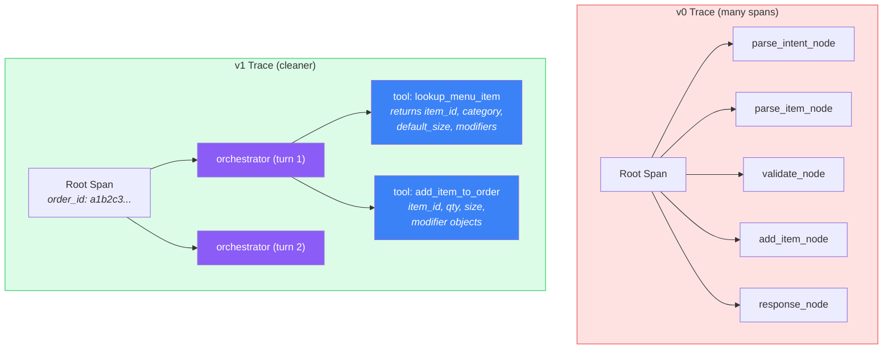

---

## Complete State Machine

The v1 state machine is intentionally minimal.

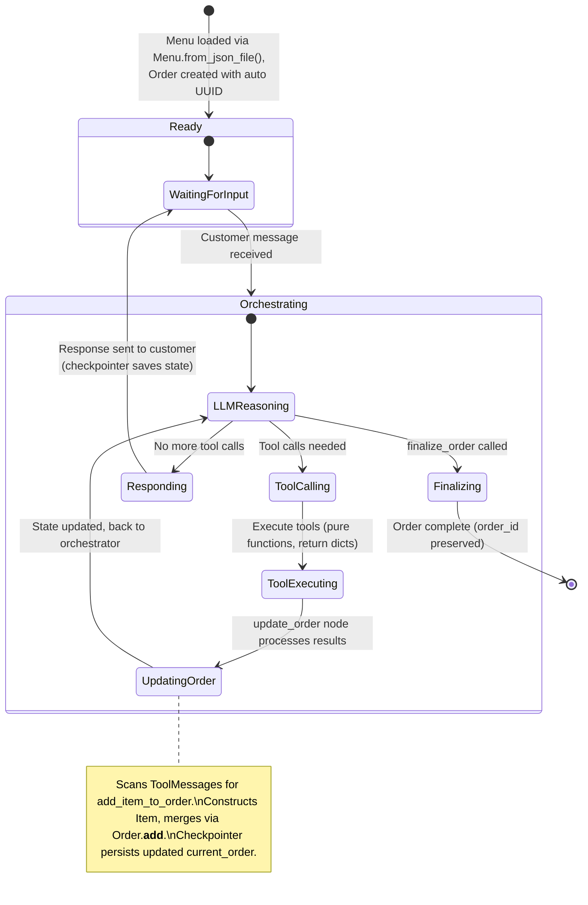

---

## Legend

| Symbol | Meaning |
|--------|---------|
| Purple | Orchestrator (LLM reasoning) |
| Blue | Tools (deterministic functions) |
| Yellow/Orange | Decision points |
| Green | Success / v1 improvements |
| Red | End states / v0 complexity |
