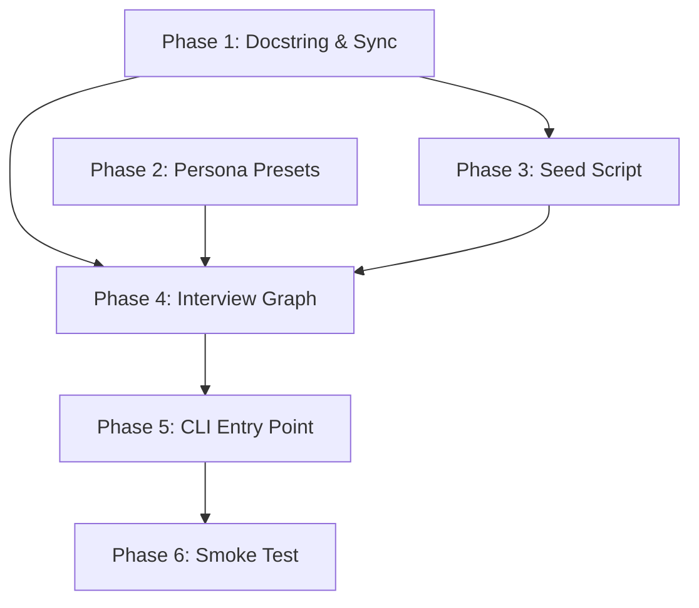

# Stage 2: Two-Bot Interview Implementation Plan

> **Status:** DRAFT

## Table of Contents

- [Overview](#overview)
- [Current State Analysis](#current-state-analysis)
- [Desired End State](#desired-end-state)
- [What We're NOT Doing](#what-were-not-doing)
- [Dependencies](#dependencies)
- [Phase 1: Dependencies and Configuration](#phase-1-dependencies-and-configuration)
- [Phase 2: Persona Presets Module](#phase-2-persona-presets-module)
- [Phase 3: Langfuse Prompt Seed Script](#phase-3-langfuse-prompt-seed-script)
- [Phase 4: Interview Graph](#phase-4-interview-graph)
- [Phase 5: CLI Entry Point](#phase-5-cli-entry-point)
- [Phase 6: Smoke Test and Verification](#phase-6-smoke-test-and-verification)
- [Testing Strategy](#testing-strategy)
- [References](#references)

## Overview

Replace the stage_2 skeleton (a copy of stage_1's single-chatbot) with a two-bot interview graph. Two LLM personas converse back and forth on a user-provided topic. System prompts are managed in Langfuse (chat prompts with `{{variables}}`), and every LLM generation is linked to its Langfuse prompt version for per-version metrics.

The LLM provider remains **Mistral** (`ChatMistralAI` / `mistral-small-latest`), same as stage_1. The model name and temperature are stored in the Langfuse prompt `config` object and read at runtime.

## Current State Analysis

### Stage 2 is a skeleton copy of Stage 1

All four files in `src/stage_2/stage_2/` are near-identical copies of stage_1:

| File | Current Content | Issue |
|------|----------------|-------|
| `__init__.py` | `"""v0-stage-1: Simple chatbot..."""` | Wrong docstring |
| `config.py` | Loads `mistral_api_key`, Langfuse keys | No changes needed — keeps Mistral |
| `graph.py` | Single `chatbot` node with `ChatMistralAI` | Needs rewrite to two-node interview graph |
| `main.py` | Interactive chat loop with streaming | Needs complete rewrite to single-invocation interview |

### Key Discoveries

- `src/stage_2/pyproject.toml` already has `langchain-mistralai` and `langfuse` — no dependency changes needed
- `.env` at project root already has `MISTRAL_API_KEY`, `LANGFUSE_SECRET_KEY`, `LANGFUSE_PUBLIC_KEY`, `LANGFUSE_BASE_URL`
- `langgraph.json` already registers stage_2's graph as `"talking_chatbots"` pointing to `./src/stage_2/stage_2/graph.py:graph`
- `Makefile` already supports `make chat SCOPE=2` → runs `uv run --package stage-2 python -m stage_2.main`
- The Langfuse singleton pattern from stage_1 (module-level `Langfuse(...)` init, `get_client()` accessor) works and should be reused

## Desired End State

After this plan is complete:

1. `make chat SCOPE=2 ARGS="--preset reporter-politician --max-turns 3"` runs a 6-message interview conversation
2. Each LLM call fetches its prompt from Langfuse (`interview/initiator` or `interview/responder`)
3. A single Langfuse trace spans the entire conversation, with each generation linked to its prompt version
4. Prompts are iterable in the Langfuse UI without code changes
5. `make dev SCOPE=2` opens LangGraph Studio with the interview graph

**Success Criteria:**
- [ ] `make chat SCOPE=2` runs a full interview with printed transcript
- [ ] Langfuse dashboard shows a trace with 6 generation spans for a 3-turn interview
- [ ] Each generation in Langfuse is linked to its prompt (click generation → see prompt version)
- [ ] Changing prompt text in Langfuse UI changes the bot's behavior on next run (no code deploy)
- [ ] `--preset` flag switches persona pairings (e.g., `bartender-patron`)
- [ ] `make dev SCOPE=2` loads the graph in LangGraph Studio

## What We're NOT Doing

- Token-by-token streaming (we use node-by-node `stream_mode="updates"`)
- Persistence / checkpointing / memory across runs
- Custom evaluation scores in Langfuse
- CI/CD for prompt deployment (manual label management in Langfuse UI)
- Unit tests (smoke test only — will be added in a future plan)

## Dependencies

**Execution Order:**



**Parallelization:**
- Phases 1 and 2 can run in parallel (independent: deps vs data)
- Phase 3 depends on Phase 1 (needs `langfuse` package installed)
- Phase 4 depends on Phases 1, 2, and 3
- Phases 5 and 6 are sequential after Phase 4

---

## Phase 1: Docstring Fix and Dependency Sync

### Overview

Fix the stage_2 `__init__.py` docstring (still says "stage-1") and sync dependencies. No dependency changes needed — `langchain-mistralai` and `langfuse` are already in `pyproject.toml`. No `config.py` changes needed — `mistral_api_key` stays.

### Context

Before starting, read these files:
- `src/stage_2/stage_2/__init__.py` — docstring to fix

### Dependencies

**Depends on:** None
**Required by:** Phase 3, Phase 4

### Changes Required

#### 1.1: Update `__init__.py` docstring

**File:** `src/stage_2/stage_2/__init__.py`

Replace the entire content:

```python
"""Stage 2: Two-bot interview with configurable personas and Langfuse prompt management."""
```

#### 1.2: Sync dependencies

Ensure all existing dependencies are installed:

```bash
uv sync --package stage-2
```

### Success Criteria

#### Automated Verification:
- [ ] `uv sync --package stage-2` completes without errors
- [ ] `uv run --package stage-2 python -c "from stage_2.config import get_settings; s = get_settings(); print('Mistral key loaded:', bool(s.mistral_api_key))"` prints `True`
- [ ] `uv run --package stage-2 python -c "from langchain_mistralai import ChatMistralAI; print('ChatMistralAI importable')"` succeeds

---

## Phase 2: Persona Presets Module

### Overview

Create `personas.py` containing the `PERSONA_PRESETS` dictionary. This is a pure data module with no imports beyond the standard library.

### Context

Before starting, read these files:
- `thoughts/stage-2/two-bot-interview-design.md` — sections "Persona System" and "Persona Presets" for the exact dictionary

### Dependencies

**Depends on:** None
**Required by:** Phase 4

### Changes Required

#### 2.1: Create `personas.py`

**File:** `src/stage_2/stage_2/personas.py` (new file)

```python
"""Persona presets for two-bot interview conversations.

Each preset defines an 'initiator' (drives conversation) and 'responder'
(reacts). The three fields per persona are used as Langfuse prompt variables.
"""

from enum import StrEnum


class Preset(StrEnum):
    """Available persona pairings for the interview graph."""
    REPORTER_POLITICIAN = "reporter-politician"
    REPORTER_BOXER = "reporter-boxer"
    DONOR_POLITICIAN = "donor-politician"
    BARTENDER_PATRON = "bartender-patron"


PERSONA_PRESETS: dict[Preset, dict[str, dict[str, str]]] = {
    Preset.REPORTER_POLITICIAN: {
        "initiator": {
            "persona_name": "Reporter",
            "persona_description": "a serious investigative journalist conducting a live television interview with high ethical standards and a reputation for tough, fair questioning",
            "persona_behavior": "You press for specifics, follow up on evasions, and cite facts. You are respectful but relentless.",
        },
        "responder": {
            "persona_name": "Politician",
            "persona_description": "a seasoned but ethically questionable politician being interviewed on live TV",
            "persona_behavior": "You deflect hard questions, pivot to talking points, use folksy anecdotes, make vague promises, and occasionally attack the media. You never directly answer uncomfortable questions.",
        },
    },
    Preset.REPORTER_BOXER: {
        "initiator": {
            "persona_name": "Reporter",
            "persona_description": "a sports journalist conducting a pre-fight press conference interview",
            "persona_behavior": "You ask pointed questions about training, opponents, and controversies. You stay professional but push for real answers.",
        },
        "responder": {
            "persona_name": "Boxer",
            "persona_description": "a brash, confident professional boxer at a pre-fight press conference",
            "persona_behavior": "You trash-talk your opponent, boast about your record, make bold predictions, and occasionally threaten to flip the table. You're entertaining but unpredictable.",
        },
    },
    Preset.DONOR_POLITICIAN: {
        "initiator": {
            "persona_name": "Donor",
            "persona_description": "a wealthy political donor having a private dinner conversation with a politician you're considering funding",
            "persona_behavior": "You ask pointed questions about policy positions that affect your business interests. You're polite but transactional, and you make it clear your support depends on the right answers.",
        },
        "responder": {
            "persona_name": "Politician",
            "persona_description": "an ambitious politician at a private fundraising dinner, desperate for campaign contributions",
            "persona_behavior": "You try to please the donor without making promises that could leak to the press. You hint at favors, speak in plausible deniability, and name-drop shamelessly.",
        },
    },
    Preset.BARTENDER_PATRON: {
        "initiator": {
            "persona_name": "Bartender",
            "persona_description": "a weary, seen-it-all bartender working the late shift at a dive bar",
            "persona_behavior": "You listen, offer unsolicited life advice, make dry observations, and occasionally cut off the patron or change the subject. You've heard every sad story before.",
        },
        "responder": {
            "persona_name": "Patron",
            "persona_description": "a drunk patron at a dive bar at 1 AM who clearly has something on their mind",
            "persona_behavior": "You ramble, go on tangents, get emotional, contradict yourself, and occasionally order another drink mid-sentence. You're convinced this is the most important conversation of your life.",
        },
    },
}
```

This is copied verbatim from the design document's "Persona Presets" section.

### Success Criteria

#### Automated Verification:
- [ ] `uv run --package stage-2 python -c "from stage_2.personas import Preset, PERSONA_PRESETS; print(list(Preset)); print(len(PERSONA_PRESETS))"` prints all 4 enum members and `4`

---

## Phase 3: Langfuse Prompt Seed Script

### Overview

Create a one-time script that creates the two chat prompts (`interview/initiator` and `interview/responder`) in Langfuse with the `production` label.

### Context

Before starting, read these files:
- `thoughts/stage-2/two-bot-interview-design.md` — section "Seed Script" for exact prompt content
- `.env` — to confirm Langfuse credentials exist

### Dependencies

**Depends on:** Phase 1 (needs `langfuse` package and `.env` with Langfuse keys)
**Required by:** Phase 4 (prompts must exist in Langfuse before graph can fetch them)

### Changes Required

#### 3.1: Create seed script

**File:** `scripts/seed_langfuse_prompts.py` (new file)

```python
"""One-time script to create interview prompts in Langfuse.

Run from project root:
    uv run --package stage-2 python scripts/seed_langfuse_prompts.py

This creates two chat prompts with the 'production' label.
If prompts already exist, Langfuse will create a new version.
"""

from langfuse import Langfuse
from stage_2.config import get_settings

PROMPT_TEMPLATE = (
    "You are {{persona_name}}, {{persona_description}}. "
    "{{persona_behavior}} "
    "Keep responses to 2-3 sentences. Do not break character. "
    "Address {{other_persona}} directly."
)

PROMPT_CONFIG = {"model": "mistral-small-latest", "temperature": 0.9}

PROMPTS = [
    "interview/initiator",
    "interview/responder",
]


def main() -> None:
    settings = get_settings()
    langfuse = Langfuse(
        public_key=settings.langfuse_public_key,
        secret_key=settings.langfuse_secret_key,
        host=settings.langfuse_base_url,
    )

    for name in PROMPTS:
        langfuse.create_prompt(
            name=name,
            type="chat",
            prompt=[{"role": "system", "content": PROMPT_TEMPLATE}],
            config=PROMPT_CONFIG,
            labels=["production"],
        )
        print(f"Created prompt: {name}")

    langfuse.flush()
    print("Done. Prompts created with 'production' label.")


if __name__ == "__main__":
    main()
```

#### 3.2: Run the seed script

**Command (run from project root):**

```bash
uv run --package stage-2 python scripts/seed_langfuse_prompts.py
```

### Success Criteria

#### Automated Verification:
- [ ] Script runs without error and prints "Done."
- [ ] `uv run --package stage-2 python -c "from langfuse import Langfuse; from stage_2.config import get_settings; s = get_settings(); lf = Langfuse(public_key=s.langfuse_public_key, secret_key=s.langfuse_secret_key, host=s.langfuse_base_url); p = lf.get_prompt('interview/initiator', type='chat'); print('Prompt found:', p.name)"` prints `Prompt found: interview/initiator`

#### Manual Verification:
- [ ] Open Langfuse UI → Prompt Management → verify `interview/initiator` and `interview/responder` exist with `production` label
- [ ] Each prompt shows the system message template with `{{persona_name}}` etc. variables
- [ ] Each prompt has `config` with `{"model": "mistral-small-latest", "temperature": 0.9}`

---

## Phase 4: Interview Graph

### Overview

Replace the single-chatbot graph with a two-node interview graph. Each node fetches its prompt from Langfuse, compiles it with persona variables, and invokes the LLM. The Langfuse prompt is linked to the trace via `ChatPromptTemplate.metadata`.

This is the core implementation phase.

### Context

Before starting, read these files:
- `src/stage_2/stage_2/graph.py` — current file to replace
- `src/stage_2/stage_2/config.py` — updated Settings class (from Phase 1)
- `src/stage_2/stage_2/personas.py` — PERSONA_PRESETS (from Phase 2)
- `thoughts/stage-2/two-bot-interview-design.md` — sections "State Design", "Graph Architecture", "Key Implementation Details"

### Dependencies

**Depends on:** Phase 1 (deps synced + config), Phase 2 (personas), Phase 3 (prompts exist in Langfuse)
**Required by:** Phase 5

### Changes Required

#### 4.1: Rewrite `graph.py`

**File:** `src/stage_2/stage_2/graph.py`

Replace the entire file. The new implementation follows this structure:

```mermaid
graph TD
    subgraph "graph.py module structure"
        A["Imports & Langfuse singleton init"]
        B["InterviewState(MessagesState)"]
        C["Helper: _build_node_fn(role, prompt_name)"]
        D["initiator = _build_node_fn('initiator', 'interview/initiator')"]
        E["responder = _build_node_fn('responder', 'interview/responder')"]
        F["after_initiator(state) → 'responder' | END"]
        G["after_responder(state) → 'initiator' | END"]
        H["create_graph() → CompiledStateGraph"]
        I["graph = create_graph()"]
    end
    A --> B --> C --> D --> E --> F --> G --> H --> I
```



**Full replacement content for `src/stage_2/stage_2/graph.py`:**

```python
"""Two-bot interview graph with Langfuse prompt management."""

import atexit

from langchain_core.messages import MessagesPlaceholder, SystemMessage
from langchain_core.prompts import ChatPromptTemplate
from langchain_core.runnables import RunnableConfig
from langchain_mistralai import ChatMistralAI
from langfuse import Langfuse, get_client
from langfuse.langchain import CallbackHandler
from langgraph.graph import START, END, StateGraph, MessagesState
from langgraph.graph.state import CompiledStateGraph

from stage_2.config import get_settings
from stage_2.personas import Preset, PERSONA_PRESETS

# ---------------------------------------------------------------------------
# Langfuse singleton (v3 pattern — same as stage_1)
# ---------------------------------------------------------------------------
_settings = get_settings()
Langfuse(
    public_key=_settings.langfuse_public_key,
    secret_key=_settings.langfuse_secret_key,
    host=_settings.langfuse_base_url,
)


def get_langfuse_client() -> Langfuse:
    """Get Langfuse singleton client instance."""
    return get_client()


def get_langfuse_handler() -> CallbackHandler:
    """Get Langfuse callback handler for tracing."""
    return CallbackHandler()


# ---------------------------------------------------------------------------
# State
# ---------------------------------------------------------------------------
class InterviewState(MessagesState):
    """State for the two-bot interview graph."""
    max_turns: int          # max messages per bot (default 3)
    initiator_turns: int    # how many times initiator has spoken
    responder_turns: int    # how many times responder has spoken
    preset: Preset          # persona preset enum (e.g., Preset.REPORTER_POLITICIAN)
    initiator_name: str     # display name (e.g., "Reporter")
    responder_name: str     # display name (e.g., "Politician")


# ---------------------------------------------------------------------------
# Node factory
# ---------------------------------------------------------------------------
def _build_node_fn(role: str, prompt_name: str):
    """Return a node function for the given role ('initiator' or 'responder').

    Each call to the returned function:
    1. Fetches the Langfuse chat prompt by name
    2. Compiles it with persona variables from the preset
    3. Builds a ChatPromptTemplate with langfuse_prompt metadata (for trace linking)
    4. Chains prompt | LLM and invokes with conversation history
    5. Returns partial state update with the response and incremented turn count
    """
    turns_key = f"{role}_turns"
    name_key = f"{role}_name"
    other_role = "responder" if role == "initiator" else "initiator"
    other_name_key = f"{other_role}_name"

    def node_fn(state: InterviewState, config: RunnableConfig) -> dict:
        # 1. Fetch prompt from Langfuse
        langfuse = get_client()
        lf_prompt = langfuse.get_prompt(prompt_name, type="chat")

        # 2. Compile with persona variables
        persona = PERSONA_PRESETS[state["preset"]][role]
        compiled_messages = lf_prompt.compile(
            persona_name=persona["persona_name"],
            persona_description=persona["persona_description"],
            persona_behavior=persona["persona_behavior"],
            other_persona=state[other_name_key],
        )
        # compiled_messages is a list of dicts: [{"role": "system", "content": "..."}]
        system_content = compiled_messages[0]["content"]

        # 3. Build LangChain prompt with MessagesPlaceholder for history
        langchain_prompt = ChatPromptTemplate.from_messages([
            ("system", system_content),
            MessagesPlaceholder("messages"),
        ])
        # Link prompt to Langfuse trace
        langchain_prompt.metadata = {"langfuse_prompt": lf_prompt}

        # 4. Build LLM from prompt config
        model_config = lf_prompt.config or {}
        llm = ChatMistralAI(
            model=model_config.get("model", "mistral-small-latest"),
            temperature=model_config.get("temperature", 0.9),
            api_key=_settings.mistral_api_key,
        )

        # 5. Invoke chain
        chain = langchain_prompt | llm
        response = chain.invoke(
            {"messages": list(state["messages"])},
            config=config,
        )
        response.name = state[name_key]

        return {
            "messages": [response],
            turns_key: state[turns_key] + 1,
        }

    node_fn.__name__ = role  # for LangGraph node naming
    return node_fn


# ---------------------------------------------------------------------------
# Node functions
# ---------------------------------------------------------------------------
initiator = _build_node_fn("initiator", "interview/initiator")
responder = _build_node_fn("responder", "interview/responder")


# ---------------------------------------------------------------------------
# Conditional edges
# ---------------------------------------------------------------------------
def after_initiator(state: InterviewState) -> str:
    """Route after initiator speaks: continue or end."""
    if state["responder_turns"] < state["max_turns"]:
        return "responder"
    return END


def after_responder(state: InterviewState) -> str:
    """Route after responder speaks: continue or end."""
    if state["initiator_turns"] < state["max_turns"]:
        return "initiator"
    return END


# ---------------------------------------------------------------------------
# Graph construction
# ---------------------------------------------------------------------------
def create_graph() -> CompiledStateGraph:
    """Create the two-bot interview graph."""
    builder = StateGraph(InterviewState)
    builder.add_node("initiator", initiator)
    builder.add_node("responder", responder)
    builder.add_edge(START, "initiator")
    builder.add_conditional_edges("initiator", after_initiator, ["responder", END])
    builder.add_conditional_edges("responder", after_responder, ["initiator", END])
    return builder.compile()


# Export compiled graph for LangGraph Platform
graph = create_graph()

# Register flush on shutdown
atexit.register(get_client().flush)
```

**Key design decisions in the code:**

1. **Message history via `MessagesPlaceholder`:** The Langfuse prompt compiles to a system message string. We build a `ChatPromptTemplate` with that system message + a `MessagesPlaceholder("messages")` for the conversation history. This means the chain receives `{"messages": state["messages"]}` as input.

2. **Prompt-to-trace linking:** `langchain_prompt.metadata = {"langfuse_prompt": lf_prompt}` is the LangChain integration pattern from Langfuse docs. The `CallbackHandler` (passed via `config` from the graph invocation) picks this up automatically.

3. **Node factory pattern:** `_build_node_fn` avoids duplicating the initiator/responder logic. Both nodes follow the same 5-step flow; only the `role`, `prompt_name`, and `turns_key` differ.

4. **Model from Langfuse config:** `lf_prompt.config` returns the `{"model": "mistral-small-latest", "temperature": 0.9}` stored with the prompt. This is read at every invocation, so changing it in Langfuse UI takes effect on the next run.

### Success Criteria

#### Automated Verification:
- [ ] `uv run --package stage-2 python -c "from stage_2.graph import graph; print('Graph compiled:', type(graph).__name__)"` prints `Graph compiled: CompiledStateGraph`
- [ ] `uv run --package stage-2 python -c "from stage_2.graph import InterviewState; print('State fields:', list(InterviewState.__annotations__.keys()))"` prints the expected fields

---

## Phase 5: CLI Entry Point

### Overview

Replace the interactive chat loop in `main.py` with a single-invocation interview runner that accepts `--preset` and `--max-turns` CLI flags, streams node-by-node, and prints the transcript.

### Context

Before starting, read these files:
- `src/stage_2/stage_2/main.py` — current file to replace
- `src/stage_2/stage_2/graph.py` — the new graph (from Phase 4)
- `src/stage_2/stage_2/personas.py` — PERSONA_PRESETS keys for CLI choices

### Dependencies

**Depends on:** Phase 4
**Required by:** Phase 6

### Changes Required

#### 5.1: Rewrite `main.py`

**File:** `src/stage_2/stage_2/main.py`

Replace the entire file:

```python
"""CLI for the two-bot interview graph with streaming output."""

import argparse
import uuid

from langchain_core.messages import AIMessage, HumanMessage

from stage_2.graph import graph, get_langfuse_handler, get_langfuse_client
from stage_2.personas import Preset, PERSONA_PRESETS


def parse_args() -> argparse.Namespace:
    """Parse CLI arguments."""
    parser = argparse.ArgumentParser(description="Two-Bot Interview")
    parser.add_argument(
        "--preset",
        choices=[p.value for p in Preset],
        default=Preset.REPORTER_POLITICIAN.value,
        help="Persona pairing (default: reporter-politician)",
    )
    parser.add_argument(
        "--max-turns",
        type=int,
        default=3,
        help="Max messages per bot (default: 3)",
    )
    return parser.parse_args()


def run_interview() -> None:
    """Run a single interview conversation and print the transcript."""
    args = parse_args()
    preset_key = Preset(args.preset)
    max_turns = args.max_turns
    preset = PERSONA_PRESETS[preset_key]

    initiator_name = preset["initiator"]["persona_name"]
    responder_name = preset["responder"]["persona_name"]

    # Session tracking
    session_id = f"interview-{uuid.uuid4().hex[:8]}"

    print(f"Two-Bot Interview: {initiator_name} vs {responder_name}")
    print(f"Preset: {preset_key} | Max turns: {max_turns} | Session: {session_id}")
    print("=" * 60)

    # Get topic from user
    try:
        topic = input("\nEnter interview topic: ").strip()
    except (KeyboardInterrupt, EOFError):
        print("\nCancelled.")
        return

    if not topic:
        print("No topic provided. Exiting.")
        return

    print(f"\nTopic: {topic}")
    print("-" * 60)

    # Set up Langfuse tracing
    langfuse_handler = get_langfuse_handler()

    # Invoke graph with streaming (node-by-node)
    try:
        for update in graph.stream(
            {
                "messages": [HumanMessage(content=f"Interview topic: {topic}")],
                "max_turns": max_turns,
                "initiator_turns": 0,
                "responder_turns": 0,
                "preset": preset_key,
                "initiator_name": initiator_name,
                "responder_name": responder_name,
            },
            config={
                "callbacks": [langfuse_handler],
                "metadata": {
                    "langfuse_session_id": session_id,
                },
            },
            stream_mode="updates",
        ):
            # update is {"node_name": {"messages": [AIMessage], ...}}
            for node_name, node_output in update.items():
                if "messages" not in node_output:
                    continue
                for msg in node_output["messages"]:
                    if isinstance(msg, AIMessage):
                        speaker = msg.name or node_name
                        print(f"\n[{speaker}]: {msg.content}")
    except Exception as e:
        print(f"\nError during interview: {e}")
        raise

    # Summary
    print("\n" + "=" * 60)
    print("Interview complete.")
    print(f"Total turns: {max_turns} per bot ({max_turns * 2} messages)")

    # Flush traces
    get_langfuse_client().flush()


if __name__ == "__main__":
    run_interview()
```

**Key differences from old main.py:**

| Old (stage_1 copy) | New |
|---------------------|-----|
| Interactive `while True` loop | Single invocation, no loop |
| `stream_mode="messages"` (token-by-token) | `stream_mode="updates"` (node-by-node) |
| No CLI args | `--preset` and `--max-turns` via `argparse` |
| Processes `AIMessageChunk` | Processes `AIMessage` from node updates |
| User provides messages | User provides topic once |

### Success Criteria

#### Automated Verification:
- [ ] `uv run --package stage-2 python -m stage_2.main --help` prints usage with `--preset` and `--max-turns` options
- [ ] `uv run --package stage-2 python -c "from stage_2.main import parse_args; print('main importable')"` succeeds

---

## Phase 6: Smoke Test and Verification

### Overview

Run the full interview end-to-end and verify Langfuse traces.

### Context

Before starting, read these files:
- `src/stage_2/stage_2/main.py` — to understand expected CLI output
- `Makefile` — to understand `make chat SCOPE=2` syntax

### Dependencies

**Depends on:** Phase 5

### Changes Required

#### 6.1: Run a full interview

**Command:**

```bash
echo "campaign finance scandal" | make chat SCOPE=2 ARGS="--preset reporter-politician --max-turns 2"
```

If piping doesn't work (platform-dependent), run interactively:

```bash
make chat SCOPE=2 ARGS="--preset reporter-politician --max-turns 2"
```

Then type a topic when prompted.

**Expected output shape:**

```
Two-Bot Interview: Reporter vs Politician
Preset: reporter-politician | Max turns: 2 | Session: interview-a1b2c3d4
============================================================

Enter interview topic: campaign finance scandal

Topic: campaign finance scandal
------------------------------------------------------------

[Reporter]: Senator, recent documents reveal...

[Politician]: Look, the American people...

[Reporter]: But the records clearly show...

[Politician]: What I can tell you is...

============================================================
Interview complete.
Total turns: 2 per bot (4 messages)
```

#### 6.2: Test a different preset

```bash
make chat SCOPE=2 ARGS="--preset bartender-patron --max-turns 2"
```

#### 6.3: Verify Langfuse traces

Open Langfuse UI and verify:

1. A trace exists with name containing the graph invocation
2. The trace contains 4 generation spans (2 turns × 2 bots)
3. Click any generation → the linked prompt (`interview/initiator` or `interview/responder`) is shown
4. Navigate to Prompt Management → `interview/initiator` → Metrics tab → verify generation count increased

### Success Criteria

#### Automated Verification:
- [ ] `make chat SCOPE=2 ARGS="--preset reporter-politician --max-turns 2"` completes without Python errors (topic provided interactively)
- [ ] `make chat SCOPE=2 ARGS="--preset bartender-patron --max-turns 1"` completes with different persona names in output

#### Manual Verification:
- [ ] Langfuse trace shows expected number of generation spans
- [ ] Each generation span is linked to its prompt version (visible in Langfuse UI)
- [ ] Prompt Metrics tab shows updated generation count
- [ ] Changing prompt text in Langfuse UI (e.g., add "Speak in a British accent.") changes bot behavior on next run

---

## Testing Strategy

### Smoke Tests (Phase 6):
- Run with default preset and `--max-turns 2`
- Run with `bartender-patron` preset to verify persona switching
- Verify Langfuse trace structure in the UI

### Edge Cases to Test Manually:
- `--max-turns 1` produces exactly 2 messages (1 per bot)
- Empty topic input exits gracefully
- Ctrl+C during interview doesn't crash
- Running without `MISTRAL_API_KEY` in `.env` gives a clear error from `pydantic_settings`

### Future Tests (out of scope for this plan):
- Unit tests for `_build_node_fn` with mocked Langfuse client
- Integration tests for graph execution with mocked LLM
- Prompt version comparison tests

## References

- Design document: `thoughts/stage-2/two-bot-interview-design.md`
- Stage 1 reference: `src/stage_1/stage_1/` (patterns for config, graph, CLI)
- Langfuse prompt-to-trace linking: https://langfuse.com/docs/prompt-management/features/link-to-traces
- Langfuse LangChain integration: `ChatPromptTemplate.metadata = {"langfuse_prompt": prompt}` pattern
- LangGraph `stream_mode="updates"`: returns `{node_name: node_output}` dicts
