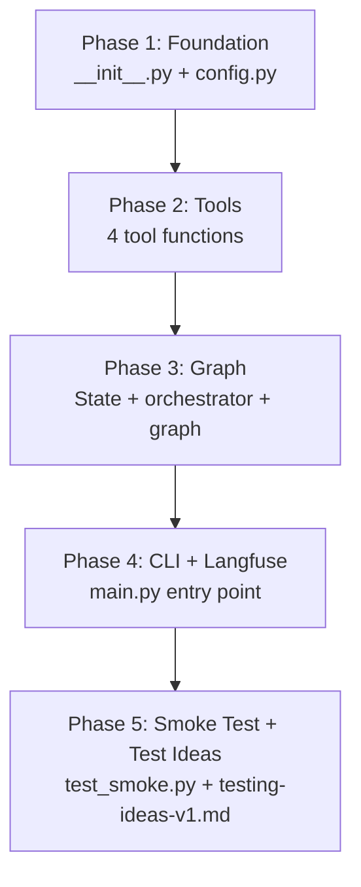
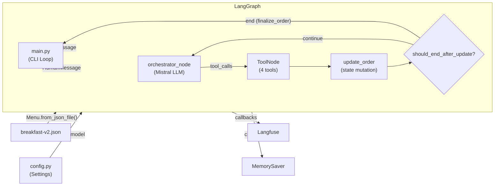
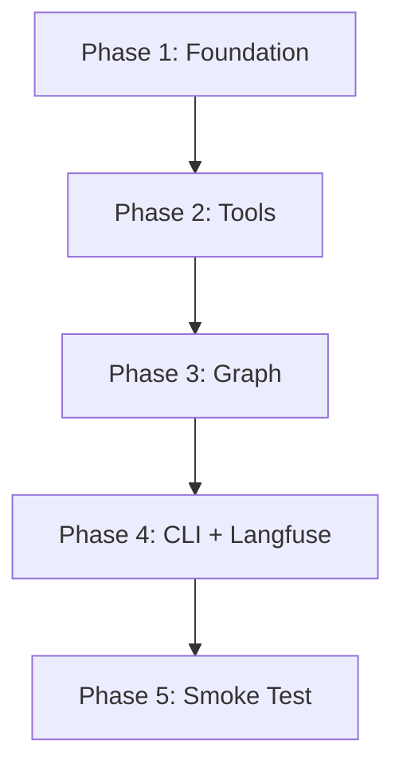

# v1 LLM Orchestrator Drive-Thru Bot — Implementation Plan

> **Status:** DRAFT

## Table of Contents

- [Overview](#overview)
- [Current State Analysis](#current-state-analysis)
- [Desired End State](#desired-end-state)
- [What We're NOT Doing](#what-were-not-doing)
- [File Inventory](#file-inventory)
- [Implementation Approach](#implementation-approach)
- [Dependencies](#dependencies)
- [Task Checklist](#task-checklist)
- [Phase Files](#phase-files)
- [References](#references)

## Overview

Implement the v1 LLM Orchestrator pattern for the McDonald's drive-thru chatbot. This replaces the planned v0 explicit state machine (12+ nodes) with a 4-node LangGraph graph using a single LLM reasoning node (Mistral) with tool-calling.

The v1 bot supports **adding items only** (no remove/modify). It runs as a **text-only chatbot CLI**. The LLM orchestrator calls 4 tools (`lookup_menu_item`, `add_item_to_order`, `get_current_order`, `finalize_order`) to manage the order, with an `update_order` node bridging tool results into state. After `update_order`, a conditional edge checks for `finalize_order` to end the conversation.

Langfuse observability is wired in from the start. Configuration uses pydantic-settings. Structured logging with **loguru** is added across all important code paths (tools, graph nodes, config, CLI) — output goes to stderr and to rotating log files (rotation every 3 hours, retention 1 day).

## Current State Analysis

### What Exists:
- `src/orchestrator/orchestrator/enums.py` — `Size` and `CategoryName` StrEnums (complete)
- `src/orchestrator/orchestrator/models.py` — `Modifier`, `Location`, `Item`, `Order`, `Menu` Pydantic models (complete, including `__add__` operators)
- `menus/mcdonalds/breakfast-menu/json/breakfast-v2.json` — Breakfast menu data (278 lines, 21 items)
- `src/orchestrator/pyproject.toml` — Dependencies: `langchain`, `langchain-core`, `langchain-mistralai`, `langfuse`, `langgraph`, `pydantic`, `pydantic-settings`
- `langgraph.json` — Already configured: `"orchestrator": "./src/orchestrator/orchestrator/graph.py:graph"`

### What's Missing:
- `__init__.py` — No package init, no exports
- `config.py` — No configuration management
- `tools.py` — No tool implementations
- `graph.py` — No graph, state schema, orchestrator node, or update_order node
- `main.py` — No CLI entry point
- Tests — No test files at all

### Key Constraints:
- LLM provider is **Mistral AI** (`langchain-mistralai`, model: `mistral-small-latest`)
- `InjectedState` is used for tools to access `menu` and `current_order` without LLM passing them
- Tools are **pure functions** returning dicts (no `Command` pattern)
- `update_order` node handles state mutation from tool results
- `finalize_order` routes through tools → update_order → conditional END (no dangling tool_calls)
- LLM is lazily initialized (not at import time) so imports work without API keys
- `MemorySaver` checkpointer for development
- Full menu in system prompt (Option A from state management doc)

## Desired End State

A working chatbot CLI where a user can:
1. Start a conversation and be greeted
2. Order items from the breakfast menu (single or multiple in one utterance)
3. Ask questions about the menu
4. Have their order read back
5. Finalize and submit their order

All interactions are traced in Langfuse. Configuration is managed via `.env` file.

**Success Criteria:**
- [ ] `uv run --package orchestrator python -m orchestrator.main` starts the chatbot CLI
- [ ] LangGraph Studio can load the graph via `langgraph.json`
- [ ] Smoke test passes: `uv run --package orchestrator pytest tests/orchestrator/test_smoke.py`
- [ ] Multi-turn conversation works: greet → order → read back → finalize
- [ ] Langfuse traces appear for each conversation turn

**How to Verify:**
```bash
# 1. Install dependencies
uv sync --all-packages

# 2. Run smoke test
uv run --package orchestrator pytest tests/orchestrator/test_smoke.py -v

# 3. Run chatbot CLI (interactive)
uv run --package orchestrator python -m orchestrator.main

# 4. Check Langfuse dashboard for traces
```

## What We're NOT Doing

- **No remove/modify item functionality** — v1 is add-only
- **No voice/audio** — text-only chatbot
- **No FastAPI/web server** — CLI only
- **No production checkpointer** — `MemorySaver` only (no Postgres/SQLite)
- **No custom reducer for Order** — `update_order` node handles it
- **No `search_menu_by_category` tool** — full menu is in the system prompt
- **No comprehensive test suite** — smoke test only (test ideas documented separately)
- **No streaming** — simple `graph.invoke()` (streaming can be added later)
- **No price quoting** — `Item` has no price field
- **No JSON/structured log format** — human-readable loguru format for now

## File Inventory

| File | Action | Phase | Purpose |
|------|--------|-------|---------|
| `src/orchestrator/orchestrator/__init__.py` | CREATE | 1 | Package init with public exports |
| `src/orchestrator/orchestrator/config.py` | CREATE | 1 | Pydantic-settings configuration |
| `src/orchestrator/orchestrator/logging.py` | CREATE | 1 | Loguru configuration (stderr + rotating file sinks) |
| `.env.local` | CREATE | 1 | Example .env template (safe to commit) |
| `src/orchestrator/orchestrator/__main__.py` | CREATE | 4 | Enables `python -m orchestrator` |
| `src/orchestrator/orchestrator/tools.py` | CREATE | 2 | 4 tool functions (lookup, add, get_order, finalize) |
| `src/orchestrator/orchestrator/graph.py` | CREATE | 3 | State schema, orchestrator node, graph construction |
| `src/orchestrator/orchestrator/main.py` | CREATE | 4 | CLI chat loop with Langfuse integration |
| `tests/orchestrator/__init__.py` | CREATE | 5 | Test package init |
| `tests/orchestrator/conftest.py` | CREATE | 5 | Pytest fixtures (menu, order) |
| `tests/orchestrator/test_smoke.py` | CREATE | 5 | Smoke test: graph compiles, tools work |
| `scripts/seed_langfuse_prompts.py` | REPLACE_ENTIRE | 4 | Updated with drive-thru orchestrator prompt |
| `docs/thoughts/target-implementation/v1/testing-ideas-v1.md` | CREATE | 5 | Future testing ideas document |

## Implementation Approach

### Execution Flow



### Architecture / Data Flow



### Decision Log

| Decision | Options Considered | Chosen | Rationale |
|----------|-------------------|--------|-----------|
| LLM provider | OpenAI (gpt-4o-mini) vs Mistral | Mistral (`mistral-small-latest`) | Existing dependency; user preference |
| Menu in prompt | Full prompt (A) vs Tool-only (B) vs Hybrid (D) | Full prompt (A) | ~50 items is manageable; simplest for v1 |
| Order updates | Command in tools vs update_order node vs custom reducer | `update_order` node | Tools stay pure functions; easier to test |
| Config | Hardcoded vs pydantic-settings | pydantic-settings | Clean .env management; already a dependency |
| Langfuse | Include vs defer | Include | Already a dependency; important for debugging |
| Logging | stdlib logging vs loguru | loguru | Cleaner API, structured context, built-in rotation/retention; already a dependency |
| Log sinks | stderr-only vs stderr+file | stderr + rotating file | File logs aid post-hoc debugging; 3h rotation + 1d retention keeps disk bounded |
| Testing | Full suite vs smoke test | Smoke test + ideas doc | User preference; validates graph compiles |
| CLI interface | Simple input() loop | Simple input() loop | Matches v1 scope; no web server needed |

## Dependencies

**Execution Order:**

1. Phase 1: Foundation (no dependencies)
2. Phase 2: Tools (depends on Phase 1)
3. Phase 3: Graph (depends on Phase 2)
4. Phase 4: CLI + Langfuse (depends on Phase 3)
5. Phase 5: Smoke Test + Test Ideas (depends on Phase 4)

**Dependency Graph:**



**Parallelization:**
- All phases are sequential — each depends on the previous one.
- Within Phase 5, the test file and the testing-ideas doc can be written in parallel.

## Task Checklist

- [ ] [Phase 1: Foundation](./01-foundation.md) — `__init__.py` + `config.py`
- [ ] [Phase 2: Tools](./02-tools.md) — 4 tool functions
- [ ] [Phase 3: Graph](./03-graph.md) — State schema + orchestrator node + graph construction
- [ ] [Phase 4: CLI + Langfuse](./04-cli-langfuse.md) — `main.py` entry point
- [ ] [Phase 5: Smoke Test + Test Ideas](./05-smoke-test.md) — `test_smoke.py` + `testing-ideas-v1.md`

## Phase Files

1. [Foundation](./01-foundation.md) — Package init and configuration
2. [Tools](./02-tools.md) — Tool function implementations
3. [Graph](./03-graph.md) — LangGraph state, orchestrator, and graph construction
4. [CLI + Langfuse](./04-cli-langfuse.md) — CLI chat loop with observability
5. [Smoke Test + Test Ideas](./05-smoke-test.md) — Smoke test and future testing ideas

## References

- Design doc: `docs/thoughts/target-implementation/v1/langgraph-state-design-v1.md`
- State diagrams: `docs/thoughts/target-implementation/v1/langgraph-state-diagrams-v1.md`
- Context & state management: `docs/thoughts/target-implementation/v1/context-and-state-management-v1.md`
- Menu data: `menus/mcdonalds/breakfast-menu/json/breakfast-v2.json`
- Existing models: `src/orchestrator/orchestrator/models.py`
- Existing enums: `src/orchestrator/orchestrator/enums.py`
