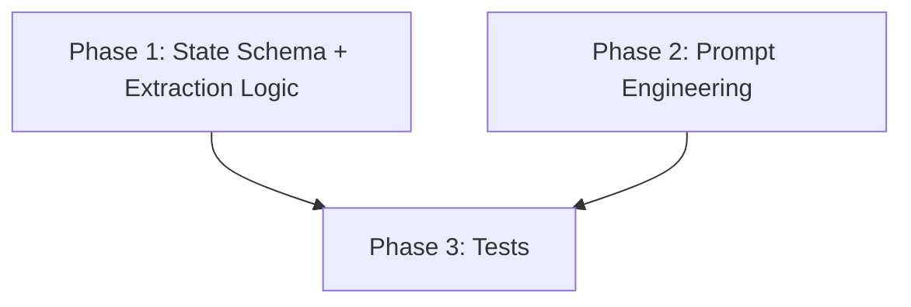
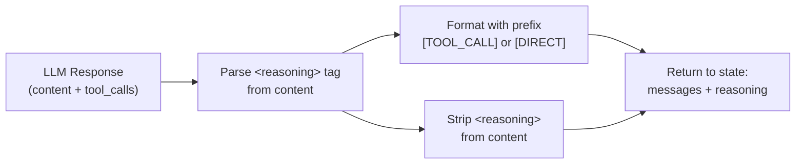

# Add Reasoning Key to DriveThruState

> **Status:** DRAFT

## Table of Contents

- [Overview](#overview)
- [Current State Analysis](#current-state-analysis)
- [Desired End State](#desired-end-state)
- [What We're NOT Doing](#what-were-not-doing)
- [File Inventory](#file-inventory)
- [Implementation Approach](#implementation-approach)
- [Dependencies](#dependencies)
- [Phase 1: State Schema and Reasoning Extraction](#phase-1-state-schema-and-reasoning-extraction)
- [Phase 2: Prompt Engineering](#phase-2-prompt-engineering)
- [Phase 3: Tests](#phase-3-tests)
- [Testing Strategy](#testing-strategy)
- [References](#references)

## Overview

Add a `reasoning` key (`list[str]` with `operator.add` reducer) to `DriveThruState` that captures the LLM's rationale for every decision it makes. After each orchestrator node invocation, the LLM's reasoning is extracted from its response content (via `<reasoning>` XML tags), formatted with a structured prefix (`[TOOL_CALL]` or `[DIRECT]`), and appended to the reasoning list.

This gives observability into WHY the LLM chose specific tools or chose to respond directly, accumulated across the full conversation.

## Current State Analysis

### Key Discoveries:
- `DriveThruState` at `src/orchestrator/orchestrator/graph.py:36-44` extends `MessagesState` with `menu: Menu` and `current_order: Order`. No reasoning field exists.
- `orchestrator_node` at `graph.py:162-218` invokes the LLM, checks for tool calls, and returns `{"messages": [response]}`. No reasoning is captured.
- The system prompt (Langfuse-fetched or `FALLBACK_SYSTEM_PROMPT` at `graph.py:54-88`) has 13 rules but no reasoning instruction.
- The LLM is Mistral (`ChatMistralAI`), which supports including `content` alongside `tool_calls` in AIMessage responses.
- Tests at `tests/orchestrator/test_smoke.py` construct `DriveThruState` directly and test node functions — no LLM calls.

## Desired End State

After implementation:
- `DriveThruState` has a `reasoning: Annotated[list[str], operator.add]` field (default `[]`)
- Every time the orchestrator node runs, exactly one reasoning entry is appended
- Tool call entries formatted as: `[TOOL_CALL] tool_name: <LLM's reasoning>`
- Multiple tool calls in one response produce: `[TOOL_CALL] tool1, tool2: <LLM's reasoning>`
- Direct response entries formatted as: `[DIRECT] <LLM's reasoning>`
- If the LLM fails to include `<reasoning>` tags, a fallback entry is generated from tool call metadata
- The `<reasoning>` tag is stripped from `response.content` before the message is stored in state (so the user never sees it)
- The reasoning list persists across the conversation via the checkpointer

**Success Criteria:**
- [ ] `DriveThruState` has `reasoning` field with `operator.add` reducer
- [ ] Reasoning entries accumulate across multiple orchestrator node invocations
- [ ] `<reasoning>` tags are stripped from AIMessage content before storage
- [ ] Fallback works when LLM omits `<reasoning>` tags
- [ ] All existing tests still pass
- [ ] New unit tests verify reasoning extraction and accumulation

**How to Verify:**
```bash
uv run --package orchestrator pytest tests/orchestrator/ -v
```

## What We're NOT Doing

- NOT adding reasoning to any node other than `orchestrator_node` (tools, update_order don't make LLM decisions)
- NOT displaying reasoning in the CLI output (main.py unchanged) — it's for observability/tracing only
- NOT sending reasoning to Langfuse (future enhancement)
- NOT adding a separate LLM call for reasoning — it comes from the same response
- NOT changing the graph topology or edge logic

## File Inventory

| File | Action | Phase | Purpose |
|------|--------|-------|---------|
| `src/orchestrator/orchestrator/graph.py` | MODIFY | 1 | Add `reasoning` to state, add extraction logic to `orchestrator_node` |
| `src/orchestrator/orchestrator/graph.py` | MODIFY | 2 | Update `FALLBACK_SYSTEM_PROMPT` with reasoning instruction |
| `tests/orchestrator/test_smoke.py` | MODIFY | 3 | Add tests for reasoning extraction and accumulation |

## Implementation Approach

### Execution Flow



### Architecture / Data Flow



### Decision Log

| Decision | Options Considered | Chosen | Rationale |
|----------|-------------------|--------|-----------|
| Reasoning source | LLM-generated vs code-generated vs hybrid | LLM-generated with code fallback | User chose LLM-generated; fallback ensures reliability when LLM omits tags |
| Reasoning format | Plain English vs structured prefix | Structured prefix | User chose structured; easier to parse and filter programmatically |
| Extraction method | Regex on content vs separate field vs JSON | Regex on `<reasoning>` XML tags | Simple, works with any LLM that follows instructions, easy to strip |
| Where to strip tags | In orchestrator_node vs post-processing | In orchestrator_node before returning | Keeps message history clean; no downstream code sees reasoning tags |
| Multiple tool calls | One entry per tool vs one entry per response | One entry per response listing all tools | Simpler, matches the LLM's single reasoning block |

## Dependencies

**Execution Order:**

1. Phase 1: State Schema + Extraction Logic (no dependencies)
2. Phase 2: Prompt Engineering (no dependencies)
3. Phase 3: Tests (depends on Phases 1 and 2)

**Parallelization:**
- Phases 1 and 2 can run in parallel (different sections of the same file)
- Phase 3 must wait for both Phase 1 and Phase 2

---

## Phase 1: State Schema and Reasoning Extraction

### Overview
Add the `reasoning` field to `DriveThruState` and add extraction/formatting logic to `orchestrator_node`.

### Context
Before starting, read these files:
- `src/orchestrator/orchestrator/graph.py` — full file, contains state definition and orchestrator_node

### Dependencies
**Depends on:** None
**Required by:** Phase 3

### Changes Required

#### 1.1: Add imports for Annotated and operator
**File:** `src/orchestrator/orchestrator/graph.py`
**Action:** MODIFY

**What this does:** Add the `operator` and `Annotated` imports needed for the reducer, and `re` for regex parsing.

**Before** (lines 1-19):
```python
"""LangGraph drive-thru orchestrator graph (v1).

4-node graph: orchestrator -> tools -> update_order -> orchestrator (loop).
The orchestrator is a Mistral LLM with tools bound. The system prompt is
fetched from Langfuse prompt management and compiled with runtime variables.

Exported as `graph` for langgraph.json.
"""

import json
from functools import lru_cache

from langchain_core.messages import SystemMessage, ToolMessage
from langchain_mistralai import ChatMistralAI
from langfuse import Langfuse
from langgraph.checkpoint.memory import MemorySaver
from langgraph.graph import END, START, MessagesState, StateGraph
from langgraph.prebuilt import ToolNode
from loguru import logger
```

**After:**
```python
"""LangGraph drive-thru orchestrator graph (v1).

4-node graph: orchestrator -> tools -> update_order -> orchestrator (loop).
The orchestrator is a Mistral LLM with tools bound. The system prompt is
fetched from Langfuse prompt management and compiled with runtime variables.

Exported as `graph` for langgraph.json.
"""

import json
import operator
import re
from functools import lru_cache
from typing import Annotated

from langchain_core.messages import SystemMessage, ToolMessage
from langchain_mistralai import ChatMistralAI
from langfuse import Langfuse
from langgraph.checkpoint.memory import MemorySaver
from langgraph.graph import END, START, MessagesState, StateGraph
from langgraph.prebuilt import ToolNode
from loguru import logger
```

**Rationale:** `operator.add` is the standard LangGraph reducer for appending to lists. `Annotated` is needed for the reducer type hint. `re` is used for parsing `<reasoning>` tags from LLM content.

#### 1.2: Add reasoning field to DriveThruState
**File:** `src/orchestrator/orchestrator/graph.py`
**Action:** MODIFY

**What this does:** Add the `reasoning` field with an `operator.add` reducer and empty list default.

**Before** (lines 36-44):
```python
class DriveThruState(MessagesState):
    """State for the drive-thru orchestrator graph.

    Inherits `messages` from MessagesState (with add-message reducer).
    Only adds the domain objects the orchestrator needs.
    """

    menu: Menu  # Loaded menu for this location
    current_order: Order  # Customer's order in progress
```

**After:**
```python
class DriveThruState(MessagesState):
    """State for the drive-thru orchestrator graph.

    Inherits `messages` from MessagesState (with add-message reducer).
    Only adds the domain objects the orchestrator needs.
    """

    menu: Menu  # Loaded menu for this location
    current_order: Order  # Customer's order in progress
    reasoning: Annotated[list[str], operator.add]  # LLM decision rationale log
```

**Rationale:** `operator.add` means each node return of `{"reasoning": ["entry"]}` appends to the existing list rather than replacing it. This accumulates reasoning across the full conversation.

#### 1.3: Add reasoning extraction helper function
**File:** `src/orchestrator/orchestrator/graph.py`
**Action:** MODIFY

**What this does:** Add a helper function `_extract_reasoning` right before `orchestrator_node` (after the LLM+Tools section, before the Nodes section). This function parses `<reasoning>` XML tags from LLM response content.

Insert the following function **between line 159 (the `# Nodes` section comment's closing `---` line) and line 162 (the `def orchestrator_node` line)**:

**Before** (lines 157-162):
```python
# ---------------------------------------------------------------------------
# Nodes
# ---------------------------------------------------------------------------


def orchestrator_node(state: DriveThruState) -> dict:
```

**After:**
```python
# ---------------------------------------------------------------------------
# Nodes
# ---------------------------------------------------------------------------

_REASONING_PATTERN = re.compile(r"<reasoning>(.*?)</reasoning>", re.DOTALL)


def _extract_reasoning(content: str) -> tuple[str, str]:
    """Extract and strip <reasoning> tags from LLM response content.

    Returns:
        (reasoning_text, cleaned_content) — reasoning_text is the extracted
        reasoning (empty string if no tag found), cleaned_content is the
        original content with the <reasoning> tag removed.
    """
    match = _REASONING_PATTERN.search(content)
    if not match:
        return "", content
    reasoning_text = match.group(1).strip()
    cleaned = _REASONING_PATTERN.sub("", content).strip()
    return reasoning_text, cleaned


def orchestrator_node(state: DriveThruState) -> dict:
```

**Rationale:** Separating extraction into a testable helper keeps `orchestrator_node` clean. The regex handles multiline reasoning via `re.DOTALL`. Returns both the extracted reasoning and the cleaned content so the caller can update the message.

#### 1.4: Update orchestrator_node to extract and return reasoning
**File:** `src/orchestrator/orchestrator/graph.py`
**Action:** MODIFY

**What this does:** After the LLM invocation, extract reasoning from the response, format it with a structured prefix, strip the reasoning tag from content, and return the reasoning entry alongside messages.

**Before** (lines 208-218, the section after `response = _get_orchestrator_llm().invoke(messages)`):
```python
    response = _get_orchestrator_llm().invoke(messages)

    if response.tool_calls:
        logger.info(
            "Orchestrator requesting tools: {}",
            [tc["name"] for tc in response.tool_calls],
        )
    else:
        logger.info("Orchestrator responding directly (no tool calls)")

    return {"messages": [response]}
```

**After:**
```python
    response = _get_orchestrator_llm().invoke(messages)

    # Extract reasoning from <reasoning> tags in content
    raw_reasoning, cleaned_content = _extract_reasoning(response.content or "")

    # Strip reasoning tags from the message content before storing
    if cleaned_content != (response.content or ""):
        response.content = cleaned_content

    # Format reasoning entry with structured prefix
    if response.tool_calls:
        tool_names = ", ".join(tc["name"] for tc in response.tool_calls)
        logger.info("Orchestrator requesting tools: {}", tool_names)
        if raw_reasoning:
            reasoning_entry = f"[TOOL_CALL] {tool_names}: {raw_reasoning}"
        else:
            # Fallback: generate from tool call metadata
            args_summary = "; ".join(
                f"{tc['name']}({', '.join(f'{k}={v!r}' for k, v in tc['args'].items())})"
                for tc in response.tool_calls
            )
            reasoning_entry = f"[TOOL_CALL] {tool_names}: {args_summary}"
    else:
        logger.info("Orchestrator responding directly (no tool calls)")
        if raw_reasoning:
            reasoning_entry = f"[DIRECT] {raw_reasoning}"
        else:
            # Fallback: note that no reasoning was provided
            snippet = (response.content or "")[:80]
            reasoning_entry = f"[DIRECT] {snippet}"

    logger.debug("Reasoning: {}", reasoning_entry)

    return {"messages": [response], "reasoning": [reasoning_entry]}
```

**Rationale:** This handles four cases: tool call with reasoning, tool call without reasoning (fallback to metadata), direct response with reasoning, direct response without reasoning (fallback to content snippet). The `<reasoning>` tags are always stripped from content so users and message history stay clean.

### Success Criteria

#### Automated Verification:
- [ ] All existing tests pass: `uv run --package orchestrator pytest tests/orchestrator/ -v`
- [ ] Type checking passes: `uv run --package orchestrator python -c "from orchestrator.graph import DriveThruState; s = DriveThruState(messages=[], menu=None, current_order=None, reasoning=[]); print('OK')"`  (note: this is just a sanity check that the field exists; actual validation requires real Menu/Order objects)
- [ ] Module imports without error: `uv run --package orchestrator python -c "from orchestrator.graph import graph, _extract_reasoning; print('OK')"`

---

## Phase 2: Prompt Engineering

### Overview
Update the system prompt to instruct the LLM to always include reasoning in `<reasoning>` tags.

### Context
Before starting, read these files:
- `src/orchestrator/orchestrator/graph.py` — specifically `FALLBACK_SYSTEM_PROMPT` at lines 54-88

### Dependencies
**Depends on:** None
**Required by:** Phase 3

### Changes Required

#### 2.1: Update FALLBACK_SYSTEM_PROMPT with reasoning instruction
**File:** `src/orchestrator/orchestrator/graph.py`
**Action:** MODIFY

**What this does:** Add rule 14 to the system prompt instructing the LLM to include `<reasoning>` tags in every response.

**Before** (lines 85-88, the last two rules and closing quote):
```python
12. When adding modifiers, only use modifiers from the item's available_modifiers
    list returned by lookup_menu_item. Do not accept modifiers that aren't
    available for that item.
13. Sizes are: snack, small, medium, large, regular. If the customer doesn't
    specify a size, do not ask — the item's default size will be used automatically.\
"""
```

**After:**
```python
12. When adding modifiers, only use modifiers from the item's available_modifiers
    list returned by lookup_menu_item. Do not accept modifiers that aren't
    available for that item.
13. Sizes are: snack, small, medium, large, regular. If the customer doesn't
    specify a size, do not ask — the item's default size will be used automatically.
14. ALWAYS start your response with a <reasoning> tag explaining your decision.
    If you are calling tools, explain which tools you chose and why.
    If you are responding directly, explain why no tool call is needed.
    Example: <reasoning>Customer asked for an Egg McMuffin. I need to call
    lookup_menu_item to verify it exists before adding it.</reasoning>
    The reasoning tag MUST appear before any other content in your response.\
"""
```

**Rationale:** Placing the instruction as the last numbered rule makes it prominent. The example helps the LLM understand the expected format. The "MUST appear before any other content" instruction maximizes compliance.

### Success Criteria

#### Automated Verification:
- [ ] Module imports without error: `uv run --package orchestrator python -c "from orchestrator.graph import FALLBACK_SYSTEM_PROMPT; assert '<reasoning>' in FALLBACK_SYSTEM_PROMPT; print('OK')"`

#### Manual Verification:
- [ ] Run the chatbot (`make chat`) and observe that reasoning tags appear in LLM responses (check debug logs)

---

## Phase 3: Tests

### Overview
Add unit tests verifying reasoning extraction, formatting, and accumulation in state.

### Context
Before starting, read these files:
- `src/orchestrator/orchestrator/graph.py` — the `_extract_reasoning` function and updated `orchestrator_node`
- `tests/orchestrator/test_smoke.py` — existing test patterns
- `tests/orchestrator/conftest.py` — existing fixtures

### Dependencies
**Depends on:** Phase 1, Phase 2
**Required by:** None

### Changes Required

#### 3.1: Add reasoning tests to test_smoke.py
**File:** `tests/orchestrator/test_smoke.py`
**Action:** MODIFY

**What this does:** Add a new test class `TestReasoning` with tests for `_extract_reasoning` helper and reasoning accumulation in `orchestrator_node` output. Also update the import line to include `_extract_reasoning`.

**Before** (line 11):
```python
from orchestrator.graph import DriveThruState, graph, update_order
```

**After:**
```python
from orchestrator.graph import DriveThruState, _extract_reasoning, graph, update_order
```

Then append the following new test class **at the end of the file** (after line 162):

```python


class TestReasoning:
    """Test reasoning extraction and formatting."""

    def test_extract_reasoning_with_tags(self):
        """_extract_reasoning should extract text from <reasoning> tags."""
        content = "<reasoning>Looking up the item first.</reasoning>Sure, let me check that for you."
        reasoning, cleaned = _extract_reasoning(content)
        assert reasoning == "Looking up the item first."
        assert cleaned == "Sure, let me check that for you."

    def test_extract_reasoning_without_tags(self):
        """_extract_reasoning should return empty string when no tags present."""
        content = "Sure, let me check that for you."
        reasoning, cleaned = _extract_reasoning(content)
        assert reasoning == ""
        assert cleaned == "Sure, let me check that for you."

    def test_extract_reasoning_multiline(self):
        """_extract_reasoning should handle multiline reasoning."""
        content = "<reasoning>Customer wants two items.\nNeed to look up both.</reasoning>OK!"
        reasoning, cleaned = _extract_reasoning(content)
        assert "Customer wants two items." in reasoning
        assert "Need to look up both." in reasoning
        assert cleaned == "OK!"

    def test_extract_reasoning_empty_content(self):
        """_extract_reasoning should handle empty string."""
        reasoning, cleaned = _extract_reasoning("")
        assert reasoning == ""
        assert cleaned == ""

    def test_state_reasoning_field_defaults_empty(self, menu, empty_order):
        """DriveThruState reasoning field should accept empty list."""
        state = DriveThruState(
            messages=[],
            menu=menu,
            current_order=empty_order,
            reasoning=[],
        )
        assert state["reasoning"] == []

    def test_state_reasoning_field_accumulates(self, menu, empty_order):
        """DriveThruState reasoning field should be a list of strings."""
        state = DriveThruState(
            messages=[],
            menu=menu,
            current_order=empty_order,
            reasoning=["[DIRECT] Greeting the customer."],
        )
        assert len(state["reasoning"]) == 1
        assert state["reasoning"][0].startswith("[DIRECT]")
```

**Rationale:** Tests cover the core `_extract_reasoning` function (with tags, without tags, multiline, empty), plus verify the state field works correctly. We don't test the full `orchestrator_node` reasoning integration here since that requires mocking the LLM — the extraction logic and state field tests give sufficient confidence.

### Success Criteria

#### Automated Verification:
- [ ] All tests pass: `uv run --package orchestrator pytest tests/orchestrator/ -v`
- [ ] New test class appears in output: `TestReasoning`
- [ ] All 6 new tests pass

---

## Testing Strategy

### Unit Tests:
- `_extract_reasoning` — 4 cases: with tags, without tags, multiline, empty
- `DriveThruState` — reasoning field initialization and type

### Integration Tests (not in this plan, future work):
- Full graph invocation with mocked LLM verifying reasoning accumulates across turns

### Manual Testing Steps:
1. Run `make chat` and have a conversation
2. Check debug logs (`loguru`) for `"Reasoning: ..."` entries
3. Verify reasoning entries have `[TOOL_CALL]` prefix when tools are called
4. Verify reasoning entries have `[DIRECT]` prefix when LLM responds directly
5. Verify the customer-facing response does NOT contain `<reasoning>` tags

## References

- State definition: `src/orchestrator/orchestrator/graph.py:36-44`
- Orchestrator node: `src/orchestrator/orchestrator/graph.py:162-218`
- System prompt: `src/orchestrator/orchestrator/graph.py:54-88`
- Existing tests: `tests/orchestrator/test_smoke.py`
- LangGraph reducer docs: `operator.add` appends lists on state update
