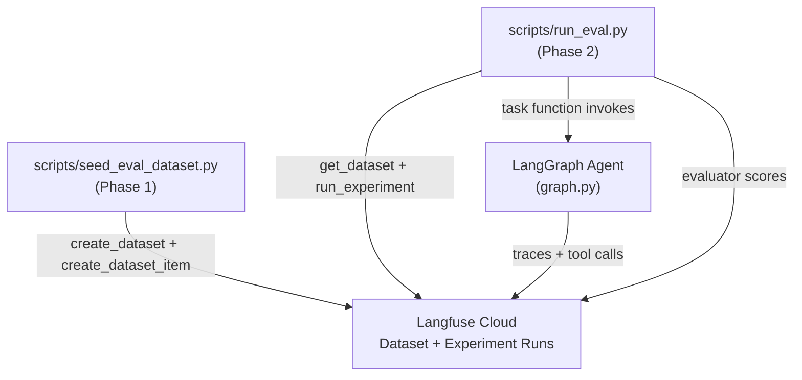
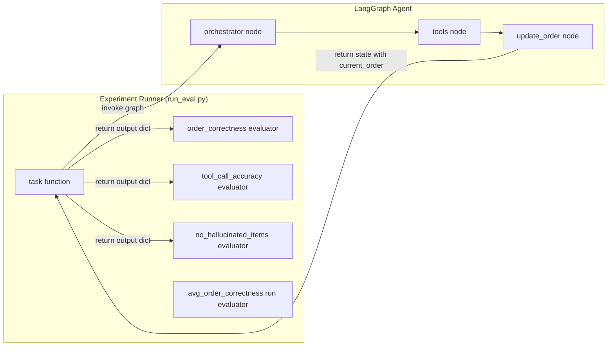
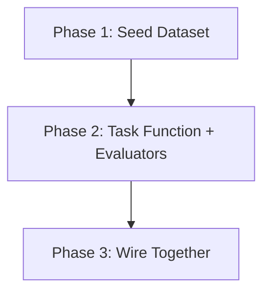

# Langfuse Evaluation Dataset & Experiments Implementation Plan

> **Status:** DRAFT

## Table of Contents

- [Overview](#overview)
- [Current State Analysis](#current-state-analysis)
- [Desired End State](#desired-end-state)
- [What We're NOT Doing](#what-were-not-doing)
- [File Inventory](#file-inventory)
- [Implementation Approach](#implementation-approach)
- [Dependencies](#dependencies)
- [Phase 1: Evaluation Dataset Seeding Script](#phase-1-evaluation-dataset-seeding-script)
- [Phase 2: Experiment Task Function, Evaluators & Runner](#phase-2-experiment-task-function-evaluators--runner)
- [Phase 3: Wire Everything Together](#phase-3-wire-everything-together)
- [Testing Strategy](#testing-strategy)
- [References](#references)

## Overview

Build a single-turn evaluation system for the McDonald's drive-thru chatbot using Langfuse v3 datasets and experiments. The system will:

1. **Seed a Langfuse-hosted dataset** with 25+ test cases covering common ordering patterns, edge cases, and failure modes
2. **Run experiments** via `dataset.run_experiment()` that invoke the LangGraph agent on each test case
3. **Score results** with deterministic evaluators focused on **order correctness** — whether the right items (with correct quantities, sizes, modifiers) end up in the order and no wrong items are added

Each test case is a single customer utterance (e.g., "I'll have two Egg McMuffins"). The agent processes it through the full graph loop (orchestrator → tools → update_order → orchestrator) and the evaluators check the resulting `current_order` state against the expected order.

## Current State Analysis

### What exists:
- Langfuse v3 tracing and prompt management are integrated (`main.py:19-38`, `graph.py:100-133`)
- A theoretical evaluation planning doc exists at `planning-docs/thoughts/target-implementation/v0/langfuse-evaluation-v0.md` but nothing is implemented
- Existing test infrastructure: `tests/orchestrator/conftest.py` with `menu` and `empty_order` fixtures
- `scripts/seed_langfuse_prompts.py` — a seeding script pattern already exists

### Key Discoveries:
- The chatbot uses `MemorySaver` checkpointer for multi-turn persistence (`main.py:60`)
- For single-turn evaluation, each test case needs its own `thread_id` to start with a fresh state
- The `_builder` (StateGraph builder) is a module-level variable in `graph.py:386` and can be compiled with any checkpointer (note: prefixed with `_` but `main.py` already imports it this way)
- Tools are pure functions — `add_item_to_order` returns `{"added": True, "item_id": ..., ...}` and `update_order` node constructs `Item` objects and merges into `Order` via `__add__`
- The Langfuse v3 `CallbackHandler` is used for tracing (`from langfuse.langchain import CallbackHandler`)
- The `Evaluation` class from `langfuse` is the return type for evaluators in `run_experiment()`
- The menu has 21 items, all category "breakfast", sizes are "regular" or "large"

### Concurrency Note:
`run_experiment()` may run task functions concurrently. The `get_settings()` function (which uses `@lru_cache`) and the global `_menu` cache in `run_eval.py` are both populated on the first task invocation before concurrency kicks in. Subsequent concurrent calls safely read the cached values. This is standard Python behavior — `@lru_cache` uses a lock internally.

## Desired End State

A working evaluation pipeline where:
- `make eval-seed` uploads the evaluation dataset to Langfuse
- `make eval` runs the experiment against the dataset and prints scored results
- Experiment results are visible in the Langfuse UI with per-item scores and run-level aggregates
- New test cases can be added by editing a single Python file

**Success Criteria:**
- [ ] Dataset with 25+ items is created in Langfuse
- [ ] Experiment runner invokes the LangGraph agent for each dataset item and produces traces
- [ ] `order_correctness` evaluator scores each item (1.0 = perfect match, partial credit for partial matches)
- [ ] `tool_call_accuracy` evaluator checks the agent called `lookup_menu_item` before `add_item_to_order`
- [ ] `no_hallucinated_items` evaluator checks no items outside the menu were added
- [ ] Run-level evaluator computes average scores across all items
- [ ] Results are visible in Langfuse Datasets UI with comparison support
- [ ] `make eval` and `make eval-seed` targets work

**How to Verify:**
- Run `make eval-seed` — dataset appears in Langfuse UI under Datasets
- Run `make eval` — experiment completes, scores printed to terminal, traces + scores visible in Langfuse
- Run `make eval` a second time with a different run name — two runs appear side-by-side in Langfuse comparison view

## What We're NOT Doing

- **Multi-turn conversation evaluation** — that's Phase 2 (future work)
- **LLM-as-judge evaluators** — deterministic evaluators first; LLM-as-judge can be layered on later
- **Online/production evaluation** — this is offline evaluation only
- **CI integration** — no pytest assertions on eval scores yet (can add later)
- **Voice/audio evaluation** — text-only
- **Response quality scoring** — focusing on order correctness, not tone/brevity
- **Modifying any existing source code** — the evaluation system is additive only

## File Inventory

| File | Action | Phase | Purpose |
|------|--------|-------|---------|
| `scripts/seed_eval_dataset.py` | CREATE | 1 | Script to create & populate Langfuse dataset |
| `scripts/run_eval.py` | CREATE | 2 | Experiment runner with task function + evaluators |
| `Makefile` | MODIFY | 3 | Add `eval-seed` and `eval` targets |

## Implementation Approach

### Execution Flow



### Architecture / Data Flow



### Decision Log

| Decision | Options Considered | Chosen | Rationale |
|----------|-------------------|--------|-----------|
| Dataset hosting | Local JSON vs Langfuse-hosted | Langfuse-hosted | Enables UI comparison, experiment runs, version tracking |
| Experiment API | Low-level `item.run()` loop vs `dataset.run_experiment()` | `dataset.run_experiment()` | Higher-level, handles concurrency, error isolation, auto-linking |
| Eval scope | Single-turn vs multi-turn | Single-turn | Simpler to implement and reason about; multi-turn is Phase 2 |
| Task output format | Return just order items vs full state dict | Full output dict with order + tool_calls + response | Enables multiple evaluators to check different aspects |
| Thread isolation | Shared thread vs per-item thread | Per-item fresh thread | Each eval item must start with empty order state |
| Evaluator type | LLM-as-judge vs deterministic | Deterministic | Order correctness is objectively measurable; cheaper and faster |
| Graph compilation | Import `graph` vs compile from `_builder` | Compile from `_builder` with `MemorySaver` | Need checkpointer for stateful evaluation; same pattern as `main.py` |
| Evaluator comparison | List-order-dependent vs order-independent | Order-independent (dict/set matching by item_id) | Order of items in a list should not affect scores — `["egg-mcmuffin", "hash-brown"]` must equal `["hash-brown", "egg-mcmuffin"]` |

## Dependencies

**Execution Order:**

1. Phase 1: Seed evaluation dataset (no dependencies)
2. Phase 2: Build task function + evaluators (depends on Phase 1 for dataset to exist)
3. Phase 3: Wire together + Makefile (depends on Phases 1 and 2)

**Dependency Graph:**



---

## Phase 1: Evaluation Dataset Seeding Script

### Overview
Create a script that populates a Langfuse-hosted dataset with 25+ single-turn test cases. Each item has a customer utterance as input and the expected order state as expected_output.

### Context
Before starting, read these files:
- `scripts/seed_langfuse_prompts.py` — existing seeding script pattern
- `menus/mcdonalds/breakfast-menu/json/breakfast-v2.json` — menu data with item IDs, names, sizes
- `src/orchestrator/orchestrator/config.py` — Settings class with Langfuse credentials
- `src/orchestrator/orchestrator/models.py` — Order, Item, Modifier model definitions

### Dependencies
**Depends on:** None
**Required by:** Phase 2, Phase 3

### Changes Required

#### 1.1: Create `scripts/seed_eval_dataset.py` ✓
**File:** `scripts/seed_eval_dataset.py`
**Action:** CREATE

**What this does:** Creates a Langfuse dataset named `drive-thru/order-correctness-v1` and populates it with test cases covering simple orders, multi-item orders, quantities, modifiers, not-on-menu items, and edge cases. Each dataset item has a deterministic `id` based on its index, making the script idempotent (running twice upserts rather than duplicates).

```python
"""Seed the Langfuse evaluation dataset for drive-thru order correctness.

Usage:
    uv run --package orchestrator python scripts/seed_eval_dataset.py

Creates a dataset in Langfuse with test cases for single-turn ordering evaluation.
Each item has:
  - input: {"customer_utterance": "..."} — what the customer says
  - expected_output: {"expected_items": [...]} — what should end up in the order
  - metadata: {"category": "...", "difficulty": "..."} — for filtering/analysis

Idempotent: each item has a deterministic id, so running twice upserts (no duplicates).
"""

from orchestrator.config import get_settings

DATASET_NAME = "drive-thru/order-correctness-v1"
DATASET_DESCRIPTION = (
    "Single-turn order correctness evaluation dataset. "
    "Tests whether the chatbot correctly adds items to the order "
    "based on a single customer utterance."
)

# ── Test Cases ──────────────────────────────────────────────────────────────
# Each test case: (customer_utterance, expected_items, category, difficulty)
#
# expected_items format:
#   [{"item_id": "...", "name": "...", "quantity": N, "size": "...", "modifiers": [...]}]
#
# An empty list [] means no items should be added (e.g., greeting, question).
#
# NOTE: The order of items in expected_items does NOT matter — the evaluator
# matches by item_id using dicts, not by list position.
# ────────────────────────────────────────────────────────────────────────────

TEST_CASES: list[tuple[str, list[dict], str, str]] = [
    # ── Simple single-item orders (easy) ──
    (
        "I'll have an Egg McMuffin",
        [{"item_id": "egg-mcmuffin", "name": "Egg McMuffin", "quantity": 1, "size": "regular", "modifiers": []}],
        "simple_order",
        "easy",
    ),
    (
        "Can I get a Hash Brown please?",
        [{"item_id": "hash-brown", "name": "Hash Brown", "quantity": 1, "size": "regular", "modifiers": []}],
        "simple_order",
        "easy",
    ),
    (
        "I'd like the Hotcakes",
        [{"item_id": "hotcakes", "name": "Hotcakes", "quantity": 1, "size": "regular", "modifiers": []}],
        "simple_order",
        "easy",
    ),
    (
        "Give me a Sausage Burrito",
        [{"item_id": "sausage-burrito", "name": "Sausage Burrito", "quantity": 1, "size": "regular", "modifiers": []}],
        "simple_order",
        "easy",
    ),
    (
        "I want the Fruit & Maple Oatmeal",
        [{"item_id": "fruit-maple-oatmeal", "name": "Fruit & Maple Oatmeal", "quantity": 1, "size": "regular", "modifiers": []}],
        "simple_order",
        "easy",
    ),
    # ── Quantities (easy-medium) ──
    (
        "Two hash browns please",
        [{"item_id": "hash-brown", "name": "Hash Brown", "quantity": 2, "size": "regular", "modifiers": []}],
        "quantity",
        "easy",
    ),
    (
        "I'll take three Sausage Biscuits",
        [{"item_id": "sausage-biscuit", "name": "Sausage Biscuit", "quantity": 3, "size": "regular", "modifiers": []}],
        "quantity",
        "medium",
    ),
    # ── Multi-item in single utterance (medium) ──
    (
        "I'll have an Egg McMuffin and a Hash Brown",
        [
            {"item_id": "egg-mcmuffin", "name": "Egg McMuffin", "quantity": 1, "size": "regular", "modifiers": []},
            {"item_id": "hash-brown", "name": "Hash Brown", "quantity": 1, "size": "regular", "modifiers": []},
        ],
        "multi_item",
        "medium",
    ),
    (
        "Can I get two Sausage McMuffins and a Sausage Burrito",
        [
            {"item_id": "sausage-mcmuffin", "name": "Sausage McMuffin", "quantity": 2, "size": "regular", "modifiers": []},
            {"item_id": "sausage-burrito", "name": "Sausage Burrito", "quantity": 1, "size": "regular", "modifiers": []},
        ],
        "multi_item",
        "medium",
    ),
    (
        "I'd like a Steak & Egg McMuffin, two Hash Browns, and Hotcakes",
        [
            {"item_id": "steak-egg-mcmuffin", "name": "Steak & Egg McMuffin", "quantity": 1, "size": "regular", "modifiers": []},
            {"item_id": "hash-brown", "name": "Hash Brown", "quantity": 2, "size": "regular", "modifiers": []},
            {"item_id": "hotcakes", "name": "Hotcakes", "quantity": 1, "size": "regular", "modifiers": []},
        ],
        "multi_item",
        "medium",
    ),
    # ── Modifiers (medium) ──
    (
        "Sausage McMuffin with egg please",
        [{"item_id": "sausage-mcmuffin", "name": "Sausage McMuffin", "quantity": 1, "size": "regular", "modifiers": [{"modifier_id": "egg", "name": "Egg"}]}],
        "modifier",
        "medium",
    ),
    (
        "I'll have a Sausage Biscuit with egg whites",
        [{"item_id": "sausage-biscuit", "name": "Sausage Biscuit", "quantity": 1, "size": "regular", "modifiers": [{"modifier_id": "egg-whites", "name": "Egg Whites"}]}],
        "modifier",
        "medium",
    ),
    (
        "Hotcakes with sausage",
        [{"item_id": "hotcakes", "name": "Hotcakes", "quantity": 1, "size": "regular", "modifiers": [{"modifier_id": "sausage", "name": "Sausage"}]}],
        "modifier",
        "medium",
    ),
    # ── Not on menu / should add nothing (medium-hard) ──
    (
        "I'd like a Big Mac",
        [],
        "not_on_menu",
        "medium",
    ),
    (
        "Can I get a Quarter Pounder?",
        [],
        "not_on_menu",
        "medium",
    ),
    (
        "I want chicken nuggets",
        [],
        "not_on_menu",
        "medium",
    ),
    # ── Greetings / questions — no items should be added (easy) ──
    (
        "Hi, good morning!",
        [],
        "greeting",
        "easy",
    ),
    (
        "What do you have on the menu?",
        [],
        "question",
        "easy",
    ),
    (
        "What comes with the Big Breakfast?",
        [],
        "question",
        "easy",
    ),
    # ── Informal / colloquial phrasing (medium-hard) ──
    (
        "Lemme get uhh two of those egg mcmuffins",
        [{"item_id": "egg-mcmuffin", "name": "Egg McMuffin", "quantity": 2, "size": "regular", "modifiers": []}],
        "informal",
        "medium",
    ),
    (
        "yeah gimme a sausage mcmuffin with egg and a hash brown",
        [
            {"item_id": "sausage-mcmuffin", "name": "Sausage McMuffin", "quantity": 1, "size": "regular", "modifiers": [{"modifier_id": "egg", "name": "Egg"}]},
            {"item_id": "hash-brown", "name": "Hash Brown", "quantity": 1, "size": "regular", "modifiers": []},
        ],
        "informal",
        "hard",
    ),
    # ── Ambiguous / partial names (hard) ──
    (
        "I'll have a McMuffin",
        [],  # Ambiguous — could be Egg McMuffin, Sausage McMuffin, etc. Agent should clarify, not guess.
        "ambiguous",
        "hard",
    ),
    (
        "Give me some bacon",
        [{"item_id": "bacon", "name": "Bacon", "quantity": 1, "size": "regular", "modifiers": []}],
        "ambiguous",
        "hard",
    ),
    # ── Quantity + modifier combo (hard) ──
    (
        "Two Sausage Biscuits with egg and a Sausage Burrito",
        [
            {"item_id": "sausage-biscuit", "name": "Sausage Biscuit", "quantity": 2, "size": "regular", "modifiers": [{"modifier_id": "egg", "name": "Egg"}]},
            {"item_id": "sausage-burrito", "name": "Sausage Burrito", "quantity": 1, "size": "regular", "modifiers": []},
        ],
        "complex",
        "hard",
    ),
    (
        "I'd like three hash browns and two Egg McMuffins",
        [
            {"item_id": "hash-brown", "name": "Hash Brown", "quantity": 3, "size": "regular", "modifiers": []},
            {"item_id": "egg-mcmuffin", "name": "Egg McMuffin", "quantity": 2, "size": "regular", "modifiers": []},
        ],
        "complex",
        "hard",
    ),
]


def main() -> None:
    """Seed the evaluation dataset in Langfuse."""
    settings = get_settings()
    if not settings.langfuse_public_key or not settings.langfuse_secret_key:
        print("ERROR: Langfuse credentials not configured in .env")
        print("Set LANGFUSE_PUBLIC_KEY and LANGFUSE_SECRET_KEY")
        return

    from langfuse import Langfuse

    langfuse = Langfuse(
        public_key=settings.langfuse_public_key,
        secret_key=settings.langfuse_secret_key,
        host=settings.langfuse_base_url,
    )

    # Create the dataset (idempotent — Langfuse upserts by name)
    print(f"Creating dataset: {DATASET_NAME}")
    langfuse.create_dataset(
        name=DATASET_NAME,
        description=DATASET_DESCRIPTION,
        metadata={
            "version": "1.0",
            "scope": "single-turn",
            "focus": "order-correctness",
            "item_count": len(TEST_CASES),
        },
    )

    # Add test cases as dataset items
    # Each item has a deterministic id so re-running upserts instead of duplicating
    for i, (utterance, expected_items, category, difficulty) in enumerate(TEST_CASES):
        print(f"  [{i+1}/{len(TEST_CASES)}] {category}/{difficulty}: {utterance[:50]}...")
        langfuse.create_dataset_item(
            id=f"order-correctness-{i:03d}",
            dataset_name=DATASET_NAME,
            input={"customer_utterance": utterance},
            expected_output={"expected_items": expected_items},
            metadata={
                "category": category,
                "difficulty": difficulty,
                "index": i,
            },
        )

    langfuse.flush()
    print(f"\nDone! {len(TEST_CASES)} items seeded to '{DATASET_NAME}'")
    print("View in Langfuse UI: Datasets > drive-thru/order-correctness-v1")


if __name__ == "__main__":
    main()
```

### Success Criteria

#### Automated Verification:
- [x] Script runs without errors: `uv run --package orchestrator python scripts/seed_eval_dataset.py`
- [x] Script is idempotent (running twice doesn't create duplicates — each item has a deterministic `id`)

#### Manual Verification:
- [ ] Dataset appears in Langfuse UI under Datasets
- [ ] Dataset has 25 items with correct input/expected_output structure
- [ ] Items have metadata (category, difficulty) visible in Langfuse UI

---

## Phase 2: Experiment Task Function, Evaluators & Runner

### Overview
Create the experiment runner script with a task function that invokes the LangGraph agent on each dataset item and returns a structured output dict. Define deterministic evaluators that score the output against expected results. All evaluator comparisons are **order-independent** — they match items by `item_id` using dicts and compare modifiers using sets, so list ordering never affects scores.

### Context
Before starting, read these files:
- `src/orchestrator/orchestrator/graph.py` — `_builder`, `DriveThruState`, graph compilation
- `src/orchestrator/orchestrator/main.py` — how Langfuse handler and graph invocation work
- `src/orchestrator/orchestrator/config.py` — `get_settings()` for credentials
- `src/orchestrator/orchestrator/models.py` — `Menu`, `Order`, `Item` models

### Dependencies
**Depends on:** Phase 1 (dataset must exist)
**Required by:** Phase 3

### Evaluator Design

The evaluators are co-located in `scripts/run_eval.py` for simplicity. Each receives the task output and expected output from the dataset item.

**Order-independence guarantee:** All evaluators compare items by `item_id` keys in dicts, not by list position. Modifiers are compared as sets of `modifier_id` values. The order that items appear in `order_items` or `expected_items` lists has zero effect on scoring.

| Evaluator | What it checks | Score range | Comparison method |
|-----------|---------------|-------------|-------------------|
| `order_correctness` | Item-by-item comparison of actual vs expected order | 0.0 - 1.0 | Dict keyed by `item_id`; modifiers as sets of `modifier_id` |
| `tool_call_accuracy` | Protocol compliance: lookup before add, no add when not needed | 0.0 - 1.0 | Temporal ordering of tool calls (intentional — checks protocol sequence) |
| `no_hallucinated_items` | All item_ids in order exist on the breakfast menu | 0.0 or 1.0 | Set membership check against menu `item_id` values |
| `avg_order_correctness` (run-level) | Mean of order_correctness across all items | 0.0 - 1.0 | Simple average (order of items irrelevant) |

### `order_correctness` Scoring Algorithm

For each unique `item_id` across expected and actual (matched by dict key, not list position):
- **Name match**: 0.4 points (case-insensitive)
- **Quantity match**: 0.3 points (partial credit for close quantities)
- **Size match**: 0.1 points
- **Modifier match**: 0.2 points (Jaccard similarity of modifier ID **sets**)
- **Missing expected item**: 0 points for that item
- **Unexpected extra item**: 0 points for that item (dilutes overall score)

Final score = sum of per-item scores / number of unique item_ids.

### Changes Required

#### 2.1: Create `scripts/run_eval.py` ✓
**File:** `scripts/run_eval.py`
**Action:** CREATE

**What this does:** Defines the task function that wraps the LangGraph agent invocation, compiles the graph with a per-item MemorySaver, and returns a structured dict with the resulting order state plus tool call information. Also defines all evaluators (order-independent by design) and runs the experiment.

```python
"""Run evaluation experiment on the drive-thru chatbot.

Usage:
    uv run --package orchestrator python scripts/run_eval.py
    uv run --package orchestrator python scripts/run_eval.py --run-name "mistral-small-v2"

Runs the LangGraph agent against every item in the Langfuse evaluation dataset,
scores each result with deterministic evaluators, and prints a summary.
"""

import argparse
import json
import uuid
from datetime import datetime

from langchain_core.messages import HumanMessage, ToolMessage
from langgraph.checkpoint.memory import MemorySaver

from orchestrator.config import get_settings
from orchestrator.graph import _builder
from orchestrator.models import Menu, Order


# ── Langfuse Setup ──────────────────────────────────────────────────────────


def _init_langfuse():
    """Initialize and return the Langfuse client."""
    settings = get_settings()
    if not settings.langfuse_public_key or not settings.langfuse_secret_key:
        raise RuntimeError("Langfuse credentials not configured in .env")

    from langfuse import Langfuse

    langfuse = Langfuse(
        public_key=settings.langfuse_public_key,
        secret_key=settings.langfuse_secret_key,
        host=settings.langfuse_base_url,
    )
    return langfuse


# ── Task Function ───────────────────────────────────────────────────────────

DATASET_NAME = "drive-thru/order-correctness-v1"


def _load_menu() -> Menu:
    """Load the breakfast menu."""
    settings = get_settings()
    return Menu.from_json_file(settings.menu_json_path)


# Cache the menu so it's loaded once across all task invocations.
# This is populated on the first task invocation before run_experiment()
# starts concurrent execution, so subsequent reads are safe.
_menu: Menu | None = None


def _get_menu() -> Menu:
    global _menu
    if _menu is None:
        _menu = _load_menu()
    return _menu


def eval_task(*, item, **kwargs):
    """Task function for the experiment runner.

    Invokes the LangGraph agent with the customer utterance from the dataset
    item. Returns a dict with the resulting order and tool call trace for
    evaluators to score.

    Args:
        item: A DatasetItemClient from Langfuse. Has .input and .expected_output.

    Returns:
        dict with keys:
            - "order_items": list of dicts with item details from the final order
            - "tool_calls": list of tool call names in execution order
            - "response": the final assistant message text
            - "item_count": total number of items in the order
    """
    from langfuse.langchain import CallbackHandler

    customer_utterance = item.input["customer_utterance"]
    menu = _get_menu()

    # Compile a fresh graph with its own checkpointer for state isolation
    graph = _builder.compile(checkpointer=MemorySaver())

    # Unique thread for this evaluation item
    thread_id = f"eval-{uuid.uuid4()}"

    # The CallbackHandler captures LangChain-specific observations (LLM calls,
    # tool calls, chain runs) and links them under the experiment trace created
    # by run_experiment(). run_experiment() manages the top-level trace/span;
    # the CallbackHandler adds the LangChain detail underneath it.
    langfuse_handler = CallbackHandler()

    config = {
        "configurable": {"thread_id": thread_id},
        "callbacks": [langfuse_handler],
    }

    # Invoke the graph with the customer utterance
    result = graph.invoke(
        {
            "messages": [HumanMessage(content=customer_utterance)],
            "menu": menu,
            "current_order": Order(),
        },
        config=config,
    )

    # Extract the final order state
    current_order = result["current_order"]
    order_items = [
        {
            "item_id": item_obj.item_id,
            "name": item_obj.name,
            "quantity": item_obj.quantity,
            "size": item_obj.size.value if item_obj.size else "regular",
            "modifiers": [
                {"modifier_id": m.modifier_id, "name": m.name}
                for m in item_obj.modifiers
            ],
        }
        for item_obj in current_order.items
    ]

    # Extract tool call sequence from messages
    tool_calls = []
    for msg in result["messages"]:
        if hasattr(msg, "tool_calls") and msg.tool_calls:
            for tc in msg.tool_calls:
                tool_calls.append(tc["name"])

    # Get the final assistant response
    response = ""
    for msg in reversed(result["messages"]):
        if hasattr(msg, "content") and not isinstance(msg, (HumanMessage, ToolMessage)):
            response = msg.content or ""
            break

    return {
        "order_items": order_items,
        "tool_calls": tool_calls,
        "response": response,
        "item_count": sum(i["quantity"] for i in order_items),
    }


# ── Evaluators ──────────────────────────────────────────────────────────────
#
# IMPORTANT: All evaluators are ORDER-INDEPENDENT. They match items by item_id
# using dict lookups, and compare modifiers using sets. The order that items
# appear in order_items or expected_items lists does NOT affect scores.
# ────────────────────────────────────────────────────────────────────────────


def order_correctness_evaluator(*, output, expected_output, **kwargs):
    """Score how well the actual order matches the expected order.

    ORDER-INDEPENDENT: Items are matched by item_id using dict lookups,
    not by list position. Modifiers are compared as sets of modifier_id.

    Scoring:
    - If expected is empty and actual is empty: 1.0 (correct: no items should be added)
    - If expected is empty but actual has items: 0.0 (hallucinated items)
    - If expected has items but actual is empty: 0.0 (missed everything)
    - Otherwise: Jaccard-like score based on item matching by item_id
    """
    from langfuse import Evaluation

    if output is None:
        return Evaluation(name="order_correctness", value=0.0, comment="Task returned None")

    expected_items = expected_output.get("expected_items", [])
    actual_items = output.get("order_items", [])

    # Both empty — correct behavior (greeting, question, not-on-menu)
    if not expected_items and not actual_items:
        return Evaluation(name="order_correctness", value=1.0, comment="Correctly added no items")

    # Expected empty but got items — hallucination
    if not expected_items and actual_items:
        item_names = [i["name"] for i in actual_items]
        return Evaluation(
            name="order_correctness",
            value=0.0,
            comment=f"Expected no items but got: {item_names}",
        )

    # Expected items but got nothing
    if expected_items and not actual_items:
        item_names = [i["name"] for i in expected_items]
        return Evaluation(
            name="order_correctness",
            value=0.0,
            comment=f"Expected {item_names} but order is empty",
        )

    # Both have items — compute match score
    # Build lookup by item_id — order of items in lists does NOT matter
    expected_by_id = {item["item_id"]: item for item in expected_items}
    actual_by_id = {item["item_id"]: item for item in actual_items}

    all_ids = set(expected_by_id.keys()) | set(actual_by_id.keys())
    total_score = 0.0
    max_score = len(all_ids)
    details = []

    for item_id in sorted(all_ids):  # sorted for deterministic comment output
        exp = expected_by_id.get(item_id)
        act = actual_by_id.get(item_id)

        if exp and act:
            # Item present in both — score match quality
            item_score = 0.0

            # Name match (0.4 weight)
            if act["name"].lower() == exp["name"].lower():
                item_score += 0.4

            # Quantity match (0.3 weight)
            if act["quantity"] == exp["quantity"]:
                item_score += 0.3
            else:
                # Partial credit for close quantities
                ratio = min(act["quantity"], exp["quantity"]) / max(act["quantity"], exp["quantity"])
                item_score += 0.3 * ratio

            # Size match (0.1 weight)
            if act.get("size") == exp.get("size"):
                item_score += 0.1

            # Modifier match (0.2 weight) — uses SETS, order-independent
            exp_mod_ids = {m["modifier_id"] for m in exp.get("modifiers", [])}
            act_mod_ids = {m["modifier_id"] for m in act.get("modifiers", [])}
            if not exp_mod_ids and not act_mod_ids:
                item_score += 0.2  # Both have no modifiers — match
            elif exp_mod_ids or act_mod_ids:
                intersection = exp_mod_ids & act_mod_ids
                union = exp_mod_ids | act_mod_ids
                item_score += 0.2 * (len(intersection) / len(union))

            total_score += item_score
            details.append(f"{exp['name']}: {item_score:.2f}/1.0")

        elif exp and not act:
            details.append(f"{exp['name']}: MISSING from order")
        elif act and not exp:
            details.append(f"{act['name']}: UNEXPECTED in order")

    final_score = total_score / max_score if max_score > 0 else 0.0
    comment = "; ".join(details)

    return Evaluation(name="order_correctness", value=round(final_score, 3), comment=comment)


def tool_call_accuracy_evaluator(*, output, expected_output, **kwargs):
    """Check that the agent followed the correct tool-calling protocol.

    NOTE: This evaluator intentionally checks temporal ordering of tool calls
    (lookup must come before add). This is a protocol sequence check, not a
    list-equality check — the order of tool calls in time IS meaningful here.

    Rules:
    - If items were expected: lookup_menu_item must appear before add_item_to_order
    - If no items were expected: add_item_to_order should NOT appear
    - lookup_menu_item before add_item_to_order (protocol compliance)
    """
    from langfuse import Evaluation

    if output is None:
        return Evaluation(name="tool_call_accuracy", value=0.0, comment="Task returned None")

    expected_items = expected_output.get("expected_items", [])
    tool_calls = output.get("tool_calls", [])

    # No items expected — check that add_item_to_order was NOT called
    if not expected_items:
        if "add_item_to_order" not in tool_calls:
            return Evaluation(name="tool_call_accuracy", value=1.0, comment="Correctly did not add items")
        return Evaluation(
            name="tool_call_accuracy",
            value=0.0,
            comment=f"Should not have called add_item_to_order. Tool calls: {tool_calls}",
        )

    # Items expected — check protocol
    has_lookup = "lookup_menu_item" in tool_calls
    has_add = "add_item_to_order" in tool_calls

    if not has_lookup and not has_add:
        return Evaluation(name="tool_call_accuracy", value=0.0, comment="No tool calls made — expected ordering tools")

    if not has_lookup:
        return Evaluation(name="tool_call_accuracy", value=0.3, comment="add_item_to_order called without lookup_menu_item first")

    if not has_add:
        return Evaluation(name="tool_call_accuracy", value=0.3, comment="lookup_menu_item called but add_item_to_order never called")

    # Check ordering: first lookup should come before first add
    first_lookup = tool_calls.index("lookup_menu_item")
    first_add = tool_calls.index("add_item_to_order")

    if first_lookup < first_add:
        return Evaluation(name="tool_call_accuracy", value=1.0, comment="Correct: lookup before add")

    return Evaluation(
        name="tool_call_accuracy",
        value=0.5,
        comment=f"Protocol violation: add_item_to_order at index {first_add} before lookup_menu_item at {first_lookup}",
    )


def no_hallucinated_items_evaluator(*, output, **kwargs):
    """Check that no items outside the breakfast menu were added.

    ORDER-INDEPENDENT: Uses set membership check on item_ids.
    Loads the menu and checks all item_ids in the order exist on the menu.
    """
    from langfuse import Evaluation

    if output is None:
        return Evaluation(name="no_hallucinated_items", value=0.0, comment="Task returned None")

    actual_items = output.get("order_items", [])
    if not actual_items:
        return Evaluation(name="no_hallucinated_items", value=1.0, comment="No items in order")

    menu = _get_menu()
    valid_ids = {item.item_id for item in menu.items}

    hallucinated = [item for item in actual_items if item["item_id"] not in valid_ids]

    if not hallucinated:
        return Evaluation(name="no_hallucinated_items", value=1.0, comment="All items are on the menu")

    names = [i["name"] for i in hallucinated]
    return Evaluation(
        name="no_hallucinated_items",
        value=0.0,
        comment=f"Hallucinated items not on menu: {names}",
    )


# ── Run-level Evaluator ────────────────────────────────────────────────────


def avg_order_correctness_evaluator(*, item_results, **kwargs):
    """Compute average order_correctness across all items in the run."""
    from langfuse import Evaluation

    scores = [
        ev.value
        for result in item_results
        for ev in result.evaluations
        if ev.name == "order_correctness" and ev.value is not None
    ]

    if not scores:
        return Evaluation(name="avg_order_correctness", value=None, comment="No scores")

    avg = sum(scores) / len(scores)
    return Evaluation(
        name="avg_order_correctness",
        value=round(avg, 3),
        comment=f"Average order correctness: {avg:.1%} across {len(scores)} items",
    )


# ── Main ────────────────────────────────────────────────────────────────────


def main() -> None:
    parser = argparse.ArgumentParser(description="Run drive-thru evaluation experiment")
    parser.add_argument(
        "--run-name",
        default=None,
        help="Name for this experiment run (default: auto-generated with timestamp)",
    )
    args = parser.parse_args()

    run_name = args.run_name or f"eval-{datetime.now().strftime('%Y%m%d-%H%M%S')}"

    langfuse = _init_langfuse()

    print(f"Loading dataset: {DATASET_NAME}")
    dataset = langfuse.get_dataset(DATASET_NAME)
    print(f"Dataset has {len(dataset.items)} items")

    print(f"Running experiment: {run_name}")
    print("This will invoke the LangGraph agent for each dataset item...")
    print()

    settings = get_settings()
    result = dataset.run_experiment(
        name=run_name,
        description=f"Single-turn order correctness evaluation using {settings.mistral_model}",
        task=eval_task,
        evaluators=[
            order_correctness_evaluator,
            tool_call_accuracy_evaluator,
            no_hallucinated_items_evaluator,
        ],
        run_evaluators=[avg_order_correctness_evaluator],
        metadata={
            "model": settings.mistral_model,
            "temperature": settings.mistral_temperature,
            "dataset": DATASET_NAME,
        },
    )

    print()
    print(result.format())

    langfuse.flush()
    print(f"\nDone! View results in Langfuse: Datasets > {DATASET_NAME}")


if __name__ == "__main__":
    main()
```

### Success Criteria

#### Automated Verification:
- [x] Script runs without errors: `uv run --package orchestrator python scripts/run_eval.py --help`
- [x] Script completes an experiment run: `uv run --package orchestrator python scripts/run_eval.py` (16/25 items completed; 9 failed due to Mistral API rate limits)
- [ ] All 25 items produce traces in Langfuse (blocked by Mistral API rate limits on free tier — re-run when rate limit resets)

#### Manual Verification:
- [ ] Experiment run appears in Langfuse UI under the dataset's Runs tab
- [ ] Each item has 3 scores: `order_correctness`, `tool_call_accuracy`, `no_hallucinated_items`
- [ ] Run-level `avg_order_correctness` score is computed
- [ ] Terminal output shows formatted results with scores
- [ ] Scores are the same regardless of item order in expected_items or order_items lists

---

## Phase 3: Wire Everything Together

### Overview
Add Makefile targets and ensure the end-to-end flow works.

### Context
Before starting, read these files:
- `Makefile` — existing Make targets
- `scripts/seed_eval_dataset.py` — from Phase 1
- `scripts/run_eval.py` — from Phase 2

### Dependencies
**Depends on:** Phases 1 and 2
**Required by:** None

### Changes Required

#### 3.1: Add eval targets to Makefile ✓
**File:** `Makefile`
**Action:** MODIFY

**What this does:** Adds `eval-seed` and `eval` Make targets for easy invocation.

**Add `eval-seed eval` to the `.PHONY` line:**

**Before:**
```makefile
.PHONY: help chat dev setup test typecheck
```

**After:**
```makefile
.PHONY: help chat dev setup test typecheck eval-seed eval
```

**Add eval targets after the CODE QUALITY section (append to end of file):**

**Before** (the last lines of the file):
```makefile
typecheck: ## Run ty type checker
	@echo "$(BLUE)==> Running type checker (ty)...$(NC)"
	uv run ty check
	@echo "$(GREEN)==> Type checking complete!$(NC)"
```

**After:**
```makefile
typecheck: ## Run ty type checker
	@echo "$(BLUE)==> Running type checker (ty)...$(NC)"
	uv run ty check
	@echo "$(GREEN)==> Type checking complete!$(NC)"

# =============================================================================
# EVALUATION
# =============================================================================
eval-seed: ## Seed evaluation dataset in Langfuse
	@echo "$(BLUE)==> Seeding evaluation dataset...$(NC)"
	uv run --package orchestrator python scripts/seed_eval_dataset.py
	@echo "$(GREEN)==> Dataset seeded!$(NC)"

eval: ## Run evaluation experiment
	@echo "$(BLUE)==> Running evaluation experiment...$(NC)"
	uv run --package orchestrator python scripts/run_eval.py $(ARGS)
	@echo "$(GREEN)==> Evaluation complete!$(NC)"
```

**Add eval help entries in the help target. Insert BEFORE the final closing separator.**

**Before** (the last 3 lines of the `help` target):
```makefile
	@echo "$(BOLD)typecheck$(NC) - Static type checking"
	@echo "  $(GREEN)make typecheck$(NC)              Run ty type checker"
	@echo ""
	@echo "$(CYAN)━━━━━━━━━━━━━━━━━━━━━━━━━━━━━━━━━━━━━━━━━━━━━━━━━━━━━━━━━━━━━━━━━━━━━━━━━━━━━━$(NC)"
	@echo ""
```

**After:**
```makefile
	@echo "$(BOLD)typecheck$(NC) - Static type checking"
	@echo "  $(GREEN)make typecheck$(NC)              Run ty type checker"
	@echo ""
	@echo "$(BOLD)eval-seed$(NC) - Seed evaluation dataset in Langfuse"
	@echo "  $(GREEN)make eval-seed$(NC)"
	@echo ""
	@echo "$(BOLD)eval$(NC) - Run evaluation experiment"
	@echo "  $(GREEN)make eval$(NC)                   Run with auto-generated name"
	@echo "  $(GREEN)make eval ARGS='--run-name my-run'$(NC)   Run with custom name"
	@echo ""
	@echo "$(CYAN)━━━━━━━━━━━━━━━━━━━━━━━━━━━━━━━━━━━━━━━━━━━━━━━━━━━━━━━━━━━━━━━━━━━━━━━━━━━━━━$(NC)"
	@echo ""
```

### Success Criteria

#### Automated Verification:
- [x] `make eval-seed` succeeds (verified via direct script invocation)
- [x] `make eval` succeeds and prints scores (16/25 items scored; Mistral rate limits affected remaining 9)
- [x] `make help` shows eval targets

#### Manual Verification:
- [ ] Langfuse UI shows the dataset with items
- [ ] Langfuse UI shows experiment run(s) with scores
- [ ] Running `make eval` twice shows two comparable runs in Langfuse

---

## Testing Strategy

### Unit Tests:
- Not adding pytest tests for evaluators in this plan (can be added as follow-up)
- The evaluators are tested implicitly by running `make eval`

### Integration Tests:
- `make eval-seed` → `make eval` is the integration test
- Verify scores appear in Langfuse UI

### Manual Testing Steps:
1. Run `make eval-seed` and confirm dataset in Langfuse UI
2. Run `make eval` and check terminal output for scores
3. Run `make eval ARGS='--run-name baseline-v1'` for a named run
4. Run `make eval ARGS='--run-name candidate-v2'` again
5. In Langfuse UI, compare the two runs side-by-side
6. Verify easy test cases (simple orders, greetings) score 1.0
7. Check that not-on-menu items correctly score 1.0 (no items added)
8. Review hard test cases and check if low scores have meaningful comments

## Performance Considerations

- Each dataset item invokes the full LangGraph agent loop, which makes 1-3 Mistral API calls
- With 25 items, expect ~50-75 Mistral API calls per experiment run
- `run_experiment()` handles concurrency; default concurrency should be fine for 25 items
- Each run takes approximately 2-5 minutes depending on Mistral API latency
- `get_settings()` (which uses `@lru_cache`) and the global `_menu` cache are populated on the first task call before concurrent execution begins — subsequent calls safely read cached values

## References

- Existing evaluation planning doc: `planning-docs/thoughts/target-implementation/v0/langfuse-evaluation-v0.md`
- Blog post: `docs/blogs/building-a-drive-thru-chatbot-with-langgraph/building-a-drive-thru-chatbot-with-langgraph-v3.md`
- Architecture: `docs/architecture/architecture.md`
- Langfuse v3 Experiments SDK: https://langfuse.com/docs/evaluation/experiments/experiments-via-sdk
- Langfuse v3 Datasets: https://langfuse.com/docs/evaluation/experiments/datasets
- Langfuse Evaluation Overview: https://langfuse.com/docs/evaluation/overview
- Langfuse Core Concepts: https://langfuse.com/docs/evaluation/core-concepts
- Langfuse Cookbook — Evaluate LangGraph Agents: https://langfuse.com/guides/cookbook/example_langgraph_agents
