# LangGraph Drive-Thru Bot: State Diagrams

> **Reference Document:** [LangGraph State Design v0](./langgraph-state-design-v0.md)

> **v0 Scope:** Customers can only **add items** to their order. Remove and modify functionality will be added in future versions.

> **v0 Interface:** Chatbot (text-only). No Speech-to-Text (STT) or Text-to-Speech (TTS) in v0. The design is structured to easily integrate STT/TTS in future versions.

This document provides detailed Mermaid diagrams visualizing the state design for the McDonald's breakfast drive-thru ordering system.

---

## Table of Contents

- [System Overview](#system-overview)
- [State Schema](#state-schema)
- [Pydantic Model Relationships](#pydantic-model-relationships)
- [Graph Architectures](#graph-architectures)
  - [Approach 1: Simple Linear with Conditional Loop (Deprecated)](#approach-1-simple-linear-with-conditional-loop-deprecated)
  - [Approach 2: Explicit State Machine (v0 Implementation)](#approach-2-explicit-state-machine-v0-implementation)
  - [Approach 3: Subgraph Pattern (Future Consideration)](#approach-3-subgraph-pattern-future-consideration)
- [Intent Routing Flow](#intent-routing-flow)
- [Validation Flow](#validation-flow)
- [Node Execution Sequence](#node-execution-sequence)
- [Error Recovery Flow](#error-recovery-flow)
- [Langfuse Integration](#langfuse-integration)

---

## System Overview

High-level view of the drive-thru ordering system components and their interactions. In v0, input/output is via chatbot (text). STT/TTS integration is shown as future capability.

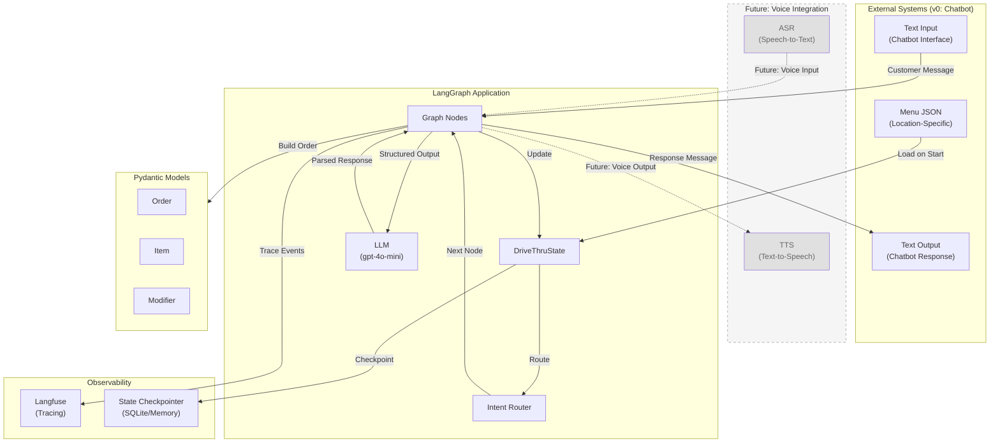

---

## State Schema

The `DriveThruState` TypedDict structure and its components.

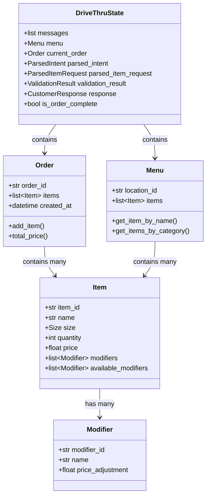

---

## Pydantic Model Relationships

Structured output models used for LLM parsing and validation.

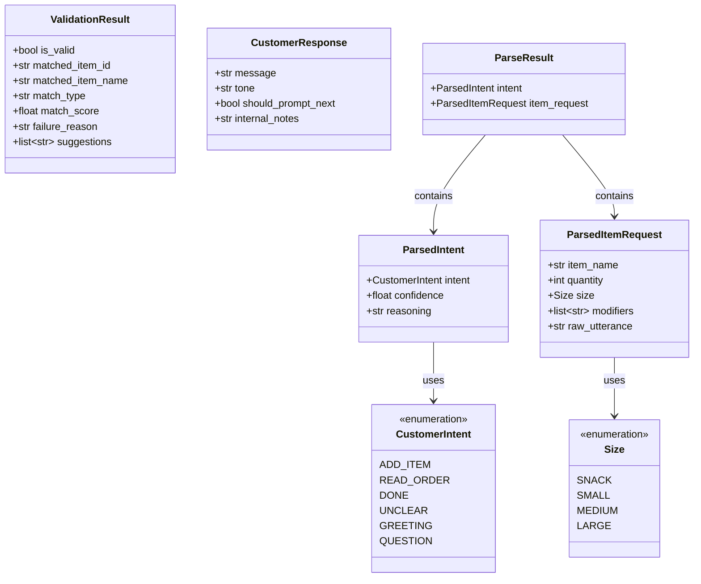

---

## Graph Architectures

### Approach 1: Simple Linear with Conditional Loop (Deprecated)

> **⚠️ DEPRECATED:** This approach will not be used. See [Approach 2](#approach-2-explicit-state-machine-v0-implementation) for the v0 implementation.

Minimal graph with single order-handling node.

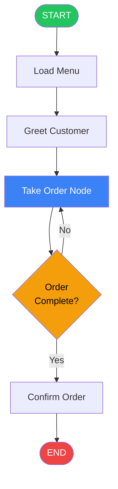

**Characteristics:**
- All logic bundled in `Take Order Node`
- Simple state transitions
- ~~Best for MVP/prototyping~~ **Not used—too limited for production requirements**

---

### Approach 2: Explicit State Machine (v0 Implementation)

> **✅ v0 IMPLEMENTATION:** This is the architecture used for v0.

Discrete, testable nodes with explicit transitions.

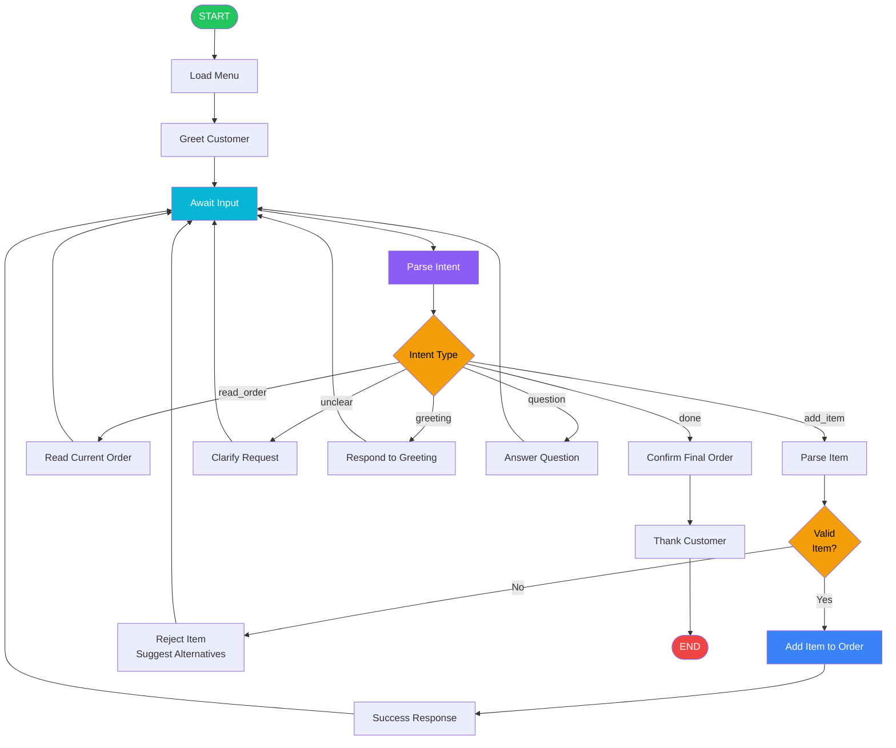

---

### Approach 3: Subgraph Pattern (Future Consideration)

> **📋 FUTURE:** This approach may be considered for future versions if validation complexity increases.

Main graph delegates validation to a dedicated subgraph.

#### Main Graph

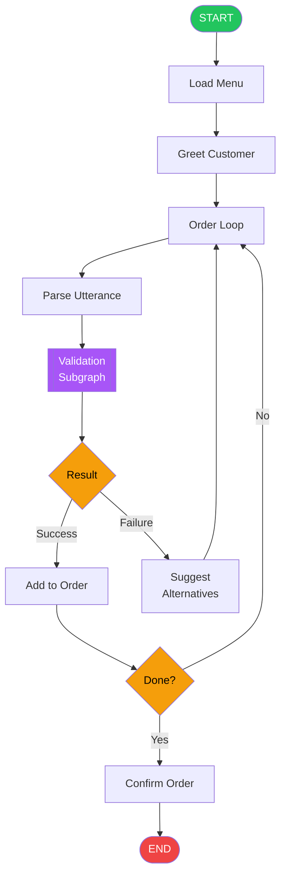

#### Validation Subgraph

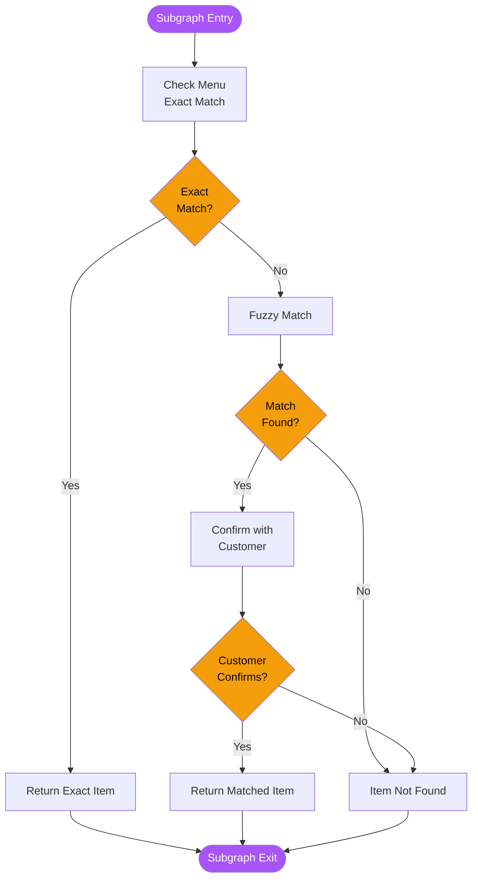

---

## Intent Routing Flow

Detailed view of how customer intents are classified and routed.

```mermaid
flowchart LR
    subgraph Input
        Utterance["Customer<br/>Utterance"]
    end

    subgraph Classification["Intent Classification (LLM)"]
        IntentParser["intent_parser<br/>.with_structured_output()"]
    end

    subgraph ParsedIntent["ParsedIntent Model"]
        Intent["intent: CustomerIntent"]
        Confidence["confidence: 0.0-1.0"]
        Reasoning["reasoning: str"]
    end

    subgraph ConfidenceCheck["Confidence Gate"]
        ConfCheck{"confidence<br/>≥ 0.7?"}
    end

    subgraph Routing["Route by Intent"]
        AddRoute["add_item → parse_item"]
        ReadRoute["read_order → read_order"]
        DoneRoute["done → confirm_order"]
        UnclearRoute["unclear → clarify"]
        GreetRoute["greeting → greet"]
        QuestionRoute["question → answer_question"]
    end

    Utterance --> IntentParser
    IntentParser --> Intent
    IntentParser --> Confidence
    IntentParser --> Reasoning

    Confidence --> ConfCheck

    ConfCheck -->|No| UnclearRoute
    ConfCheck -->|Yes| Intent

    Intent -->|ADD_ITEM| AddRoute
    Intent -->|READ_ORDER| ReadRoute
    Intent -->|DONE| DoneRoute
    Intent -->|UNCLEAR| UnclearRoute
    Intent -->|GREETING| GreetRoute
    Intent -->|QUESTION| QuestionRoute

    style IntentParser fill:#8b5cf6,color:#fff
    style ConfCheck fill:#f59e0b,color:#000
```

---

## Validation Flow

How parsed items are validated against the menu.

```mermaid
flowchart TD
    subgraph Input["Parsed Input"]
        ParsedItem["ParsedItemRequest"]
        ItemName["item_name"]
        Quantity["quantity"]
        Modifiers["modifiers[]"]
    end

    subgraph MenuValidation["Menu Validation"]
        CheckItem{"Item exists<br/>in Menu?"}
        CheckQty{"quantity ≥ 1?"}
        CheckMods{"All modifiers<br/>in available_modifiers?"}
    end

    subgraph Results["ValidationResult"]
        Valid["is_valid: true<br/>matched_item_id: '...'<br/>matched_item_name: '...'<br/>match_score: 1.0"]
        Invalid["is_valid: false<br/>failure_reason: '...'<br/>suggestions: [...]"]
    end

    ParsedItem --> ItemName
    ParsedItem --> Quantity
    ParsedItem --> Modifiers

    ItemName --> CheckItem

    CheckItem -->|No| Invalid
    CheckItem -->|Yes| CheckQty

    CheckQty -->|No| Invalid
    CheckQty -->|Yes| CheckMods

    CheckMods -->|No| Invalid
    CheckMods -->|Yes| Valid

    style CheckItem fill:#f59e0b,color:#000
    style CheckQty fill:#f59e0b,color:#000
    style CheckMods fill:#f59e0b,color:#000
    style Valid fill:#22c55e,color:#fff
    style Invalid fill:#ef4444,color:#fff
```

---

## Node Execution Sequence

Sequence diagram showing typical order flow (v0: text-based chatbot).

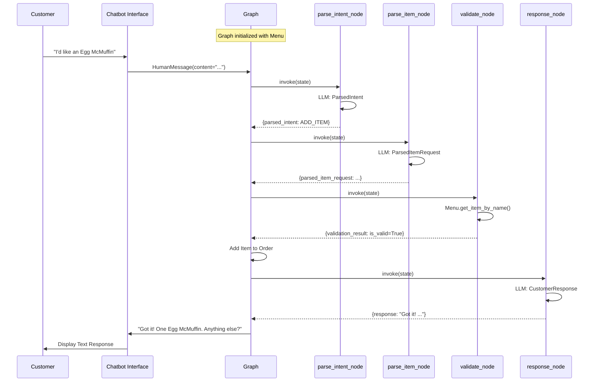

> **Future (STT/TTS):** Replace `Chatbot Interface` with ASR (Speech-to-Text) for input and TTS (Text-to-Speech) for output. The graph nodes remain unchanged—only the input/output interfaces change.

---

## Error Recovery Flow

How the system handles errors and edge cases.

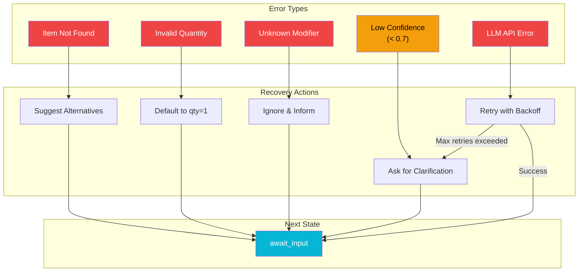

---

## Langfuse Integration

How Langfuse observability integrates with the graph.

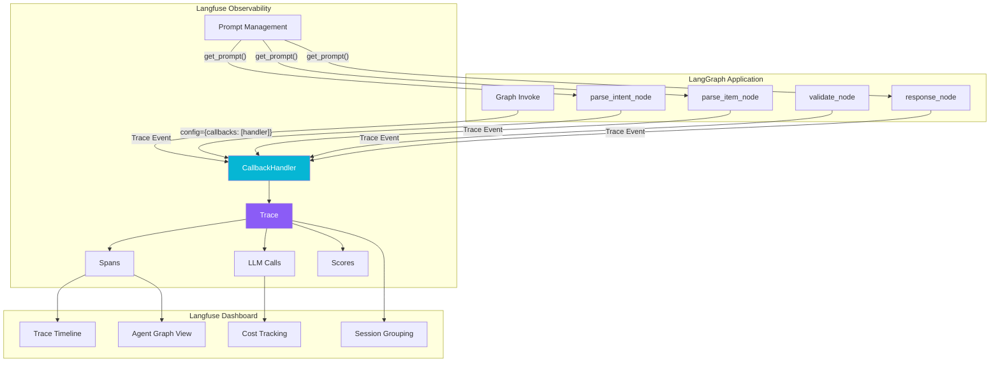

---

## Tracing Data Flow

Detailed view of what data flows through Langfuse traces.

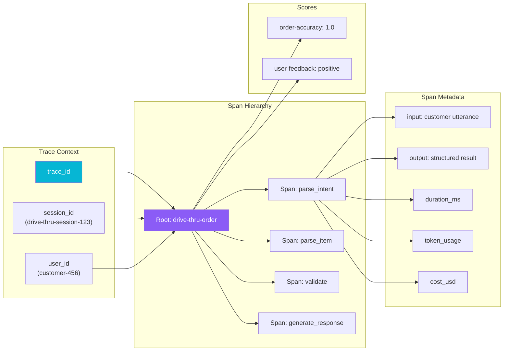

---

## Complete System State Machine

Comprehensive view of all states and transitions.

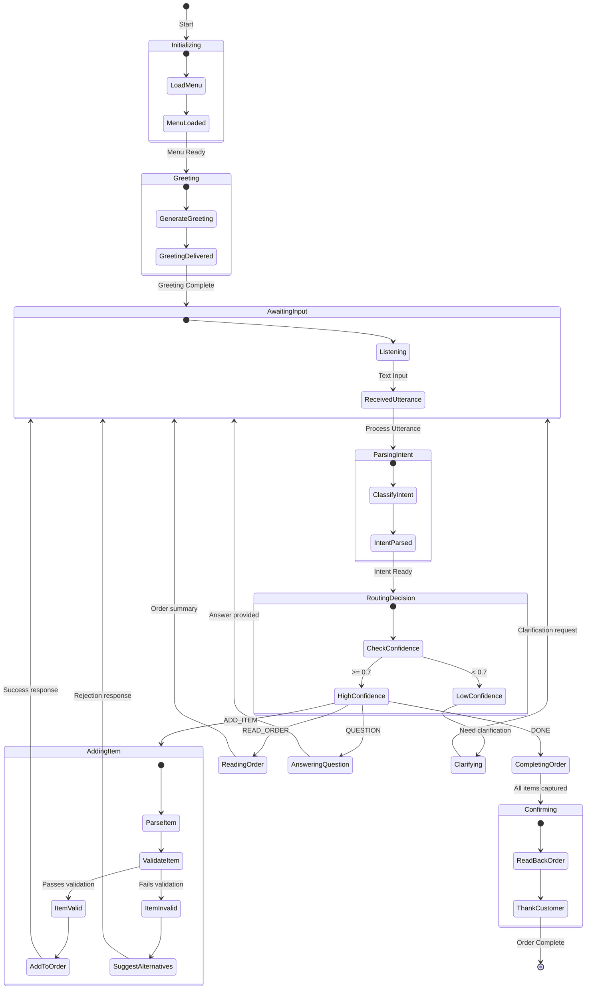

---

## Legend

| Symbol | Meaning |
|--------|---------|
| 🟢 Green | Start/Success states |
| 🔴 Red | End/Failure states |
| 🟡 Yellow/Orange | Decision points |
| 🔵 Blue | Processing nodes |
| 🟣 Purple | LLM/Subgraph operations |
| 🔵 Cyan | Waiting/Input states |
