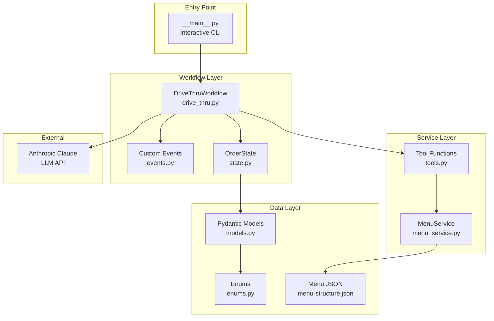
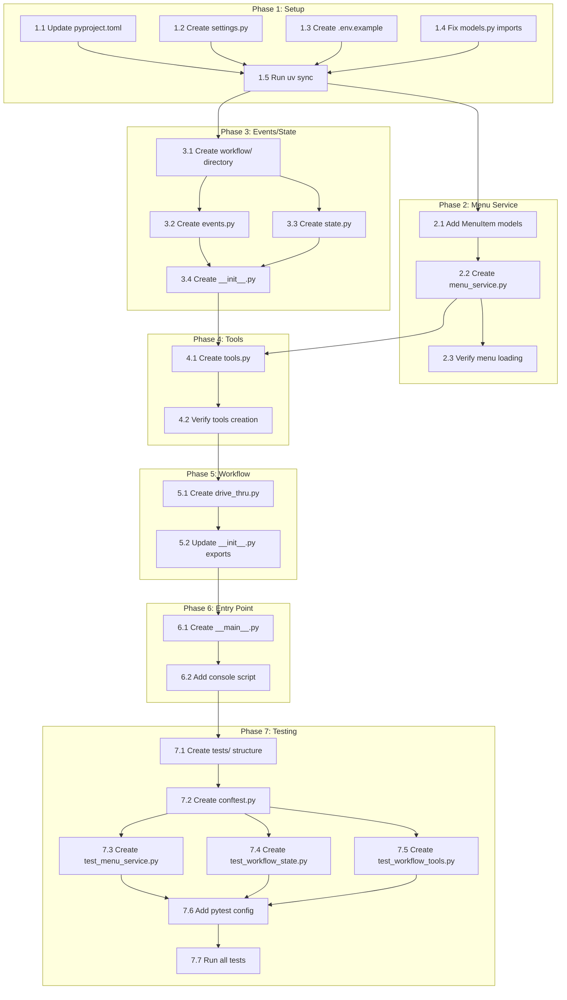

# McDonald's Drive-Thru LlamaIndex Workflow - Detailed Implementation Plan

> **Status:** READY FOR IMPLEMENTATION
> **Based on:** `plans/2026-02-02-llamaindex-drive-thru-workflow.md` (reviewed and corrected)
> **Created:** 2026-02-02

## Table of Contents

- [Overview](#overview)
- [Corrections from Original Plan](#corrections-from-original-plan)
- [Dependency Graph](#dependency-graph)
- [Parallelization Strategy](#parallelization-strategy)
- [Task Breakdown](#task-breakdown)
  - [Phase 1: Project Setup](#phase-1-project-setup)
  - [Phase 2: Menu Service](#phase-2-menu-service)
  - [Phase 3: Workflow Events and State](#phase-3-workflow-events-and-state)
  - [Phase 4: Tool Definitions](#phase-4-tool-definitions)
  - [Phase 5: Workflow Implementation](#phase-5-workflow-implementation)
  - [Phase 6: Entry Point and CLI](#phase-6-entry-point-and-cli)
  - [Phase 7: Testing](#phase-7-testing)
- [Verification Checklist](#verification-checklist)

---

## Overview

Build a text-based McDonald's drive-thru ordering system using **LlamaIndex Workflows** with Anthropic Claude. This plan provides step-by-step instructions that an agent can follow without ambiguity.

### Architecture Overview



---

## Corrections from Original Plan

The following issues were identified and corrected:

| Issue | Original | Corrected |
|-------|----------|-----------|
| **LlamaIndex package** | `llama-index-core>=0.12.0` | `llama-index>=0.14.0` (unified package) |
| **Workflow utils** | `llama-index-utils-workflow>=0.3.0` | Not needed (included in core) |
| **Ruff version** | `ruff>=0.14.14` | `ruff>=0.9.0` (0.14 doesn't exist) |
| **Missing package** | N/A | Add `llama-index-llms-anthropic>=0.10.0` |
| **Import in models.py** | `from enums import ...` | `from src.enums import ...` |
| **Context creation** | `Context[OrderState](workflow, store=OrderState())` | Use workflow's `initial_state` parameter |
| **Category mapping** | Direct string match | Case-insensitive slug-based mapping |

---

## Dependency Graph



---

## Parallelization Strategy

```mermaid
gantt
    title Implementation Timeline - Parallel Execution Opportunities
    dateFormat X
    axisFormat %s

    section Phase 1
    1.1 Update pyproject.toml     :p1_1, 0, 1
    1.2 Create settings.py        :p1_2, 0, 1
    1.3 Create .env.example       :p1_3, 0, 1
    1.4 Fix models.py imports     :p1_4, 0, 1
    1.5 Run uv sync               :p1_5, after p1_1 p1_2 p1_3 p1_4, 1

    section Phase 2
    2.1 Add MenuItem models       :p2_1, after p1_5, 1
    2.2 Create menu_service.py    :p2_2, after p2_1, 2
    2.3 Verify menu loading       :p2_3, after p2_2, 1

    section Phase 3
    3.1 Create workflow/ dir      :p3_1, after p1_5, 1
    3.2 Create events.py          :p3_2, after p3_1, 1
    3.3 Create state.py           :p3_3, after p3_1, 1
    3.4 Create __init__.py        :p3_4, after p3_2 p3_3, 1

    section Phase 4
    4.1 Create tools.py           :p4_1, after p2_3 p3_4, 2
    4.2 Verify tools              :p4_2, after p4_1, 1

    section Phase 5
    5.1 Create drive_thru.py      :p5_1, after p4_2, 3
    5.2 Update exports            :p5_2, after p5_1, 1

    section Phase 6
    6.1 Create __main__.py        :p6_1, after p5_2, 2
    6.2 Add console script        :p6_2, after p6_1, 1

    section Phase 7
    7.1-7.6 Tests                 :p7, after p6_2, 4
    7.7 Run tests                 :p7_7, after p7, 1
```



### Parallel Execution Summary

| Stage | Tasks that can run in PARALLEL |
|-------|-------------------------------|
| Stage 1 | Tasks 1.1, 1.2, 1.3, 1.4 (all independent file operations) |
| Stage 2 | Task 2.1 AND Tasks 3.1 (different files, no dependencies) |
| Stage 3 | Tasks 3.2, 3.3 (both depend on 3.1, independent of each other) |
| Stage 4 | Tasks 7.3, 7.4, 7.5 (all test files, independent) |

### Sequential Dependencies

| Task | Must wait for |
|------|---------------|
| 1.5 (uv sync) | All Phase 1 file edits |
| 2.2 (menu_service.py) | 2.1 (MenuItem models) |
| 3.4 (__init__.py) | 3.2 AND 3.3 |
| 4.1 (tools.py) | 2.3 AND 3.4 |
| 5.1 (drive_thru.py) | 4.2 |
| 7.7 (run tests) | All test files created |

---

## Task Breakdown

> **📦 Package Management Best Practice:** Always use `uv add <package>` to add new dependencies instead of manually editing pyproject.toml. This ensures you get the latest compatible versions and avoids version conflicts.

### Phase 1: Project Setup

#### Task 1.1: Update pyproject.toml

**File:** `pyproject.toml`

> **⚠️ IMPORTANT:** Use `uv add <package>` instead of manually editing pyproject.toml. This ensures you get the latest compatible versions. The content below shows the probable target state for reference, but dependencies should be added via:
> ```bash
> uv add llama-index llama-index-llms-anthropic pydantic pydantic-settings thefuzz python-Levenshtein
> uv add --group dev pre-commit ruff pytest pytest-asyncio mypy
> ```

**Action:** Replace entire file content with:

```toml
[project]
name = "mcdonalds-data-model"
version = "0.1.0"
description = "McDonald's drive-thru voice ordering data models and workflow"
readme = "README.md"
requires-python = ">=3.12"
dependencies = [
    "llama-index>=0.14.0",
    "llama-index-llms-anthropic>=0.10.0",
    "pydantic>=2.12.0",
    "pydantic-settings>=2.8.0",
    "thefuzz>=0.22.1",
    "python-Levenshtein>=0.26.0",
]

[dependency-groups]
dev = [
    "pre-commit>=4.0.0",
    "ruff>=0.9.0",
    "pytest>=8.0.0",
    "pytest-asyncio>=0.24.0",
    "mypy>=1.14.0",
]

[project.scripts]
drive-thru = "src.workflow.__main__:run"

[tool.ruff]
line-length = 88
indent-width = 4
target-version = "py312"

[tool.ruff.lint]
select = ["E4", "E7", "E9", "F", "I"]
ignore = []
fixable = ["ALL"]
unfixable = []

[tool.ruff.format]
quote-style = "double"
indent-style = "space"
skip-magic-trailing-comma = false
line-ending = "auto"

[tool.pytest.ini_options]
asyncio_mode = "auto"
asyncio_default_fixture_loop_scope = "function"
testpaths = ["tests"]
python_files = ["test_*.py"]
python_functions = ["test_*"]

[tool.mypy]
python_version = "3.12"
strict = true
ignore_missing_imports = true
```

**Verification:**
```bash
# File should exist and be valid TOML
uv run python -c "import tomllib; tomllib.load(open('pyproject.toml', 'rb'))"
```

---

#### Task 1.2: Create settings.py

**File:** `src/settings.py`

**Action:** Create new file with:

```python
"""Application settings loaded from environment variables."""

from pydantic_settings import BaseSettings


class Settings(BaseSettings):
    """Application settings loaded from environment variables."""

    anthropic_api_key: str = ""

    # Model configuration
    model_name: str = "claude-sonnet-4-20250514"
    model_temperature: float = 0.3

    # Menu configuration
    menu_path: str = "menus/raw-data/menu-structure-2026-01-30.json"

    model_config = {
        "env_file": ".env",
        "env_file_encoding": "utf-8",
        "extra": "ignore",
    }


settings = Settings()
```

**Verification:**
```bash
uv run python -c "from src.settings import settings; print('Settings loaded')"
```

---

#### Task 1.3: Create .env.example

**File:** `.env.example`

**Action:** Create new file with:

```
# Required: Your Anthropic API key
ANTHROPIC_API_KEY=your-api-key-here

# Optional: Override defaults
# MODEL_NAME=claude-sonnet-4-20250514
# MODEL_TEMPERATURE=0.3
# MENU_PATH=menus/raw-data/menu-structure-2026-01-30.json
```

**Verification:** File exists.

---

#### Task 1.4: Fix models.py imports

**File:** `src/models.py`

**Action:** Change line 2 from:
```python
from enums import Size, CategoryName
```
to:
```python
from src.enums import Size, CategoryName
```

**Verification:**
```bash
uv run python -c "from src.models import Item, Order; print('Models import OK')"
```

---

#### Task 1.5: Install dependencies

**Action:** If you used `uv add` commands in Task 1.1 (recommended), dependencies are already installed. Otherwise, run:
```bash
uv sync
```

> **Note:** When adding dependencies in the future, always use `uv add <package>` rather than editing pyproject.toml directly. This ensures compatibility with the latest package versions.

**Verification:**
```bash
uv run python -c "from llama_index.core.workflow import Workflow; print('LlamaIndex OK')"
uv run python -c "from llama_index.llms.anthropic import Anthropic; print('Anthropic OK')"
uv run python -c "from thefuzz import fuzz; print('thefuzz OK')"
```

---

### Phase 2: Menu Service

#### Task 2.1: Add MenuItem models to models.py

**File:** `src/models.py`

**Action:** Add after the existing `Order` class (before the commented `Combo` class):

```python
from typing import Any


class MenuItemOption(BaseModel):
    """An option for a menu item (size, flavor, etc.)."""

    option_type: str  # "substitute" or "addon"
    choices: list[str | int]


class MenuItem(BaseModel):
    """A menu item as defined in the restaurant's menu."""

    name: str
    category: str
    available_as_base: bool = True
    defaults: dict[str, Any] = Field(default_factory=dict)
    options: dict[str, MenuItemOption] = Field(default_factory=dict)
    variations: MenuItemOption | None = None
```

**Note:** Also add `from typing import Any` at the top of the file if not present.

**Verification:**
```bash
uv run python -c "from src.models import MenuItem, MenuItemOption; print('MenuItem models OK')"
```

---

#### Task 2.2: Create menu_service.py

**File:** `src/menu_service.py`

**Action:** Create new file with:

```python
"""Menu loading and item matching service."""

from __future__ import annotations

import json
from dataclasses import dataclass
from pathlib import Path

from thefuzz import fuzz, process

from src.models import MenuItem, MenuItemOption


@dataclass
class MatchResult:
    """Result of a menu item match attempt."""

    success: bool
    menu_item: MenuItem | None = None
    matched_name: str | None = None
    score: int = 0
    error: str | None = None


class MenuService:
    """Service for loading menu and matching customer requests to menu items."""

    # Minimum fuzzy match score to consider a match (0-100)
    FUZZY_THRESHOLD = 80

    def __init__(self, menu_path: str | Path) -> None:
        """Initialize the menu service.

        Args:
            menu_path: Path to the JSON menu file.
        """
        self.menu_path = Path(menu_path)
        self._items: dict[str, MenuItem] = {}
        self._item_names: list[str] = []
        self._load_menu()

    def _load_menu(self) -> None:
        """Load menu from JSON file."""
        with open(self.menu_path, encoding="utf-8") as f:
            data = json.load(f)

        for category, items in data.get("categories", {}).items():
            for item_data in items:
                # Parse options
                options: dict[str, MenuItemOption] = {}
                for opt_name, opt_data in item_data.get("options", {}).items():
                    options[opt_name] = MenuItemOption(
                        option_type=opt_data.get("type", "substitute"),
                        choices=opt_data.get("choices", []),
                    )

                # Parse variations
                variations = None
                if "variations" in item_data:
                    var_data = item_data["variations"]
                    variations = MenuItemOption(
                        option_type=var_data.get("type", "addon"),
                        choices=var_data.get("choices", []),
                    )

                menu_item = MenuItem(
                    name=item_data["name"],
                    category=category,
                    available_as_base=item_data.get("available_as_base", True),
                    defaults=item_data.get("defaults", {}),
                    options=options,
                    variations=variations,
                )

                # Store by lowercase name for case-insensitive lookup
                self._items[item_data["name"].lower()] = menu_item
                self._item_names.append(item_data["name"])

    def get_item(self, name: str) -> MenuItem | None:
        """Get menu item by exact name (case-insensitive).

        Args:
            name: The item name to look up.

        Returns:
            The MenuItem if found, None otherwise.
        """
        return self._items.get(name.lower())

    def match_item(self, query: str) -> MatchResult:
        """Match a customer query to a menu item.

        Uses strict matching first, then falls back to fuzzy matching.

        Args:
            query: The customer's item request (e.g., "Big Mac", "bigmac").

        Returns:
            MatchResult with success=True if found, False otherwise.
        """
        query_lower = query.lower().strip()

        # Try exact match first
        if query_lower in self._items:
            item = self._items[query_lower]
            return MatchResult(
                success=True,
                menu_item=item,
                matched_name=item.name,
                score=100,
            )

        # Try fuzzy match
        if not self._item_names:
            return MatchResult(success=False, error="Menu is empty")

        best_match = process.extractOne(
            query, self._item_names, scorer=fuzz.token_sort_ratio
        )

        if best_match and best_match[1] >= self.FUZZY_THRESHOLD:
            matched_name = best_match[0]
            item = self._items[matched_name.lower()]
            return MatchResult(
                success=True,
                menu_item=item,
                matched_name=matched_name,
                score=best_match[1],
            )

        return MatchResult(
            success=False,
            error=f"'{query}' is not on our menu. Please choose from our available items.",
        )

    def list_categories(self) -> list[str]:
        """List all unique menu categories.

        Returns:
            List of category names.
        """
        return list(set(item.category for item in self._items.values()))

    def list_items_in_category(self, category: str) -> list[str]:
        """List all item names in a category.

        Args:
            category: The category name (case-insensitive).

        Returns:
            List of item names in that category.
        """
        return [
            item.name
            for item in self._items.values()
            if item.category.lower() == category.lower()
        ]

    @property
    def item_count(self) -> int:
        """Number of items in the menu."""
        return len(self._items)
```

**Verification:**
```bash
uv run python -c "
from src.menu_service import MenuService
m = MenuService('menus/raw-data/menu-structure-2026-01-30.json')
print(f'Loaded {m.item_count} items')
assert m.item_count == 101, f'Expected 101 items, got {m.item_count}'
"
```

---

#### Task 2.3: Verify menu matching

**Action:** Run verification tests:

```bash
uv run python -c "
from src.menu_service import MenuService
m = MenuService('menus/raw-data/menu-structure-2026-01-30.json')

# Test exact match
r1 = m.match_item('Big Mac')
assert r1.success, 'Exact match failed'
assert r1.matched_name == 'Big Mac', f'Expected Big Mac, got {r1.matched_name}'
print('✓ Exact match: Big Mac')

# Test case-insensitive
r2 = m.match_item('big mac')
assert r2.success, 'Case-insensitive match failed'
print('✓ Case-insensitive: big mac')

# Test fuzzy match
r3 = m.match_item('bigmac')
assert r3.success, 'Fuzzy match failed'
print(f'✓ Fuzzy match: bigmac -> {r3.matched_name} (score: {r3.score})')

# Test invalid item
r4 = m.match_item('tacos')
assert not r4.success, 'Should reject tacos'
print('✓ Invalid item rejected: tacos')

print('All menu service tests passed!')
"
```

---

### Phase 3: Workflow Events and State

#### Task 3.1: Create workflow directory

**Action:** Create directory `src/workflow/`

```bash
mkdir -p src/workflow
```

---

#### Task 3.2: Create events.py

**File:** `src/workflow/events.py`

**Action:** Create new file with:

```python
"""Custom events for the drive-thru ordering workflow."""

from llama_index.core.workflow import Event
from pydantic import Field

from src.models import Item


class OrderUpdatedEvent(Event):
    """Event indicating the order has been updated."""

    items_added: list[Item] = Field(default_factory=list, description="Items added to order")
    message: str = Field(default="", description="Message to relay to customer")


class OrderCompleteEvent(Event):
    """Event indicating customer is done ordering."""

    pass
```

**Verification:**
```bash
uv run python -c "from src.workflow.events import OrderUpdatedEvent, OrderCompleteEvent; print('Events OK')"
```

---

#### Task 3.3: Create state.py

**File:** `src/workflow/state.py`

**Action:** Create new file with:

```python
"""Workflow state definitions."""

from pydantic import BaseModel, Field

from src.models import Item


class OrderState(BaseModel):
    """Typed state for the drive-thru ordering workflow.

    All fields must have defaults for LlamaIndex Context compatibility.
    """

    # Conversation state
    is_greeted: bool = Field(default=False, description="Whether customer has been greeted")
    is_complete: bool = Field(default=False, description="Whether ordering is finished")
    turn_count: int = Field(default=0, description="Number of conversation turns")

    # Order state
    current_order: list[Item] = Field(default_factory=list, description="Items in the order")

    # Conversation history (for context to LLM)
    conversation_history: list[dict[str, str]] = Field(
        default_factory=list,
        description="List of {'role': 'user'|'assistant', 'content': str}",
    )

    def add_message(self, role: str, content: str) -> None:
        """Add a message to conversation history."""
        self.conversation_history.append({"role": role, "content": content})

    def get_order_summary(self) -> str:
        """Generate a summary of the current order."""
        if not self.current_order:
            return "No items in order."

        lines = []
        for item in self.current_order:
            size_str = item.size.value if hasattr(item.size, "value") else str(item.size)
            lines.append(f"  - {item.quantity}x {item.name} ({size_str})")
        return "\n".join(lines)
```

**Verification:**
```bash
uv run python -c "
from src.workflow.state import OrderState
s = OrderState()
assert s.is_greeted is False
assert s.turn_count == 0
assert len(s.current_order) == 0
s.add_message('assistant', 'Hello')
assert len(s.conversation_history) == 1
print('OrderState OK')
"
```

---

#### Task 3.4: Create workflow __init__.py

**File:** `src/workflow/__init__.py`

**Action:** Create new file with:

```python
"""McDonald's drive-thru ordering workflow using LlamaIndex."""

from src.workflow.events import OrderCompleteEvent, OrderUpdatedEvent
from src.workflow.state import OrderState

__all__ = [
    "OrderCompleteEvent",
    "OrderState",
    "OrderUpdatedEvent",
]
```

**Verification:**
```bash
uv run python -c "from src.workflow import OrderState, OrderUpdatedEvent; print('Workflow package OK')"
```

---

### Phase 4: Tool Definitions

#### Task 4.1: Create tools.py

**File:** `src/workflow/tools.py`

**Action:** Create new file with:

```python
"""Tools for the drive-thru ordering workflow."""

from __future__ import annotations

from llama_index.core.tools import FunctionTool

from src.enums import CategoryName, Size
from src.menu_service import MenuService


def create_tools(menu_service: MenuService) -> list[FunctionTool]:
    """Create workflow tools with the given menu service.

    Args:
        menu_service: The menu service instance to use for validation.

    Returns:
        List of FunctionTool instances for the workflow.
    """

    # Category name mapping: JSON category names to enum values
    # JSON uses "Beef & Pork", enum uses "beef-pork"
    category_mapping: dict[str, CategoryName] = {
        "breakfast": CategoryName.BREAKFAST,
        "beef & pork": CategoryName.BEEF_PORK,
        "chicken & fish": CategoryName.CHICKEN_FISH,
        "salads": CategoryName.SALADS,
        "snacks & sides": CategoryName.SNACKS_SIDES,
        "desserts": CategoryName.DESSERTS,
        "beverages": CategoryName.BEVERAGES,
        "coffee & tea": CategoryName.COFFEE_TEA,
        "smoothies & shakes": CategoryName.SMOOTHIES_SHAKES,
    }

    def validate_menu_item(
        item_name: str,
        size: str = "medium",
        quantity: int = 1,
    ) -> dict:
        """Validate if an item exists in the McDonald's menu.

        Use this tool whenever a customer mentions an item they want to order.
        Returns validation result with item details if valid.

        Args:
            item_name: The name of the menu item to validate (e.g., "Big Mac", "fries")
            size: Size of the item: snack, small, medium, or large. Default is medium.
            quantity: Number of this item to order. Must be at least 1. Default is 1.

        Returns:
            Dictionary with validation result including:
            - valid: Whether the item is on the menu
            - item_name: The official menu item name if valid
            - category: The menu category
            - size: The requested size
            - quantity: The requested quantity
            - error: Error message if invalid
        """
        result = menu_service.match_item(item_name)

        if not result.success:
            return {
                "valid": False,
                "error": result.error,
                "suggestion": "Please ask the customer to choose a different item.",
            }

        # Validate size
        try:
            size_enum = Size(size.lower())
        except ValueError:
            return {
                "valid": False,
                "error": f"Invalid size '{size}'. Valid sizes are: snack, small, medium, large.",
                "suggestion": "Ask the customer what size they would like.",
            }

        # Map category string to enum (case-insensitive)
        menu_item = result.menu_item
        category_key = menu_item.category.lower() if menu_item else ""
        category = category_mapping.get(category_key, CategoryName.SNACKS_SIDES)

        return {
            "valid": True,
            "item_name": result.matched_name,
            "category": category.value,
            "size": size_enum.value,
            "quantity": quantity,
            "match_score": result.score,
            "message": f"Found '{result.matched_name}' on the menu.",
        }

    def get_menu_categories() -> dict:
        """Get the list of available menu categories.

        Use this when a customer asks what's on the menu or what categories are available.

        Returns:
            Dictionary with list of category names.
        """
        return {"categories": menu_service.list_categories()}

    def get_items_in_category(category: str) -> dict:
        """Get all items in a specific menu category.

        Use this when a customer asks what items are in a category
        (e.g., "what breakfast items do you have?").

        Args:
            category: The category name to list items from (e.g., "Breakfast", "Beverages")

        Returns:
            Dictionary with list of items in the category, or error if category not found.
        """
        items = menu_service.list_items_in_category(category)

        if not items:
            return {
                "error": f"Category '{category}' not found.",
                "available_categories": menu_service.list_categories(),
            }

        return {
            "category": category,
            "items": items,
            "count": len(items),
        }

    # Create FunctionTool instances
    return [
        FunctionTool.from_defaults(fn=validate_menu_item),
        FunctionTool.from_defaults(fn=get_menu_categories),
        FunctionTool.from_defaults(fn=get_items_in_category),
    ]
```

**Verification:**
```bash
uv run python -c "
from src.workflow.tools import create_tools
from src.menu_service import MenuService
m = MenuService('menus/raw-data/menu-structure-2026-01-30.json')
tools = create_tools(m)
print(f'Created {len(tools)} tools')
assert len(tools) == 3
for t in tools:
    print(f'  - {t.metadata.name}')
"
```

---

#### Task 4.2: Verify tools functionality

**Action:** Run verification:

```bash
uv run python -c "
from src.workflow.tools import create_tools
from src.menu_service import MenuService

m = MenuService('menus/raw-data/menu-structure-2026-01-30.json')
tools = create_tools(m)

# Find validate tool
validate_tool = next(t for t in tools if t.metadata.name == 'validate_menu_item')

# Test valid item
result = validate_tool(item_name='Big Mac', size='medium', quantity=1)
assert result['valid'] is True, f'Expected valid, got {result}'
print(f'✓ Valid item: {result}')

# Test invalid item
result = validate_tool(item_name='tacos', size='medium', quantity=1)
assert result['valid'] is False
print(f'✓ Invalid item rejected')

# Test invalid size
result = validate_tool(item_name='Big Mac', size='jumbo', quantity=1)
assert result['valid'] is False
print(f'✓ Invalid size rejected')

print('All tool tests passed!')
"
```

---

### Phase 5: Workflow Implementation

#### Task 5.1: Create drive_thru.py

**File:** `src/workflow/drive_thru.py`

**Action:** Create new file with:

```python
"""Drive-thru ordering workflow implementation."""

from __future__ import annotations

from typing import Union

from llama_index.core.llms import ChatMessage
from llama_index.core.workflow import (
    Context,
    StartEvent,
    StopEvent,
    Workflow,
    step,
)
from llama_index.core.workflow.events import (
    HumanResponseEvent,
    InputRequiredEvent,
)
from llama_index.llms.anthropic import Anthropic

from src.enums import CategoryName, Size
from src.menu_service import MenuService
from src.models import Item
from src.settings import settings
from src.workflow.state import OrderState
from src.workflow.tools import create_tools


# System prompt for the order-taking agent
ORDER_AGENT_PROMPT = """You are a friendly McDonald's drive-thru employee taking orders.

Your responsibilities:
1. Greet customers warmly when they first arrive
2. Listen to their order and use the validate_menu_item tool to check each item
3. Confirm validated items and ask if they want anything else
4. When they're done, summarize the complete order

Guidelines:
- Be conversational and friendly, like a real drive-thru employee
- Process ONE item at a time - validate it before moving on
- If an item isn't on the menu, politely let them know and suggest alternatives
- If they ask about the menu, use get_menu_categories or get_items_in_category
- Always confirm what size they want if it's not specified (default to medium)
- When they say "that's all", "that's it", "I'm done", "nothing else", etc., summarize their order

IMPORTANT: Always use the validate_menu_item tool to check items. Do not assume items are valid.
"""


class DriveThruWorkflow(Workflow):
    """Event-driven workflow for McDonald's drive-thru ordering."""

    def __init__(
        self,
        menu_path: str | None = None,
        **kwargs,
    ):
        """Initialize the drive-thru workflow.

        Args:
            menu_path: Optional path to menu JSON file. Uses settings default if not provided.
            **kwargs: Additional arguments passed to Workflow base class.
        """
        super().__init__(**kwargs)

        # Initialize menu service
        self.menu_service = MenuService(menu_path or settings.menu_path)

        # Initialize tools
        self.tools = create_tools(self.menu_service)

        # Initialize LLM with tools (API key from settings)
        self.llm = Anthropic(
            model=settings.model_name,
            temperature=settings.model_temperature,
            api_key=settings.anthropic_api_key,
        )

    @step
    async def start(
        self, ctx: Context, ev: StartEvent
    ) -> InputRequiredEvent:
        """Initialize workflow and greet the customer."""
        # Initialize state
        state = OrderState()
        state.is_greeted = True
        await ctx.set("state", state)

        greeting = "Welcome to McDonald's! How can I help you today?"

        # Store greeting in conversation history
        state.add_message("assistant", greeting)
        await ctx.set("state", state)

        return InputRequiredEvent(prefix=f"McDonald's: {greeting}\n\nYou: ")

    @step
    async def process_input(
        self, ctx: Context, ev: HumanResponseEvent
    ) -> Union[InputRequiredEvent, StopEvent]:
        """Process customer input and handle the ordering conversation."""
        customer_input = ev.response.strip()

        if not customer_input:
            return InputRequiredEvent(prefix="You: ")

        # Get current state
        state: OrderState = await ctx.get("state", default=OrderState())

        # Update state
        state.turn_count += 1
        state.add_message("user", customer_input)

        # Check for completion signals
        done_phrases = [
            "that's all",
            "that's it",
            "i'm done",
            "im done",
            "nothing else",
            "no thanks",
            "nope",
            "that'll be all",
            "that will be all",
            "finish",
            "complete",
            "checkout",
        ]

        if any(phrase in customer_input.lower() for phrase in done_phrases):
            return await self._generate_summary(ctx, state)

        # Safety limit on turns
        if state.turn_count > 20:
            return await self._generate_summary(ctx, state)

        # Build messages for LLM
        messages = [ChatMessage(role="system", content=ORDER_AGENT_PROMPT)]
        for msg in state.conversation_history:
            messages.append(ChatMessage(role=msg["role"], content=msg["content"]))

        # Call LLM with tools
        response = await self.llm.achat_with_tools(
            tools=self.tools,
            chat_history=messages,
        )

        # Process tool calls if any
        tool_calls = self.llm.get_tool_calls_from_response(
            response, error_on_no_tool_call=False
        )

        tool_result = None
        if tool_calls:
            # Execute tool calls
            for tool_call in tool_calls:
                tool_name = tool_call.tool_name
                tool_kwargs = tool_call.tool_kwargs

                # Find and execute the tool
                for tool in self.tools:
                    if tool.metadata.name == tool_name:
                        tool_result = tool(**tool_kwargs)

                        # If validation succeeded, add item to order
                        if (
                            tool_name == "validate_menu_item"
                            and isinstance(tool_result, dict)
                            and tool_result.get("valid")
                        ):
                            # Create Item from validation result
                            item = Item(
                                item_id=f"item_{len(state.current_order) + 1}",
                                name=tool_result["item_name"],
                                category_name=CategoryName(tool_result["category"]),
                                size=Size(tool_result["size"]),
                                quantity=tool_result["quantity"],
                            )
                            state.current_order.append(item)
                        break

            # Get follow-up response from LLM with tool result
            messages.append(
                ChatMessage(role="assistant", content=str(response.message.content))
            )
            if tool_result is not None:
                messages.append(ChatMessage(role="tool", content=str(tool_result)))

            follow_up = await self.llm.achat(messages)
            agent_response = str(follow_up.message.content)
        else:
            agent_response = str(response.message.content)

        # Store response in conversation history
        state.add_message("assistant", agent_response)
        await ctx.set("state", state)

        # Continue the conversation
        order_count = len(state.current_order)
        order_status = f"[Order: {order_count} item(s)]" if order_count > 0 else ""
        return InputRequiredEvent(
            prefix=f"McDonald's: {agent_response}\n{order_status}\n\nYou: "
        )

    async def _generate_summary(
        self, ctx: Context, state: OrderState
    ) -> StopEvent:
        """Generate the final order summary."""
        if not state.current_order:
            summary = (
                "It looks like you didn't order anything today. "
                "No problem! Come back anytime when you're ready to order. "
                "Thank you for visiting McDonald's!"
            )
        else:
            items_text = state.get_order_summary()
            summary = (
                f"Let me read back your order:\n{items_text}\n\n"
                "Thank you for choosing McDonald's! "
                "Please pull forward to the first window."
            )

        # Update state
        state.is_complete = True
        state.add_message("assistant", summary)
        await ctx.set("state", state)

        return StopEvent(result=f"McDonald's: {summary}")
```

**Verification:**
```bash
uv run python -c "from src.workflow.drive_thru import DriveThruWorkflow; print('DriveThruWorkflow OK')"
```

---

#### Task 5.2: Update workflow __init__.py

**File:** `src/workflow/__init__.py`

**Action:** Replace content with:

```python
"""McDonald's drive-thru ordering workflow using LlamaIndex."""

from src.workflow.drive_thru import DriveThruWorkflow
from src.workflow.events import OrderCompleteEvent, OrderUpdatedEvent
from src.workflow.state import OrderState

__all__ = [
    "DriveThruWorkflow",
    "OrderCompleteEvent",
    "OrderState",
    "OrderUpdatedEvent",
]
```

**Verification:**
```bash
uv run python -c "from src.workflow import DriveThruWorkflow, OrderState; print('Workflow exports OK')"
```

---

### Phase 6: Entry Point and CLI

#### Task 6.1: Create __main__.py

**File:** `src/workflow/__main__.py`

**Action:** Create new file with:

```python
"""Interactive CLI for testing the drive-thru workflow."""

from __future__ import annotations

import asyncio
import sys

from llama_index.core.workflow import Context
from llama_index.core.workflow.events import (
    HumanResponseEvent,
    InputRequiredEvent,
)

from src.workflow.drive_thru import DriveThruWorkflow
from src.workflow.state import OrderState


async def main() -> None:
    """Run interactive drive-thru ordering session."""
    print("=" * 50)
    print("McDonald's Drive-Thru Ordering System")
    print("=" * 50)
    print("Type 'quit' to exit\n")

    # Create workflow with timeout (5 minutes)
    workflow = DriveThruWorkflow(timeout=300, verbose=False)

    # Create context
    ctx = Context(workflow)

    # Start the workflow
    handler = workflow.run(ctx=ctx)

    # Process events
    async for event in handler.stream_events():
        if isinstance(event, InputRequiredEvent):
            # Print the prompt and get user input
            print(event.prefix, end="", flush=True)

            try:
                user_input = input().strip()
            except (KeyboardInterrupt, EOFError):
                print("\n\nGoodbye!")
                await handler.cancel_run()
                return

            if user_input.lower() == "quit":
                print("\nGoodbye!")
                await handler.cancel_run()
                return

            # Send user response back to workflow
            handler.ctx.send_event(HumanResponseEvent(response=user_input))

    # Get final result
    try:
        result = await handler
        print(f"\n{result}")
    except Exception as e:
        print(f"\nWorkflow ended: {e}")


def run() -> None:
    """Entry point for the CLI."""
    try:
        asyncio.run(main())
    except KeyboardInterrupt:
        print("\n\nGoodbye!")
        sys.exit(0)


if __name__ == "__main__":
    run()
```

**Verification:**
```bash
uv run python -c "from src.workflow.__main__ import run; print('CLI entry point OK')"
```

---

#### Task 6.2: Verify console script

**Action:** The console script was already added in Task 1.1. Verify it works:

```bash
# This should show help or start the CLI (requires API key)
uv run drive-thru --help 2>/dev/null || echo "Script registered (requires API key to run)"
```

---

### Phase 7: Testing

#### Task 7.1: Create tests directory structure

**Action:**
```bash
mkdir -p tests
touch tests/__init__.py
```

---

#### Task 7.2: Create conftest.py

**File:** `tests/conftest.py`

**Action:** Create new file with:

```python
"""Shared test fixtures."""

import pytest

from src.menu_service import MenuService


@pytest.fixture
def menu_service() -> MenuService:
    """Create a MenuService instance for testing."""
    return MenuService("menus/raw-data/menu-structure-2026-01-30.json")


@pytest.fixture
def sample_menu_items() -> list[str]:
    """Common menu items for testing."""
    return [
        "Big Mac",
        "Quarter Pounder with Cheese",
        "Chicken McNuggets",
        "French Fries",
        "Coca-Cola",
    ]
```

---

#### Task 7.3: Create test_menu_service.py

**File:** `tests/test_menu_service.py`

**Action:** Create new file with:

```python
"""Tests for the menu service."""

import pytest

from src.menu_service import MatchResult, MenuService


class TestMenuService:
    """Tests for MenuService class."""

    def test_load_menu(self, menu_service: MenuService) -> None:
        """Test menu loads successfully."""
        assert menu_service.item_count > 0
        assert menu_service.item_count == 101  # From metadata

    def test_exact_match(self, menu_service: MenuService) -> None:
        """Test exact item name matching."""
        result = menu_service.match_item("Big Mac")
        assert result.success
        assert result.matched_name == "Big Mac"
        assert result.score == 100

    def test_case_insensitive_match(self, menu_service: MenuService) -> None:
        """Test case-insensitive matching."""
        result = menu_service.match_item("big mac")
        assert result.success
        assert result.matched_name == "Big Mac"

    def test_fuzzy_match(self, menu_service: MenuService) -> None:
        """Test fuzzy matching for typos."""
        result = menu_service.match_item("bigmac")
        assert result.success
        assert result.matched_name == "Big Mac"
        assert result.score >= 80

    def test_fuzzy_match_partial(self, menu_service: MenuService) -> None:
        """Test fuzzy matching for partial names."""
        result = menu_service.match_item("quarter pounder cheese")
        assert result.success
        assert "Quarter Pounder" in (result.matched_name or "")

    def test_invalid_item(self, menu_service: MenuService) -> None:
        """Test that invalid items return failure."""
        result = menu_service.match_item("tacos")
        assert not result.success
        assert result.error is not None
        assert "not on our menu" in result.error

    def test_invalid_item_sushi(self, menu_service: MenuService) -> None:
        """Test another invalid item."""
        result = menu_service.match_item("sushi roll")
        assert not result.success

    def test_list_categories(self, menu_service: MenuService) -> None:
        """Test listing menu categories."""
        categories = menu_service.list_categories()
        assert len(categories) == 9
        assert "Breakfast" in categories
        assert "Beef & Pork" in categories

    def test_list_items_in_category(self, menu_service: MenuService) -> None:
        """Test listing items in a category."""
        items = menu_service.list_items_in_category("Breakfast")
        assert len(items) > 0
        assert "Egg McMuffin" in items

    def test_list_items_invalid_category(self, menu_service: MenuService) -> None:
        """Test listing items for invalid category."""
        items = menu_service.list_items_in_category("Nonexistent")
        assert len(items) == 0


class TestMatchResult:
    """Tests for MatchResult dataclass."""

    def test_success_result(self) -> None:
        """Test creating a success result."""
        result = MatchResult(
            success=True,
            matched_name="Big Mac",
            score=100,
        )
        assert result.success
        assert result.error is None

    def test_failure_result(self) -> None:
        """Test creating a failure result."""
        result = MatchResult(
            success=False,
            error="Item not found",
        )
        assert not result.success
        assert result.matched_name is None
```

---

#### Task 7.4: Create test_workflow_state.py

**File:** `tests/test_workflow_state.py`

**Action:** Create new file with:

```python
"""Tests for workflow state handling."""

from src.enums import CategoryName, Size
from src.models import Item
from src.workflow.state import OrderState


class TestOrderState:
    """Tests for OrderState."""

    def test_initial_state(self) -> None:
        """Test creating initial state."""
        state = OrderState()
        assert state.is_greeted is False
        assert state.is_complete is False
        assert state.turn_count == 0
        assert len(state.current_order) == 0
        assert len(state.conversation_history) == 0

    def test_add_message(self) -> None:
        """Test adding messages to conversation history."""
        state = OrderState()
        state.add_message("assistant", "Welcome!")
        state.add_message("user", "I want a Big Mac")

        assert len(state.conversation_history) == 2
        assert state.conversation_history[0]["role"] == "assistant"
        assert state.conversation_history[1]["content"] == "I want a Big Mac"

    def test_state_with_order(self) -> None:
        """Test state with items in order."""
        item = Item(
            item_id="item_1",
            name="Big Mac",
            category_name=CategoryName.BEEF_PORK,
            size=Size.MEDIUM,
            quantity=1,
        )
        state = OrderState(current_order=[item])

        assert len(state.current_order) == 1
        assert state.current_order[0].name == "Big Mac"

    def test_get_order_summary_empty(self) -> None:
        """Test order summary with no items."""
        state = OrderState()
        summary = state.get_order_summary()
        assert summary == "No items in order."

    def test_get_order_summary_with_items(self) -> None:
        """Test order summary with items."""
        items = [
            Item(
                item_id="item_1",
                name="Big Mac",
                category_name=CategoryName.BEEF_PORK,
                size=Size.MEDIUM,
                quantity=1,
            ),
            Item(
                item_id="item_2",
                name="French Fries",
                category_name=CategoryName.SNACKS_SIDES,
                size=Size.LARGE,
                quantity=2,
            ),
        ]
        state = OrderState(current_order=items)
        summary = state.get_order_summary()

        assert "Big Mac" in summary
        assert "French Fries" in summary
        assert "2x" in summary
```

---

#### Task 7.5: Create test_workflow_tools.py

**File:** `tests/test_workflow_tools.py`

**Action:** Create new file with:

```python
"""Tests for workflow tools."""

import pytest

from src.menu_service import MenuService
from src.workflow.tools import create_tools


@pytest.fixture
def tools(menu_service: MenuService):
    """Create tools for testing."""
    return create_tools(menu_service)


@pytest.fixture
def validate_tool(tools):
    """Get the validate_menu_item tool."""
    for tool in tools:
        if tool.metadata.name == "validate_menu_item":
            return tool
    pytest.fail("validate_menu_item tool not found")


@pytest.fixture
def categories_tool(tools):
    """Get the get_menu_categories tool."""
    for tool in tools:
        if tool.metadata.name == "get_menu_categories":
            return tool
    pytest.fail("get_menu_categories tool not found")


@pytest.fixture
def items_tool(tools):
    """Get the get_items_in_category tool."""
    for tool in tools:
        if tool.metadata.name == "get_items_in_category":
            return tool
    pytest.fail("get_items_in_category tool not found")


class TestValidateMenuItem:
    """Tests for validate_menu_item tool."""

    def test_valid_item(self, validate_tool) -> None:
        """Test validating a valid menu item."""
        result = validate_tool(
            item_name="Big Mac",
            size="medium",
            quantity=1,
        )
        assert result["valid"] is True
        assert result["item_name"] == "Big Mac"

    def test_valid_item_with_size(self, validate_tool) -> None:
        """Test validating item with specific size."""
        result = validate_tool(
            item_name="Coca-Cola",
            size="large",
            quantity=1,
        )
        assert result["valid"] is True
        assert result["size"] == "large"

    def test_invalid_item(self, validate_tool) -> None:
        """Test validating an invalid item."""
        result = validate_tool(
            item_name="tacos",
            size="medium",
            quantity=1,
        )
        assert result["valid"] is False
        assert "error" in result

    def test_invalid_size(self, validate_tool) -> None:
        """Test validating with invalid size."""
        result = validate_tool(
            item_name="Big Mac",
            size="extra-jumbo",
            quantity=1,
        )
        assert result["valid"] is False
        assert "Invalid size" in result["error"]

    def test_fuzzy_match(self, validate_tool) -> None:
        """Test fuzzy matching works through tool."""
        result = validate_tool(
            item_name="mcnuggets",
            size="medium",
            quantity=1,
        )
        assert result["valid"] is True
        assert "McNuggets" in result["item_name"]


class TestGetMenuCategories:
    """Tests for get_menu_categories tool."""

    def test_returns_categories(self, categories_tool) -> None:
        """Test that categories are returned."""
        result = categories_tool()
        assert "categories" in result
        assert len(result["categories"]) > 0


class TestGetItemsInCategory:
    """Tests for get_items_in_category tool."""

    def test_valid_category(self, items_tool) -> None:
        """Test getting items from valid category."""
        result = items_tool(category="Breakfast")
        assert "items" in result
        assert len(result["items"]) > 0

    def test_invalid_category(self, items_tool) -> None:
        """Test getting items from invalid category."""
        result = items_tool(category="Nonexistent")
        assert "error" in result
```

---

#### Task 7.6: Verify pytest configuration

**Action:** The pytest configuration was already added in Task 1.1. Verify syntax is correct:

```bash
uv run python -c "import tomllib; c = tomllib.load(open('pyproject.toml', 'rb')); print('pytest config:', c.get('tool', {}).get('pytest', {}))"
```

---

#### Task 7.7: Run all tests

**Action:**
```bash
uv run pytest tests/ -v
```

**Expected:** All tests pass.

---

## Verification Checklist

### Phase 1: Setup
- [ ] `pyproject.toml` updated with correct dependencies
- [ ] `uv sync` completes without errors
- [ ] `src/settings.py` created and imports correctly
- [ ] `.env.example` created
- [ ] `src/models.py` import fixed

### Phase 2: Menu Service
- [ ] `MenuService` loads 101 items
- [ ] Exact match works ("Big Mac")
- [ ] Fuzzy match works ("bigmac")
- [ ] Invalid items rejected ("tacos")

### Phase 3: Events and State
- [ ] `OrderState` can be instantiated
- [ ] `add_message()` works correctly
- [ ] `get_order_summary()` returns correct format

### Phase 4: Tools
- [ ] Three tools created
- [ ] `validate_menu_item` validates correctly
- [ ] Category mapping works (Beef & Pork -> beef-pork)

### Phase 5: Workflow
- [ ] `DriveThruWorkflow` imports without errors
- [ ] Workflow initializes with menu service and LLM

### Phase 6: Entry Point
- [ ] `src/workflow/__main__.py` created
- [ ] `drive-thru` console script registered

### Phase 7: Testing
- [ ] All unit tests pass
- [ ] Test coverage for menu service, state, and tools

### Manual Testing (requires API key)
- [ ] `.env` file created with valid `ANTHROPIC_API_KEY`
- [ ] `uv run drive-thru` starts interactive session
- [ ] Greeting appears: "Welcome to McDonald's!"
- [ ] Valid order works: "I want a Big Mac"
- [ ] Invalid order rejected: "I want tacos"
- [ ] Order completion: "That's all" shows summary

---

## References

- [LlamaIndex Workflows Documentation](https://developers.llamaindex.ai/python/llamaagents/workflows/)
- [LlamaIndex Human-in-the-Loop](https://developers.llamaindex.ai/python/framework/understanding/agent/human_in_the_loop/)
- [LlamaIndex State Management](https://developers.llamaindex.ai/python/llamaagents/workflows/managing_state/)
- [LlamaIndex Anthropic Integration](https://docs.llamaindex.ai/en/stable/examples/llm/anthropic/)
- [thefuzz Library](https://github.com/seatgeek/thefuzz)
