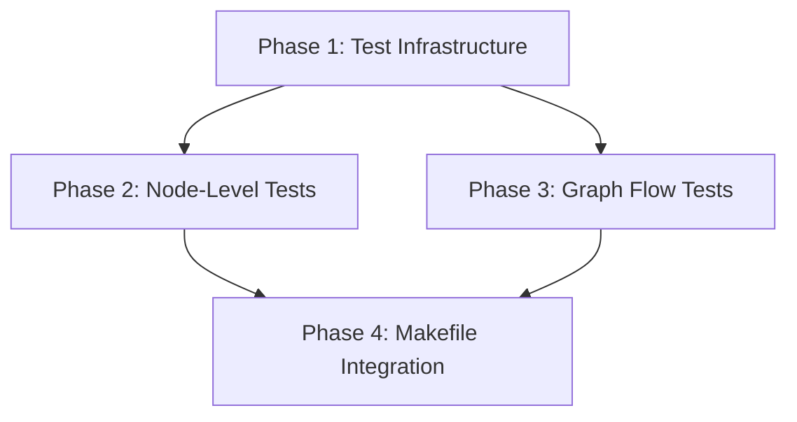
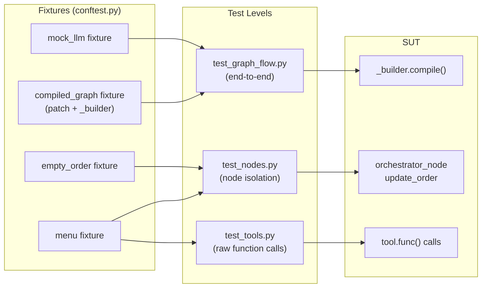

<!-- modified: 2026-02-11 -->

# LangGraph Testing Setup — Implementation Plan

> **Status:** DRAFT

## Table of Contents

- [Overview](#overview)
- [Current State Analysis](#current-state-analysis)
- [Desired End State](#desired-end-state)
- [What We're NOT Doing](#what-were-not-doing)
- [File Inventory](#file-inventory)
- [Implementation Approach](#implementation-approach)
- [Dependencies](#dependencies)
- [Phase 1: Test Infrastructure](#phase-1-test-infrastructure)
- [Phase 2: Node-Level Tests](#phase-2-node-level-tests)
- [Phase 3: Graph Flow Tests](#phase-3-graph-flow-tests)
- [Phase 4: Makefile Integration](#phase-4-makefile-integration)
- [Testing Strategy](#testing-strategy)
- [References](#references)

## Overview

Set up a comprehensive LangGraph testing suite for the McDonald's drive-thru orchestrator graph. The graph is a 4-node loop (`orchestrator` → `tools` → `update_order` → loop back) using `DriveThruState`. Tests will cover individual nodes, conditional routing, partial graph execution, and end-to-end flows with mocked LLM responses.

The project already has basic smoke tests (`tests/orchestrator/test_smoke.py`). This plan adds proper graph-level testing following the LangGraph testing patterns: graph factory, `MemorySaver` per test, `GenericFakeChatModel` for deterministic LLM mocking, and node-level isolation.

## Current State Analysis

### Key Discoveries:
- **Existing tests** at `tests/orchestrator/test_smoke.py` — smoke tests for graph compilation, menu loading, `update_order` node, and reasoning extraction. These tests call `update_order()` directly with constructed state dicts — they do NOT test the graph flow.
- **Existing conftest** at `tests/orchestrator/conftest.py` — provides `menu` and `empty_order` fixtures.
- **Graph builder** exposed as `_builder` at `src/orchestrator/orchestrator/graph.py:399` — can be compiled with a `MemorySaver` per test (already done in `main.py:60`).
- **Module-level LLM** uses `@lru_cache` in `_get_orchestrator_llm()` at `graph.py:144` — needs to be bypassed in tests to inject `GenericFakeChatModel`. Patching `orchestrator.graph._get_orchestrator_llm` replaces the module-level name binding, so calls inside `orchestrator_node` hit the mock regardless of `@lru_cache`.
- **Tools use `InjectedState`** — `lookup_menu_item`, `add_item_to_order`, `get_current_order`, `finalize_order` all inject state params. `InjectedState` params are **stripped from the tool's input schema** — they cannot be passed via `.invoke()`. To test tool logic directly, call the underlying Python function via `tool.func()`.
- **pytest already in dev deps** at `src/orchestrator/pyproject.toml:44` — `pytest>=9.0.2`.
- **No pytest config** — no `[tool.pytest.ini_options]` in either `pyproject.toml`.

### Graph Structure:
```
START → orchestrator → [should_continue] → tools → update_order → [should_end_after_update] → orchestrator (loop) or END
                          ↓ "respond"
                         END
```

### Node Functions:
| Node | Function | Reads | Writes |
|------|----------|-------|--------|
| `orchestrator` | `orchestrator_node()` | `messages`, `menu`, `current_order` | `messages`, `reasoning` |
| `tools` | `ToolNode(_tools)` | `messages` (+ `InjectedState`) | `messages` |
| `update_order` | `update_order()` | `messages`, `menu`, `current_order` | `current_order` |

### Conditional Edges:
| Function | Input | Returns |
|----------|-------|---------|
| `should_continue()` | Last message has `tool_calls`? | `"tools"` or `"respond"` |
| `should_end_after_update()` | Recent ToolMessages contain `finalize_order`? | `"end"` or `"continue"` |

## Desired End State

A test suite at `tests/orchestrator/` that covers:

1. **Node tests** — each node function tested in isolation with constructed state
2. **Routing tests** — `should_continue` and `should_end_after_update` tested with various message patterns
3. **Graph flow tests** — end-to-end graph execution with `GenericFakeChatModel` replacing the real LLM, verifying state transitions through the full cycle
4. **Tool tests** — tool underlying functions tested directly via `.func()` calls

**Success Criteria:**
- [ ] All new tests pass: `make test SCOPE=all`
- [ ] Existing smoke tests still pass: `make test`
- [ ] No real LLM calls made during tests (no API keys needed)
- [ ] Tests run in < 10 seconds
- [ ] Fresh `MemorySaver` per graph flow test

**How to Verify:**
```bash
make test SCOPE=all
```

## What We're NOT Doing

- **Integration tests with real LLM** — no `pytest-recording`/VCR cassettes (can add later)
- **Async tests** — the graph uses sync `invoke()`, not `ainvoke()`
- **Testing Langfuse prompt fetching** — already falls back gracefully
- **Testing `main.py` CLI** — out of scope
- **Performance/load testing**

## File Inventory

| File | Action | Phase | Purpose |
|------|--------|-------|---------|
| `src/orchestrator/pyproject.toml` | MODIFY | 1 | Add pytest config section |
| `tests/orchestrator/conftest.py` | MODIFY | 1 | Add graph factory fixtures, mock LLM fixtures |
| `tests/orchestrator/test_nodes.py` | CREATE | 2 | Node-level tests (orchestrator_node, update_order, routing) |
| `tests/orchestrator/test_tools.py` | CREATE | 2 | Tool function tests via `.func()` |
| `tests/orchestrator/test_graph_flow.py` | CREATE | 3 | End-to-end graph flow tests with mocked LLM |
| `Makefile` | MODIFY | 4 | Add `graph` SCOPE for graph tests specifically |

## Implementation Approach

### Execution Flow



### Architecture: Test Structure



### LLM Mocking Strategy

The `orchestrator_node` calls `_get_orchestrator_llm()` which is `@lru_cache`'d. For tests, we use `unittest.mock.patch("orchestrator.graph._get_orchestrator_llm")` to replace it with a `GenericFakeChatModel` that has tools bound. This approach:

1. **Patches the module-level name** — `mock.patch` replaces `orchestrator.graph._get_orchestrator_llm`, so when `orchestrator_node` calls it, it gets the mock. The `@lru_cache` on the original function is irrelevant because the name binding is replaced.
2. **Uses the production `_builder`** — we compile `_builder` with `MemorySaver()` while the patch is active, then `yield` the compiled graph. The patch stays active during test execution via the `yield` fixture pattern.
3. **No code duplication** — unlike a custom graph factory that copies `orchestrator_node`, this approach reuses the production graph exactly. Any production changes are automatically tested.

### Tool Testing Strategy

Tools decorated with `@tool` that use `InjectedState` have those params **stripped from the tool's input schema**. Calling `tool.invoke({"param": value, "injected_param": value})` will fail because `injected_param` is not in the schema.

To test the underlying logic, call the raw Python function via `tool.func()`:
```python
# This FAILS — "menu" is InjectedState, not in schema
lookup_menu_item.invoke({"item_name": "Big Mac", "menu": menu})

# This WORKS — calls the underlying Python function directly
lookup_menu_item.func(item_name="Big Mac", menu=menu)
```

### Decision Log

| Decision | Options Considered | Chosen | Rationale |
|----------|-------------------|--------|-----------|
| LLM mocking | Custom graph factory vs `mock.patch` on `_get_orchestrator_llm` | `mock.patch` everywhere | No code duplication; stays in sync with production automatically; simpler |
| Mock LLM | `GenericFakeChatModel` vs hand-rolled mock | `GenericFakeChatModel` | LangChain's built-in fake; supports tool calls natively |
| Test file organization | Single file vs multiple files | Multiple files by test level | Clearer separation, easier to run specific test levels |
| Tool testing | `.invoke()` vs `.func()` vs `ToolNode` | `.func()` (raw function call) | `InjectedState` params are stripped from `.invoke()` schema; `.func()` calls the underlying Python function directly |
| pytest-asyncio | Add it vs skip | Skip | Plan explicitly says no async tests; adding it would contradict scope and risk side effects from `asyncio_mode = "auto"` |

## Dependencies

**Execution Order:**

1. Phase 1: Test Infrastructure (no dependencies)
2. Phase 2: Node-Level Tests (depends on Phase 1)
3. Phase 3: Graph Flow Tests (depends on Phase 1)
4. Phase 4: Makefile Integration (depends on Phases 2 & 3)

**Dependency Graph:**


**Parallelization:**
- Phases 2 and 3 can run in parallel (both depend only on Phase 1)
- Phase 4 must wait for Phases 2 and 3

---

## Phase 1: Test Infrastructure

### Overview
Add pytest configuration and shared fixtures (compiled graph with mock LLM, mock LLM helpers).

### Context
Before starting, read these files:
- `src/orchestrator/pyproject.toml` — current dev dependencies and config
- `tests/orchestrator/conftest.py` — existing fixtures
- `src/orchestrator/orchestrator/graph.py` — graph builder and node functions

### Dependencies
**Depends on:** None
**Required by:** Phase 2, Phase 3

### Changes Required

#### 1.1: Add pytest configuration
**File:** `src/orchestrator/pyproject.toml`
**Action:** MODIFY

**What this does:** Adds `[tool.pytest.ini_options]` section for consistent pytest behavior. No new packages are added — all required packages (`pytest`, `langchain-core`, `langgraph`) are already in dependencies.

**Before** (end of file):
```toml
[dependency-groups]
dev = [
    "pytest>=9.0.2",
    "ty>=0.0.15",
]
```

**After** (append after the existing `[dependency-groups]` section):
```toml
[dependency-groups]
dev = [
    "pytest>=9.0.2",
    "ty>=0.0.15",
]

[tool.pytest.ini_options]
addopts = "-ra -q"
testpaths = ["tests"]
markers = [
    "integration: marks tests requiring real LLM calls",
]
```

**Rationale:** Configures pytest with sensible defaults. `addopts = "-ra -q"` shows short test summary for all except passed. `testpaths` sets default test discovery. The `integration` marker is for future use when real LLM tests are added. No `pytest-asyncio` is added since the plan explicitly excludes async tests.

#### 1.2: Expand conftest.py with mock LLM and compiled graph fixtures
**File:** `tests/orchestrator/conftest.py`
**Action:** MODIFY

**What this does:** Adds mock LLM fixtures and a `compiled_graph` fixture that patches `_get_orchestrator_llm` on the production `_builder` graph. No graph duplication — reuses production code exactly.

**Before:**
```python
"""Shared pytest fixtures for orchestrator tests."""

from pathlib import Path

import pytest

from orchestrator.models import Menu, Order

# Path to the breakfast menu JSON relative to project root
MENU_JSON_PATH = (
    Path(__file__).resolve().parents[2]
    / "menus"
    / "mcdonalds"
    / "breakfast-menu"
    / "json"
    / "breakfast-v2.json"
)


@pytest.fixture
def menu() -> Menu:
    """Load the breakfast menu from JSON."""
    return Menu.from_json_file(MENU_JSON_PATH)


@pytest.fixture
def empty_order() -> Order:
    """Create a fresh empty order."""
    return Order()
```

**After:**
```python
"""Shared pytest fixtures for orchestrator tests."""

from pathlib import Path
from unittest.mock import patch

import pytest
from langchain_core.language_models.fake_chat_models import GenericFakeChatModel
from langchain_core.messages import AIMessage
from langgraph.checkpoint.memory import MemorySaver

from orchestrator.models import Menu, Order
from orchestrator.tools import (
    add_item_to_order,
    finalize_order,
    get_current_order,
    lookup_menu_item,
)

# Path to the breakfast menu JSON relative to project root
MENU_JSON_PATH = (
    Path(__file__).resolve().parents[2]
    / "menus"
    / "mcdonalds"
    / "breakfast-menu"
    / "json"
    / "breakfast-v2.json"
)

_tools = [lookup_menu_item, add_item_to_order, get_current_order, finalize_order]


# ---------------------------------------------------------------------------
# Data fixtures
# ---------------------------------------------------------------------------


@pytest.fixture
def menu() -> Menu:
    """Load the breakfast menu from JSON."""
    return Menu.from_json_file(MENU_JSON_PATH)


@pytest.fixture
def empty_order() -> Order:
    """Create a fresh empty order."""
    return Order()


# ---------------------------------------------------------------------------
# Mock LLM fixtures
# ---------------------------------------------------------------------------


@pytest.fixture
def mock_llm_responses():
    """Override this fixture in test classes to provide custom mock LLM responses.

    Returns an iterator of AIMessage objects. Each call to the mock LLM
    consumes the next message from the iterator.

    To override in a test class, define a fixture with the same name:

        class TestMyFlow:
            @pytest.fixture
            def mock_llm_responses(self):
                return iter([AIMessage(content="Custom response")])

    Pytest resolves the closest-scoped fixture, so the class-level fixture
    takes priority over this conftest-level default.
    """
    return iter([AIMessage(content="Welcome to McDonald's! What can I get for you?")])


@pytest.fixture
def mock_llm(mock_llm_responses):
    """GenericFakeChatModel that returns predetermined responses.

    Override `mock_llm_responses` fixture to customize responses per test.
    """
    return GenericFakeChatModel(messages=mock_llm_responses)


# ---------------------------------------------------------------------------
# Graph fixtures (patch-based — no production code duplication)
# ---------------------------------------------------------------------------


@pytest.fixture
def compiled_graph(mock_llm):
    """Compiled production graph with mock LLM and fresh MemorySaver.

    Uses unittest.mock.patch to replace _get_orchestrator_llm with the
    mock LLM (with tools bound). The patch stays active for the duration
    of the test via the yield pattern.

    The production _builder StateGraph is compiled with a fresh MemorySaver
    checkpointer, giving each test isolated state.
    """
    from orchestrator.graph import _builder

    mock_llm_with_tools = mock_llm.bind_tools(_tools)

    with patch(
        "orchestrator.graph._get_orchestrator_llm",
        return_value=mock_llm_with_tools,
    ):
        graph = _builder.compile(checkpointer=MemorySaver())
        yield graph


@pytest.fixture
def thread_config(request):
    """Unique thread config based on test name."""
    return {"configurable": {"thread_id": f"test-{request.node.name}"}}
```

**Rationale:** The `compiled_graph` fixture patches `_get_orchestrator_llm` to return the mock LLM with the real tools bound. This means the production `orchestrator_node` runs exactly as in production — same prompt formatting, same reasoning extraction — but with a fake LLM. No code duplication. The `yield` ensures the patch is active during the test and cleaned up after. Each test gets a fresh `MemorySaver` for state isolation.

### Success Criteria

#### Automated Verification:
- [ ] Existing smoke tests still pass: `make test`
- [ ] Fixtures are loadable by pytest: `uv run --package orchestrator pytest tests/orchestrator --collect-only`

---

## Phase 2: Node-Level Tests

### Overview
Test individual node functions and routing logic in isolation, without running the full graph. Also test tool underlying functions directly via `.func()`.

### Context
Before starting, read these files:
- `tests/orchestrator/conftest.py` — fixtures from Phase 1
- `src/orchestrator/orchestrator/graph.py` — node functions and routing
- `src/orchestrator/orchestrator/tools.py` — tool definitions
- `tests/orchestrator/test_smoke.py` — existing test patterns

### Dependencies
**Depends on:** Phase 1
**Required by:** Phase 4

### Changes Required

#### 2.1: Create node-level tests
**File:** `tests/orchestrator/test_nodes.py`
**Action:** CREATE

**What this does:** Tests `should_continue`, `should_end_after_update`, `update_order` with various state configurations, and `orchestrator_node` with a patched LLM.

```python
"""Node-level tests for the drive-thru orchestrator graph.

Tests individual node functions and routing logic in isolation.
No graph compilation or checkpointing needed.
"""

import json
from unittest.mock import patch

from langchain_core.language_models.fake_chat_models import GenericFakeChatModel
from langchain_core.messages import AIMessage, HumanMessage, ToolMessage

from orchestrator.graph import (
    DriveThruState,
    _tools,
    orchestrator_node,
    should_continue,
    should_end_after_update,
    update_order,
)
from orchestrator.models import Menu, Order


# ---------------------------------------------------------------------------
# should_continue (routing after orchestrator)
# ---------------------------------------------------------------------------


class TestShouldContinue:
    """Test the should_continue conditional edge."""

    def test_routes_to_tools_when_tool_calls_present(self, menu, empty_order):
        """When last message has tool_calls, route to 'tools'."""
        state = DriveThruState(
            messages=[
                AIMessage(
                    content="",
                    tool_calls=[
                        {"id": "call_1", "name": "lookup_menu_item", "args": {"item_name": "Big Mac"}}
                    ],
                )
            ],
            menu=menu,
            current_order=empty_order,
            reasoning=[],
        )
        assert should_continue(state) == "tools"

    def test_routes_to_respond_when_no_tool_calls(self, menu, empty_order):
        """When last message has no tool_calls, route to 'respond' (END)."""
        state = DriveThruState(
            messages=[AIMessage(content="Welcome! What can I get you?")],
            menu=menu,
            current_order=empty_order,
            reasoning=[],
        )
        assert should_continue(state) == "respond"

    def test_routes_to_tools_with_multiple_tool_calls(self, menu, empty_order):
        """When last message has multiple tool_calls, still route to 'tools'."""
        state = DriveThruState(
            messages=[
                AIMessage(
                    content="",
                    tool_calls=[
                        {"id": "call_1", "name": "lookup_menu_item", "args": {"item_name": "Big Mac"}},
                        {"id": "call_2", "name": "lookup_menu_item", "args": {"item_name": "Fries"}},
                    ],
                )
            ],
            menu=menu,
            current_order=empty_order,
            reasoning=[],
        )
        assert should_continue(state) == "tools"


# ---------------------------------------------------------------------------
# should_end_after_update (routing after update_order)
# ---------------------------------------------------------------------------


class TestShouldEndAfterUpdate:
    """Test the should_end_after_update conditional edge."""

    def test_returns_end_when_finalize_order_present(self, menu, empty_order):
        """When recent ToolMessages include finalize_order, route to 'end'."""
        state = DriveThruState(
            messages=[
                AIMessage(
                    content="",
                    tool_calls=[{"id": "call_1", "name": "finalize_order", "args": {}}],
                ),
                ToolMessage(
                    content=json.dumps({"finalized": True, "order_id": "abc", "message": "Order submitted."}),
                    name="finalize_order",
                    tool_call_id="call_1",
                ),
            ],
            menu=menu,
            current_order=empty_order,
            reasoning=[],
        )
        assert should_end_after_update(state) == "end"

    def test_returns_continue_when_no_finalize(self, menu, empty_order):
        """When recent ToolMessages are not finalize_order, route to 'continue'."""
        state = DriveThruState(
            messages=[
                AIMessage(
                    content="",
                    tool_calls=[{"id": "call_1", "name": "add_item_to_order", "args": {}}],
                ),
                ToolMessage(
                    content=json.dumps({"added": True, "item_id": "123"}),
                    name="add_item_to_order",
                    tool_call_id="call_1",
                ),
            ],
            menu=menu,
            current_order=empty_order,
            reasoning=[],
        )
        assert should_end_after_update(state) == "continue"

    def test_returns_continue_when_no_tool_messages(self, menu, empty_order):
        """When there are no recent ToolMessages, route to 'continue'."""
        state = DriveThruState(
            messages=[HumanMessage(content="Hello")],
            menu=menu,
            current_order=empty_order,
            reasoning=[],
        )
        assert should_end_after_update(state) == "continue"


# ---------------------------------------------------------------------------
# update_order (state mutation node)
# ---------------------------------------------------------------------------


class TestUpdateOrder:
    """Test the update_order node processes tool results correctly.

    Note: Some of these patterns already exist in test_smoke.py.
    These tests cover additional edge cases.
    """

    def test_merges_duplicate_items(self, menu, empty_order):
        """Adding the same item twice should merge quantities."""
        item = menu.items[0]
        add_result = {
            "added": True,
            "item_id": item.item_id,
            "item_name": item.name,
            "category_name": item.category_name.value,
            "quantity": 1,
            "size": item.default_size.value,
            "modifiers": [],
        }

        # First add
        state1 = DriveThruState(
            messages=[
                AIMessage(content="", tool_calls=[{"id": "c1", "name": "add_item_to_order", "args": {}}]),
                ToolMessage(content=json.dumps(add_result), name="add_item_to_order", tool_call_id="c1"),
            ],
            menu=menu,
            current_order=empty_order,
            reasoning=[],
        )
        result1 = update_order(state1)
        order_after_first = result1["current_order"]
        assert len(order_after_first.items) == 1
        assert order_after_first.items[0].quantity == 1

        # Second add of same item
        state2 = DriveThruState(
            messages=[
                AIMessage(content="", tool_calls=[{"id": "c2", "name": "add_item_to_order", "args": {}}]),
                ToolMessage(content=json.dumps(add_result), name="add_item_to_order", tool_call_id="c2"),
            ],
            menu=menu,
            current_order=order_after_first,
            reasoning=[],
        )
        result2 = update_order(state2)
        order_after_second = result2["current_order"]
        assert len(order_after_second.items) == 1
        assert order_after_second.items[0].quantity == 2

    def test_handles_multiple_tool_results_in_one_batch(self, menu, empty_order):
        """Multiple add_item_to_order results in one batch should all be processed."""
        item1 = menu.items[0]
        item2 = menu.items[1]

        state = DriveThruState(
            messages=[
                AIMessage(
                    content="",
                    tool_calls=[
                        {"id": "c1", "name": "add_item_to_order", "args": {}},
                        {"id": "c2", "name": "add_item_to_order", "args": {}},
                    ],
                ),
                ToolMessage(
                    content=json.dumps({
                        "added": True, "item_id": item1.item_id, "item_name": item1.name,
                        "category_name": item1.category_name.value, "quantity": 1,
                        "size": item1.default_size.value, "modifiers": [],
                    }),
                    name="add_item_to_order",
                    tool_call_id="c1",
                ),
                ToolMessage(
                    content=json.dumps({
                        "added": True, "item_id": item2.item_id, "item_name": item2.name,
                        "category_name": item2.category_name.value, "quantity": 1,
                        "size": item2.default_size.value, "modifiers": [],
                    }),
                    name="add_item_to_order",
                    tool_call_id="c2",
                ),
            ],
            menu=menu,
            current_order=empty_order,
            reasoning=[],
        )
        result = update_order(state)
        assert len(result["current_order"].items) == 2


# ---------------------------------------------------------------------------
# orchestrator_node (with mocked LLM)
# ---------------------------------------------------------------------------


class TestOrchestratorNode:
    """Test orchestrator_node with a patched LLM.

    Uses unittest.mock.patch on _get_orchestrator_llm to inject
    GenericFakeChatModel with the real tools bound.
    """

    def test_returns_messages_and_reasoning(self, menu, empty_order):
        """orchestrator_node should return messages and reasoning keys."""
        mock_response = AIMessage(content="<reasoning>Greeting.</reasoning>Welcome!")
        mock_llm = GenericFakeChatModel(messages=iter([mock_response]))
        mock_llm_with_tools = mock_llm.bind_tools(_tools)

        with patch("orchestrator.graph._get_orchestrator_llm", return_value=mock_llm_with_tools):
            state = DriveThruState(
                messages=[HumanMessage(content="Hi")],
                menu=menu,
                current_order=empty_order,
                reasoning=[],
            )
            result = orchestrator_node(state)

        assert "messages" in result
        assert "reasoning" in result
        assert len(result["messages"]) == 1
        assert len(result["reasoning"]) == 1
        assert result["reasoning"][0].startswith("[DIRECT]")

    def test_strips_reasoning_tags_from_content(self, menu, empty_order):
        """orchestrator_node should strip <reasoning> tags from response content."""
        mock_response = AIMessage(content="<reasoning>Checking menu.</reasoning>Here's what we have!")
        mock_llm = GenericFakeChatModel(messages=iter([mock_response]))
        mock_llm_with_tools = mock_llm.bind_tools(_tools)

        with patch("orchestrator.graph._get_orchestrator_llm", return_value=mock_llm_with_tools):
            state = DriveThruState(
                messages=[HumanMessage(content="What's on the menu?")],
                menu=menu,
                current_order=empty_order,
                reasoning=[],
            )
            result = orchestrator_node(state)

        # The response content should have reasoning tags stripped
        assert "<reasoning>" not in result["messages"][0].content
        assert "Here's what we have!" in result["messages"][0].content
```

**Rationale:** Tests each node/routing function in isolation. `should_continue` and `should_end_after_update` are pure functions of state — easy to test. `update_order` is tested with edge cases not covered by existing smoke tests (duplicate merging, multi-item batches). `orchestrator_node` uses `unittest.mock.patch` on `_get_orchestrator_llm` with the real `_tools` bound to the mock LLM, matching production behavior.

#### 2.2: Create tool tests
**File:** `tests/orchestrator/test_tools.py`
**Action:** CREATE

**What this does:** Tests the tool underlying Python functions directly via `.func()`, bypassing the `@tool` decorator and `InjectedState` injection mechanism.

**Important:** Tools with `InjectedState` params have those params **stripped from the tool's `.invoke()` schema**. You cannot pass `InjectedState` params via `.invoke()`. Instead, call the raw function via `tool.func(param=value, injected_param=value)`.

```python
"""Tool-level tests for the drive-thru orchestrator.

Tests tool underlying functions directly via .func() to bypass the @tool
decorator's InjectedState handling. InjectedState params (like "menu" and
"state") are stripped from the tool's .invoke() schema, so we must call
the raw Python function instead.
"""

from orchestrator.models import Menu, Order
from orchestrator.tools import (
    add_item_to_order,
    finalize_order,
    get_current_order,
    lookup_menu_item,
)


class TestLookupMenuItem:
    """Test the lookup_menu_item tool function."""

    def test_exact_match_returns_item(self, menu):
        """Exact name match should return found=True with item details."""
        item = menu.items[0]
        result = lookup_menu_item.func(item_name=item.name, menu=menu)
        assert result["found"] is True
        assert result["item_id"] == item.item_id
        assert result["name"] == item.name

    def test_case_insensitive_match(self, menu):
        """Lookup should be case-insensitive."""
        item = menu.items[0]
        result = lookup_menu_item.func(item_name=item.name.upper(), menu=menu)
        assert result["found"] is True
        assert result["item_id"] == item.item_id

    def test_no_match_returns_suggestions(self, menu):
        """Non-existent item should return found=False with suggestions."""
        result = lookup_menu_item.func(item_name="Nonexistent Item XYZ", menu=menu)
        assert result["found"] is False
        assert "suggestions" in result

    def test_partial_match_gives_suggestions(self, menu):
        """Partial name match should return suggestions."""
        # Use a substring of the first item's name
        item = menu.items[0]
        partial = item.name.split()[0] if " " in item.name else item.name[:3]
        result = lookup_menu_item.func(item_name=partial, menu=menu)
        # May or may not find exact — check structure is valid
        assert "found" in result


class TestAddItemToOrder:
    """Test the add_item_to_order tool function."""

    def test_valid_item_returns_added_true(self, menu):
        """Adding a valid menu item should return added=True."""
        item = menu.items[0]
        result = add_item_to_order.func(
            item_id=item.item_id,
            item_name=item.name,
            category_name=item.category_name.value,
            quantity=1,
            menu=menu,
        )
        assert result["added"] is True
        assert result["item_name"] == item.name
        assert result["quantity"] == 1

    def test_invalid_item_returns_added_false(self, menu):
        """Adding a non-existent item should return added=False."""
        result = add_item_to_order.func(
            item_id="nonexistent-id",
            item_name="Fake Item",
            category_name="breakfast",
            menu=menu,
        )
        assert result["added"] is False
        assert "error" in result

    def test_invalid_modifier_returns_added_false(self, menu):
        """Adding an item with an invalid modifier should return added=False."""
        item = menu.items[0]
        result = add_item_to_order.func(
            item_id=item.item_id,
            item_name=item.name,
            category_name=item.category_name.value,
            modifiers=[{"modifier_id": "fake-mod", "name": "Fake Modifier"}],
            menu=menu,
        )
        assert result["added"] is False

    def test_default_size_used_when_not_specified(self, menu):
        """When size is not provided, should use item's default_size."""
        item = menu.items[0]
        result = add_item_to_order.func(
            item_id=item.item_id,
            item_name=item.name,
            category_name=item.category_name.value,
            menu=menu,
        )
        assert result["added"] is True
        assert result["size"] == item.default_size.value


class TestGetCurrentOrder:
    """Test the get_current_order tool function."""

    def test_empty_order(self, menu, empty_order):
        """Empty order should return 0 items."""
        state = {"menu": menu, "current_order": empty_order}
        result = get_current_order.func(state=state)
        assert result["item_count"] == 0
        assert result["items"] == []


class TestFinalizeOrder:
    """Test the finalize_order tool function."""

    def test_finalize_returns_success(self, menu, empty_order):
        """Finalizing an order should return finalized=True."""
        state = {"menu": menu, "current_order": empty_order}
        result = finalize_order.func(state=state)
        assert result["finalized"] is True
        assert result["order_id"] == empty_order.order_id
```

**Rationale:** Tests tool logic directly by calling `.func()` — the underlying Python function — bypassing the `@tool` decorator entirely. This avoids the `InjectedState` schema stripping issue. Each tool function receives all params as keyword arguments, including `InjectedState` params like `menu` and `state`.

### Success Criteria

#### Automated Verification:
- [ ] Node tests pass: `uv run --package orchestrator pytest tests/orchestrator/test_nodes.py -v`
- [ ] Tool tests pass: `uv run --package orchestrator pytest tests/orchestrator/test_tools.py -v`
- [ ] Existing smoke tests still pass: `make test`

---

## Phase 3: Graph Flow Tests

### Overview
Test end-to-end graph execution with `GenericFakeChatModel`, verifying state transitions through the full orchestrator → tools → update_order cycle.

### Context
Before starting, read these files:
- `tests/orchestrator/conftest.py` — fixtures from Phase 1 (especially `compiled_graph`, `thread_config`, `mock_llm_responses`)
- `src/orchestrator/orchestrator/graph.py` — full graph structure
- `src/orchestrator/orchestrator/tools.py` — tool signatures

### Dependencies
**Depends on:** Phase 1
**Required by:** Phase 4

### Changes Required

#### 3.1: Create graph flow tests
**File:** `tests/orchestrator/test_graph_flow.py`
**Action:** CREATE

**What this does:** End-to-end tests running the full production graph with mocked LLM responses, verifying state transitions. Uses the `compiled_graph` fixture from conftest which patches `_get_orchestrator_llm`.

**How fixture overriding works:** Each test class defines a `mock_llm_responses` fixture that returns an iterator of `AIMessage` objects. Pytest resolves the closest-scoped fixture first — so a class-level `mock_llm_responses` takes priority over the conftest default. The `mock_llm` fixture consumes `mock_llm_responses`, and `compiled_graph` uses `mock_llm`. This chain means each test class controls the LLM's response sequence.

```python
"""End-to-end graph flow tests for the drive-thru orchestrator.

Tests complete graph execution with GenericFakeChatModel.
Each test gets a fresh graph + MemorySaver via the compiled_graph fixture.

The compiled_graph fixture (from conftest.py) patches _get_orchestrator_llm
so the production orchestrator_node runs with a mock LLM. Override the
mock_llm_responses fixture in each test class to control the LLM's response
sequence.
"""

import pytest
from langchain_core.messages import AIMessage, HumanMessage, ToolCall

from orchestrator.models import Menu, Order


class TestDirectResponseFlow:
    """Test graph flows where the LLM responds directly (no tool calls)."""

    @pytest.fixture
    def mock_llm_responses(self):
        """LLM responds with a greeting — no tool calls."""
        return iter([
            AIMessage(content="Welcome to McDonald's! What can I get for you today?"),
        ])

    def test_greeting_flow_reaches_end(self, compiled_graph, thread_config, menu, empty_order):
        """Graph should reach END when LLM responds without tool calls."""
        result = compiled_graph.invoke(
            {
                "messages": [HumanMessage(content="Hi")],
                "menu": menu,
                "current_order": empty_order,
                "reasoning": [],
            },
            config=thread_config,
        )

        assert len(result["messages"]) >= 2  # HumanMessage + AIMessage
        last_msg = result["messages"][-1]
        assert isinstance(last_msg, AIMessage)
        assert "McDonald's" in last_msg.content

    def test_reasoning_is_recorded(self, compiled_graph, thread_config, menu, empty_order):
        """Graph should populate the reasoning field."""
        result = compiled_graph.invoke(
            {
                "messages": [HumanMessage(content="Hi")],
                "menu": menu,
                "current_order": empty_order,
                "reasoning": [],
            },
            config=thread_config,
        )

        assert len(result["reasoning"]) >= 1
        assert result["reasoning"][0].startswith("[DIRECT]")


class TestToolCallFlow:
    """Test graph flows where the LLM makes tool calls."""

    @pytest.fixture
    def mock_llm_responses(self, menu):
        """LLM calls lookup_menu_item, then responds with result."""
        item = menu.items[0]
        return iter([
            # First invocation: LLM decides to look up an item
            AIMessage(
                content="",
                tool_calls=[
                    ToolCall(
                        name="lookup_menu_item",
                        args={"item_name": item.name},
                        id="call_lookup_1",
                    )
                ],
            ),
            # Second invocation: LLM responds after seeing tool result
            AIMessage(content=f"I found {item.name} on our menu! Would you like to add it?"),
        ])

    def test_lookup_flow_returns_item_info(self, compiled_graph, thread_config, menu, empty_order):
        """Graph should execute lookup_menu_item and return to orchestrator."""
        result = compiled_graph.invoke(
            {
                "messages": [HumanMessage(content="Do you have an Egg McMuffin?")],
                "menu": menu,
                "current_order": empty_order,
                "reasoning": [],
            },
            config=thread_config,
        )

        # Should have gone through orchestrator -> tools -> update_order -> orchestrator -> END
        last_msg = result["messages"][-1]
        assert isinstance(last_msg, AIMessage)
        # Order should still be empty (lookup doesn't add items)
        assert len(result["current_order"].items) == 0


class TestAddItemFlow:
    """Test the full add-item cycle: lookup -> add -> update_order."""

    @pytest.fixture
    def mock_llm_responses(self, menu):
        """LLM calls lookup then add_item_to_order, then confirms."""
        item = menu.items[0]
        return iter([
            # First: lookup
            AIMessage(
                content="",
                tool_calls=[
                    ToolCall(
                        name="lookup_menu_item",
                        args={"item_name": item.name},
                        id="call_lookup",
                    )
                ],
            ),
            # Second: after seeing lookup result, add to order
            AIMessage(
                content="",
                tool_calls=[
                    ToolCall(
                        name="add_item_to_order",
                        args={
                            "item_id": item.item_id,
                            "item_name": item.name,
                            "category_name": item.category_name.value,
                            "quantity": 1,
                        },
                        id="call_add",
                    )
                ],
            ),
            # Third: confirm addition
            AIMessage(content=f"I've added {item.name} to your order!"),
        ])

    def test_item_added_to_order(self, compiled_graph, thread_config, menu, empty_order):
        """Full flow should add item to current_order state."""
        result = compiled_graph.invoke(
            {
                "messages": [HumanMessage(content="I'd like an Egg McMuffin")],
                "menu": menu,
                "current_order": empty_order,
                "reasoning": [],
            },
            config=thread_config,
        )

        assert len(result["current_order"].items) == 1
        assert result["current_order"].items[0].name == menu.items[0].name
        assert result["current_order"].items[0].quantity == 1

    def test_reasoning_tracks_tool_calls(self, compiled_graph, thread_config, menu, empty_order):
        """Reasoning should record both tool call rounds."""
        result = compiled_graph.invoke(
            {
                "messages": [HumanMessage(content="I'd like an Egg McMuffin")],
                "menu": menu,
                "current_order": empty_order,
                "reasoning": [],
            },
            config=thread_config,
        )

        # Should have at least 2 reasoning entries (lookup + add rounds) plus final
        assert len(result["reasoning"]) >= 2
        tool_call_entries = [r for r in result["reasoning"] if r.startswith("[TOOL_CALL]")]
        assert len(tool_call_entries) >= 2


class TestStateCheckpointing:
    """Test that state is properly checkpointed across invocations."""

    @pytest.fixture
    def mock_llm_responses(self):
        """Simple greeting response."""
        return iter([
            AIMessage(content="Welcome! What can I get for you?"),
        ])

    def test_state_history_has_entries(self, compiled_graph, thread_config, menu, empty_order):
        """After invocation, checkpointed state history should have entries."""
        compiled_graph.invoke(
            {
                "messages": [HumanMessage(content="Hi")],
                "menu": menu,
                "current_order": empty_order,
                "reasoning": [],
            },
            config=thread_config,
        )

        history = list(compiled_graph.get_state_history(thread_config))
        assert len(history) >= 2  # At least initial + final states
```

**Rationale:** These tests verify the graph flows end-to-end with `GenericFakeChatModel`. Each test class overrides the `mock_llm_responses` fixture to provide specific LLM response sequences. The `compiled_graph` fixture from conftest picks up the overridden responses automatically via pytest's fixture resolution (closest scope wins). Tests verify both final state and intermediate state properties (reasoning, order items). The production `orchestrator_node` runs unmodified — only the LLM is replaced.

### Success Criteria

#### Automated Verification:
- [ ] Graph flow tests pass: `uv run --package orchestrator pytest tests/orchestrator/test_graph_flow.py -v`
- [ ] All tests pass together: `uv run --package orchestrator pytest tests/ -v`

---

## Phase 4: Makefile Integration

### Overview
Add a `graph` test scope to the Makefile for running graph-specific tests.

**Note:** This changes the `smoke` scope behavior. Previously `make test` (default `SCOPE=smoke`) ran `pytest tests/orchestrator` which would include ALL test files in that directory. After this change, `smoke` targets only `test_smoke.py`. This is intentional — without this change, adding new test files would automatically include them in the smoke scope, which is meant to be fast import/compilation checks only.

### Context
Before starting, read these files:
- `Makefile` — existing test targets

### Dependencies
**Depends on:** Phase 2, Phase 3
**Required by:** None

### Changes Required

#### 4.1: Add graph test scope to Makefile
**File:** `Makefile`
**Action:** MODIFY

**What this does:** Adds a `graph` SCOPE option for running only the graph/node/tool tests (excluding smoke). Narrows `smoke` scope to only `test_smoke.py`.

**Before:**
```makefile
test: ## Run tests (SCOPE: smoke, all)
	@case "$(SCOPE)" in \
		smoke) \
			echo "$(BLUE)==> Running smoke tests...$(NC)"; \
			uv run --package orchestrator pytest tests/orchestrator $(ARGS); \
			echo "$(GREEN)==> Smoke tests complete!$(NC)"; \
			;; \
		all) \
			echo "$(BLUE)==> Running all tests...$(NC)"; \
			uv run --package orchestrator pytest tests $(ARGS); \
			echo "$(GREEN)==> All tests complete!$(NC)"; \
			;; \
		*) \
			echo "$(YELLOW)Unknown SCOPE: $(SCOPE)$(NC)"; \
			echo "Usage: make test SCOPE=[smoke|all]"; \
			exit 1; \
			;; \
	esac
```

**After:**
```makefile
test: ## Run tests (SCOPE: smoke, graph, all)
	@case "$(SCOPE)" in \
		smoke) \
			echo "$(BLUE)==> Running smoke tests...$(NC)"; \
			uv run --package orchestrator pytest tests/orchestrator/test_smoke.py $(ARGS); \
			echo "$(GREEN)==> Smoke tests complete!$(NC)"; \
			;; \
		graph) \
			echo "$(BLUE)==> Running graph tests...$(NC)"; \
			uv run --package orchestrator pytest tests/orchestrator/test_nodes.py tests/orchestrator/test_tools.py tests/orchestrator/test_graph_flow.py $(ARGS); \
			echo "$(GREEN)==> Graph tests complete!$(NC)"; \
			;; \
		all) \
			echo "$(BLUE)==> Running all tests...$(NC)"; \
			uv run --package orchestrator pytest tests $(ARGS); \
			echo "$(GREEN)==> All tests complete!$(NC)"; \
			;; \
		*) \
			echo "$(YELLOW)Unknown SCOPE: $(SCOPE)$(NC)"; \
			echo "Usage: make test SCOPE=[smoke|graph|all]"; \
			exit 1; \
			;; \
	esac
```

**Rationale:** Separates smoke tests (quick import/compilation checks) from graph tests (node, tool, and flow tests). The `smoke` scope now targets only `test_smoke.py` specifically — previously it ran all files in the directory, which would unintentionally include graph tests. The `graph` scope runs the new test files. `all` runs everything.

Also update the help text:

**Before:**
```makefile
	@echo "  $(GREEN)make test$(NC)                   Run smoke tests (default)"
	@echo "  $(GREEN)make test SCOPE=smoke$(NC)       Run smoke tests"
	@echo "  $(GREEN)make test SCOPE=all$(NC)         Run all tests"
```

**After:**
```makefile
	@echo "  $(GREEN)make test$(NC)                   Run smoke tests (default)"
	@echo "  $(GREEN)make test SCOPE=smoke$(NC)       Run smoke tests"
	@echo "  $(GREEN)make test SCOPE=graph$(NC)       Run graph tests (nodes, tools, flows)"
	@echo "  $(GREEN)make test SCOPE=all$(NC)         Run all tests"
```

### Success Criteria

#### Automated Verification:
- [ ] Smoke tests pass: `make test SCOPE=smoke`
- [ ] Graph tests pass: `make test SCOPE=graph`
- [ ] All tests pass: `make test SCOPE=all`
- [ ] Default scope still works: `make test`

---

## Testing Strategy

### Unit Tests (Phase 2):
- Individual node functions with constructed state
- Routing logic with various message patterns
- Tool underlying functions with valid/invalid inputs via `.func()`
- Edge cases: empty state, missing items, duplicate merging

### Graph Flow Tests (Phase 3):
- Direct response flow (greeting)
- Tool call flow (lookup → respond)
- Multi-step flow (lookup → add → confirm)
- State checkpointing verification

### Key Edge Cases:
- Empty order state
- Items not found on menu
- Invalid modifiers
- Multiple items in one batch
- Duplicate item merging

## References

- LangGraph testing skill: `.claude/skills/langgraph-testing/`
- Python patterns: `.claude/skills/langgraph-testing/references/python.md`
- Production graph: `src/orchestrator/orchestrator/graph.py`
- Existing tests: `tests/orchestrator/test_smoke.py`
- Existing fixtures: `tests/orchestrator/conftest.py`
