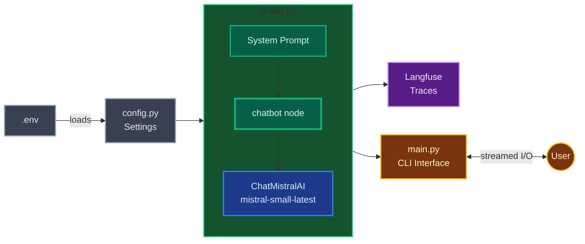
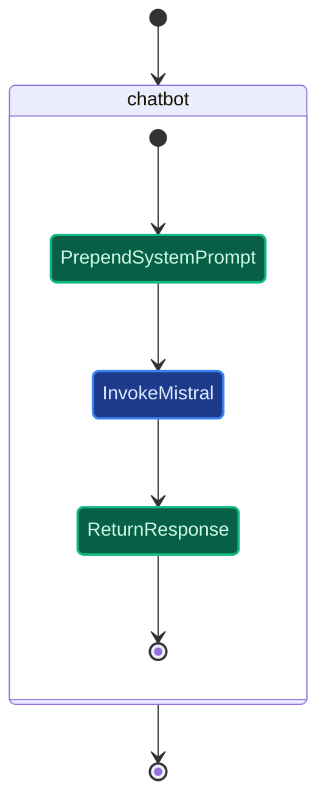
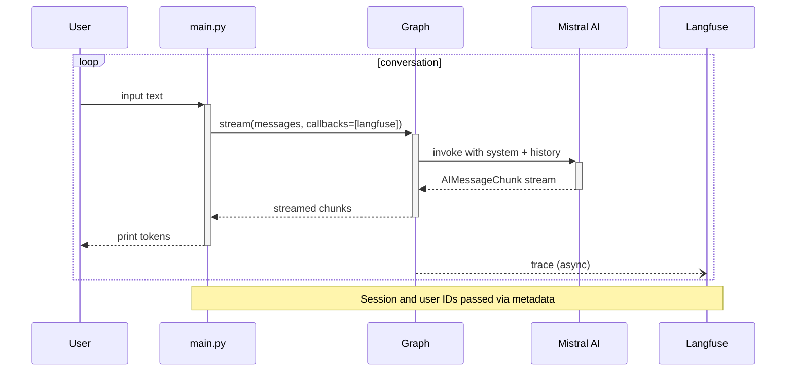
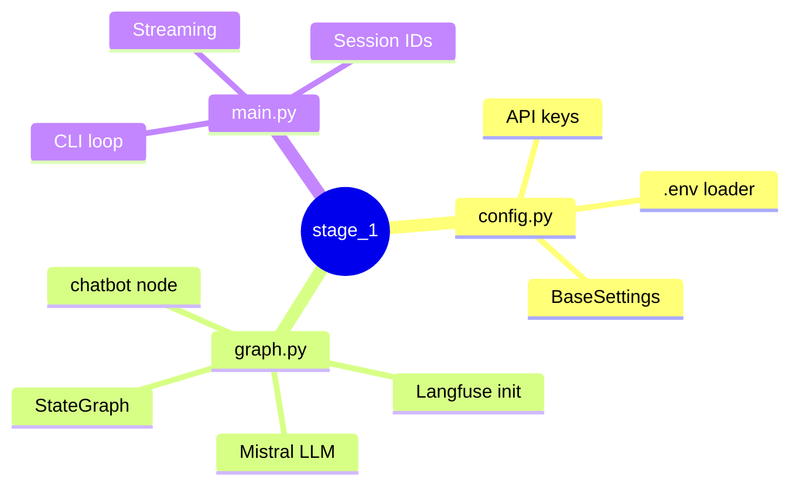

# Stage 1: Simple Chatbot

Single-node LangGraph chatbot. Mistral AI for generation, Langfuse for tracing.

## Table of Contents

- [Introduction](#introduction)
- [Tech Stack](#tech-stack)
- [Architectural Decisions](#architectural-decisions)
- [How It Works](#how-it-works)
- [The Graph](#the-graph)
- [Streaming Conversation Loop](#streaming-conversation-loop)
- [File Map](#file-map)
- [Run](#run)

## Introduction

Stage 1 is the simplest possible voice-AI chatbot — a single-node LangGraph graph backed by Mistral AI. It exists as a walking skeleton: a minimal end-to-end slice that proves the toolchain works (LangGraph orchestration, LLM calls, observability, CLI streaming) before later stages add menu knowledge, tool calling, and multi-agent flows. Everything here is intentionally bare so it can be extended without rework.

## Tech Stack

The chatbot is built on **LangGraph** (v1.0+), which provides graph-based orchestration on top of LangChain. The LLM is **Mistral AI** (`mistral-small-latest`) accessed through `langchain-mistralai`. Observability is handled by **Langfuse** (v3), which captures full LLM traces via a LangChain callback handler. Configuration uses **Pydantic Settings** to load API keys and endpoints from a `.env` file, and the project is packaged with **uv** workspaces and **Hatchling** builds so each stage stays independently installable.

## Architectural Decisions

**Single-node graph.** The graph contains one node (`chatbot`) wired START → chatbot → END. This is the minimal LangGraph structure — it keeps the code trivial while still exercising the full graph lifecycle so later stages can add nodes (tool use, routing) without changing the harness.

**System prompt prepended at runtime.** Rather than storing the system prompt in state, the `chatbot` node checks whether the first message is a `SystemMessage` and prepends one if missing. This avoids duplicating the prompt across turns and keeps state clean for the message-based reducer.

**Streaming-first CLI.** `main.py` uses `graph.stream(..., stream_mode="messages")` so tokens appear as they arrive. Session and user IDs are generated per run and passed through LangGraph's `config.metadata`, which Langfuse picks up automatically — no manual span wiring required.

**Module-level graph export.** `graph.py` compiles the graph at import time (`graph = create_graph()`) so that both the CLI and LangGraph Studio can import the same object without re-compilation.

## How It Works



## The Graph



## Streaming Conversation Loop



## File Map



## Run

```bash
make chat   # CLI
make dev    # LangGraph Studio
```
