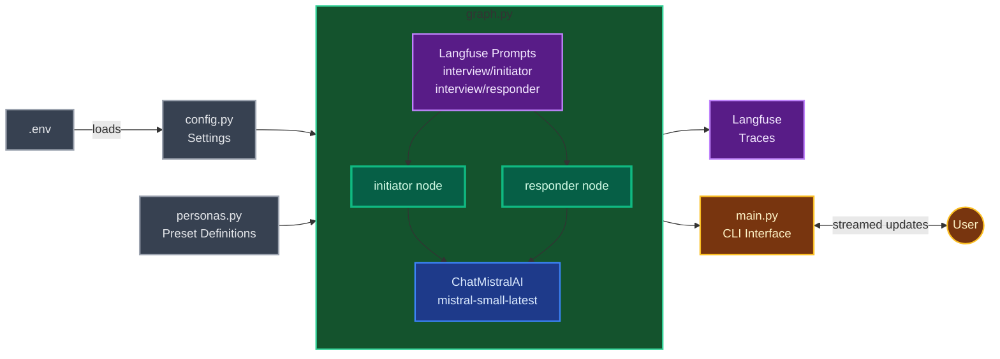
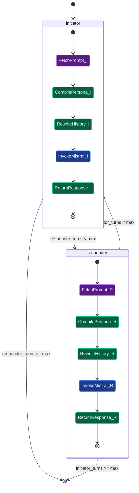
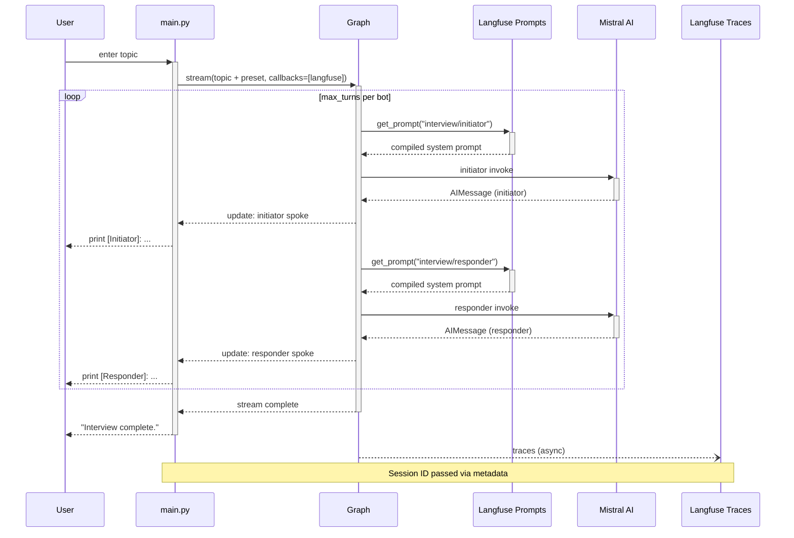
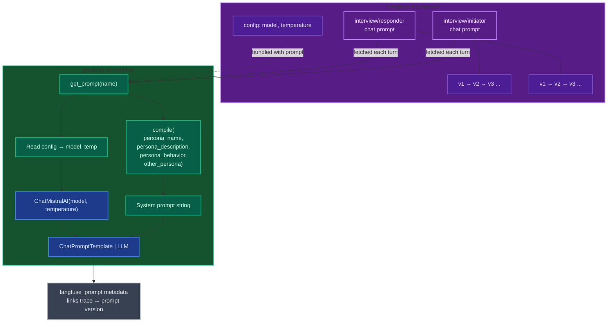
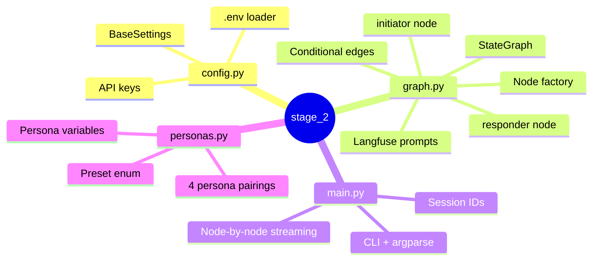

# Stage 2: Two-Bot Interview

Multi-node LangGraph graph where two AI personas interview each other. Mistral AI for generation, Langfuse for prompt management and tracing.

## Table of Contents

- [Introduction](#introduction)
- [Tech Stack](#tech-stack)
- [Architectural Decisions](#architectural-decisions)
- [How It Works](#how-it-works)
- [The Graph](#the-graph)
- [Streaming Conversation Loop](#streaming-conversation-loop)
- [Presets and Personas](#presets-and-personas)
- [Prompt Management with Langfuse](#prompt-management-with-langfuse)
- [Observability with Langfuse](#observability-with-langfuse)
- [File Map](#file-map)
- [Run](#run)

## Introduction

Stage 2 evolves the single-bot chatbot into a two-bot conversation system. Two AI personas — an initiator and a responder — take turns speaking on a user-provided topic. Persona definitions are stored in Langfuse as managed chat prompts, so behavior can be tweaked without code changes. The graph alternates between the two bots until a configurable turn limit is reached, producing an interview-style transcript streamed to the CLI.

## Tech Stack

The graph runs on **LangGraph** (v1.0+) with two nodes wired in a conditional loop. The LLM is **Mistral AI** (`mistral-small-latest`) via `langchain-mistralai`. Prompt templates are managed in **Langfuse** (v3) as versioned chat prompts — fetched at runtime, compiled with persona variables, and linked back to traces for full observability. Persona presets are defined in Python as a `StrEnum` + dictionary so new pairings can be added without touching graph logic. Configuration uses **Pydantic Settings**, and the project is packaged with **uv** workspaces and **Hatchling** builds.

## Architectural Decisions

**Two-node conditional loop.** The graph has two nodes (`initiator`, `responder`) connected by conditional edges that check turn counts. This is the minimal structure for a multi-turn two-agent conversation — each node is symmetric and built by the same factory function.

**Langfuse prompt management.** System prompts live in Langfuse as `interview/initiator` and `interview/responder` chat prompts, not in source code. Each invocation fetches the latest prompt version, compiles it with persona variables, and attaches `langfuse_prompt` metadata so traces link back to the exact prompt version used.

**Node factory pattern.** `_build_node_fn(role, prompt_name)` returns a closure for either role. This eliminates duplication — the initiator and responder nodes differ only in which persona they load and which turn counter they increment.

**Message rewriting for Mistral.** Mistral requires strict user/assistant alternation. Since both bots produce `AIMessage`s, each node rewrites the other bot's messages to `HumanMessage`s before invoking the LLM. This keeps the conversation history valid from each bot's perspective.

## How It Works

The system is organized around four files, each with a single responsibility. Configuration flows left to right: `.env` feeds API keys into `config.py`, which `graph.py` consumes to initialize the Langfuse client and the Mistral LLM. The `personas.py` module supplies preset persona definitions — pairs of initiator/responder characters with names, descriptions, and behavioral instructions — that get injected into the graph at runtime. The graph itself is the core: it holds two nodes that each fetch a Langfuse chat prompt, compile it with the active persona's variables, and call Mistral to generate a response.

On the right side of the diagram, `main.py` serves as the entry point. It accepts a topic from the user, packages it with the selected preset and turn limit into the graph's input state, and streams node-by-node updates back to the terminal. Langfuse sits on two edges: it provides prompts going in (the purple box feeding both nodes) and captures traces going out (every LLM call, prompt version, and latency metric recorded asynchronously). This means you can change persona behavior or prompt wording in the Langfuse dashboard and see the effect on the next run without touching code.

The green subgraph in the center represents `graph.py` at import time. Both nodes share a single `ChatMistralAI` instance configuration (model name, temperature) that comes from the Langfuse prompt's `config` field, so model parameters are also managed remotely. The compiled graph object is exported at module level, making it importable by both the CLI and LangGraph Studio with no re-compilation.



## The Graph

The outer structure is a conditional loop between two nodes. The graph starts at the `initiator` node, which speaks first. After the initiator finishes, a conditional edge (`after_initiator`) checks whether the responder still has turns remaining — if so, control passes to `responder`; if not, the graph ends. The responder's exit edge (`after_responder`) applies the same logic in reverse for the initiator. This ping-pong continues until both bots have spoken `max_turns` times, producing a total of `max_turns * 2` messages in the transcript.

Inside each node, the five-step pipeline is identical — only the persona and prompt name differ. First, the node fetches its Langfuse chat prompt (`interview/initiator` or `interview/responder`) to get the latest version. It then compiles the prompt template with four persona variables: `persona_name`, `persona_description`, `persona_behavior`, and `other_persona` (the other bot's display name). Next comes message rewriting: since Mistral requires strict user/assistant alternation and both bots produce `AIMessage`s, the node converts all messages in the shared history to `HumanMessage`s before invoking the LLM. This means each bot sees the entire conversation as user input, with only its own response being the assistant turn.

The state update returned by each node is minimal: the new `AIMessage` appended to `messages` (via LangGraph's built-in message reducer) and `+1` to the role's turn counter (via an `operator.add` annotated reducer). The turn counters are what the conditional edges inspect to decide whether the conversation continues or terminates. The `InputState` / `InterviewState` split ensures that only the fields the user provides (preset, names, max turns) appear in the graph's input schema, while the internal turn counters live in the full state and are initialized to zero.



## Streaming Conversation Loop

The CLI in `main.py` uses `graph.stream(..., stream_mode="updates")` to receive output node by node rather than waiting for the entire graph to finish. Each iteration of the stream yields a dictionary keyed by node name (e.g., `{"initiator": {"messages": [AIMessage], "initiator_turns": 1}}`), so the CLI can print each bot's response the moment it arrives. This gives the user a live feel — the Reporter's question appears, then the Politician's answer, then the next question — rather than a single dump at the end.

Before streaming begins, `main.py` parses CLI arguments to select a preset (defaulting to `reporter-politician`) and a turn limit (defaulting to 3). It looks up the preset in `PERSONA_PRESETS` to extract the display names, generates a unique session ID, and prompts the user for an interview topic. The topic is wrapped in a `HumanMessage` and bundled with the preset, names, and zeroed turn counters into the graph's input state. A Langfuse `CallbackHandler` is attached via the config's `callbacks` list, and the session ID is passed through `config.metadata` so Langfuse groups all traces from this run under a single session.

On each loop iteration inside the stream, the CLI filters for `AIMessage` objects in the node output and prints them with the speaker's name (pulled from `msg.name`, which the node sets to the persona's display name). After the stream ends, it prints a summary line with the total message count and flushes the Langfuse client to ensure all traces are shipped before the process exits.



## Presets and Personas

The interview system ships with four persona pairings, each designed to produce conversations with natural tension. Every preset casts one bot as the **initiator** — the character who drives the conversation forward with questions, provocations, or demands — and the other as the **responder** — the character who reacts, deflects, or pushes back. The friction is the point: a Reporter who presses for specifics paired with a Politician who pivots to talking points, a Donor who ties support to policy answers paired with a Politician who hints at favors without committing, a Bartender who dispenses unsolicited wisdom paired with a Patron who rambles and contradicts himself at 1 AM.

Each persona is defined by three fields that get compiled into the Langfuse prompt template: `persona_name` (the display label), `persona_description` (who the character is and the situation they're in), and `persona_behavior` (how they act — their rhetorical style, habits, and tendencies). The behavioral instructions are where the comedy lives. The Boxer "trash-talks, boasts about their record, makes bold predictions, and occasionally threatens to flip the table." The Patron "rambles, goes on tangents, gets emotional, contradicts himself, and occasionally orders another drink mid-sentence." These aren't polite conversationalists — they're characters with strong opinions, bad habits, and no interest in finding common ground.

Adding a new preset is a data-only change: define a new `Preset` enum value and add a matching entry to `PERSONA_PRESETS` with initiator/responder dictionaries. No graph logic, node code, or prompt templates need to change — the same `interview/initiator` and `interview/responder` Langfuse prompts accept any persona variables. The `--preset` CLI flag picks which pairing to load at runtime, defaulting to `reporter-politician`.

```mermaid
flowchart TB
    subgraph Presets["Persona Presets"]
        direction LR
        RP["reporter-politician<br/><i>tough questions<br/>meet slippery answers</i>"]
        RB["reporter-boxer<br/><i>press conference<br/>meets trash talk</i>"]
        DP["donor-politician<br/><i>transactional support<br/>meets plausible deniability</i>"]
        BP["bartender-patron<br/><i>unsolicited advice<br/>meets 1 AM rambling</i>"]
    end

    RP --> Roles
    RB --> Roles
    DP --> Roles
    BP --> Roles

    subgraph Roles["Each Preset"]
        direction TB
        subgraph Init["Initiator"]
            IN["persona_name"]
            ID["persona_description"]
            IB["persona_behavior"]
        end
        subgraph Resp["Responder"]
            RN["persona_name"]
            RD["persona_description"]
            RB2["persona_behavior"]
        end
    end

    Init -->|compiled into| LFI["Langfuse Prompt<br/>interview/initiator"]
    Resp -->|compiled into| LFR["Langfuse Prompt<br/>interview/responder"]

    style Presets fill:#374151,stroke:#9ca3af,stroke-width:2px
    style Roles fill:#14532d,stroke:#34d399,stroke-width:2px
    style Init fill:#065f46,stroke:#10b981,stroke-width:2px
    style Resp fill:#065f46,stroke:#10b981,stroke-width:2px
    style RP fill:#78350f,stroke:#fbbf24,stroke-width:2px,color:#fef3c7
    style RB fill:#78350f,stroke:#fbbf24,stroke-width:2px,color:#fef3c7
    style DP fill:#78350f,stroke:#fbbf24,stroke-width:2px,color:#fef3c7
    style BP fill:#78350f,stroke:#fbbf24,stroke-width:2px,color:#fef3c7
    style IN fill:#065f46,stroke:#10b981,stroke-width:2px,color:#d1fae5
    style ID fill:#065f46,stroke:#10b981,stroke-width:2px,color:#d1fae5
    style IB fill:#065f46,stroke:#10b981,stroke-width:2px,color:#d1fae5
    style RN fill:#065f46,stroke:#10b981,stroke-width:2px,color:#d1fae5
    style RD fill:#065f46,stroke:#10b981,stroke-width:2px,color:#d1fae5
    style RB2 fill:#065f46,stroke:#10b981,stroke-width:2px,color:#d1fae5
    style LFI fill:#581c87,stroke:#c084fc,stroke-width:2px,color:#f3e8ff
    style LFR fill:#581c87,stroke:#c084fc,stroke-width:2px,color:#f3e8ff
```



| Preset | Initiator | Responder | Vibe |
|--------|-----------|-----------|------|
| `reporter-politician` | Serious investigative journalist | Seasoned, ethically questionable politician | Tough questions meet evasive pivots |
| `reporter-boxer` | Sports journalist at a press conference | Brash, confident professional boxer | Professional inquiry meets trash talk and table-flipping threats |
| `donor-politician` | Wealthy donor with business interests | Desperate-for-funding politician | Transactional politeness meets plausible deniability |
| `bartender-patron` | Weary, seen-it-all late-shift bartender | Drunk patron at 1 AM with something on their mind | Dry wisdom meets emotional rambling and mid-sentence drink orders |

## Prompt Management with Langfuse

Stage 2's system prompts do not live in source code — they are stored, versioned, and served by Langfuse as managed chat prompts. The two prompts, `interview/initiator` and `interview/responder`, are chat-type templates with placeholder variables (`persona_name`, `persona_description`, `persona_behavior`, `other_persona`) that get compiled at runtime with the active persona's values. This means you can edit the wording, tone, or instructions for either role directly in the Langfuse dashboard and every subsequent graph invocation picks up the new version automatically — no code change, no redeployment, no PR required.

Each prompt in Langfuse also carries a `config` object that holds model parameters like `model` name and `temperature`. The node factory reads these values when constructing the `ChatMistralAI` instance, so switching from `mistral-small-latest` to a different model or tuning temperature from 0.9 to 0.7 is a dashboard operation, not a code change. This keeps the entire prompt-and-model surface area outside the codebase, which is especially useful when iterating on persona behavior — you can A/B test a more aggressive Reporter prompt against a softer one without touching `graph.py`.

Langfuse prompt versioning gives you a full history of every edit. When a trace records which prompt version was used (via the `langfuse_prompt` metadata attached to each `ChatPromptTemplate`), you can correlate a specific conversation's quality back to the exact prompt text that produced it. If a persona starts behaving oddly after an edit, you can diff the current version against the previous one in the Langfuse UI and roll back in seconds. This closes the loop between prompt authoring and production behavior — edit, observe, revert, all without code.



| Benefit | How It Works |
|---------|-------------|
| **No-code prompt editing** | Edit prompt text in the Langfuse dashboard; next graph run picks it up automatically |
| **Model config outside code** | `model` and `temperature` live in the prompt's `config` field, not in `graph.py` |
| **Version history** | Every prompt edit is versioned; diff and roll back from the UI |
| **Trace-to-prompt linking** | `langfuse_prompt` metadata on each `ChatPromptTemplate` ties every trace to the exact prompt version that produced it |

## Observability with Langfuse

Every LLM call in the graph is traced by Langfuse via the LangChain `CallbackHandler`. The handler is created once per CLI run and passed through `config["callbacks"]`, so LangGraph automatically instruments every node invocation — no manual span creation needed. Each trace captures the full input/output pair (system prompt + message history in, `AIMessage` out), latency, token counts, and the model used. For a 3-turn interview, that's 6 traced LLM calls nested under a single session, giving you a complete picture of the conversation from first question to final answer.

Session grouping is handled by a single metadata field. `main.py` generates a unique `langfuse_session_id` per run and passes it through `config["metadata"]`. Langfuse uses this to group all traces from one interview under a single session in the dashboard, so you can view the full Reporter-vs-Politician transcript as one unit rather than hunting through individual traces. This is especially useful when running multiple interviews back-to-back — each session is isolated and labeled.

The combination of tracing and prompt management creates a feedback loop that is hard to get any other way. You can see exactly which prompt version was used for each trace, compare output quality across prompt versions, and spot regressions immediately. If the Politician starts giving straight answers instead of deflecting (suspicious), you check the trace, see it was prompt v4, diff against v3, and find that someone removed the "never directly answer uncomfortable questions" instruction. The observability is not just about debugging errors — it's about understanding how prompt changes affect conversation dynamics across presets, topics, and turn counts.

```mermaid
flowchart LR
    subgraph GraphRun["Single Interview Run"]
        direction TB
        T1["Trace 1<br/>initiator turn 1"]
        T2["Trace 2<br/>responder turn 1"]
        T3["Trace 3<br/>initiator turn 2"]
        T4["Trace 4<br/>responder turn 2"]
        T5["Trace 5<br/>initiator turn 3"]
        T6["Trace 6<br/>responder turn 3"]
        T1 --> T2 --> T3 --> T4 --> T5 --> T6
    end

    subgraph TraceDetail["Each Trace Contains"]
        direction TB
        IN["Input: system prompt<br/>+ message history"]
        OUT["Output: AIMessage"]
        TOK["Token counts<br/>+ latency"]
        PV["Prompt version link"]
    end

    subgraph LangfuseDash["Langfuse Dashboard"]
        direction TB
        SESS["Session View<br/>langfuse_session_id"]
        SESS --> TIMELINE["Full conversation<br/>timeline"]
        SESS --> COST["Cost & latency<br/>per interview"]
        SESS --> PLINK["Prompt version<br/>correlation"]
    end

    GraphRun -->|"async flush"| LangfuseDash
    T1 -.-> TraceDetail

    style GraphRun fill:#14532d,stroke:#34d399,stroke-width:2px
    style TraceDetail fill:#374151,stroke:#9ca3af,stroke-width:2px
    style LangfuseDash fill:#581c87,stroke:#c084fc,stroke-width:2px
    style T1 fill:#065f46,stroke:#10b981,stroke-width:2px,color:#d1fae5
    style T2 fill:#065f46,stroke:#10b981,stroke-width:2px,color:#d1fae5
    style T3 fill:#065f46,stroke:#10b981,stroke-width:2px,color:#d1fae5
    style T4 fill:#065f46,stroke:#10b981,stroke-width:2px,color:#d1fae5
    style T5 fill:#065f46,stroke:#10b981,stroke-width:2px,color:#d1fae5
    style T6 fill:#065f46,stroke:#10b981,stroke-width:2px,color:#d1fae5
    style IN fill:#374151,stroke:#9ca3af,stroke-width:2px,color:#e5e7eb
    style OUT fill:#374151,stroke:#9ca3af,stroke-width:2px,color:#e5e7eb
    style TOK fill:#374151,stroke:#9ca3af,stroke-width:2px,color:#e5e7eb
    style PV fill:#374151,stroke:#9ca3af,stroke-width:2px,color:#e5e7eb
    style SESS fill:#581c87,stroke:#c084fc,stroke-width:2px,color:#f3e8ff
    style TIMELINE fill:#4c1d95,stroke:#a78bfa,stroke-width:1px,color:#ede9fe
    style COST fill:#4c1d95,stroke:#a78bfa,stroke-width:1px,color:#ede9fe
    style PLINK fill:#4c1d95,stroke:#a78bfa,stroke-width:1px,color:#ede9fe
```



| Benefit | How It Works |
|---------|-------------|
| **Automatic instrumentation** | `CallbackHandler` traces every LLM call — no manual spans or decorators |
| **Session grouping** | `langfuse_session_id` in metadata groups all traces from one interview together |
| **Full I/O capture** | Every trace records the complete system prompt, message history, response, token count, and latency |
| **Prompt version correlation** | Each trace links to the exact prompt version used, enabling regression detection across edits |
| **Async flush** | Traces are shipped asynchronously and flushed at shutdown via `atexit`, so tracing never blocks the conversation |

## File Map



## Run

```bash
make chat SCOPE=2                              # CLI (default preset)
make chat SCOPE=2 -- --preset bartender-patron  # CLI with preset
make dev SCOPE=2                                # LangGraph Studio
```
