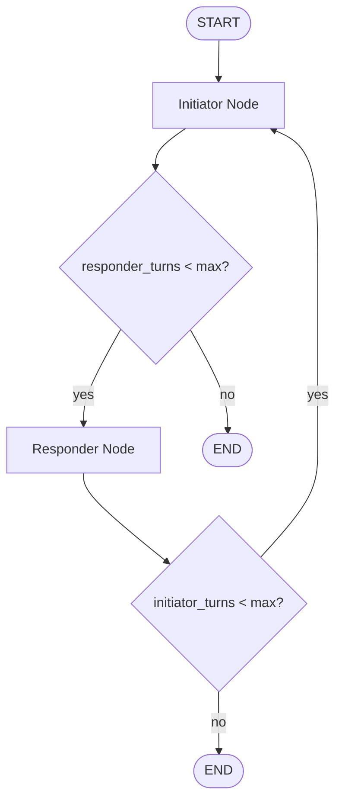
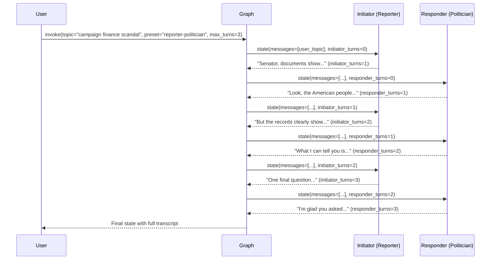
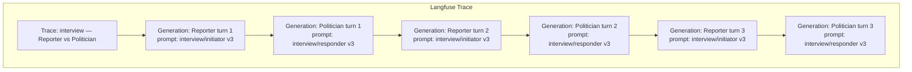
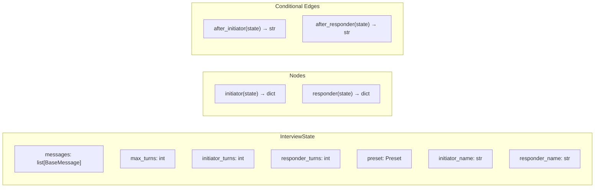

# Stage 2: Two-Bot Interview — Configurable Personas

## Concept

Two LLM-powered personas have a live conversation with each other. The persona pairing is configurable:

| Preset | Initiator | Responder |
|--------|-----------|-----------|
| `reporter-politician` (default) | Serious investigative journalist | Sleazy, evasive politician |
| `reporter-boxer` | Sports journalist | Brash, trash-talking boxer |
| `donor-politician` | Big-money political donor | Eager-to-please politician |
| `bartender-patron` | Weary, seen-it-all bartender | Rambling drunk patron |

No human in the loop during the conversation. The user picks a persona preset and topic, sets `max_turns`, and watches the bots go back and forth.

## Persona System

### Persona Presets

Each preset defines two personas with three fields used as Langfuse prompt variables:

```python
from enum import StrEnum


class Preset(StrEnum):
    """Available persona pairings for the interview graph."""
    REPORTER_POLITICIAN = "reporter-politician"
    REPORTER_BOXER = "reporter-boxer"
    DONOR_POLITICIAN = "donor-politician"
    BARTENDER_PATRON = "bartender-patron"


PERSONA_PRESETS: dict[Preset, dict[str, dict[str, str]]] = {
    Preset.REPORTER_POLITICIAN: {
        "initiator": {
            "persona_name": "Reporter",
            "persona_description": "a serious investigative journalist conducting a live television interview with high ethical standards and a reputation for tough, fair questioning",
            "persona_behavior": "You press for specifics, follow up on evasions, and cite facts. You are respectful but relentless.",
        },
        "responder": {
            "persona_name": "Politician",
            "persona_description": "a seasoned but ethically questionable politician being interviewed on live TV",
            "persona_behavior": "You deflect hard questions, pivot to talking points, use folksy anecdotes, make vague promises, and occasionally attack the media. You never directly answer uncomfortable questions.",
        },
    },
    Preset.REPORTER_BOXER: {
        "initiator": {
            "persona_name": "Reporter",
            "persona_description": "a sports journalist conducting a pre-fight press conference interview",
            "persona_behavior": "You ask pointed questions about training, opponents, and controversies. You stay professional but push for real answers.",
        },
        "responder": {
            "persona_name": "Boxer",
            "persona_description": "a brash, confident professional boxer at a pre-fight press conference",
            "persona_behavior": "You trash-talk your opponent, boast about your record, make bold predictions, and occasionally threaten to flip the table. You're entertaining but unpredictable.",
        },
    },
    Preset.DONOR_POLITICIAN: {
        "initiator": {
            "persona_name": "Donor",
            "persona_description": "a wealthy political donor having a private dinner conversation with a politician you're considering funding",
            "persona_behavior": "You ask pointed questions about policy positions that affect your business interests. You're polite but transactional, and you make it clear your support depends on the right answers.",
        },
        "responder": {
            "persona_name": "Politician",
            "persona_description": "an ambitious politician at a private fundraising dinner, desperate for campaign contributions",
            "persona_behavior": "You try to please the donor without making promises that could leak to the press. You hint at favors, speak in plausible deniability, and name-drop shamelessly.",
        },
    },
    Preset.BARTENDER_PATRON: {
        "initiator": {
            "persona_name": "Bartender",
            "persona_description": "a weary, seen-it-all bartender working the late shift at a dive bar",
            "persona_behavior": "You listen, offer unsolicited life advice, make dry observations, and occasionally cut off the patron or change the subject. You've heard every sad story before.",
        },
        "responder": {
            "persona_name": "Patron",
            "persona_description": "a drunk patron at a dive bar at 1 AM who clearly has something on their mind",
            "persona_behavior": "You ramble, go on tangents, get emotional, contradict yourself, and occasionally order another drink mid-sentence. You're convinced this is the most important conversation of your life.",
        },
    },
}
```

## Langfuse Prompt Management

### Why Langfuse Prompts

Instead of hardcoding system prompts as Python string constants, we store them in Langfuse as **chat prompts** with `{{variables}}`. This gives us:

- **Version control** — iterate on prompts in the Langfuse UI without code deploys
- **A/B testing** — use labels (`production`, `experiment-a`) to serve different prompt versions
- **Metrics per version** — latency, token usage, and evaluation scores tracked per prompt version
- **Prompt-to-trace linking** — every LLM generation in Langfuse shows which prompt version produced it

### Prompt Definitions

Two chat prompts stored in Langfuse:

#### `interview/initiator` (type: chat)

```json
[
  {
    "role": "system",
    "content": "You are {{persona_name}}, {{persona_description}}. {{persona_behavior}} Keep responses to 2-3 sentences. Do not break character. Address {{other_persona}} directly."
  }
]
```

**Variables:** `persona_name`, `persona_description`, `persona_behavior`, `other_persona`

#### `interview/responder` (type: chat)

```json
[
  {
    "role": "system",
    "content": "You are {{persona_name}}, {{persona_description}}. {{persona_behavior}} Keep responses to 2-3 sentences. Do not break character. Address {{other_persona}} directly."
  }
]
```

**Variables:** `persona_name`, `persona_description`, `persona_behavior`, `other_persona`

### Why Two Separate Prompts?

The templates look identical now, but keeping them separate allows:
- Independent versioning (e.g., tweak only the responder's tone)
- Separate metrics in Langfuse (initiator vs responder latency, token usage)
- Future divergence (e.g., initiator gets tool-use instructions)

### Prompt Config

Each prompt's Langfuse `config` stores model parameters:

```json
{
  "model": "mistral-small-latest",
  "temperature": 0.9
}
```

This lets us change model/temperature per prompt version from the Langfuse UI without touching code.

### Seed Script

A one-time script (`scripts/seed_langfuse_prompts.py`) creates the initial prompt versions in Langfuse with the `production` label:

```python
from langfuse import get_client

langfuse = get_client()

langfuse.create_prompt(
    name="interview/initiator",
    type="chat",
    prompt=[{
        "role": "system",
        "content": "You are {{persona_name}}, {{persona_description}}. {{persona_behavior}} Keep responses to 2-3 sentences. Do not break character. Address {{other_persona}} directly.",
    }],
    config={"model": "mistral-small-latest", "temperature": 0.9},
    labels=["production"],
)

langfuse.create_prompt(
    name="interview/responder",
    type="chat",
    prompt=[{
        "role": "system",
        "content": "You are {{persona_name}}, {{persona_description}}. {{persona_behavior}} Keep responses to 2-3 sentences. Do not break character. Address {{other_persona}} directly.",
    }],
    config={"model": "mistral-small-latest", "temperature": 0.9},
    labels=["production"],
)
```

## Langfuse Tracing & Prompt-to-Trace Linking

### Tracing Strategy

A single Langfuse **trace** spans the entire graph invocation. Within that trace, each node's LLM call is a **generation** span linked to the Langfuse prompt that produced it.

```
Trace: "interview — Reporter vs Politician — campaign finance scandal"
├── Generation: initiator turn 1  (linked to interview/initiator v3)
├── Generation: responder turn 1  (linked to interview/responder v3)
├── Generation: initiator turn 2  (linked to interview/initiator v3)
├── Generation: responder turn 2  (linked to interview/responder v3)
├── Generation: initiator turn 3  (linked to interview/initiator v3)
└── Generation: responder turn 3  (linked to interview/responder v3)
```

### Integration Approach: LangChain CallbackHandler + Prompt Metadata

We use the Langfuse `CallbackHandler` on the graph invocation for automatic tracing. To link prompts to generations, we set `metadata={"langfuse_prompt": prompt_object}` on the `ChatPromptTemplate` used in each node.

```python
from langfuse import get_client
from langfuse.langchain import CallbackHandler
from langchain_core.prompts import ChatPromptTemplate

langfuse = get_client()

def make_prompt_template(prompt_name: str, variables: dict) -> ChatPromptTemplate:
    """Fetch a Langfuse chat prompt and return a compiled LangChain ChatPromptTemplate linked to the trace."""
    langfuse_prompt = langfuse.get_prompt(prompt_name, type="chat")

    langchain_prompt = ChatPromptTemplate.from_messages(
        langfuse_prompt.get_langchain_prompt()
    )
    langchain_prompt.metadata = {"langfuse_prompt": langfuse_prompt}

    return langchain_prompt
```

### What This Enables in the Langfuse UI

- **Per-generation prompt linking** — click any generation span to see which prompt version produced it
- **Metrics tab on prompts** — median latency, token counts, costs, and scores per prompt version
- **Version comparison** — compare metrics across prompt versions to measure improvement

## State Design

Extend `MessagesState` with turn-tracking and persona configuration:

```python
from langgraph.graph import MessagesState

class InterviewState(MessagesState):
    max_turns: int              # max messages per bot (default 3)
    initiator_turns: int        # how many times initiator has spoken
    responder_turns: int        # how many times responder has spoken
    preset: Preset              # persona preset enum (e.g., Preset.REPORTER_POLITICIAN)
    initiator_name: str         # display name for initiator (e.g., "Reporter")
    responder_name: str         # display name for responder (e.g., "Politician")
```

`MessagesState` gives us `messages: list[BaseMessage]` with the append-only reducer built in. We add ints for turn counting, the preset key for prompt variable lookup, and persona names for display/message naming.

### Why not just count messages?

We could derive turn counts from `len(messages)`, but explicit counters are clearer and avoid off-by-one bugs when the initial user message or system messages are in the list.

## Graph Architecture

### Nodes

| Node | Role |
|------|------|
| `initiator` | Fetches `interview/initiator` prompt from Langfuse, compiles with persona variables, invokes LLM, increments `initiator_turns`. |
| `responder` | Fetches `interview/responder` prompt from Langfuse, compiles with persona variables, invokes LLM, increments `responder_turns`. |

### Edges

| From | To | Condition |
|------|-----|-----------|
| `START` | `initiator` | Always — initiator opens the conversation |
| `initiator` | `should_continue_after_initiator` | Conditional edge |
| `should_continue_after_initiator` | `responder` | If `responder_turns < max_turns` |
| `should_continue_after_initiator` | `END` | If `responder_turns >= max_turns` |
| `responder` | `should_continue_after_responder` | Conditional edge |
| `should_continue_after_responder` | `initiator` | If `initiator_turns < max_turns` |
| `should_continue_after_responder` | `END` | If `initiator_turns >= max_turns` |

### Flow for max_turns=3

```
Turn 1: Initiator asks   (initiator_turns=1)
Turn 1: Responder answers (responder_turns=1)
Turn 2: Initiator follows up (initiator_turns=2)
Turn 2: Responder deflects  (responder_turns=2)
Turn 3: Initiator presses   (initiator_turns=3)
Turn 3: Responder spins     (responder_turns=3)
→ END (both at max)
```

Total messages: 6 (3 from each bot). The initiator always gets the last word before the responder closes it out.

## Mermaid Diagrams

### High-Level Flow



### Detailed State Flow (default preset)



### Langfuse Trace Structure



### LangGraph StateGraph Structure



## Key Implementation Details

### Node Functions

Each node function:
1. Fetches its Langfuse chat prompt and compiles with persona variables
2. Builds a LangChain `ChatPromptTemplate` with `langfuse_prompt` metadata for trace linking
3. Invokes the LLM chain with the callback handler
4. Returns `{"messages": [response], "<role>_turns": state["<role>_turns"] + 1}`

```python
from langfuse import get_client
from langfuse.langchain import CallbackHandler
from langchain_core.prompts import ChatPromptTemplate
from langchain_core.messages import SystemMessage

langfuse = get_client()

def _get_persona(state: InterviewState, role: str) -> dict:
    """Look up persona variables from the preset."""
    return PERSONA_PRESETS[state["preset"]][role]

def _get_other_name(state: InterviewState, role: str) -> str:
    """Get the other persona's display name."""
    if role == "initiator":
        return state["responder_name"]
    return state["initiator_name"]

def initiator(state: InterviewState, config: RunnableConfig) -> dict:
    persona = _get_persona(state, "initiator")
    prompt = langfuse.get_prompt("interview/initiator", type="chat")

    # Compile prompt with persona variables -> list of message dicts
    compiled_messages = prompt.compile(
        persona_name=persona["persona_name"],
        persona_description=persona["persona_description"],
        persona_behavior=persona["persona_behavior"],
        other_persona=_get_other_name(state, "initiator"),
    )

    # Build LangChain prompt with langfuse_prompt metadata for trace linking
    langchain_prompt = ChatPromptTemplate.from_messages(
        [(msg["role"], msg["content"]) for msg in compiled_messages]
    )
    langchain_prompt.metadata = {"langfuse_prompt": prompt}

    # Build chain and invoke with message history
    model_config = prompt.config  # {"model": "mistral-small-latest", "temperature": 0.9}
    llm = ChatMistralAI(model=model_config["model"], temperature=model_config["temperature"])
    chain = langchain_prompt | llm

    response = chain.invoke(
        {},  # no additional variables — prompt is already compiled
        config=config,  # passes through the CallbackHandler from graph invocation
    )
    response.name = state["initiator_name"]
    return {
        "messages": [response],
        "initiator_turns": state["initiator_turns"] + 1,
    }

def responder(state: InterviewState, config: RunnableConfig) -> dict:
    persona = _get_persona(state, "responder")
    prompt = langfuse.get_prompt("interview/responder", type="chat")

    compiled_messages = prompt.compile(
        persona_name=persona["persona_name"],
        persona_description=persona["persona_description"],
        persona_behavior=persona["persona_behavior"],
        other_persona=_get_other_name(state, "responder"),
    )

    langchain_prompt = ChatPromptTemplate.from_messages(
        [(msg["role"], msg["content"]) for msg in compiled_messages]
    )
    langchain_prompt.metadata = {"langfuse_prompt": prompt}

    model_config = prompt.config
    llm = ChatMistralAI(model=model_config["model"], temperature=model_config["temperature"])
    chain = langchain_prompt | llm

    response = chain.invoke({}, config=config)
    response.name = state["responder_name"]
    return {
        "messages": [response],
        "responder_turns": state["responder_turns"] + 1,
    }
```

**Note on message history:** The compiled system prompt is the only message in the `ChatPromptTemplate`. The conversation history from `state["messages"]` needs to be appended to the LLM call. The exact mechanism (prepending system message to state messages, or using a `MessagesPlaceholder`) is an implementation detail to resolve during coding.

### Conditional Edge Functions

```python
def after_initiator(state: InterviewState) -> str:
    if state["responder_turns"] < state["max_turns"]:
        return "responder"
    return END

def after_responder(state: InterviewState) -> str:
    if state["initiator_turns"] < state["max_turns"]:
        return "initiator"
    return END
```

### Graph Construction

```python
def create_graph() -> CompiledStateGraph:
    builder = StateGraph(InterviewState)
    builder.add_node("initiator", initiator)
    builder.add_node("responder", responder)
    builder.add_edge(START, "initiator")
    builder.add_conditional_edges("initiator", after_initiator, ["responder", END])
    builder.add_conditional_edges("responder", after_responder, ["initiator", END])
    return builder.compile()
```

### Invocation with Langfuse Tracing

```python
from langfuse.langchain import CallbackHandler

langfuse_handler = CallbackHandler()
preset_key = Preset.REPORTER_POLITICIAN
preset = PERSONA_PRESETS[preset_key]

result = graph.invoke(
    {
        "messages": [HumanMessage(content="Interview topic: campaign finance scandal")],
        "max_turns": 3,
        "initiator_turns": 0,
        "responder_turns": 0,
        "preset": preset_key,
        "initiator_name": preset["initiator"]["persona_name"],
        "responder_name": preset["responder"]["persona_name"],
    },
    config={"callbacks": [langfuse_handler]},
)
```

The `CallbackHandler` creates a single trace for the entire `graph.invoke()` call. Each chain invocation inside the nodes becomes a generation span. Because we set `langchain_prompt.metadata = {"langfuse_prompt": prompt}`, each generation is automatically linked to its Langfuse prompt version.

## CLI (main.py)

The CLI should:
1. Accept `--max-turns` flag (default 3)
2. Accept `--preset` flag (default `reporter-politician`), with choices from `PERSONA_PRESETS`
3. Prompt user for a topic
4. Invoke the graph once (no interactive loop — the bots talk to each other)
5. Print each message as it arrives (using `stream_mode="updates"`)
6. Print a summary at the end (including a Langfuse trace URL if available)

## Environment Variables

```bash
# Langfuse (required)
LANGFUSE_SECRET_KEY=sk-lf-...
LANGFUSE_PUBLIC_KEY=pk-lf-...
LANGFUSE_HOST=https://cloud.langfuse.com  # or self-hosted URL

# Mistral AI (required)
MISTRAL_API_KEY=...
```

## File Changes

| File | Change |
|------|--------|
| `src/stage_2/stage_2/graph.py` | Two-node interview graph with Langfuse prompt fetching and trace linking |
| `src/stage_2/stage_2/main.py` | CLI with `--preset` and `--max-turns` flags, Langfuse CallbackHandler |
| `src/stage_2/stage_2/config.py` | No changes needed (keeps Mistral + Langfuse keys) |
| `src/stage_2/stage_2/personas.py` | `PERSONA_PRESETS` dictionary (new file) |
| `scripts/seed_langfuse_prompts.py` | One-time script to create prompts in Langfuse (new file) |
| `src/stage_2/pyproject.toml` | No changes needed (`langfuse` and `langchain-mistralai` already present) |

## Dependencies

```
langfuse          # prompt management + tracing
langchain-mistralai  # LLM provider
langgraph         # graph framework
```

## Decisions

1. **Topic injection** — Use `HumanMessage` for the topic. Simple, natural, and the initiator sees it as context for their first question.
2. **Named AI messages** — Yes. Set `response.name` to the persona's display name on each `AIMessage`. Makes the transcript readable and helps each LLM distinguish who said what in the history.
3. **Streaming** — Node-by-node (`stream_mode="updates"`). Print each complete response as it finishes. Simpler than token-by-token.
4. **Langfuse prompt type** — Chat prompts (not text). The system message role is explicit, and the compiled output is a list of message dicts ready for the LLM.
5. **Prompt-to-trace linking** — Via `ChatPromptTemplate.metadata = {"langfuse_prompt": prompt}` on the LangChain prompt template. This is the recommended LangChain integration path per Langfuse docs.
6. **Model config in Langfuse** — Store `model` and `temperature` in the prompt's `config` object. This lets us change model parameters from the Langfuse UI without code changes.
7. **Two prompts, not one** — Separate `interview/initiator` and `interview/responder` prompts for independent versioning and per-role metrics, even though the templates start identical.
8. **Persona presets** — Defined in code as a dictionary. The Langfuse prompts are generic templates; the persona-specific content comes from variables at runtime. Adding a new preset requires only a new dict entry, no new Langfuse prompts.
